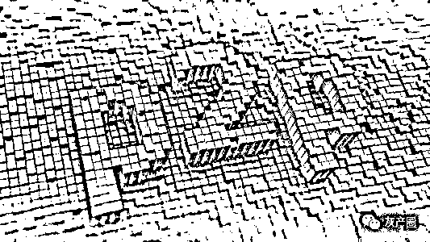
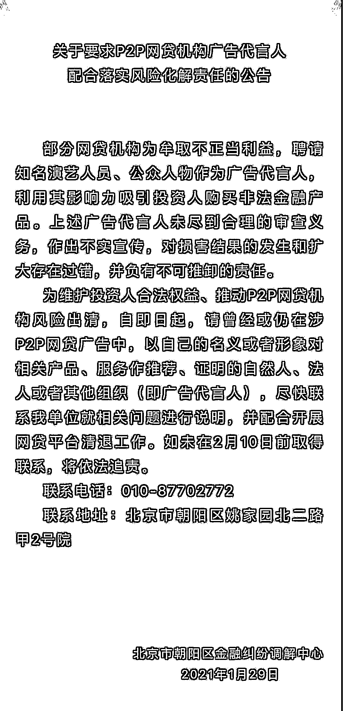
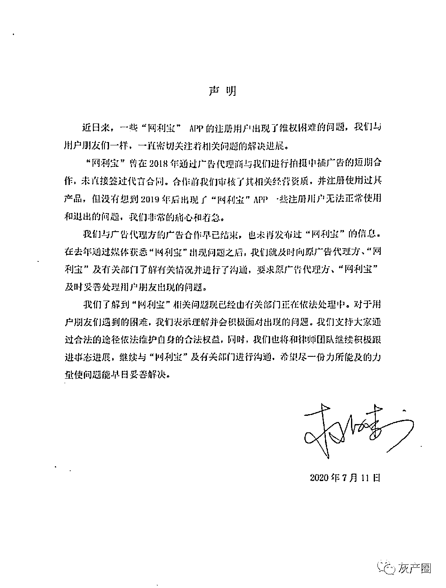

# 明星代言 P2P 责任不可推卸，需配合监管开展网贷清退

> 原文：[`mp.weixin.qq.com/s?__biz=MzIyMDYwMTk0Mw==&mid=2247508768&idx=2&sn=6c44c809e5da58f04e3fb0b9934f8834&chksm=97cb6818a0bce10e4d9c9efafb2344179b8b5c015f1b19290ac244f9eef7a11d43d76707bf4c&scene=27#wechat_redirect`](http://mp.weixin.qq.com/s?__biz=MzIyMDYwMTk0Mw==&mid=2247508768&idx=2&sn=6c44c809e5da58f04e3fb0b9934f8834&chksm=97cb6818a0bce10e4d9c9efafb2344179b8b5c015f1b19290ac244f9eef7a11d43d76707bf4c&scene=27#wechat_redirect)

图片来源网络

**自 2014 年以来，e 租宝、中晋资产、紫马财行、鑫琦资产、理想宝、团贷网、网利宝、有利网、爱投资等等多个风险平台“暴雷”后，涉事公众艺人尽管在投资人维权声讨中陷入巨大的舆论风波，但实际上更多是不了了之。**

1 月 29 日，北京市朝阳区金融纠纷调解中心微信公众号发布《关于要求 P2P 网贷机构广告代言人配合落实风险化解责任的公告》。公告称，部分网贷机构为牟取不正当利益，聘请知名演艺人员、公众人物作为广告代言人，利用其影响力吸引投资人购买非法金融产品。上述广告代言人未尽到合理的审查义务，作出不实宣传，对损害结果的发生和扩大存在过错，并负有不可推卸的责任。为维护投资人合法权益、推动 P2P 网贷机构风险出清，自即日起，请曾经或仍在涉 P2P 网贷广告中，以自己的名义或者形象对相关产品、服务作推荐、证明的自然人、法人或者其他组织（即广告代言人），尽快联系我单位就相关问题进行说明，并配合开展网贷平台清退工作。如未在 2 月 10 日前取得联系，将依法追责。多名艺人因 P2P 产品道歉请明星代言，是 P2P 的惯用套路。据不完全统计，近年来明星代言的 P2P 平台涉及爆雷的便不下十几个，涉案金额动辄百亿起步。随着网贷平台出现兑付问题，不断有明星代言人被“催债”。作为互金平台的明星代言人，张铁林是第一个被广大投资者攻击的。此前鑫琦资产公司宣传页显示，为了彰显鑫琦资产的经营理念，该公司邀请张铁林出任企业形象大使。2014 年 12 月 1 日，鑫琦资产相关负责人员与张铁林在其居所会面，就为鑫琦资产管理有限公司代言一事达成共识，并当场在代言协议书上签字。鑫琦资产于 2015 年 1 月召开以“皇上驾到，一言九鼎”为主题的新闻发布会。张铁林出席并题词“一言九鼎，财源广进”，张铁林还为该公司拍摄了长达 1 分 13 秒的广告宣传片。2014 年 12 月开始，鑫琦资产先后在上海、北京、山西、成都、陕西、河南等地设立分公司。2014 年鑫琦资产就被疑涉嫌非法集资，但直到到 2016 年 2 月鑫琦资产危机才全面爆发，上海相关负责人被警方带走，仅上海分公司就涉及资金 19 亿。事发之后，网友在微博直言：“代言虚假广告的明星必须负连带清偿债务责任，皇阿玛赔钱啊！”而张铁林本人手机处于关机状态，外界无法获悉他对此事件的看法。张铁林也从未对鑫琦资产危机做过任何公开回复。随后，e 租宝从风风光光到被判为非法集资，最后只留下投资人的无奈。e 租宝一路以来都是走高调路线，背景渲染得高大上且带着一丝神秘色彩，还邀请唐嫣、李湘、瞿颖、钟丽缇、胡静 5 位女星为其宣传。2015 年 11 月，黄晓明成为东虹桥金融的代言人，在上海外滩震旦大厦和花旗银行的巨屏上的广告特别耀眼：“黄晓明，贷你圆梦，赚多多的钱。”好景不长，在 2016 年 4 月便出现兑付逾期，随后微博上出现了#一起召唤黄晓明来还钱#的话题。粉丝因为信任，全部资金砸入虹桥金融，平台出事之后却只看到工作室声明“黄晓明与东虹桥金融无关。”2020 年 6 月，爱钱进被北京警方立案侦办。根据媒体报道，有超过 10 万投资者受骗，涉及资金超过 100 亿元人民币，致使大量投资者血本无归。随后，有人在其昔日代言人微博“汪涵超话”下面爆料称，爱钱进爆雷事件共涉及约 37 万投资者，资金损失约 230 亿元。被欺骗的投资者索赔无门，索性拉起了横幅拍合照，要求汪涵站出来归还投资者的血汗钱。7 月，爱前进被立案消息再度传出，汪涵与刘国梁曾冲上微博热搜榜，对此，两人都在公开场合发声道歉。汪涵很快发公告表示，自己曾于 2016 年至 2018 年为“爱钱进”APP 代言，之后得知产品出现兑付迟缓的现象，就已经多次联系平台敦促尽快为大家解决问题，之后，还将和律师团队积极地和大家一起跟进此事，共同面对，也将会和平台、有关部门密切沟通，为妥善解决此事尽力。2020 年 7 月，P2P 平台“有利网”的投资者在知名艺人杨迪微博下喊话，呼吁其为“有利网诈骗”事件发声。7 月 24 日，杨迪发表声明，称自己不是“有利网”代言人，录制宣传视频也未收取任何费用，对此次视频推荐承受损失的观众致以深深歉意。同样实在 7 月份，网利宝爆雷，绝望的投资人将代言人杜海涛当成救命稻草，试图要其帮忙索赔血汗钱。随后，杜海涛工作室发布声明，声明称杜海涛曾与对方在 2018 年通过广告代理商进行拍摄中插广告的短期合作，未直接签署代言合同，目前广告合作也早已结束。对于网利宝 App 出现的问题，杜海涛工作室此前已与原广告代理方、网利宝及有关部门进行沟通，后续将和律师团队继续积极跟进事态进展，使问题早日妥善解决。去年 9 月 22 日，演员胡军的微博评论区突然涌入大量评论。网友主要反映的是，他们投资的悟空理财产品在下半年兑付延期情况增多，产品到期未回款。**稍加梳理不难发现，自 2014 年以来，e 租宝、中晋资产、紫马财行、鑫琦资产、理想宝、团贷网、网利宝、有利网、爱投资等等多个风险平台“暴雷”后，涉事公众艺人尽管在投资人维权声讨中陷入巨大的舆论风波，但实际上更多是不了了之。**北京开展清退 P2P 网贷广告代言人工作明星对 P2P 平台的引流作用不可忽视。有财经大 V 表示，“代言 P2P 的明星多了去了，微博上数据量最大的应该是毛不易代言了人人贷，专门写了首歌，结果粉丝一起使劲整出来三十万的转发。”此前，据中国基金报报道，北京威诺律师事务所主任杨兆全律师分析爱钱进案例时表示，有两种情况可以让汪涵、刘国梁承担责任：一是汪涵、刘国梁是否明知或者应知爱钱进广告虚假，仍在广告中对商品、服务作推荐、证明。二是汪涵、刘国梁是否使用过这个产品。如果汪涵、刘国梁在推荐前，本人没有投资爱钱进，他要承担责任。如果有证据显示，汪涵、刘国梁明知以及应知是爱钱进是虚假宣传，或者没有使用过爱钱进理财产品。根据《广告法》，汪涵、刘国梁将被市场监督管理部门没收违法所得，并处违法所得一倍以上二倍以下的罚款。但业内人士认为，明星都会有自己的法律团队，在承接广告时，团队会帮他规避一些法律风险。这就是很多理财平台爆雷后，相关代言明星并没有受到责任追究的原因。此次北京市朝阳区金融纠纷调解中心通告明确指出，“部分网贷机构为牟取不正当利益，聘请知名演艺人员、公众人物作为广告代言人，利用其影响力吸引投资人购买非法金融产品。上述广告代言人未尽到合理的审查义务，作出不实宣传，对损害结果的发生和扩大存在过错，并负有不可推卸的责任。”不过，据时代周报，此次调解中心的公告要求涉及 P2P 网贷机构的广告代言人配合清退，但清退是否涉及参与赔偿，目前还未有定论。据每经报道，中国传媒大学讲师程科表示，配合清退不一定就是要求艺人也要参与 P2P 网贷机构的清偿工作，而且按照一般规则来看，只有代言人明知且属于关系消费者生命健康的代言才需要承担连带责任。但是实际上，“代言人明知”这个条件并不好证明，所以有业内人士猜测艺人可能只是说明问题，解释其与该公司的关系，但是并不需要承担过多的赔偿责任。“P2P 网贷机构案件会不会因为涉及面太广而加重代言人责任现在还不好说，但一般不会到加重让代言人和企业一起承担连带责任的程度。”上述人士指出。全国实际运营的 P2P 网贷机构全部归零 2016 年，一系列行业监管政策相继落地，互联网金融迎来合规元年。2017 年对 P2P 网贷行业来说是“冰与火”交融的一年。2020 年 1 月 15 日，央行副行长陈雨露在国新办新闻发布会上表示，2020 年防范化解金融风险攻坚战取得重要阶段性成果，P2P 平台已全部清零，各类高风险金融机构得到有序处置。他还称，影子银行规模缩减，资管产品风险明显收敛，同业关联嵌套持续减少。我国 P2P 网贷发展历史不过十几年，自 2007 年至今历经萌芽期、野蛮扩张期以及整顿规范和清退期。据统计，过去 13 年间先后有 1 万多家 P2P 上线，高峰时同时有 5000 多家运营，年交易规模约 3 万亿元，坏账损失率极高。2020 年 12 月 8 日中国银保监会主席郭树清在 2020 年新加坡金融科技节上演讲时表示，到 2020 年 11 月中旬，实际运营的 P2P 网贷机构已经全部归零。郭树清表示，中国金融科技应用整体上在法律规范和风险监管等方面是“摸着石头过河”，遇到过不少问题，也积累了一些经验教训。提及经验教训时，郭树清以“全面整治 P2P 网贷机构”为其中的一个案例。郭树清称：P2P 网贷机构本来定位为金融信息中介，但在实践中，绝大多数机构事实上开展了信贷和理财业务。据统计，过去 14 年里先后有 1 万多家 P2P 上线，高峰时同时有 5000 多家运营，年交易规模约 3 万亿元，坏账损失率很高。近年来，我们持续清理整顿，到 11 月中旬实际运营的 P2P 网贷机构已经全部归零。郭树清表示，面对金融科技的持续快速发展，我们将坚持既鼓励创新又守牢底线的积极审慎态度，切实解决好面临的新问题新挑战。来源：钛媒体、21 经济、券商中国、中金网、中国基金报、时代周报、每经

← 向右滑动与灰产圈互动交流 →

