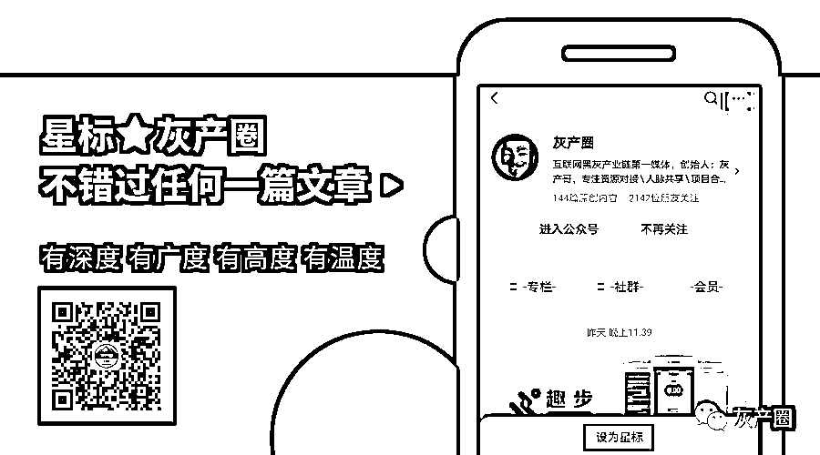

# 没钱就不怕诈骗？当心骗子盯上你的贷款额度

> 原文：[`mp.weixin.qq.com/s?__biz=MzIyMDYwMTk0Mw==&mid=2247508768&idx=3&sn=e49f030d2fe9e2b75cc7e02253942e32&chksm=97cb6818a0bce10e61a7a7764bb31d4b2a4d5ce3cab57041ba82b470e3cd87fc8f7df693869d&scene=27#wechat_redirect`](http://mp.weixin.qq.com/s?__biz=MzIyMDYwMTk0Mw==&mid=2247508768&idx=3&sn=e49f030d2fe9e2b75cc7e02253942e32&chksm=97cb6818a0bce10e61a7a7764bb31d4b2a4d5ce3cab57041ba82b470e3cd87fc8f7df693869d&scene=27#wechat_redirect)

说起来

很多人有一定的防骗意识

支付宝、微信绑定的都是不常用的银行卡

账户里没钱或者只有少量的钱

摆出“空城计”应对各类诈骗

以为这样就能高枕无忧

“**我没钱，骗子来了也不怕，没钱可骗**”

其实，你错了！

如今骗子的诈骗套路翻新

**就算你没钱**

**他们也有办法从你身上骗到钱**

01

有一种骗术以理赔、退款为由

谎称直接将钱退到银行卡

如果你有所疑虑

骗子会说：这是退款，随便提供一张没钱的银行卡就行 

这句话听着还是很容易让人信任的 

接着骗子引导你扫描二维码 

**↓如下↓**

这样的二维码看似很正规

但同一个二维码

**↓**我们也可以把它变成另外一个样式**↓** 

此类二维码可以随意更改 LOGO 图片或备注文字

扫描后都是进入骗子的后台网页 

**↓扫描之后进入网页界面↓** 

骗子会告诉你，查询密码和退款密码 

都填写银行卡密码就行了

（换了个说法，只不过为了降低你的警惕性）

而这上面填写的所有信息

骗子都能在后台看得清清楚楚

然后利用这些信息登陆网银 APP 操作 

这时候你会收到短信验证码 

骗子会一次次指导你快速填写验证码

但无论你怎么快 

骗子都会告诉你验证超时了

让你重新填写新的验证码

利用这种方式多次套取验证码 

在网银上操作手机贷款并转走资金

让你背负一笔天降债务 

在这个诈骗套路中

骗子多次强调填写验证码要快

许多人短信内容都没看清

直接将验证码透露出去导致资金损失

02

还有一种骗术叫**注销校园贷诈骗** 

近期，一种与贷款相关的新型诈骗盯上了有贷款经历的在校学生或刚毕业的年轻人。仅在上周就发生了 27 起此类诈骗案件，受害者平均年龄不到 25 岁。骗子冒充的贷款平台多以小米贷（10 起）、分期乐（5 起）、爱学贷（4 起）为主。目前，警方正加紧对这些案件进行调查。

近日

湖里公安分局邀请受害人小卢现身说法

揭秘这一新骗术

第一招：唬

“不清空贷款额度影响征信”

“国家正在整治贷款行业，必须清空贷款额度，你把钱贷出来给我们做流水，否则会影响征信……”听到这样的话，你会不会相信？27 岁的小卢就信了，于是，4 小时内他被骗 4 万多元。

小卢近期来到厦门找工作。4 月 5 日下午 6 点，他接到一名自称是分期乐工作人员的电话。“对方能准确说出我的名字、身份证号、银行卡和曾经就读的学校，我的情况他们一清二楚。”小卢说。

紧接着，对方表示，小卢曾在分期乐贷款平台上贷过款，国家现在正在清理网贷平台，必须清空贷款额度。

图片来源网络 

“我从未贷过款，但对方说，如果我不清除额度，会影响我的征信。过两天，这些征信记录就汇总到央行了，记录不良，买机票、车票都会受影响。”见对方语气严肃，说的后果也很严重，小卢一时懵了，他赶紧按照对方发来的链接登录，页面上显示，他的贷款额度为 2 万多元。

“这是我们公司给你的额度，然后我再把钱转给你，这样额度就清空了。”对方说。

于是，小卢把贷款提现到自己的银行卡，然后分次转给对方。

事后回忆起来，小卢也觉得这个过程有些不可思议。“但在当时，对方一时间说出的信息太多，我感觉自己被绕进去了，只能按照对方的吩咐操作。”

第二招：蒙

“操作超时，需重新操作”

转账成功后，小卢也担心被骗，于是立刻询问，钱何时能转回来？对方磨蹭了一会儿后回复，转账手续要在 15 分钟内完成，小卢操作太慢超时了，需要重新操作。

随后，对方又要求小卢下载小米贷、国美易卡等网贷平台，同样以“清除贷款额度”为由，要求小卢贷款。

.jpg")

图片来源网络

“我又转了几次钱给对方。对方又说，财务太忙，审核完才能把钱转回去。”小卢说，这时他清醒了一些，意识到可能遇到了电信诈骗。

“我给对方发短信，问他是不是电信诈骗。对方给我回复，‘如果我是诈骗的，为什么还要回你信息。’我觉得有些道理，就又把钱转过去了。”小卢说，随后对方又询问他有没有办信用卡，信用卡额度多少。

这些话让小卢彻底清醒了，认定对方是骗子。在这持续“洗脑”的 4 个小时内，小卢总共转给对方 40998 元。随后，对方就把小卢拉黑，断了联系。

**温馨提醒大家**

**长点心吧！** 

**没钱的朋友们也要防诈骗啊！**

近来，这样的案例还有不少，市民吴小姐也是陷入了这样的圈套中，被骗 1.7 万元。

其实，早在两年前，国家多部门已经发文明确取缔校园贷款业务，任何网络贷款机构都不允许向在校大学生发放贷款。而这些骗子在作案前都会精心物色受害者。在这些案件中，骗子都能准确说出受害者的个人信息，甚至毕业院校名称及贷款时间。有的骗子还会发送虚假的营业执照，表明自己是专业公司在提供服务。这让多数受害者对对方自称“贷款公司”的身份毫不怀疑。

.jpg")

图片来源网络 

有些受害人认为，自己身上没什么钱，就不怕诈骗，从而放松了警惕。实际上，骗子选择受害人时都做了通盘考虑，以清除贷款额度为名，要求受害人贷款，进而转给骗子。

**在此提醒在校大学生和职场新人，应该养成理性的消费习惯，如果确实需要借钱，请到正规的金融机构申请办理。**一旦接到此类自称网贷平台工作人员的电话，一定要提高警惕，可以与原先的贷款平台官方客服核实，或拨打 110 咨询。

来源：法治厦门，海西晨报，反诈骗先锋

← 向右滑动与灰产圈互动交流 →

