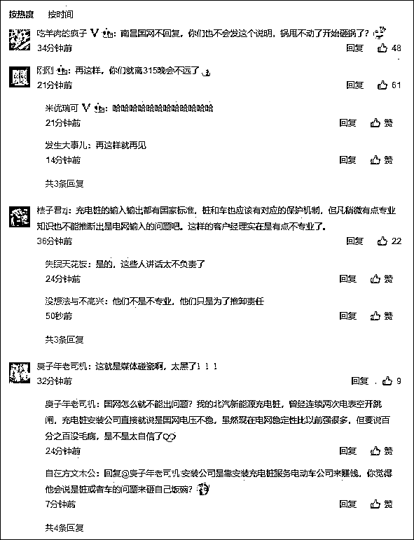

# 特斯拉致歉！还录了视频...

> 原文：[`mp.weixin.qq.com/s?__biz=MzIyMDYwMTk0Mw==&mid=2247508768&idx=4&sn=7eef4b3f09a9a0fff46862f4ef5df5b1&chksm=97cb6818a0bce10e033b5169f7ffe22e0b6b98712379d87877155cf3e87288daf0dd3da04d69&scene=27#wechat_redirect`](http://mp.weixin.qq.com/s?__biz=MzIyMDYwMTk0Mw==&mid=2247508768&idx=4&sn=7eef4b3f09a9a0fff46862f4ef5df5b1&chksm=97cb6818a0bce10e033b5169f7ffe22e0b6b98712379d87877155cf3e87288daf0dd3da04d69&scene=27#wechat_redirect)

**“甩锅”国家电网被回怼后，特斯拉向网友以及国网南昌致歉。但该公司并未改变当初的说法，“初步判断故障是充电时瞬间电流过载导致”。**

2 月 1 日，特斯拉汽车（北京）有限公司官方微博发文称，关于近日南昌车主充电后出现异常的情况，初步判断故障是充电时瞬间电流过载导致的。由于当时导致电流过载的具体原因还在检查中，售后人员在与车主沟通时被追问原因，因此提及多种可能因素供用户参考理解。 

对于此前特斯拉售后人员称“故障因国家电网电流太大”，该公司表示，**“这个沟通被录音，并且选取关于国家电网的部分进行剪辑传播。对于由此引发的网友误会以及给南昌电网造成的困扰，我们深表歉意。”**

特斯拉方面表示，目前已经妥善解决用户遇到的问题，并正在对此故障的原因进行检测和调查。

[`mp.weixin.qq.com/mp/readtemplate?t=pages/video_player_tmpl&action=mpvideo&auto=0&vid=wxv_1720596823276388353`](https://mp.weixin.qq.com/mp/readtemplate?t=pages/video_player_tmpl&action=mpvideo&auto=0&vid=wxv_1720596823276388353)

视频来自@特斯拉客户支持

在特斯拉致歉微博的下方，网友仍在对其“甩锅”行为表示不满：

“南昌国网不回复，你们也不会发这个说明，锅甩不动了开始砸锅了？”、“再这样，你们就离 315 晚会不远了”、“但凡稍微有点专业知识也不能推断出是电网输入的问题”。

** 新闻背景 **

近日，江西南昌一消费者购买了仅 6 天的特斯拉 model3，在特斯拉专用充电桩充电后无法启动，检查后发现是车辆的逆变器烧坏。至于烧坏原因，售后负责人表示，由于国家电网的电流太大，导致车子充电时冲入的瞬间电流过大，把逆变器烧坏了。

至于赔偿事宜则更令人无语，这名负责人表示，他们只能为涂先生免费更换损毁的配件。但涂先生不同意，他认为在仅仅购买 5 天后就发生这么严重的故障，特斯拉应该进行退换服务，而客服却告诉他要解决车的问题，目前只能和特斯拉中心进行沟通。

对于特斯拉售后人员指国家电网电流太大致车辆损毁的说法，1 月 31 凌晨，@国网南昌供电公司澄清表示，特斯拉自用充电站有其特有的充电技术标准，特斯拉电动车是与特斯拉专用充电装置直接连接并使用，而非由电源线路连接特斯拉电动车；此外，在使用中电源线路电压稳定无异常，周边其他用电设备也都正常工作，符合国家规定的电源质量要求，对于相关不实言论保留追究权利。

与其把锅甩给国家电网，南昌供电公司建议特斯拉，不如请专业人士认真查找车辆的故障原因。

来源：观察者网·大橘财经

← 向右滑动与灰产圈互动交流 →

