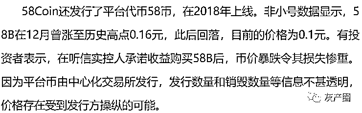

# 58coin ：一个毁三观的交易所，已经被一锅端！

> 原文：[`mp.weixin.qq.com/s?__biz=MzIyMDYwMTk0Mw==&mid=2247508897&idx=1&sn=98a41cf968eafd5911e66798fd2c6992&chksm=97cb6899a0bce18f27201c2f604486a1295f5039670fed8cafabd91621d734eb790e36c71cfb&scene=27#wechat_redirect`](http://mp.weixin.qq.com/s?__biz=MzIyMDYwMTk0Mw==&mid=2247508897&idx=1&sn=98a41cf968eafd5911e66798fd2c6992&chksm=97cb6899a0bce18f27201c2f604486a1295f5039670fed8cafabd91621d734eb790e36c71cfb&scene=27#wechat_redirect)

近日，有加密货币交易所 58Coin 用户表示，平台无法提币。

记者赴 58Coin 上海一处职场核实，公司已无人在岗，办公室门紧闭。前台无具体公司名称，有遗留物品印有 58Coin。据知情人员及该地多位周边人士告知，上周周中，有超过 10 辆警车赴该地，带走该职场全部员工，约两百人。记者了解到，目前已有部分员工被警方释放。

据悉，58Coin 关联公司当地另一职场员工也被带走，传闻称其在上海地区 400 名员工被波及。

此外，58Coin 在西安及北京均有办公场所。有西安分部员工向投资人透露，公司在营。同时有网络图片显示，驻北京公司正常营业。多个信源向记者表示，2020 年 12 月在深圳举办的一场区块链会议上，有 58Coin 高管疑被警方带走。就 58Coin 实控人是否被警方控制，尚无定论。

如其他曾被曝光在沪经营的交易所，58Coin 前台无任何标识，大楼内无平台名称指引。除正门外，其他室内门窗为磨砂玻璃，有较高私密性。

一页疑似公司合规要求显示，58Coin 员工被禁止透露公司及个人信息，解释为因是交易投资，避免不必要的麻烦。就目前了解，58Coin 有大量员工为业务员，工作包括申请多个微信和 QQ 账号，拉人进群，用模拟盘晒单，吸引新用户注册充值。从获得的疑似员工指引上，业务员被要求有至少 5 个以上微信号，包括主号、业务号和客户号，其中客户号为进同行群使用。

有未证实信息显示，58Coin 被指存在吃客损的情况，运用资金盘和杀猪盘及合约带单老师合作，一旦客户亏损，拉该客户的人将获得相应提成，其同时晒出并不清晰的报案通知书及受案回执等。从知情人士处获悉，警方对 58Coin 的定性或涉及金融诈骗，目前无官方公告证实。已有投资人以被诈骗为由向当地警方报案。

平台的加密货币合约产品受到质疑，曾有公开图片指出 58Coin 多个合约产品交易对曾存在“插针”情况，让客户资产爆仓。有多家交易所曾面临同类问题。 

目前，58Coin 在线客服显示繁忙，仅可留言。在官方用户群，有部分称提现到账，同时也有表示提现 3 日仍未到账。

2019 年，记者曾报道 58Coin 关联的元普投资旗下“新三板领军 5 号”产品无法赎回，揭露其相关公司失联，并携交易所卷土重来。

有知情人士表示，58Coin 是以张强为中心的“家族式”公司。据天眼查数据，红赢科技现任法人为路强，也是上海元普投资管理有限公司（下称 “元普投资”）法人，同时是天碧科技股东。徐佐曾在红赢科技和天碧科技担任法人，天碧科技法人现为徐敬坡。在 2018 年前，徐佐卸任红赢科技法人，路强接任。同期，原股东上海亓坤信息科技有限公司（下称 “亓坤信息”）和上海玓晟信息科技有限公司（下称 “玓晟信息”）也变更为路强全资持有。

创始人张强则已经卸任元普投资以及川茂资产法人。2019 年 6 月，中基协公布的疑似失联名单包括川茂资产。元普投资在此前被注销私募管理人资格，上述两家在中基协私募管理人名单中已不可查。

元普投资成立于 2014 年，介绍称多布局新三板，有产品名为新三板领军系列。据客服此前对记者表示，由于目前新三板行情不好，公司正在寻找接手方，拟以协议方式转出。目前，元普投资官网已不可查。

**下面来揭秘一下 58coin 的诈骗套路：**

**客损模式**

客损模式很简单，平台和代理赚的就是客户的损失。这个在传统的“炒金炒银”骗局中是非常常见的，目前一部分人已经开始转战币圈。每日经济新闻曾报道过一家提供 100 倍永续合约杠杆的平台的代理商，只要能带来交易，可返佣 77%的头寸（客损），再加 70%的手续费。大家想想 58coin 是不是这个样子的呢？是不是有高额的返佣，是不有无处不在的 58coin 业务员。不要觉得自己技术牛逼，平台会想办法让你爆仓。客损模式也是他们疯狂拉人的重要原因。

**云算力骗局**

众所周知，目前市场上大多数云算力都是传销骗局，除了比特大陆这类行业知名企业推出的其它的基本不靠谱。58coin 在 2017 年底售卖云算力，但该平台经常以停电、停水、断网等理由拒绝发放 N 天的收益。强制用户更改合同公司，不同意就停发收益。枯水期电价高达 0.67 元/度,创业界最高电费。丰水期到了，电费价格也不降价。说白了，这可能就是在空手套白狼。

**58coin 漂亮小姐姐骗局**

58coin 通过高额返佣的模式找到了数不胜数代理。代理把自己的微信头像换成漂亮小姐姐的头像，通过各种途径添加好友，微信群是主要阵地。这些人有的冒充是火币，OKEX，币安得受害者，有的是冒充新手等等，然后在群里疯狂的添加好友，他们一般还都是团伙作案。比如，一个人进了群，会拉好几个人进群。有一个被踢的 58 业务员声称一个 200 多人的群里有他们 20 多个人，其它群的更多。添加好友以后，高级一点的就是给你谈天说地，推荐平台，分析师。粗暴的就是直接发链接，发收益图等等。当你被榨干了，她就消失了，再换一个头像继续。

**58coin 分析师骗局**

一些所谓的分析师或者大 V 为了利益出卖自己的良心和 58coin 狼狈为奸。他们的对象主要是那些刚进入币圈的小白，老韭菜他们也骗不到。在一些微信群他们会发一些技术分析，高额收益单子吸引韭菜，然后，他们的托会配合演戏，一些不明真相的韭菜会加他们，他们也会主动的去加一些人。然后，会被拉近一个 58coin 体验群，群里 80%以上都是托，小白一不小心就进入了精心设计的骗局。当然，他们是团伙作案，分工明确，有专门拉人头的小姐姐。他们有时候建的是一些信息普及群，感觉很正规，取得小白信任后，鼓动用户去 58coin 玩合约，然后就是小白爆仓离场。 

**58coin 的疯狂报复**

如果有人在群里揭露 58coin 的骗局，瞬间一群人就上来助阵，开始丧心病狂的表演。微信群主如果把 58coin 的人从群里踢出去，他们的帮凶就会炸群，发二维码，发链接，然后，其他人在去投诉微信群。他们也会换个头像在混进微信群，继续作恶。当然，举报群主更是家常便饭，有一个群主一天被举报了 6 次，封号两次，原因很简单，提示了 58coin 平台的风险，踢了他们的人。他们通过这种形式恐吓那些敢于揭露 58coin 骗局的英雄。

对了，58coin 号称是在英国注册的公司，实际上却是中国公司，业务主要是国内的客户，这些也是大家都心知肚明的。在百度知道上关于 58coin 基本都像是官方回答，还都是匿名的。

[`mp.weixin.qq.com/mp/readtemplate?t=pages/video_player_tmpl&action=mpvideo&auto=0&vid=wxv_1387413971153633280`](https://mp.weixin.qq.com/mp/readtemplate?t=pages/video_player_tmpl&action=mpvideo&auto=0&vid=wxv_1387413971153633280)

综合自：Bitcoin，蓝鲸财经

← 向右滑动与灰产圈互动交流 →

