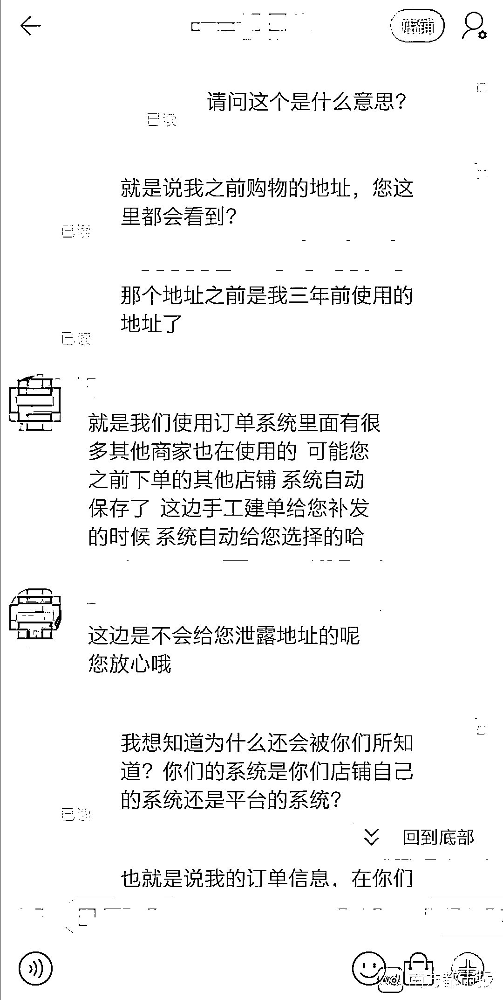
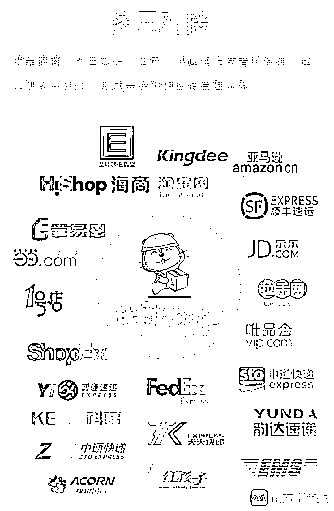
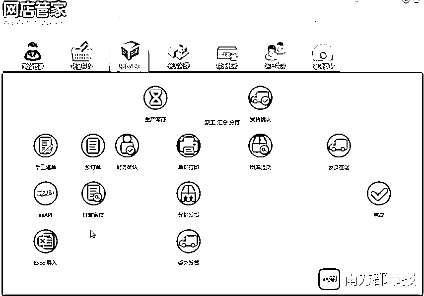
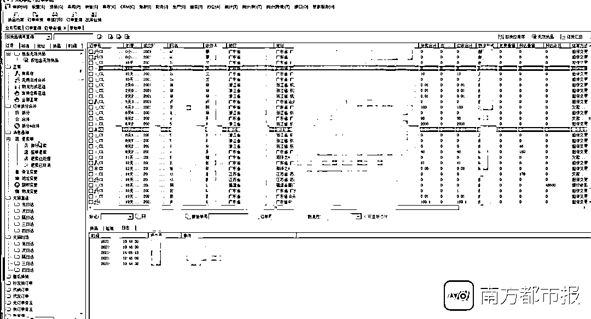
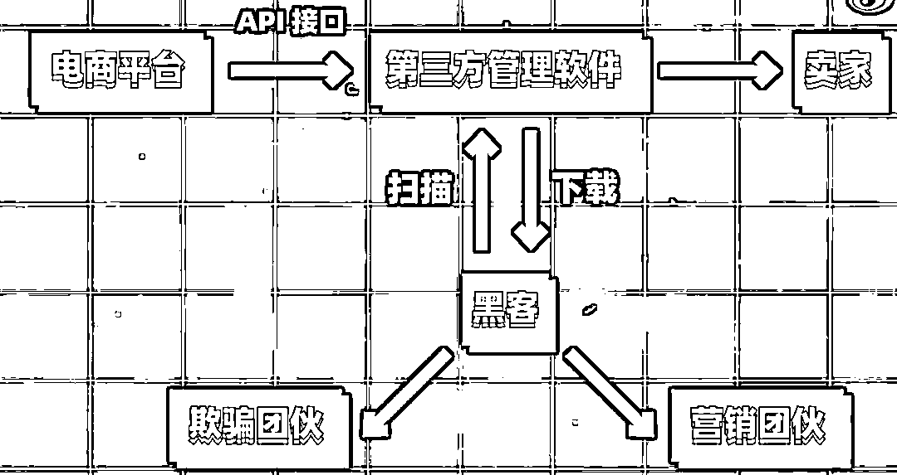

# 你怎么知道我三年前地址？网购背后的第三方和潜在的信息泄露

> 原文：[`mp.weixin.qq.com/s?__biz=MzIyMDYwMTk0Mw==&mid=2247508897&idx=2&sn=278213665083369273d994953a686e75&chksm=97cb6899a0bce18fc40fccf8da1b3d30ca8da1575090f3423a11b0aa9f19c73cda9269791fc4&scene=27#wechat_redirect`](http://mp.weixin.qq.com/s?__biz=MzIyMDYwMTk0Mw==&mid=2247508897&idx=2&sn=278213665083369273d994953a686e75&chksm=97cb6899a0bce18fc40fccf8da1b3d30ca8da1575090f3423a11b0aa9f19c73cda9269791fc4&scene=27#wechat_redirect)

当你在网上购物时，除了电商平台、商家和快递，还有别人能看到你填写的个人信息吗？答案是肯定的。

近日，南都记者调查发现，在网购订单信息的流转链条中，存在着不为公众所熟知的第三方服务商。它存储着各大电商平台的网购订单，在其后台搜索网名、地址、电话等关键词，甚至可以找到某一买家几年来在系统中记录的全部订单信息。

专家分析认为，电信诈骗涉及的网购订单信息，有些时候是从第三方软件泄露出去的，因为第三方服务商的信息安全能力普遍较为薄弱，屡屡成为黑客和内鬼的攻击目标。但因其通常隐藏在电商平台和商家之后，极易被忽视。

01

除了商家和平台，还有谁知道我的网购订单信息？

**近日，淘宝买家陈嘉向南都记者反映，她在淘宝上买东西时，发现货品有损坏。与商家协商后，商家承诺二次补发。不过，她并没有收到补发的货品，因为货品被寄到了她三年前的住址。

吊诡的是，陈嘉此前从未向该商家提供三年前的住址，商家又是怎么知道的？** ******陈嘉与淘宝商家聊天记录截图。受访者供图。****原来，在淘宝、商家、快递公司和用户之间，还隐藏着其他第三方——陈嘉遭遇的这次地址匹配错误，正是这个第三方的“锅”。****商家解释称，为了方便管理各个电商平台的订单以及货品存储，他们和一家名为“广州我配网仓仓储有限公司”（下称“我配网仓”）的仓储公司合作。

他进一步解释道，很多商家都与同一家仓储公司合作，使用同一款订单管理软件，可能陈嘉在其他商家购物时曾提供过三年前的地址，所以软件保存了陈嘉的订单信息，这次碰巧自动匹配上了。

根据商家展示的软件后台截图，搜索陈嘉的淘宝 ID，可以查询到她使用过的所有地址信息。不过商家强调，“这边是不会给您泄露信息的，您放心。”

“我觉得有点吓人。”陈嘉告诉南都记者，在她的认知中，应该只有商家和快递公司知道她的订单信息，她完全不知道其他第三方的存在，“但是他们却保有我的个人信息。”**************

**02**

**第三方服务商可看到全部订单信息 多未加密**

****南都记者从我配网仓的官网了解到，其是一家仓储管理服务商，为多家电商平台的卖家提供货物存储、收发货管理、信息对接等服务。对接的电商平台包括淘宝、京东、唯品会、拼多多等各大知名电商平台。****************我配网仓的官方介绍图。********与我配网仓合作的订单管理软件——“网店管家”则是电商平台的第三方服务商，主要功能有处理店铺订单、门店订单、库存管理等，其在淘宝服务市场上的销量为 4.3 万。********南都记者以电商平台商家谈合作为由，联系上我配网仓的业务人员赵翔。他介绍了订单信息的流转模式：通常商家把货品放在我配网仓进行存储，买家下单之后，经过商家审核，我配网仓会从电商平台的 API 接口自动抓单到网店管家，再由网店管家推送给我配网仓，由后者配货并联系快递公司发货。

也就是说，无论是仓储公司还是第三方订单管理软件，都有能力获取和存储电商平台买家的订单信息。**** ************网店管家的业务流程图。********当被问及订单信息是否会删除时，我配网仓的技术人员张洪表示，“基本上客人的订单会一直存在系统里”。网店管家的工作人员陆丰也证实，在软件后台可以看到导入此系统的全部网购订单信息，并且一般情况下，不会将这些订单信息删除。

他们都表示，可以通过搜索关键词如淘宝 ID、订单编号、电话、地址等信息，找到买家在系统中的全部订单。张洪表示，“没查过太久的，但是半年和一年的信息是能查得到的。”

从陆丰展示的网店管家后台中，南都记者看到，虽然淘宝对网购订单进行了局部打码，但只要单机鼠标左键或双击某一具体的订单信息即可“解码”，完整显示订单号、成交时间、用户名、收件人、地址、物流方式等信息。**** ************网店管家的后台截图。********陆丰还透露，在与其合作的 200 余家电商平台中，只有拼多多对手机号进行了虚拟号处理，淘宝正在尝试对订单信息进行部分打码加密，其他电商平台并未对订单信息进行加密处理。****************************

****03****

****第三方服务商应及时删除订单信息 电商平台有审核义务****

****尽管陈嘉的遭遇可能是一次概率极小的系统错误，但只要这些隐藏在用户视线之外的第三方继续存在，隐私被侵犯的感觉就难以消除。那么，第三方服务商的存在是否合理？未经用户同意，第三方服务商有权存储其个人信息吗？

App 违法违规收集使用个人信息专项治理工作组专家何延哲表示，一个商家往往在多个电商平台开设店铺，如果由其中一个电商平台开发订单管理软件，可能涉及到各平台之间的数据竞争问题。独立第三方服务商有其存在的理由，长期磨合之下形成了当下这种结果。

北京大学法学院副院长薛军也认为，第三方服务商保存相关信息具有一定的合理性和必要性。但是保存的期限要有一个合理的限度，不宜长期保存，并在没有经过同意的情况下进行分享。

国家标准《信息安全技术 个人信息安全规范》要求，个人信息控制者委托第三方处理个人信息时，受委托者应严格按照个人信息控制者的要求处理个人信息。在委托关系解除时不再存储相关个人信息。

薛军表示，如果是商家授权第三方服务商帮他管理发货，那么第三方服务商收集相关信息属于为履行合同所必要的范围之内，但商家也应该把委托第三方发货的商业模式向用户明确告知。

北京网络行业协会法律委员会副主任王琮玮也持有类似观点：“仓储公司与商家之前共享信息的目的是为了把货送给用户，在配送结束后，原则上应及时删除，而不应该保留。”

她认为，商家在收集用户信息的时候，应该按照网络安全法的规定去明示收集信息使用的目的、方法等并征得用户同意，另外也需要告知用户，为其提供服务时会向第三方共享信息。此外，电商平台也有义务对于第三方获取用户信息的渠道进行审核。****

************************

****04****

****有网购类电信诈骗因第三方泄露信息 建议增加审核制度****

****除了在存储个人信息的时长方面可能存在违规风险，信息安全能力薄弱也让第三方服务商屡屡成为黑客和内鬼的攻击目标，用户的个人信息因此屡遭泄露，进而引发诈骗。

“请问您是否在××平台购买过××牌衣服？我是××平台客服。”近几年，网购退款诈骗猖獗。冒充客服的诈骗分子以各种名义要求用户汇款转账，而不少人上当的原因就在于——假客能够精准地说出他们的网购订单信息。

网购订单信息从何处泄露？36 氪此前分析认为，电商平台和商家泄露的可能性较低，问题就出现在两者交接的环节上：为了提高工作效率，快速填写、打印快递单、自动发货等等，商家通常会使用第三方订单管理软件。**** ************第三方管理软件易成为黑客攻击对象。图：36 氪。********上述分析称，第三方软件开发公司的信息安全能力往往不如电商平台强大，因此成为黑客主攻的薄弱环节——黑客可以轻而易举地找到某些软件的后门，在软件工作的过程中扫描所有订单信息并打包下载。

除了黑客，内鬼也是主要的泄露源头之一。网店管家的陆丰透露，此前曾有新来员工把客人的订单信息拿出去卖，工作几天就离职了。目前网店管家正在配合电商平台整改，后续电商平台也可能会彻底对订单信息加密。

何延哲告诉南都记者，从电商平台、商家、第三方管理软件、仓储公司，再到物流配送，已经形成了一个非常成熟的系统。如果网购订单信息被泄露，大家可能首先想到的是电商平台和商家，很少有人注意到第三方服务商也是一个潜在的泄露渠道。

而电信诈骗、金融诈骗涉及的网购订单信息，有些时候就是从第三方软件泄露出去的。他指出，商家可以通过正常的业务渠道获得大量订单信息，而这些信息又保存在第三方软件中，“这种业务架构上的缺陷可能会增加信息泄露的风险。”

中国交通运输协会快运分会副会长徐勇提出，应该建立一个第三方管理软件的审核制度，去审核软件是否存在信息泄露的缺陷和风险。从技术上，应建立内部的防火墙和审核制度、登录记录档案，防止内部人员泄露信息。

何延哲也建议，如果由一个通过技术安全检测的第三方技术平台进行订单管理，那么这个环节就会变得更加可靠。此外，还应该加大对此环节信息泄露的打击力度，增强商家和第三方软件维护人员的个人信息保护意识。
（为保护受访人隐私，文中陈嘉、赵翔、张洪、陆丰均为化名）********************

****← 向右滑动与灰产圈互动交流 →****

********