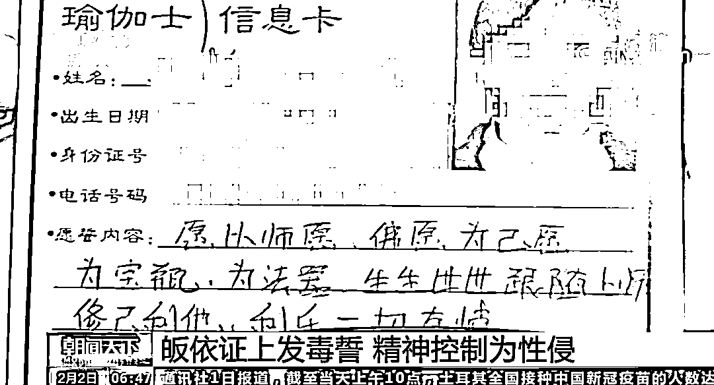
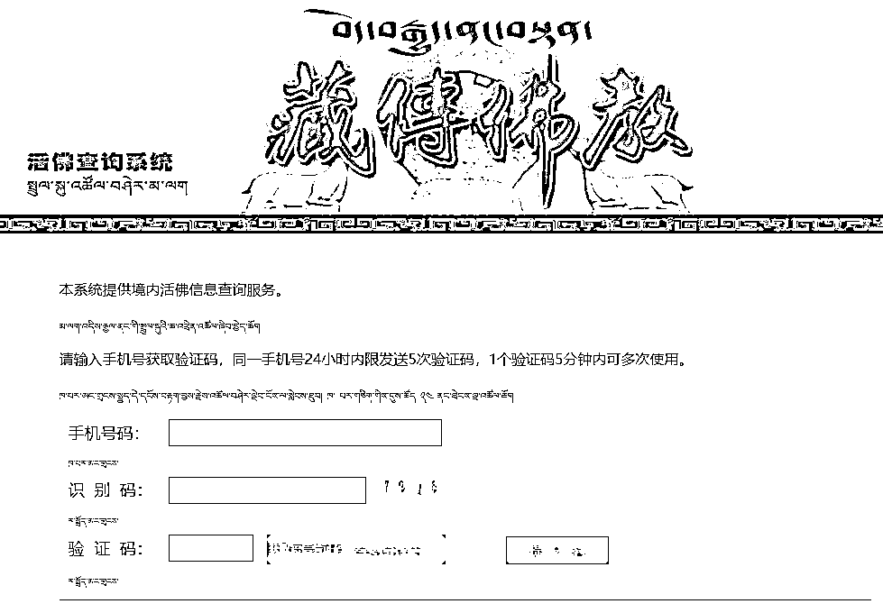

# 假活佛 10 年骗了 2 亿，名下 12 套房产！强奸数名女弟子声称“身加持”，一封举报网帖揭开真面目

> 原文：[`mp.weixin.qq.com/s?__biz=MzIyMDYwMTk0Mw==&mid=2247508897&idx=3&sn=2c1f9835b3c006c5ab38db73dd6b1203&chksm=97cb6899a0bce18f1b739623c0df9f19338dc93f8e5078a58b01a68ea94dc5ad53ed0ffc9914&scene=27#wechat_redirect`](http://mp.weixin.qq.com/s?__biz=MzIyMDYwMTk0Mw==&mid=2247508897&idx=3&sn=2c1f9835b3c006c5ab38db73dd6b1203&chksm=97cb6899a0bce18f1b739623c0df9f19338dc93f8e5078a58b01a68ea94dc5ad53ed0ffc9914&scene=27#wechat_redirect)

**导读：**身着袈裟，在全国 20 多个省份来回走穴讲经传法的“活佛”，有三张迥然不同的身份证。一张显示：他是汉族人，名为王兴夫；另两张上，他是藏族人，名字分别为“洛桑丹真”、“降巴洛桑丹真”。基于三个身份，这位“活佛”不到十年间，在全国广收 3000 余名信徒，敛财近两亿。

他在传教说法中宣扬“双修”、“身加持”，以此对女弟子行奸污猥亵之事。截至案发有 8 名受害女性投案控诉其涉嫌强奸。

 [`mp.weixin.qq.com/mp/readtemplate?t=pages/video_player_tmpl&action=mpvideo&auto=0&vid=wxv_1721901974935109637`](https://mp.weixin.qq.com/mp/readtemplate?t=pages/video_player_tmpl&action=mpvideo&auto=0&vid=wxv_1721901974935109637) 

央视揭假活佛 10 年骗了 2 亿

通过层层包装，一个所谓的气功大师，摇身一变成了转世活佛，进而在内地敛财骗色，10 年时间，这位假活佛非法敛财近两亿元，并强奸猥亵数名女弟子。近日，济南中级人民法院对这起假活佛案作出终审判决，假活佛王兴夫犯组织利用邪教破坏法律实施罪、非法经营罪、强奸罪、强制猥亵妇女罪，数罪并罚，判处有期徒刑 25 年，那么一个所谓的气功大师，是怎样通过层层包装，变成假活佛了呢？ 

这是一段名为《洛桑丹真活佛坐床法会纪实》的视频，视频中宣传，这位“洛桑丹真”活佛，在 2008 年 9 月 5 日到 9 月 7 日，先后在四川省甘孜州石渠县的蒙格寺、俄若寺等四座寺庙坐床成佛，是被藏传佛教的几位大成就者认证的活佛，而这位所谓的“洛桑丹真”活佛，真名叫作王兴夫，是一位汉族人。

王兴夫的弟子：我们还看过他拍的一些录像，那个录像上就是场面很宏大。当地的好多穿僧衣的喇嘛，还有一些藏民去迎接他们，让我们不由地不会怀疑他是假的，以为是真的。

王兴夫的身份到底是什么？20 年前，王兴夫有两个对外的身份，一个是济南监狱系统的公职人员，一个是气功大师。

王兴夫的弟子（女）：不是 1996 年就是 1995 年，身体不好、有病，觉着跟着他学学气功身体都好了，从心理上觉得身体慢慢都好了。

记者：那个时候王兴夫他是活佛吗？

王兴夫的弟子（女）：那时候不是，不是活佛。

王兴夫以气功大师的名义长期在外开班收徒，根本顾不上监狱系统的本职工作，1997 年，济南监狱在无法联系到王兴夫本人的情况下，对他作出开除公职处理，自此，王兴夫就只剩下了气功大师这一个身份。

专案组民警 王亮：到了 2000 年左右，因为国家大形势是取缔有害气功一系列功法。然后他觉得这样下去继续办气功班就不大合适了，然后他就通过以佛教居士的这个身份进行传佛法活动。

从气功大师转为佛教居士后，王兴夫并不满意自己的身份，2008 年，王兴夫想尽办法，在四川省甘孜州石渠县俄若寺，拜当地的一位老僧人为师，并在同门师兄弟鲁绒的帮助下，伪造当地藏民身份，从汉族的王兴夫变成了藏族的洛桑丹真。

专案组民警 王亮：身份也变了，**王兴夫在鲁绒的帮助下先后伪造了（藏传佛教的）洛桑丹真、降巴洛桑丹真两张藏族的身份证，然后就以洛桑丹真这个身份进行活动。**

有了洛桑丹真这个假身份，王兴夫又在师弟鲁绒的帮助下，2008 年，在四川甘孜的石渠县举行了所谓的坐床仪式，对外号称洛桑丹真活佛，由此，王兴夫完成了从气功大师到洛桑丹真活佛的华丽变身。王兴夫也把这段视频刻录成光盘，分别取名《洛桑丹真活佛坐床法会纪实》《上师洛桑丹真仁波切》，在弟子中间传播自己，**王兴夫还让弟子通过 PS 技术，把自己包装成端坐莲花台、头顶佛光的形象，还铸造铜像，让弟子们供奉起来。对于王兴夫的这些包装宣传，中国藏学研究中心宗教研究所进行了仔细研究，认定王兴夫的活佛身份纯属个人瞎编乱造。** 

（图为王兴夫的严重违反藏传佛教仪轨的“坐床仪式”）

中国藏学研究专家 周炜：他通过俄若寺的僧人组织了一套程序，就是活佛转世的程序，就是活佛转世坐床的程序。然后活生生地把内地一个汉族，变成藏族，变成僧人，最后通过这样一个转世程序把他变成了活佛，让他获得了活佛的身份。所以这个身份是假的，我们知道，要想成为一个活佛，从历史上来看，他必须是要有历史的传承，我们知道王兴夫他（所谓）成为活佛，他上面没有历史的传承。

在中国佛教协会副会长珠康·土登克珠活佛看来，王兴夫自称坐床成活佛的行为，既不符合藏传佛教的教义和基本仪规，也不符合国家宗教局制定的《藏传佛教活佛转世管理办法》，不具有合法活佛身份。

中国藏学研究专家 周炜：我觉得我们完全可以看清楚，王兴夫和藏传佛教之间没有任何的关系，他只是披着藏传佛教的外衣，所以我们不能把他与藏传佛教等同起来。

**疯狂敛财！十年骗财近两亿元**

通过办假身份证，汉族男子王兴夫摇身一变，变成了藏民“洛桑丹真”，再通过假的“坐床”仪式，变成了“洛桑丹真活佛”，开始在内地敛财骗色，法院二审认定，王兴夫在十年时间里，利用假活佛的身份，骗取钱财近两亿元，数额巨大。

这间建于 40 多年前的旧房，是王兴夫在济南接见弟子的场所。在弟子面前，王兴夫展示的是一位甘守清贫、一心向佛的长者形象，然而，济南警方在调查中发现，王兴夫真正的住所，豪华奢侈到让人震撼。 

专案组民警 刘晔：王兴夫的别墅，整个一栋楼接近小一千平方，还有很大的院子，在成都也是一个比较高档的社区。买了一个别墅，这个别墅里面有大量的宗教宣传品和一些现金，当时搜出来的现金就达到 50 余万（元）， 就放在他的保险柜里，家里还有保姆给他看着房间。

**济南警方调查发现，王兴夫在全国各地有 12 套房产。在王兴夫的那些住所里，警方查获了大量现金、各种银行卡、金条，以及高档奢侈品和名酒。**

专案组民警 王亮：据我们通过调取的一些银行交易记录、流水，包括弟子的一些、当事人的证人证言来看，再结合王兴夫本人供述，综合审计结果是 1.98 亿（元）。

（图为警方从王兴夫处搜出的大量金条的一部分）

（图为警方从王兴夫处搜出的各种现金与外币的一部分）图片来自环球时报

如此数额巨大的钱财， 王兴夫又是以什么样的名义收取的呢，据济南警方调查，自王兴夫以“洛桑丹真”活佛名义开展活动以后，在沈阳、北京、济南、成都等地建立起 8 大核心道场，核心道场下设各级分道场，在全国 20 多个省、市、自治区发展弟子 3000 多人，每个弟子每年都要给王兴夫上交供养，王兴夫宣传自己就是福田，给他供养交钱，就是“种下一粒种子，收获万亩庄稼”。

王兴夫的弟子 蔡某：王兴夫他又说，他在藏地要建很多寺庙，就是要花很多钱。我个人那时候做生意，如果说有钱我们都比较尽力供养他 ，因为他说以后他的钱都是用于建设寺庙，包括做那个佛的事业。

**除了收取弟子的供养，王兴夫还编造了名目繁多的收钱项目：皈依“活佛”要收钱，起法名也要收钱，灌顶传法的费用由低到高 4 个等级，全部修完，要收费 5 万元以上。**从网上购买的一百多元一个的景泰蓝花瓶，在王兴夫做完法事后，就变成“龙王宝瓶”，卖给弟子几千元一个。

王兴夫的弟子：曾经在厦门做过几次 “龙王宝瓶”的那个仪式，就是给大家祈福的，那个是需要收费用的，好像 1000 多（元） 还是 3000（元）、 5000（元）的，它大小不一样，价格也不一样。

（图为被鲁绒包装后的王兴夫在行骗）

王兴夫被警方抓获前一周，王兴夫以灌顶、加持、自愿供养的名义，短短 7 天，从弟子那里就收取人民币 47 万元。对于弟子们供奉的金钱，王兴夫还特意从中抽出崭新的人民币，捆扎在一起，存放在自己保险箱中。

主犯 王兴夫：弟子供养我的凡是新钱，我舍不得存（银行），我就存到橱柜里。从小在农村是穷孩子，尤其见新钱就高兴、喜欢。

为获取更大利益，王兴夫还利用这些钱财，用来投资公司，安排弟子担任法人，销售经营佛教用品，通过非法渠道印制法本、光盘，销售给各地弟子，从中获利。

中国藏学研究专家 周炜：这种敛财根本上完全是违背了我们说的藏传佛教，或者佛教所说的，那你作为一个菩萨，作为一个僧人，你应该是去救度普通老百姓，去给他们传教，帮助他们去理解佛法。而他不是，他完全是自己为了敛财！

**3000 余名信徒，不乏知名大学老师**

有了“洛桑丹真活佛”这个假身份后，王兴夫还给弟子们编了一整套“法本”。中专学历的王兴夫，曾言自己对佛法研究有“悟性”：**“别的东西看不懂，佛法看一眼就明白”。**他自称法本是以藏传佛教经典理论为基础，总结自己二十多年有利于净化身心的学佛经验编入其中，修习这些法本，信徒们不仅能学得更快，还能更快净化心灵。“比如密宗宁玛派《大圆满法》仪轨有很多，正常学的话得有 7 年至 10 年，才能达到开悟，学习我的《无上瑜伽即身成就传承仪轨》，3 年左右就能达到开悟。”

“活佛”身份加上“法本”，这让王兴夫的信徒对师父更加信以为真。在曹忠印象中，王兴夫佛学修为很高，“遇到困惑都会向他请教，他的指教都很清楚，从不引经据典，说的道理也浅显易懂。”曹忠称自己信佛，是一心求福报，为了事业顺利、家庭安康。

而从事服务行业的张康（化名），则是人到中年遭遇家庭变故，听闻有位师父可以开解，经朋友介绍与王兴夫见了一面，“看着很慈祥像个长者，说话也让人觉得舒服，觉得他很懂心理学”。

张康陆续见了王兴夫几次，“有时候在寺庙，有时候在弟子家里，二三十个人一起，他讲现实问题多，跟心理咨询师一样，夹杂佛法概念来说，太高深的也听不懂，我觉得他说的有道理，想着找心理咨询师一堂课要几百块，王兴夫开导不要钱。”在几次得到王兴夫的免费开导后，张康曾私下问其他人一般给师父多少“供养”，按惯例他交了 300，算是皈依王兴夫。对皈依自己的信徒，王兴夫还会发一张自制的“皈依证”，证件的右下角盖上他随身携带的仿造俄若寺印章的章戳。

王兴夫自制的皈依证

另一位信徒陈萍萍（化名）回忆，刚开始听王兴夫讲经也不是多么相信，后来有一次参加集会，“发现大学老师、公司董事长都相信师父，也就跟着信了。”

她称王兴夫讲经讲得好，“藏区活佛讲经我们听不懂，师傅能用汉语讲经。”但提及是否看过师父的活佛证，她只说听说有，但没有见过。

“洛桑丹真活佛”从藏地归来，在济南、成都、沈阳、厦门等地以传授藏传佛教的名义发展信徒，短短几年时间迅速在全国多个大城市组建道场，每个道场的弟子达两三百人不等。至 2017 年案发之时，王兴夫在全国已设立 8 个主要道场，发展信徒超 3000 人涉及全国 20 多个省份。

王兴夫的信徒帝国

随着信徒队伍的壮大，为管理队伍，王兴夫还在全国各地道场任命“联络员”、“助道员”、“辅导员”，王兴夫每到一个地方，当地联络员即负责召集弟子来听师父传法；助道员则主要负责收集弟子们的供养；辅导员专门负责帮助学员们学习王兴夫的“法本”。到 2010 年前后，济南、沈阳、成都、厦门、广西等地道场已形成完整的“三员”管理体系。

分级管理队伍

为确保这群数量庞大的信徒一心一意跟自己学佛，2010 年起，王兴夫还自创了一套“金刚菩提誓句”，要求每一位弟子当着菩萨的面“发毒誓”，以达到精神控制的目的。信徒们在一张张卡片上写下自己的名字以及自己最害怕的死法。有的信徒写道：“如违背菩萨愿，受五马分尸之罪”，还有信徒发誓称：“如果背弃师父，就被毒蛇咬死”。

**沆瀣一气 假作真时真亦假**

王兴夫之所以能够把自己从一个所谓的气功师包装成藏传佛教的活佛，在全国各地实施不法行为，就不得不提到另外一个人，鲁绒。鲁绒与王兴夫，一个是俄若寺民管会主任，一个是副主任，又是同门师兄弟，在骗取钱财方面，双方是相互勾结、各有所图。

这个一直陪伴在王兴夫身边的僧人就是鲁绒，鲁绒是四川石渠县内的一个藏传佛教教职人员，是俄若寺民管会主任，王兴夫正是通过鲁绒牵线搭桥，拜鲁绒的师父为师，两人由此建立了密切关系，随后两人又分别担任俄若寺民管会的正副主任。 

专案组民警 刘晔：这个鲁绒和王兴夫进行了合作，并进行了勾结，是主动的一些行为。他需要王兴夫的钱财，王兴夫诈骗之后，把这个钱财前前后后给了鲁绒五千多万 ，然后鲁绒对王兴夫进行了全面的包装。

警方侦查发现，在王兴夫变身洛桑丹真的过程中，鲁绒可以说是跑前跑后，联系当地村干部，打通各地环节，让王兴夫在当地成功办理了两个假身份证。为了让弟子们相信王兴夫这个假活佛的身份，每次王兴夫带着弟子去俄若寺，鲁绒都会按照活佛的待遇，高规格接待王兴夫。

专案组民警 刘晔：王兴夫每年带领着他全国各地所有的信徒到这个俄若寺去，去了之后，受到了这个鲁绒高规格的接待，包括到了寺院之后，居然让王兴夫能坐在（民管会）主任、坐在主持这个位置上，鲁绒居然坐到了一边，所以说给广大的王兴夫的信徒造成一种假象。王兴夫就是在藏地受到了很高规格的礼遇，他就是活佛。

对于王兴夫的真实身份，鲁绒心里最是清楚。然而，鲁绒不仅把王兴夫包装成洛桑丹真活佛，还以俄若寺民管会的名义，给王兴夫出具座床凭证。在凭证中，白字黑字，称呼王兴夫为洛桑丹真活佛。

民警：你给他这个证件是什么证件？

主犯 鲁绒：纸上写的。

民警：纸上写（他是寺院的僧人）？

主犯 鲁绒：对对。

民警：这起一个什么作用呢？

主犯 鲁绒：证明僧人（身份）。

民警：他出去之后证明僧人（身份）？

主犯 鲁绒：有时候他就给寺庙办一点事，给寺庙帮一点忙呀，这样他就可以方便些。

2016 年，网上有人举报王兴夫是假活佛，有敛财骗色的行为，在网络上引起热议，鲁绒此时又以俄若寺民管会的名义，在网上发表声明，力挺王兴夫，称王兴夫是“从不为己、从不沽名钓誉，是位清净无私的上师”，而作为回报，王兴夫前后通过银行卡或者现金的方式，给鲁绒汇款几千万元。

主犯 鲁绒：那天我查了一下，在我的银行卡上汇寄过来的钱大概差不多有三千多万。

民警：三千多万？

主犯 鲁绒：三千多万不到四千万。

民警：到后来就是说有？

主犯 鲁绒：后来也有，也带了些现金。

民警：现金？

主犯 鲁绒：现金也有，来来去去有没有四五千万，五六千万以下，就是四五千万左右吧大概。

**一个假冒活佛敛财骗色，一个给对方办假身份证，提供包装场所，并提供虚假证明，从中获益，两人就这样沆瀣一气，让弟子们一时难以分辨真假。**

**歪解“身加持”：**

**8 位女弟子指控被强奸猥亵**

再精密的骗局总有被揭露的一天，最终揭开“洛桑丹真活佛”真面目的，是来自一封网帖的举报。

2016 年 8 月，一则实名举报王兴夫为假活佛、涉嫌骗财骗色的帖子在网上广泛流传。弟子曹忠看到帖子后，第一反应是“不可置信”，他正在学习的法本《无上秘密瑜伽》封面上写着“洛桑丹真尊者著”，“师父倡导我们要爱国、爱党、爱教、爱社会、爱生活，作为一个修行的人，要懂得回报国家的恩，不要和政府作对”。

曹忠思来想去还是决定相信师父，“不管别人怎么想，我觉得师父是一个正能量的有修行的人”。其后，“洛桑丹真活佛”靠假身份证、换来假的僧人身份、办了一场假的“坐床”仪式成为假活佛的消息，很快在信徒间传开。

一个月后，曹忠接到王兴夫的电话，安排他和妻子蒋鑫赴南宁处理此事。在电话里，王兴夫对曹忠解释，网贴是有徒弟对他有意见，在网上造谣、诽谤。

由于举报人拒绝见面，曹忠和妻子到南宁后并未找到答案。

不久后，流传于网络上的帖子被删除。2016 年 12 月，一封署名俄若寺寺管委主任鲁绒的《严正声明》、《关于洛桑丹真的调查报告》出现在网络，帖子称经过多方调查，没有任何证据证明洛桑丹真有不清净或违法犯罪的行为，此前网帖所述内容与事实严重不符，纯属个人情绪宣泄和误导、恶意诽谤炒作。在报告中，鲁绒还称洛桑丹真“爱国、爱教、爱社会，促进藏汉团结，从不为己、从不沽名钓誉”，是“藏汉民族团结的使者”。

这份声明和报告很快平息了网络舆论，打消了弟子们的疑虑。

但据南都记者了解，网贴所述“洛桑丹真活佛”歪解藏传佛教，涉嫌骗财骗色，甚至对女弟子实施强奸猥亵之事，最早可追溯至 2008 年。

一位受害女信徒回忆，在 2008 年的一天，她因与丈夫关系紧张、孩子生病等原因，单独向王兴夫求加持。王兴夫答应后，让其在宾馆等他。当穿着便服的师父来到宾馆房间，这位女信徒未想到竟是一场噩梦的开始。当她按照惯例跪下给师父磕头，像平日求加持一样，向师父诉说家里的情况，王兴夫却很不耐烦。“他说，你要知道，事情总会过去的。我以前也讲过，作为弟子要身、语、意都要供养给师父，你们也发过誓，要做师父的‘如意法器’，我今天来要好好加持你。你要知道这种加持是很难得的，你要珍惜。”而后，她遭遇王兴夫的猥亵和性侵。

“我想不明白，不明白为什么这种加持会落到我的身上……”这位受害者一边哭泣一边回忆：“心里很害怕，但想到他是上师、是活佛，担心反抗会遭报应，又不敢反抗，一边哭一边给他磕头，反复说师父这样不行。”

据其介绍，此后王兴夫再次要求“宾馆开房”，王兴夫还称：“这种加持是‘身加持’，是对你最大的加持，对你有无穷的益处”，又称“你是师父的小明妃，师父身边没有几个人有资格做‘明妃’。你入门前发过誓，要用自己的身、语、意全部来供养上师，要保持愿行一致，时刻警惕自己的誓言。”

遭遇性侵后，这位受害女信徒对王兴夫又惧又疑，“他所谓‘身加持’的说法，是用来奸淫妇女的一种手段，我就是受害者。他用弟子发的誓言威胁控制弟子，甚至强行奸淫女弟子。”

据南都记者获取王兴夫的传法音视频资料显示，王兴夫在传法中，还曾宣扬“弟子要甘心做法器，法器要任由师父打造”，要“永不叛师，永不叛道，如若违愿，必遭恶报”。他还多次告诫弟子：“师父的愿就是佛陀的愿，师父与佛无二，弟子要以师父愿望为佛愿，不能违背师父”。

流传于网络的这封举报信，最终引起了警方的关注，成为王兴夫东窗事发的导火线。

2017 年 6 月，王兴夫因涉嫌组织利用邪教组织破坏法律实施罪、非法经营罪、强奸罪、强制猥亵罪被警方逮捕。南都记者获悉，在被逮捕当天，王兴夫随身携带的公文包、行李箱中搜出避孕套和印度神油。据警方调查还发现，王兴夫有一个小本子，记录了 100 多位女弟子的电话号码，已有 8 位受害女信徒指控曾遭遇王兴夫强奸和猥亵。

2020 年 7 月 31 日，山东省济南市中级人民法院对该案进行终审，该院认为，被告人王兴夫、鲁绒利用制造、散布迷信邪说等手段蛊惑、蒙骗他人，以发“金刚菩提誓句”等手段控制信徒，该组织系邪教组织。王兴夫通过在全国多地设立道场、发展成员，大肆敛财，为传播邪教，印刷出版大量的非法出版物，同时涉非法经营、强奸、强制猥亵等犯罪，情节严重。

被告人王兴夫犯组织、利用邪教组织破坏法律实施罪，判处有期徒刑十五年，并处罚金两千万，犯非法经营罪，判处有期徒刑八年，并处没收财产五十万，犯强奸罪，判处有期徒刑十二年，犯强制猥亵罪，判处有期徒刑一年。决定执行有期徒刑二十五年，并处罚金两千万，没收财产五十万。

被告人鲁绒、曹忠、蒋鑫等人因犯组织、利用邪教组织破坏法律罪分获六至两年有期徒刑。

**假活佛为何有市场？**

**一是，很多内地信徒对藏传佛教知之甚少，在有信仰需求时，只看表象，没有鉴别真假的能力。**很多人往往是在利益驱动下产生信仰，对活佛及其功德品性不做深解。在王兴夫案件中，不乏有追名逐利之人，也有很多家庭不幸的信徒，他们急切改变现状，但却将成功和幸福的希望寄托于假活佛身上。

**二是，不法分子利用信徒对佛教教义教理不甚了解以及求财求利的心理，鼓吹神化自己，把自己包装成高僧大德，迷惑广大信众，骗取信任。**例如，王兴夫大肆鼓吹自己的佛学造诣，用“密宗”“加持”“无上秘密瑜伽”等在普通群众听起来玄之又玄的词汇，让信众误以为他是高僧大德。

**三是，不法分子勾结不法僧众，组成利益集团，利用信徒的从众心理，使其打消疑虑，不疑有他。**随后散布歪门邪说，进行精神控制，为自己谋取利益。王兴夫案件中，正是因为有鲁绒贡智等人的协助“包装”、打“掩护”，使其更具欺骗性。

**真正的活佛有何要求？**

早在 2007 年，国家宗教事务局颁布的《藏传佛教活佛转世管理办法》中就明确规定：活佛转世应当遵循维护国家统一、维护民族团结、维护宗教和睦与社会和谐、维护藏传佛教正常秩序的原则。并且规定活佛转世应当具备以下条件：

（一）当地多数信教群众和寺庙管理组织要求转世；

（二）转世系统真实并传承至今；

（三）申请活佛转世的寺庙系拟转世活佛僧籍所在寺，并为依法登记的藏传佛教活动场所，且具备培养和供养转世活佛的能力。

总体来说，活佛有四条标准缺一不可，那就是：有传承，有寺庙，有供养和培养能力，有政府批准。这些规定的目的，是让藏传佛教活佛转世工作进一步法制化、规范化和制度化，防止不法分子打着宗教的名义为非作歹。

**谨记三招，识别真假活佛**

借助假的“活佛”身份，主犯王兴夫、主犯杨洪臣，在内地大肆敛财骗色，不仅玷污了活佛的声誉，也伤害了那些信奉佛教的信徒，那么有没有办法来识别真假活佛，专业人士建议，识别真假活佛，可以谨记三招。

识别真假活佛，最简单最直接的办法就是上网通过“藏传佛教活佛查询系统”进行查询。2016 年，这个藏传佛教活佛查询系统就已经上线，全国具有合法身份的 1300 多名活佛，在系统里都能查到。

原国家宗教事务局一司副司长 李寒颖：在那个中国佛教协会的网站，我们国家宗教局的网站和中国西藏网上，都有这个活佛查询系统，这是 2016 年上线的，可以很方便地查询到所有境内的活佛的信息。

识别真假活佛的第二招，就是向当地部门的宗教事务部门查询。每个活佛在当地宗教事务部门都会有备案，一位真活佛必须有传承，有寺庙，有转世灵童制度，有政府批准，并且缺一不可。

专案组民警 朱睿：如果在宗教上有所需求的话，首先第一条就是，宗教活动应该在国家指定的正规的宗教场所去进行，可以去寺庙或者是教堂等等， 不要听信一些所谓的弟子、朋友、亲戚等等这些人的推荐，有可能会导致上当受骗。

对于识别真假活佛的第三招，宗教工作人员和警方给出了一个的相同的建议，那就是一定要了解一些基础的佛教知识。

原国家宗教事务局一司副司长 李寒颖：佛教是一个理性的智慧的宗教，我们的信教群众一定要提高自身的信仰素质，提高对这个善恶美丑的辨别能力 。不能因为你认为这个人他是活佛也好，是上师也好，你就对他百依百顺，丧失了这种辨别能力。

宗教事务部门和警方建议，一旦确认对方是假活佛，应当向当地公安机关报案或者向宗教事务部门举报，打击假活佛，也是为了保护藏传佛教健康传承。

来   源：21 世纪经济报道、央视新闻、南方都市报、环球时报、中国西藏网

← 向右滑动与灰产圈互动交流 →

