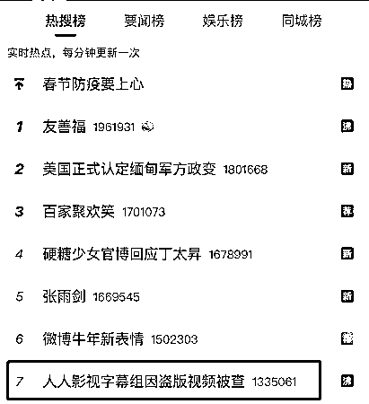
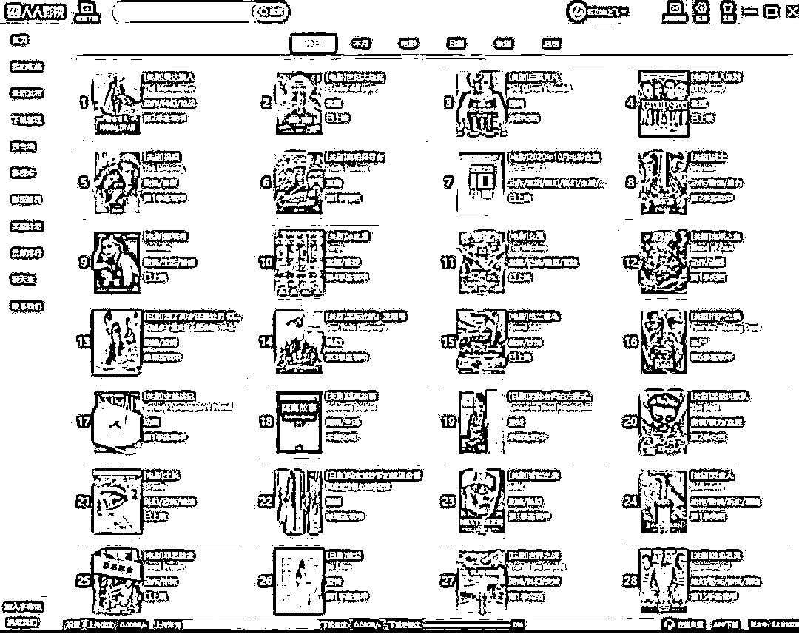
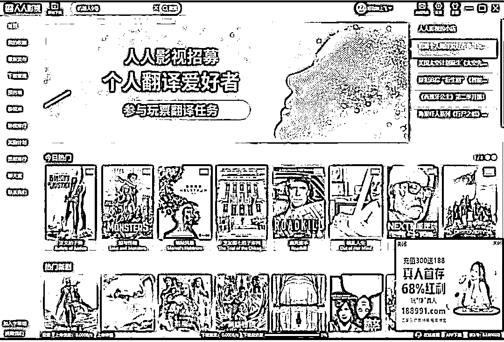
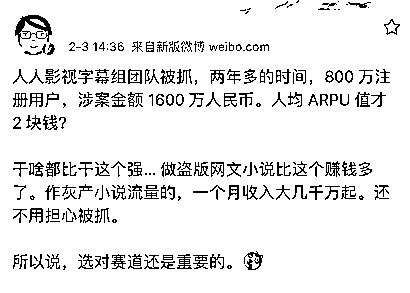
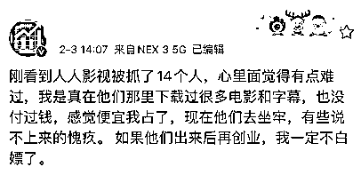

# 突发！人人影视字幕组 14 人被抓，用户超 800 万，涉案金额超 1600 万！网友炸了

> 原文：[`mp.weixin.qq.com/s?__biz=MzIyMDYwMTk0Mw==&mid=2247508912&idx=1&sn=73b9ad8f20f97706676f4275c70b2f32&chksm=97cb6888a0bce19e6ce77cfda0672f9cbef9899194b08235beb0cd89838303be8a373cb68e44&scene=27#wechat_redirect`](http://mp.weixin.qq.com/s?__biz=MzIyMDYwMTk0Mw==&mid=2247508912&idx=1&sn=73b9ad8f20f97706676f4275c70b2f32&chksm=97cb6888a0bce19e6ce77cfda0672f9cbef9899194b08235beb0cd89838303be8a373cb68e44&scene=27#wechat_redirect)

字幕组，曾被誉为近五十年最出色的文化交流使者，让无数影视发烧友折腰。随着版权保护的加强，字幕组的风云江湖日渐凋零。

而今天 2 月 3 日，一大“噩耗”传来，人人影视字幕组因盗版视频被查，涉案金额超 1600 万元。14 人被抓。

## **“人人影视字幕组”被查**

## **涉案金额 1600 余万元**

注册用户超过 800 万，发布各类影视作品超过 2 万部的“人人影视字幕组”，近日因侵犯影视作品著作权被上海警方查了

据上海市公安局新闻发言人办公室陆敏韡警官上午透露，上海警方历经 3 个月缜密侦查，在山东、湖北、广西等地警方的大力配合下，成功侦破了这起国家版权局、全国“扫黄打非”办公室、公安部、最高检四部委联合督办的“9.8”特大跨省侵犯影视作品著作权案

1 月 6 日，上海警方历经三个月缜密侦查，在山东、湖北、广西等地警方的大力配合下，成功侦破“9.8”特大跨省侵犯影视作品著作权案，抓获以梁某为首的犯罪嫌疑人 14 名，查处涉案公司 3 家，查获作案用手机 20 部和电脑主机、服务器 12 台，涉案金额 1600 余万元。

2020 年 9 月，上海警方在工作中发现，有人通过“人人影视字幕组”网站和客户端提供疑似侵权影视作品的在线观看和离线下载。经与相关著作权权利人联系，上述影视作品未取得著作权权利人的授权或许可。 

对此，上海市公安局经侦总队会同虹口公安分局开展侦查。

以涉案网站和客户端所留会员付款、周边产品销售付款两个二维码作为突破口，警方锁定了位于山东的梁某、丛某，以及位于湖北的王某，并很快摸清了整个犯罪团伙的组织架构。 

经查，自 2018 年起，犯罪嫌疑人梁某等人先后成立多家公司，在境内外分散架设、租用服务器，开发、运行、维护“人人影视字幕组”APP 及相关网站，在未经著作权人授权的情况下，通过境外盗版论坛网站下载获取片源，以约 400 元/部（集）的报酬雇人翻译、压片后，上传至 APP 服务器向公众传播，通过收取网站会员费、广告费和出售刻录侵权影视作品移动硬盘等手段非法牟利。现初步查证，各端口应用软件刊载影视作品 20000 余部（集），注册会员数量 800 余万。

目前，警方已对上述犯罪嫌疑人依法采取刑事强制措施，案件正在进一步侦办中。

警方提醒：全社会都要积极参与到知识产权工作中去，不购买盗版产品，不浏览盗版网站，不下载盗版素材。同时，在一些自媒体平台、个人网络空间刊载相关文字、视频内容时，也要提升“版权”意识，同步保护好他人与自己的原创成果。若发现侵权违法犯罪线索，请及时向公安机关举报。

**早前已经被传“真的凉了”** 

1 月 9 日，一篇名为《人人影视字幕组真的凉了》帖子，令众多美剧迷心急如焚。

这篇发布在豆瓣“鹅组”的帖子，内容只有寥寥几句，却极具“杀伤力”：“QQ 群管理员挂的通告，说要大家记住今天，以后人人也不会有了。有点想哭了。”

在上述帖文的留言区，大量网友对这个中国最大字幕组的前景表示关切。

另有网友反映，自从 1 月 4 日开始就发现“人人影视字幕组”APP 已无法使用，即便已下载该应用的用户也不能下载相关影视剧资源。PC 版网页则于 1 月 4 日发布公告称：“我们正在清理内容！所有客户端均无法正常使用”。

尽管 1 月 10 日，多位人人影视字幕组成员在微博上发声“辟谣”，表示贴文内容“纯属子虚乌有”，APP 停止使用只是正常服务器维护，但该来的还是到来。

## **字幕组消亡**

国内的字幕组，兴起于 2001 年，自一开始，就有种分享交流的互联网精神。在 2001、2002 年的网络论坛中，一群动漫、外国剧集爱好者自发组成最早的字幕组，后来迅雷、电驴等下载软件登场，字幕组进一步兴盛。

那一年，美剧《越狱》大热，字幕组进入鼎盛期。

“不容易”，是影迷、剧迷在这些事件前的共同心声。实际上，前身是 YYeTs 字幕组的人人影视，从 2006 年成立后至今，前后已经遭遇过 6 次的关闭危机。而这家早期凭借翻译热门美剧《生活大爆炸》大火，成功跻身国内最早一批创立、影响最大的字幕组，自身的起伏也只是字幕组生态的一个缩影。

日韩剧的爱好者们创建了“猪猪”、“韩娱家园”等论坛；后来由于互联网上的国外影视资源以滚雪球的速度不断扩充，催生出了内部分工更加成熟的 TLF 字幕组、YYeTs、伊甸园、风软、破烂熊、圣城家园、凤凰天使 TSKS、飞鸟影苑等字幕组。

这些影迷、剧迷口中的“隐秘组织”，在过去若干年里，凭借着抢占美剧、韩剧、纪录片等不同类型和语种的影视资源，在第一时间将“生肉”翻译为有字幕的“熟肉”后，极大程度上帮助了影迷们打开对海外影视剧的视野。

在这些字幕组里，人人影视、伊甸园、风软、破烂熊被称之为“四大美剧字幕组”，它们通过专业准确的翻译，给影迷留下了深刻印象，而这之中，人人影视尤为出名，它的前身是加拿大华裔留学生小鬼神于 2003 年创立的 YYeTs 字幕组，并在 2006 年 6 月 1 号建立独立论坛、逐渐发展为知名影视站点，2007 年改名为人人影视，一度覆盖了各大语种的字幕。 

在海外电影方面，成立于 2005 年的圣城家园字幕组是早期粉丝基数较为庞大的一家。该字幕组的前身是由一群电影爱好者们组成的 SCG 字幕组资源论坛，后来有了自己的独立网站，并提供大量海外优质资源和字幕翻译工作。圣城家园也曾凭借在《破产姐妹》中接地气的翻译，在剧圈内受过一阵的追捧，巅峰时期的会员数一度达到过 200 万人。

枫雪和猪猪是两个专注于动漫翻译的老牌字幕组，分别成立于 2003 年和 2004 年，通过翻译热门动漫被粉丝熟知。目前，枫雪依旧是国内翻译《海贼王》动画最全、坚持时间最长的字幕组，而猪猪则开始从日本动漫转向翻译日剧和日本电影，二者可以称得上是日本影视内容和内地观众间间的桥梁。

2006 年，《纽约时报》曾发表了一篇名为《打破文化屏蔽的中国字幕组》的报道，文中写道：“字幕组的成员都知道，他们的作品在其它国家可能被认为是侵权。不过根据中国法律，这些作品很可能被当作学术研究，因为它们既不收费，也不以盈利为目的。 ” 

毫无疑问，在未经授权的情况下翻译并大范围传播影视作品的行为，不在法律允许的范围之内。为了规避风险，很多字幕组都将自己定位为“影视剧爱好者的交流论坛”，并且在资源里注明“爱好者交流所用”“不作商用”等免责声明。

有人将字幕组形容为“燃烧了自己，照亮了别人”。曾经活跃的很多字幕组，都因为人手、营利、版权等诸多问题，消失不见。现存的字幕组，也很难说完全逃脱了灰色地带。

**网友评论** 

来源：中国基金报

← 向右滑动与灰产圈互动交流 →

