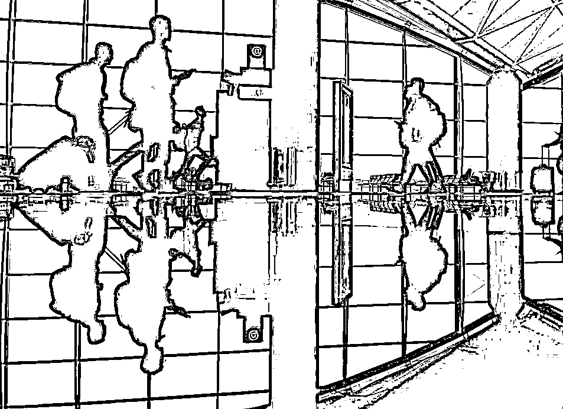
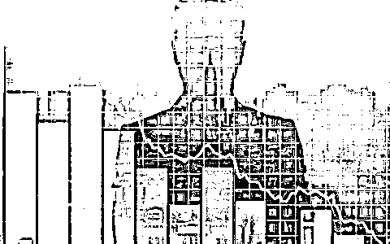
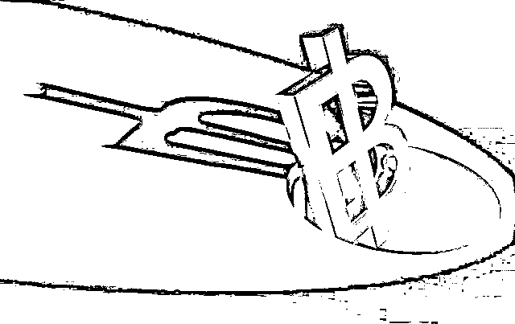
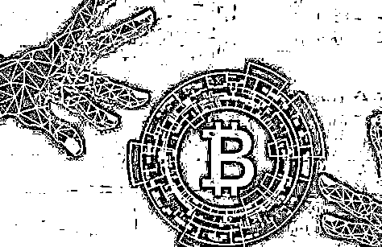
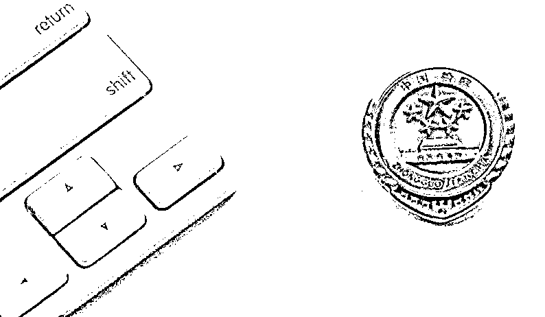

# 又一个跨国虚拟货币投资骗局崩盘了！

> 原文：[`mp.weixin.qq.com/s?__biz=MzIyMDYwMTk0Mw==&mid=2247508912&idx=2&sn=72ddc0afeb7be141d0db86be94aeb1c0&chksm=97cb6888a0bce19e39fb14492b7581d5d5f19cc1d1b10d927cbdf53dc9fc3cbe66f9e1034f55&scene=27#wechat_redirect`](http://mp.weixin.qq.com/s?__biz=MzIyMDYwMTk0Mw==&mid=2247508912&idx=2&sn=72ddc0afeb7be141d0db86be94aeb1c0&chksm=97cb6888a0bce19e39fb14492b7581d5d5f19cc1d1b10d927cbdf53dc9fc3cbe66f9e1034f55&scene=27#wechat_redirect)

数字虚拟币是新型金融货币，价格水涨船高，引得投资者趋之若鹜。这也让一些不法分子嗅到了“商机”，精心炮制出：**“拉人入群-直播荐股-平台投资-系统锁仓-收割韭菜”**这一诈骗闭环，趁机骗取投资人资金。

**|****回国即被抓****   |**

2020 年 6 月 18 日早晨 7 时许，14 天前刚从马来西亚回国的何思华在广州某酒店解除医学隔离后，**旋即被上海警方抓获。** 

“我和我女朋友去那里旅行，就我们两个人。”到案后，对于自己 3 月启程的马来之行，何思华这样辩解。

“卞建琳认识吗？跟你同一航班回来的吧？！你们在那边的所作所为我们都已经掌握了。”

那一刻，**何思华瞬间被击溃，**本想着在那边提心吊胆地干了一票，回来能过几天省心日子。结果，**一刻自由也没有得到。**

———————————————— 

**|****投资“时兴货”****|**

3 月上旬，闲暇时喜欢炒股的陶女士浏览某视频网站时，留意到一条股票投资视频中滚动着“免费荐股，请加 QQ”字条。抱着试试看的心态，陶女士加入了一个名为“老孙聊股”的 QQ 群，**随后又被拉进了直播间。**

直播间里孙忠华、韩影等几位荐股“大师”把股票行情分析得头头是道，经常有人夸老师课讲得好，行情把得准，**很快便赢得了直播间不少股民的信任。**同年 4 月，“大师”在直播间里告诉大家近期股票行情不好，**投资数字货币更稳健，**并推荐了 BOX 交易平台上的两款虚拟币。

原本，陶女士这种老股民对“时兴货”虚拟币兴意阑珊。但直播间“大师”的一通力荐，却让她有些心动了。**随后，“孙大师”“韩大师”相继找她私聊，又为她详细分析数字虚拟币的涨势。** 

很快，群里名为“追风少年”的投资者也私信告诉她，自己买这两款虚拟币赚了不少钱。这下，陶女士真的“跃跃欲试”。恰在此时，群里的“助理雅洁”又来找她私聊，“手把手”教她下载 BOX 软件后，**迅速在平台上购买了 8 万余元虚拟币。**

———————————————— 

**|****遭遇“锁仓期” **** |**

买入后，平台显示陶女士持有的虚拟币价值持续上涨，一天不到的时间已经赚了 4 万多。顺利将“第一桶金”提现后，陶女士悬着的心总算放下了，之后两天内，**她直接将购买金额追加到了 300 多万。**但这一次买入后，陶女士却被告知有 45 天锁仓期，**再后来她就再也无法登陆 BOX 平台了，群里的人也都没了音讯。**300 多万的投资就这样打了水漂，如此急转直下的“剧情”，才让陶女士意识到自己受骗了。 

事实上，像陶女士这样的被骗投资人不止一个，分布江苏、广州等各地。见损失难以挽回，5 月下旬，陶女士等人陆续向警方报案，**经过缜密侦查，一个组织严密、分工明确的跨境网络电信犯罪团伙浮出水面。**

**| ****演员请就位 ****|**

“老孙聊股”群里除了陶女士，其他人都是“角色扮演”，**准时就位，各司其职。**而唱主角的正是“孙大师”的扮演者何思华。 

据何思华交代，2 月底，朋友邢波诚邀他参与这趟“大买卖”———通过支付底薪及高额提成、统一安排出行和食宿等方式，在国内招人后前往马来西亚利用后台操控 BOX 软件实施诈骗。卞建琳就是他招募的人员之一。3 月，抵马后，**何思华就将事先从阿波那儿拿来的手机、电脑、QQ 号等工具分发给大家，组织大干一票。**

“我们分为三组，何思华平常通过 Whatsapp 软件给我们发布话术、布置工作等。”据卞建琳交代他和陈亿松、刘晓婷一组，何思华也参与其中，各自扮演“大师”“助理雅洁”“投资者”等身份，诱骗客户投资购买平台上的虚拟币。**而 BOX 平台的涨跌由一个叫“大区”的幕后公司操控，数据都由后台人为控制。**“第一次入金可以提现，第二次开始钱拿不出来了，等客户反应过来我们一般就不回 QQ 了。”

割完这一大波“韭菜”，何思华着手“毁尸灭迹”，**4 月 26 日要求下面的人将作案手机、电脑全部销毁。**6 月 4 日，何思华笃定地回到国内。**然而，此时的他和同伙早已在国内警方的侦查范围内。**

杨浦区检察院受理该案后，全面分析研究案件证据及定性，制作团伙成员组织分工图、涉案金额统计表，建立严密证据链条，经审查认为：何思华等人以非法占有为目的，利用境外网络，以推荐股票、建立信任、诱导投资等手段，蒙蔽蛊惑被害人在非法网站上投资购买虚拟货币，先后骗取全国各地 5 名被害人，涉案金额达 800 余万元，其行为涉嫌诈骗罪。

经检察官释法说理，何思华等人认罪认罚，并主动退赃百余万。日前，经杨浦区检察院提起公诉，法院依法对何思华等 6 人作出判决。而何思华交代的“上家”邢波等其他涉案人员正在进一步追查中。

此案承办检察官介绍，该案是一起典型的电信诈骗案件，犯罪集团内部分工细致，犯罪模式呈现专业化、智能化等特征。

**| 检察官提醒 |**

[`mp.weixin.qq.com/mp/readtemplate?t=pages/video_player_tmpl&action=mpvideo&auto=0&vid=wxv_1720886795728437250`](https://mp.weixin.qq.com/mp/readtemplate?t=pages/video_player_tmpl&action=mpvideo&auto=0&vid=wxv_1720886795728437250)

诈骗分子以金融投资为幌子，紧密配合，步步设套，让被害人被骗而不知晓，等到发现时为时已晚。“直播荐股”“高利回报”“系统锁仓”这些电信网络诈骗高频词汇，对此类诈骗手法务必要提高警惕。无论何时何地，切记： 

**/****/**** 不要随意透露自己的个人信息**

**/****/ ****不要轻易接受别人的理财推荐**

**/****/**** 不要轻易相信所谓的高利诱惑**

**不购买、不转账、不汇款**

**遇到被骗情况**

**请及时报警**

来源：支付界

← 向右滑动与灰产圈互动交流 →

