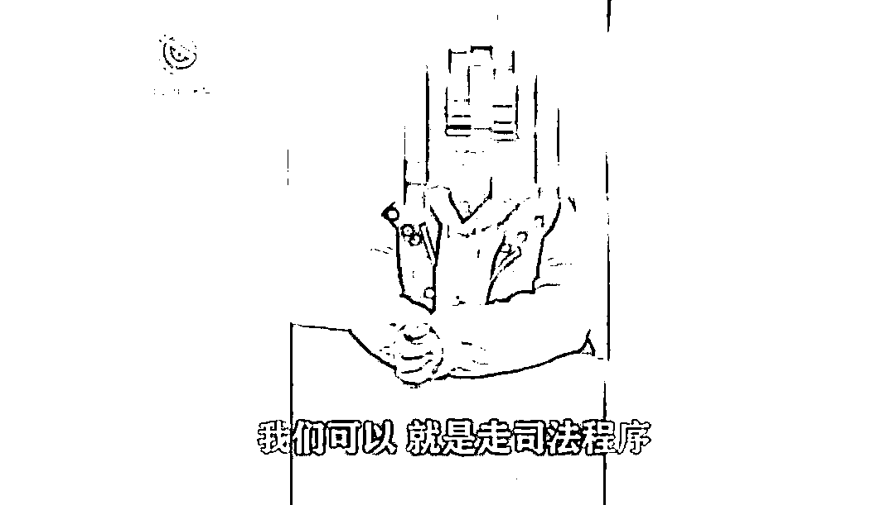
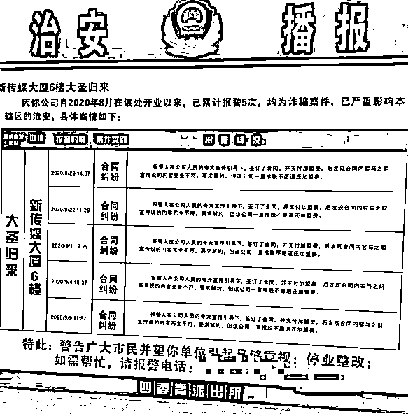
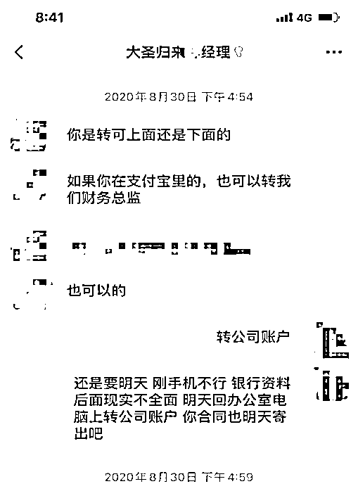
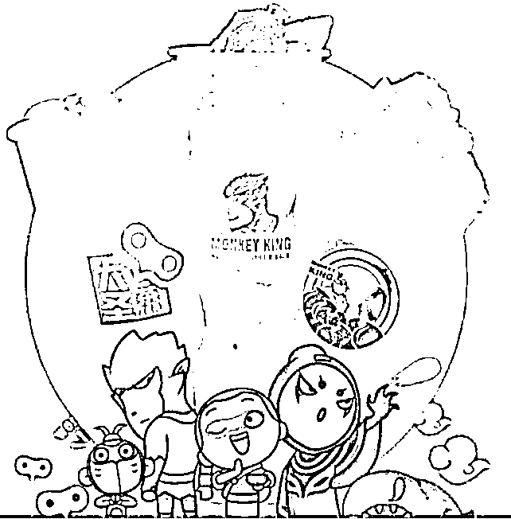
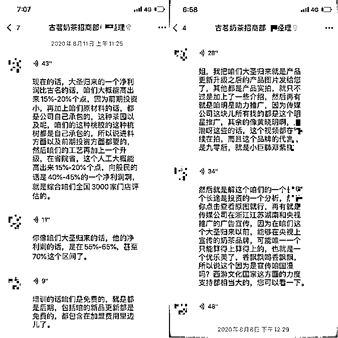
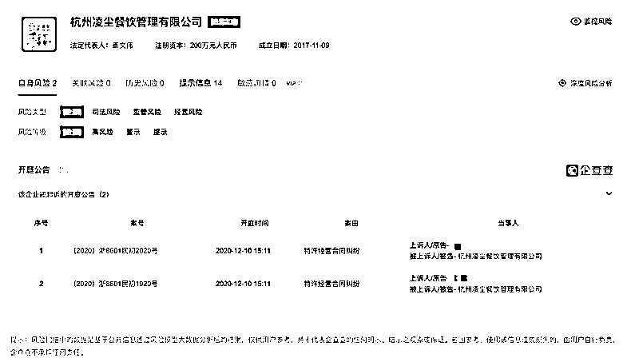
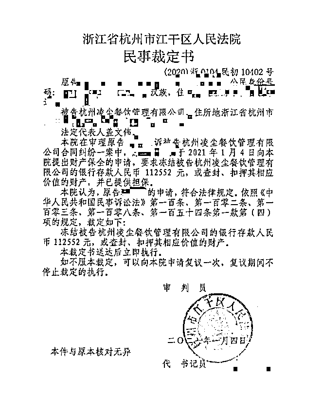

# 谈判、报警、起诉…想拿回加盟费时她才知道啥叫“一交钱就输了”

> 原文：[`mp.weixin.qq.com/s?__biz=MzIyMDYwMTk0Mw==&mid=2247508962&idx=1&sn=94279cea0915c819f116c78e25d150fc&chksm=97cb68daa0bce1ccd20bba4cb267cabd3b6c80d158fc34fee100c55e9d83430e3ad69b1b0917&scene=27#wechat_redirect`](http://mp.weixin.qq.com/s?__biz=MzIyMDYwMTk0Mw==&mid=2247508962&idx=1&sn=94279cea0915c819f116c78e25d150fc&chksm=97cb68daa0bce1ccd20bba4cb267cabd3b6c80d158fc34fee100c55e9d83430e3ad69b1b0917&scene=27#wechat_redirect)

探案 | 有无数套路让你交钱，也有无数后着防止你退钱。

2020 年 12 月初，有一位粉丝读者向商业街探案求助，说自己在开店过程中被品牌方套路了，问有没有办法挽回损失。

在历时 20 天的调查中，我们与多位类似情况的加盟商做了沟通，感觉到“大圣茶”品牌方在经营过程中确实存在的一些问题，于是撰写并发布了一篇标题为[《加盟商 3 个月亏 55 万，国漫“大圣归来”成奶茶招商套路帮凶》](http://mp.weixin.qq.com/s?__biz=MzIyMDYwMTk0Mw==&mid=2247506145&idx=2&sn=c3b5c95f81fe78b6d29cc7c4f6de6889&chksm=97cb13d9a0bc9acff61a0e9bc77d93e610f85bb7b1843126e744e3d72b34c94e1037fb6d5183&scene=21#wechat_redirect)的稿件。

这篇稿件被腾讯新闻、36kr、凤凰网等多个媒体平台发布转载，引起了一定的关注与反响，还有不少遭遇各种加盟套路的新粉丝看到文章来找我们诉苦。这稿子虽然并没有能帮我们的那位读者挽回损失，但相信能给一些想要从事茶饮生意的小伙伴们提个醒，也算是日行一善吧。

然而今天再去搜索，除了公众号等少数渠道外，这篇稿件的链接大多已经无法再打开了。这不是我们被公关了，而是品牌方向媒体平台施压，要求他们撤除了相关稿件。

我们也只能理解合作媒体平台的无奈，毕竟他们不知前因后果，多一事不如少一事。看到这些大平台都顶不住，我们本想就此算了，但抬头看到办公室“让创业者少踩一坑”的标语，还是觉得不能就这么缩了。

于是，我们又用了近一个月的时间，整理、核实了更多资料呈现给新老粉丝读者，让大家看看我们到底有没有冤了一个有良心的品牌？

百般小心，还是入了坑

“新传媒大厦 6 楼大圣归来，因你公司自 2020 年 8 月在该处开业以来，已累计报警 5 次，均为诈骗案件，已严重影响本辖区的治安……四季青派出所。”

2020 年 10 月，张青（化名） 进到了凌尘公司（大圣茶品牌方）在杭州的办公楼，一进楼就看到硕大的“预警”信息，她在心里喊着：糟了！此时， 她已经交了 8 万 9 千元的加盟费。

张青本是外贸行业的一把好手，但因为 2020 年年初的疫情，就打算开奶茶店。因为自己和合伙人都是小白，所以想加盟台州的奶茶品牌古茗。

随后就和探案报道过其他加盟入坑的流程一模一样：百度搜古茗填联系方式，自称古茗的招商经理找过来说“大圣茶是古茗的升级品牌”，此后，张青在 8 月去杭州参加了招商会。

招商会现场的气氛极其热烈：张青看到整个公司大概有十几拨人都在洽谈招商事宜，所有的招待室都是满的，很多人都是十几二十万一次性刷卡。

但张青本能的觉得交钱太快了，就以没钱为由，只交了 2 万元定金。可回到家的第二天，张青便在招商经理以名额不足，第一批扶持有各种方面的优惠政策，和第二天如果不交余款，2 万元定金就没收了的说辞下，补缴了余下的加盟费。

在补缴加盟费时，招商经理让张青把钱直接打到他们的支付宝上。对于该做法，张青无法理解，再三坚持对公转到凌尘公司的对公账户里，此时，张青心里已经隐约开始不安，等拿到合同后，不安开始扩大。

首先，她看重的是大圣茶背后的“大圣归来”IP，招商经理曾告诉她对“大圣归来”ip 的使用权是永久性的，但合同上并没有体现。

同时，虽然前期招商经理跟张青说的运营推广也没有体现在合同上，但当时的张青考虑到一个公司只要想把自己的品牌做好，是一定会去好好做运营推广的，所以也没太纠结这个事情。

拿到合同的张青只是立马质问了招商经理。她回忆，招商经理告诉她：“这些合同格式都是一样的，大家都是这样子的。”随后，招商经理给张青发了很多别的加盟商签合同的视频，表示确实是一样的。

因为合同到手以后没有收拾好，找不到合同的张青并没有马上签好合同寄回公司，而是先选择寻找店铺。张青没有想到，就是这个行为，给日后的自己留下了一线希望。

信心满满去退钱，却被强硬拒绝

张青和合伙人一直在认真寻找店铺，但合适的店铺并不那么容易寻找，这一拖就拖到了 10 月。当时，张青到了杭州，准备再去一次凌尘的公司，求教一下该如何选择更好的门面，却没想看到了开头的那一幕。

一瞬间，之前所有的怀疑再次涌上心头，张青知道糟了！

做了十几年生意，张青第一次遇见这样的情况，这个时候她开始关注凌尘的售后群，在群聊中，张青发现很多人已经在曝雷：比如某老板发现凌尘给他发来的部分物料有虫子。张青听说，经历多次沟通后，凌尘把钱退给了这位老板。

张青决定找凌尘要回加盟费，也是从这一步开始，张青开始慢慢发现，这个名为凌尘的招商加盟公司是多么的厉害，彼此之间有悬殊的实力差距。

第一次去找凌尘公司商谈退还加盟费时，张青认为自己连合同都没签，按理来说只要自己愿意承担违约金，凌尘应该是愿意退一部分钱给自己的，所以在 10 月份下旬，张青带着弟弟和律师朋友去到了凌尘的公司，信心满满的谈判。

一开始张青拿一个文件夹（张青心理明白这个文件夹的里面的证据并不充分）到凌尘的公司，表示自己有足够的证据可以要求公司退钱。同时，自己并没有签合同，并且自己愿意付 2 万元的违约金，公司只需要退张青 6.9 万元的加盟费就行。

而凌尘负责对接的人则要求张青把资料给他们看。张青表示：“我不能给你看，叫你们负责人过来，我跟他谈。”而该人表示，自己就是公司可以做主的人，如果张青不愿意拿出来给他看的话，就没有谈的必要了。

没有办法的张青，只能交出了手里的资料。对方拿到资料以后，就把资料转交给了凌尘的法务，在法务看过资料后，张青只得到了凌尘公司的一句：“你们走法律程序吧。”

[`mp.weixin.qq.com/mp/readtemplate?t=pages/video_player_tmpl&action=mpvideo&auto=0&vid=wxv_1723617259245322245`](https://mp.weixin.qq.com/mp/readtemplate?t=pages/video_player_tmpl&action=mpvideo&auto=0&vid=wxv_1723617259245322245)

（张青向探案提供了一份其他加盟商和大圣茶交涉的视频，表示和她的遭遇相似。）

张青告诉探案，她感觉公司的法务似乎并不是用来维护品牌利益，而是对付这些法务能力不强的加盟商的。如果资料没有什么杀伤力的话，就会直接让加盟商走法律程序。

也就是在这个时候，张青觉得钱可能拿不回来了。不过，大圣茶加盟商之间流传的一个案例又让她燃起了希望。

她利用房租价格差一击致命，要回全部加盟费

张青听说的案例是：有一个大圣茶的加盟商只花了 5 分钟，就让凌尘公司退还了她二十几万的加盟费。

在[加盟商 3 个月亏 55 万，国漫“大圣归来”成奶茶招商套路帮凶》](http://mp.weixin.qq.com/s?__biz=MzIyMDYwMTk0Mw==&mid=2247506145&idx=2&sn=c3b5c95f81fe78b6d29cc7c4f6de6889&chksm=97cb13d9a0bc9acff61a0e9bc77d93e610f85bb7b1843126e744e3d72b34c94e1037fb6d5183&scene=21#wechat_redirect)一文中，探案提到：“王刚还听说上海的一个加盟商差点被公司给坑了，据说加盟商收到公司的消息说上海某商场一个季度的租金是 10 万元，但后来自己去该商场问的时候，商场的负责人报价却只有 7 万元，听到这个消息的王刚无比庆幸自己当初的决定。”

从张青的描述看，她提到的要回加盟费的加盟商和王刚听说的加盟商可能是一个人，但具体的数字有出入。

需要说明的是，出于保护当事人隐私考虑，探案并没向张青、王刚透露对方的身份，同时该加盟商的案例为张青口述，不能确保细节的 100%正确。

张青告诉探案，她听说的加盟商叫赵慧（化名）。赵慧曾投入 21 万元，成为大圣奶茶在上海某区域的区域代理。前期是公司帮着赵慧找店面，给她提供了一个商场内的铺子，租金是 2 万 7 千元一个月。

赵慧一听，就觉得价格似乎太高了，立马去商场找相关负责的经理，询问该位置租金是多少，经理告诉赵慧该位置的租金是 1 万 6 千元一个月。这两者的价格相差 1 万 1 千元，一年价格就是 13 万 2 千元。

赵慧是一个风风火火的人，在确认事实以后，就立马找到了凌尘公司进行质问。她当时是这么问的：“说说你们大圣到底怎么回事？我这么相信你付了加盟费你还骗我钱？明明跟那边直接谈的租金是 1 万 6 千元一个月，为什么你们告诉我是 2 万 7 千元一个月？”

根据加盟商们之间流传的说法，最初品牌方还试图混过去，回复说：“不好意思这边搞错了。”

但赵慧并没有轻易的放过这件事，赵慧告诉凌尘公司的负责人，自己已经和商场签订了 10 年的合同，10 年就相当于凌尘公司诈骗赵慧 130 多万。凌尘公司现在只有 2 个选择，要么把赵慧的加盟费全额退还，要么赵慧把相关证据移交到政府部门。

其间凌尘公司的负责人试图和赵慧商量，退还赵慧 80%的加盟代理费用。但赵慧并不答应，赵慧表示：“退不退你们自己想好，退我就要全部一分不差的退，不退就一分都不要退。”

最后，赵慧反而把凌尘公司逼得没办法，很快就把全部加盟费退给了赵慧。 

这个案例激励了张青要回加盟费的决心。

明知蜉蝣撼树，但求全力以赴

2020 年 11 月上旬，张青去四季青市场监督局进行实名举报。举报信由律师朋友帮忙撰写，相关证据也由该律师代交。

四季青市场监督局很快就给了张青反馈。张青回忆，对方表示：张青提供的聊天记录的截图，虽然存在引诱，误导签合同的成分，但对方并未明确表示自己来自大圣茶的招商部门，所以相关诉求无法处理。

到这个时候，张青才发现原来和自己对接的招商经理根本不是凌尘的员工。

不过，四季青市场监督局相关人员同时告诉张青，有人把大圣茶的相关资料递交到了杭州市市场监督局，现在杭州市市场监督局已经在立案调查了，这说明那个人手里有足够的证据。

这个消息鼓舞了张青。她果断走了法律程序，以合同没签，要求退款为由向法院申请立案，而张青的案子已经在浙江省杭州市江干区人民法院立案。

张青告诉探案，律师认为她完全可以拿回自己的加盟费。但是自己非常悲观，因为发现凌尘公司的注册资本只有 200 万。

张青是这么理解的：注册资本其实就是一个公司一旦出事情，比如说被索赔时，在执行的时候，这 200 万必须要到账面上的。 注册资金越高，保护性也就越强，同时说明这个公司的真实性也越强。

张青听说，目前已经有 15 个人在走法律程序了，这 15 个人里要求最少的就是张青自己的 8 万 9 千块钱，而其他人平均下来每个人大约在 15 万左右。 所以即便官司打赢了，凌尘公司需要赔付的资金已经超过 200 万了，所以打到最后能否拿到钱，张青心里也没底。

对于该担忧，律师建议张青去向法院申请财产保全，这样就不用担心胜诉以后公司会没钱退给张青了，但法院同意了张青的财产保全申请，但事情却进展的非常不顺利。

2021 年 1 月，张青带着浙江省杭州市江干区人民法院给出的民事裁定书，要求农村商业银行协助冻结被告杭州凌尘餐饮管理有限公司的银行存款人民币 112552 元，或查封、扣押其相应价值的财产。

但银行的相关负责人告诉张青，张青提供的冻结账户是凌尘公司的基本账户，无法冻结，而张青也无法提供其他凌尘公司的账户。

到了这时候，张青终于觉得解脱了，就算官司真的会赢，但钱恐怕也真是一分都拿不回来了，到真应了那句老话:“加盟商从交了钱的那一刻起，就已经输了！” 

张青告诉探案，有同伴戏称现在的快招公司是一个法外之地，因为没有人可以管得了他们。张青在带人去公司理论的时候，很多同伴都曾经报过警，但因缺乏进一步的证据，警察也只能放一个警示牌。

张青回忆，他们去凌尘理论的那天，貌似听到警察对凌尘公司的人说：“厉害，没有哪个部门可以治得了你。 ”

← 向右滑动与灰产圈互动交流 →

