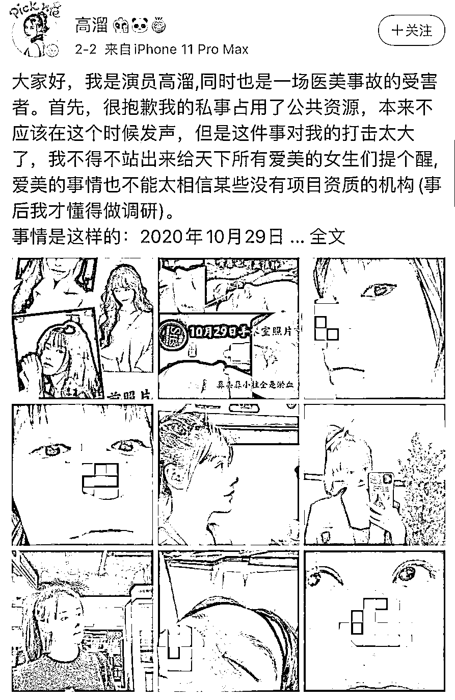
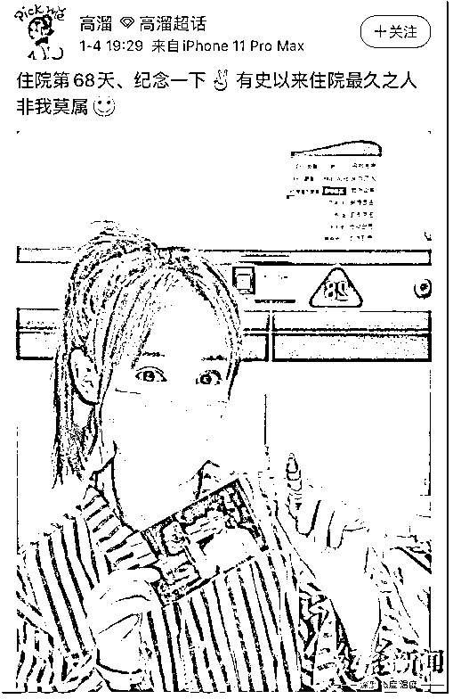
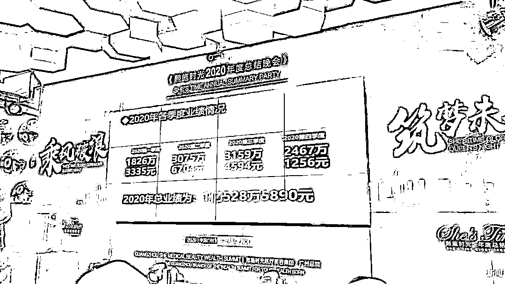
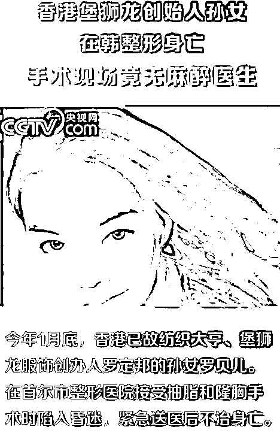

# 女演员自曝整容失败：鼻尖画面惨不忍睹，丢了工作还要赔 200 万元……

> 原文：[`mp.weixin.qq.com/s?__biz=MzIyMDYwMTk0Mw==&mid=2247508962&idx=2&sn=3e0bc411c33a3fb63ceb09123c416741&chksm=97cb68daa0bce1cccf6eac4ceccf575074c958ba7c9384b1e2fdf71bdf883946b2cce2e2c375&scene=27#wechat_redirect`](http://mp.weixin.qq.com/s?__biz=MzIyMDYwMTk0Mw==&mid=2247508962&idx=2&sn=3e0bc411c33a3fb63ceb09123c416741&chksm=97cb68daa0bce1cccf6eac4ceccf575074c958ba7c9384b1e2fdf71bdf883946b2cce2e2c375&scene=27#wechat_redirect)

**2 月 2 日，女演员高溜微博发长文**

**讲述了自己鼻子整形失败的不幸遭遇**

**· **文章称，其术后不但没有变美，还出现排异、发炎，甚至坏死等症状，并且因此失去了工作，损失片酬 40 万元，面临高额的违约赔偿 200 万元。不仅如此，她还表示，自己在事后才知道相关整形医院不具备开展该项目的资质。
**· **对此，记者联系上了一名该机构相关工作人员黄小姐，黄小姐称此事需要走司法程序解决，目前“双方都已经聘请了律师，正在走司法程序”。

**· **4 日，**广州市天河区卫生健康局**一名工作人员告诉澎湃新闻，**他们有收到广州 12345 政府服务热线转来的相关投诉，目前针对前述事件正在调查当中。**涉事的医疗美容机构有隆鼻术的备案，至于手术是否失败要通过医疗鉴定来明确责任方。

▲演员高溜所发微博。截图自微博

[`mp.weixin.qq.com/mp/readtemplate?t=pages/video_player_tmpl&action=mpvideo&auto=0&vid=wxv_1725149131557421061`](https://mp.weixin.qq.com/mp/readtemplate?t=pages/video_player_tmpl&action=mpvideo&auto=0&vid=wxv_1725149131557421061)

**女演员自称整容失败毁容****“受不了打击，曾想跳楼轻生”**据公开资料显示，高溜是中国内地女歌手、演员，曾出演过电影、网剧，也发行过单曲。她在 2 月 2 日的微博长文中表示，自己毕业于北京电影学院，“事业虽谈不上大红大紫，但也顺风顺水”。高溜称，2020 年 10 月 29 日，通过朋友介绍，她在广州“熙施时光医疗美容门诊”进行了鼻子耳软骨、肋软骨和膨体手术，即，从自己身上取下肋软骨移植到鼻部。高溜称，术前她曾告知院方，12 月和 1 月要去拍戏，“熙施时光医院信誓旦旦和我说没有任何问题，半个月恢复期，不会影响我 12 月份的新戏开机。”在微博长文中，高溜称经 4 小时手术植入异体肋软骨后，鼻部发炎刺痛，排异反应导致鼻子反复感染，随后留院观察。11 月 1 日，院方告知高溜，需要做第二次手术取出假体，在 4 天内经历了两次手术后，情况仍旧没有好转，“鼻尖和鼻小柱的皮肤颜色越来越黑，鼻头坏死，在错过了最佳的治疗时机后，11 月 5 日，熙施时光医院终于决定把我转院到广州南方医院接受治疗。”▲1 月 4 日。高溜发布了一张定位为“广州·南方医院”的自拍。截图自微博
在这篇长文当中，高溜写道，事后她了解到，其实手术过程中就已经出现了状况，若处置及时，本可以得到妥善处理，她认为是院方的一再隐瞒，最终才导致自己的鼻头坏死毁容。**同时，她表示事后查看医院相关资料，才发现该医院无“肋骨鼻”手术相关资质。****根据高溜发布的照片可见，其鼻尖有一块区域呈明显黑色。**其发布在微博的一张广州南方医院的入院记录显示，该医院门诊检查后，以“隆鼻术后鼻畸形（隆鼻术后感染）”收治。专科检查显示，鼻部皮肤约 1.5x1.0 厘米面积发黑坏死。高溜自称，由于整容失败，她无法按时进组拍戏，除了损失 40 万的片酬外，还将面临违约赔偿 200 万元。高溜称“因受不了打击，曾想跳楼轻生”。**院方相关工作人员回应：****“都在走司法程序”**记者致电涉事医院前台，一名工作人员称其对此事并不知情。随后，记者在微博上看到一个发布该医院手术信息的账号，根据账号信息记者与该网友取得联系。**对方自称是涉事医院的“分红股东”黄小姐，其朋友圈发布内容大多都是该医院的相关医疗信息。**记者以顾客身份向该医院前台核实黄小姐工作信息，前台工作人员表示“认识黄小姐，顾客前来咨询的话可以先与黄小姐沟通”。随后，黄小姐在与记者沟通中，先称此事“已经解决”。对于记者质疑“高溜昨日才在微博上发文，并称事情尚未解决”，黄小姐又回应称，这件事需要走司法程序，目前双方都已聘请了律师，“都在走司法程序”。**记者追问，双方都在走司法程序是否意味着高溜起诉医院的同时，院方也起诉了高溜，黄小姐说：“我们是不可能告高小姐的。”**▲黄小姐微信朋友圈此前发布的“熙施时光医疗美容集团”的相关内容天眼查工商资料显示，熙施时光医疗美容门诊关联公司为广州熙施时光医疗美容门诊部有限公司，成立于 2019 年 8 月，注册资本 100 万人民币，法定代表人为刘思雨，经营范围包括女性健康调理中心、非许可类医疗器械经营、医疗用品及器材零售、医疗诊断、美容服务等，由广州熙施施睿品牌管理有限公司控股。**广州熙施时光医疗美容门诊部有限公司曾于 2020 年 3 月至 10 月遭到 5 次行政处罚**，处罚事由为违反《医疗机构病历管理规定》及《医疗机构管理条例》。国家企业信用信息公示系统（广东）亦登载相同处罚信息。此外，天眼查显示，以该医院为被告的医疗服务合同纠纷，去年 11 月在广州市越秀区人民法院开庭。根据天眼查上登记的公司信息，记者多次拨打该公司法人及股东电话，均无人接听。

最新消息，2 月 4 日，广州市天河区卫生健康局一名工作人员告诉澎湃新闻，他们有收到广州 12345 政府服务热线转来的相关投诉，**目前针对前述事件正在调查当中**。涉事的医疗美容机构有隆鼻术的备案，至于手术是否失败要通过医疗鉴定来明确责任方。

**可怕的医美乱象****：**

**10 年间毁掉了 20 万张脸？**

高溜的遭遇并不是个例!

中国消费者协会 2012 年发布的数据显示，在此之前十年左右的时间里，我国平均每年因为整形美容导致毁容毁形的投诉多大近 2 万起。

也就是说，**10 年间至少有 20 万张脸被整形美容行业毁掉了****，而她们当中的部分人甚至还为此丢掉了性命。**

据小央视频消息，2020 年 1 月，香港已故纺织大亨堡狮龙罗定邦的孙女罗贝儿在首尔市整形医院接受抽脂和隆胸手术后死亡。韩国 MBC 电视台 10 月 9 日援引警方报告称，罗贝儿在韩国整形身亡，是严重医疗过失。

可这依旧没有阻挡住年轻人的爱美之心。

从需求来看，据《2020 年中国医疗美容行业洞察白皮书》统计，2019 年中国医美市场规模达到 1769 亿元，且每年以 40%左右的增速。而从供给来说，“合法医美机构仅占行业的 14%。”。

另据《2020 年中国医疗美容行业洞察白皮书》统计，目前医美行业“无证行医”、超范围行医的医生数量超过 3 万名，而据 2018 年卫健委统计年鉴，整形外科专科医院医师(含助理)数量仅 3680 名。

医疗美容业供需严重失衡，导致在行业蓬勃发展的同时，乱象丛生。**无证行医、跨专业行医、广告虚夸等现象大量存在，加之监管乏力，美容整容服务纠纷时有发生。**

一方面，由于美容业容易产生暴利，吸引了不少不懂医术的人来投资，在利益至上思想支配下，一些民营医疗机构敢把病人当“小白鼠”。

另一方面，一些民营医疗美容机构为了获得短期效益，大量投放虚假广告，对医生、专家的过度包装，对整形美容效果的过度渲染，对仪器设备夸大功效。更为严重的是，医疗美容从业人员整体素质良莠不齐，资质认定宽松，缺乏一个权威的评估认定。由于相关审批不严格，不具备资质的医疗机构和人员进入该行业，加大了行业的安全风险。

足见，眼下的医美乱象是有多种原因共同造成的。

而要解决这些问题，需要加强监管和自律双管齐下，从法律、制度层面彻底肃清行业发展乱象，给医疗美容行业来一次彻底的“整形”。

来源 ：红星新闻、澎湃新闻、21 财闻汇、上观新闻

← 向右滑动与灰产圈互动交流 →

