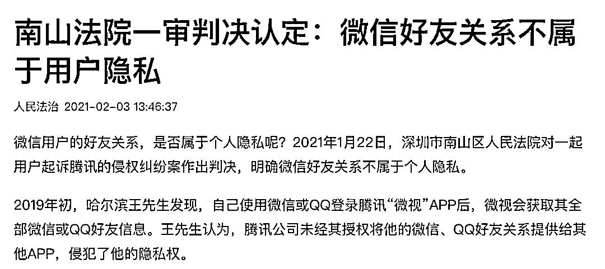

# “南山必胜客”：微信好友关系不是隐私...

> 原文：[`mp.weixin.qq.com/s?__biz=MzIyMDYwMTk0Mw==&mid=2247508962&idx=3&sn=36e135190d880229f84133cf257322fa&chksm=97cb68daa0bce1cc2f214b0184a641842d47222364427742c6558ac03bac7a00eda54c641b8b&scene=27#wechat_redirect`](http://mp.weixin.qq.com/s?__biz=MzIyMDYwMTk0Mw==&mid=2247508962&idx=3&sn=36e135190d880229f84133cf257322fa&chksm=97cb68daa0bce1cc2f214b0184a641842d47222364427742c6558ac03bac7a00eda54c641b8b&scene=27#wechat_redirect)

据人民法治 2 月 3 日消息，2021 年 1 月 22 日，深圳市南山区人民法院在审理一起用户起诉腾讯的侵权责任纠纷案时作出判决，**明确微信好友关系不属于个人隐私。**

# **南山法院一审判决认定：**

# **微信好友关系不属于用户隐私**

2019 年初，哈尔滨王先生发现，自己使用微信或 QQ 登录腾讯“微视”APP 后，微视会获取其全部微信或 QQ 好友信息。王先生认为，腾讯公司未经其授权将他的微信、QQ 好友关系提供给其他 APP，侵犯了他的隐私权。

2019 年 4 月，王先生向哈尔滨市香坊区人民法院提起诉讼，要求腾讯公司删除其个人信息、赔礼道歉并赔偿维权合理支出。

哈尔滨香坊区法院受理该案后作出裁定，要求腾讯公司立即停止侵犯原告隐私权的行为，“包括但不限于立即停止在‘微视’APP 中使用原告微信头像、昵称的行为，停止在‘微视’APP 中将申请人推荐给其他用户以及获取申请人所在地区及好友关系等全部个人信息的行为。”

随后，腾讯公司提出了管辖异议，申请将该案移送至深圳市南山区法院审理。该申请被香坊法院驳回，腾讯公司随即上诉。2019 年 8 月，哈尔滨中院作出终审裁定，将该案移送至深圳南山法院。2020 年 5 月，该案在南山法院进行了开庭审理。

根据判决书，王先生认为，他使用微信、QQ 账号登录“微视”APP，仅仅是授权进行登录服务，微视无权收集和使用其性别、地区，更甚至是好友关系。 

王先生表示，自己在登录和使用微视的过程中，微视从未告知其会收集和使用上述信息，自己也从未授权同意过微视收集和使用上述信息。“微视 App 只能使用微信或 QQ 账号登录，即使原告不愿意将这些信息提供给微视，或者之后不想再让微视继续使用，原告也毫无办法。”王先生在起诉书中表示。

腾讯公司辩称，其并未侵犯王先生的隐私，**“隐私是指用户对其生活领域不愿公开的信息享有不被他人知悉的权利。原告主张的性别和地区属于公开信息，不构成隐私。”**

南山法院经审理认为，王先生所主张的性别、地区和微信好友关系三类信息均形成于其使用微信软件的过程中，在一定范围内已公开，即上述信息已被包含软件运营商在内的相关主体所知悉。“ 

其中，原告所主张的性别、地区信息由原告注册微信账号时选择填写，该两类信息通常不具有私密性。”

根据判决书，南山法院认为，王先生所主张的微信好友关系既未包含其不愿为他人所知晓的私密关系，他人也无法通过其微信好友关系对其人格作出判断从而导致其遭受负面或不当评价，“故本院认定原告所主张的微信好友关系也不属于原告的隐私。”

“微视 App 是一款短视频社交类软件，其与微信 App 的实际运营主体都是被告。被告在符合法律规定的前提下，可以将其开发、运营微信 App 所积累的用户关系信息在其关联产品中合理利用。” 

判决书显示，南山法院认为，**“被告在微视 App 中的相关收集、使用行为不违反个人信息收集和使用的必要性原则。”**

1 月 22 日，南山法院作出（2020）粤 0305 民初 825 号判决，驳回王先生的全部诉讼请求。

据悉，目前，王先生表示将进行上诉。

**如何判定是否属于个人隐私** 

事实上关于微信好友关系是否属于隐私，也有用户在北京起诉过腾讯。

据（2019）京 0491 民初 16142 号裁判文书，2020 年 7 月，北京互联网法院对“黄某与被告腾讯科技（深圳）有限公司广州分公司、腾讯科技（北京）有限公司隐私权、个人信息权益网络侵权责任纠纷案”进行一审宣判，认定微信读书在未经用户有效同意的情况下获取微信好友关系，并自动关注微信好友，还向共同使用微信读书的微信好友默认开放其读书信息构成对个人信息权益的侵权。 

根据判决结果，腾讯应停止微信读书收集、使用原告微信好友列表的行为，并删除这些列表信息，解除原告与微信好友的互相关注，停止向微信好友展示原告读书信息。此外，腾讯还需向原告书面赔礼道歉。

在该判决书中，法院对于微信好友关系是不是个人隐私做了一些描述。

从合理隐私期待维度上，个人信息基本可以划分为几个层次： 

一是符合社会一般合理认知下共识的私密信息，如有关性取向、性生活、疾病史、未公开的违法犯罪记录等，此类信息要强化其防御性保护，非特定情形不得处理； 

二是不具备私密性的一般信息，在征得信息主体的一般同意后，即可正当处理；三是兼具防御性期待及积极利用期待的个人信息，此类信息的处理是否侵权，需要结合信息内容、处理场景、处理方式等，进行符合社会一般合理认知的判断。

关于微信好友关系。好友列表中实际可体现三个层面的信息： 

一是体现用户的联系人信息，属于该用户个人信息； 

二是体现每个好友的标识性信息，包括好友的昵称、头像、帐号等，属于用户好友的个人信息； 

三是可能体现用户在微信上的社交关系信息。对于好友列表的主体，可能具有隐私期待的，是社交关系这一层面的信息。 

微信本身就是体现着社交需求的软件，其功能设置除了存储联系人外，有显著的社会交往特征，如大多数用户在朋友圈交互中，可知晓许多他人的社交关系。 

同时，随着社交关系载体多轮的迭代后，微信已经成为大量用户主要的社交工具之一，则微信好友上承载的社交关系，也可能由最初的较为亲密的好友发展为几乎全部社会关系资源，甚至有人会选择不同的微信帐号处理不同类型的生活或工作关系。 

因此，**好友列表信息的私密性因人、因具体关系而有所不同。**此外，应用软件对微信好友关系的处理可能存在多种方式，不同用户对好友关系具体处理场景下的隐私期待也可能存在不同。

综上，**微信好友关系不能笼统地纳入符合社会一般合理认知的私密信息范畴，**而更符合前述第三类信息的特征。对这类信息保护的重点在于赋予信息主体自主决定其消极防御或积极利用的权益。

**关于个人信息定义及隐私安全的相关法律****《中华人民共和国网络安全法》第七十六条第（五）项规定：**“个人信息，是指以电子或者其他方式记录的能够单独或者与其他信息结合识别自然人个人身份的各种信息，包括但不限于自然人的姓名、出生日期、身份证件号码、个人生物识别信息、住址、电话号码等。”即将实施的《中华人民共和国民法典》将电子邮箱、健康信息、行踪信息等也纳入个人信息范围。**《信息安全技术个人信息安全规范》（GB/T35273-2017）（以下简称《个人信息安全规范》）**中对个人信息的概念表述为“以电子或者其他方式记录的能够单独或者与其他信息结合识别特定自然人身份或者反映特定自然人活动情况的各种信息。

”包括个人身份信息、生物识别信息、网络身份标识信息、健康生理信息、教育工作信息、财产信息、通信信息等。个人信息的核心特点为“可识别性”，既包括对个体身份的识别，也包括对个体特征的识别；

对个体身份的识别确定信息主体“是谁”，对个体特征的识别确定信息主体“是什么样的人”，即该信息能够显现个人自然痕迹或社会痕迹，勾勒出个人人格形象。判定某项信息是否属于个人信息，应考虑以下两条路径：一是识别，即从信息到个人，由信息本身的特殊性识别出特定自然人； 同时，识别个人的信息可以是单独的信息，也可以是信息组合。可识别性需要从信息特征以及信息处理方的角度结合具体场景进行判断。 二是关联，即从个人到信息，如已知特定自然人，则在该特定自然人活动中产生的信息即为个人信息。符合上述两种情形之一的信息，即应判定为个人信息。**《中华人民共和国民法总则》第一百一十一条规定：“自然人的个人信息受法律保护。** 任何组织或者个人需要获取他人个人信息的，应当依法取得并确保信息安全，不得非法收集、使用、加工、传输他人个人信息，不得非法买卖、提供或者公开他人个人信息。”

但是，现行法律中没有对隐私概念予以明确规定。《中华人民共和国民法典》对隐私的定义、类型予以明确，虽未正式施行，但其对法律概念的定义及相关规范精神可以在本案中作为参考。**《中华人民共和国网络安全法》第四十一条规定：**“网络运营者收集、使用个人信息，应当遵循合法、正当、必要的原则，公开收集、使用规则，明示收集、使用信息的目的、方式和范围，并经被收集者同意。”**《中华人民共和国民法典》第一千零三十二条第二款规定：**“隐私是自然人的私人生活安宁和不愿为他人知晓的私密空间、私密活动、私密信息”。侵害隐私权的行为，主要包括以电话、短信、即时通讯工具、电子邮件、传单等方式侵扰他人的私人生活安宁；

进入、拍摄、窥视他人的住宅、宾馆房间等私密空间；拍摄、窥视、窃听、公开他人的私密活动；拍摄、窥视他人身体的私密部位；处理他人的私密信息等。

就私人生活安宁而言，应当着重考量权利人个人生活状态是否因为具体行为介入而产生变化，及该变化是否给个人生活造成一定程度的侵扰。就私密空间、私密活动、私密信息而言，因互联网时代诸多的个人活动都以电子数据方式记录而呈现为个人信息。

且**《中华人民共和国民法典》第一千零三十四条第三款规定，个人信息中的私密信息，适用有关隐私权的规定，**因此，私密信息与个人信息之间的关系应予着重考量。个人信息与作为隐私权客体的私密信息既有交叉亦有不同。从权利类型看，隐私权具有绝对权属性，个人信息是受法律保护的法益，尚未上升至权利。从立法价值取向看，隐私权与个人信息权益根本上都体现自然人的人格尊严和人格自由价值。

但个人信息权益同时涉及信息利用、流通价值。从利益内容看，隐私权主要体现精神利益，而个人信息权益可能同时包括精神利益及财产利益。

从保护客体和损害后果来看，隐私权保护具有私密性的信息，一经泄露即易导致个人人格利益受到损害；而非私密信息的个人信息，仅在被过度处理的情形下才可能使得信息主体受到人格或财产损害。

从权利特点和保护方式上看，隐私权更注重消极性、防御性，保护更为严格；而个人信息权益保护在注重预防侵害的同时，还强调信息主体积极、自决的利用权益，如选择、访问、更正、删除等。来源：Financial 小伙伴

← 向右滑动与灰产圈互动交流 →

