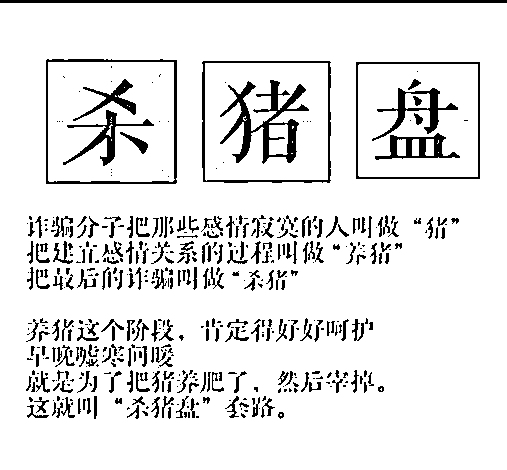
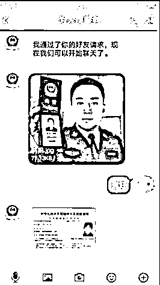

# 国家反诈中心提醒：警惕十大高发诈骗！

> 原文：[`mp.weixin.qq.com/s?__biz=MzIyMDYwMTk0Mw==&mid=2247508962&idx=5&sn=83ad88332f3067f7899ba4f851db4a8c&chksm=97cb68daa0bce1cc69c911ef0512f2dc86dfbf5735814d05b6a77d0fd6dd44479402f9ba132b&scene=27#wechat_redirect`](http://mp.weixin.qq.com/s?__biz=MzIyMDYwMTk0Mw==&mid=2247508962&idx=5&sn=83ad88332f3067f7899ba4f851db4a8c&chksm=97cb68daa0bce1cc69c911ef0512f2dc86dfbf5735814d05b6a77d0fd6dd44479402f9ba132b&scene=27#wechat_redirect)

**1**

**网络贷款**

**诈骗手法揭秘：“低门槛”广告+网贷 APP**

**【案件回放】**

1 月 9 日晚，陈先生在浏览网页时看到一款网络贷款 APP，声称“无抵押、无担保、超低息，只需要注册，贷款立马到账”。正巧陈先生近期手头资金困难，遂下载注册了该款 APP 并申请贷款 15 万元。陈先生打开自己银行账户时发现所贷钱款未到账，但贷款 APP 上却显示他已欠款 15 万元。他与客服联系询问这一情况时，客服告知他后台显示钱款已到账，让陈先生在规定时间内还清贷款，然后挂断了电话。 

民警查看陈先生手机上的贷款 APP 以及与客服的聊天记录，确认这是典型的网贷类诈骗。民警见其仍有被骗的可能，遂将以往的类似诈骗案例、诈骗手法一一耐心讲解。陈先生听完后庆幸自己来到派出所才避免“破财”，最终卸载了相关软件。

**国家反诈中心提醒：警惕“无抵押、低利率”网贷平台**

**当有人向你推销贷款时，一定要小心。诈骗分子先让你在虚假贷款网站或 APP 上填写个人信息，再以信息填报错误、贷款额度被锁定等理由，诱骗你缴纳保证金或者解冻金。任何声称“无抵押、低利率”的网贷平台都有极大风险。一旦发现被骗，请及时报警。**

**2**

**网络刷单**

**诈骗手法揭秘：兼职刷单+网络博彩**

**【案件回放】**

去年 10 月初，上海市民唐女士被拉入一兼职刷单微信群，群内自称客服的人员主动加了唐女士微信，忽悠唐女士向其提供的一网络博彩平台充值刷流水，并承诺只要根据客服提示操作肯定能赚钱。

抱着试一试的心态，唐女士下载了客服推送的 APP，并充值 98 元试水。在客服提示下，唐女士果然赚了钱，98 元变成了 224 元，并顺利提现。接着，唐女士加大投入，又一次获利提现 10488 元。看着账户里的数字越来越大，唐女士投入的本金也越来越多，直到累计充值 108 万元，准备将盈利的 120 万元全部提现时，她才发现自己的账户不能提现了。唐女士连忙联系所谓的客服，却被拉黑，继而被踢出群。

今年 1 月 14 日警方对该犯罪团伙实施收网抓捕，11 名团伙骨干成员在多地悉数落网。目前，王某等 11 名犯罪嫌疑人已被依法刑事拘留，案件正在进一步侦办中。

办案民警表示，诈骗分子通常会冒充快递员，以电话打不通为由添加好友，一旦发现有人通过微信申请，便将对方拉入兼职刷单群。接着，引诱这些潜在被害人参与所谓的网络博彩刷单。而博彩输赢和资金进出皆由该团伙控制，这也是唐女士下注每次都能赢钱的原因。诈骗分子还会根据被害人的“人设”来控制“诱饵”的金额。

**国家反诈中心提醒：所有刷单都是诈骗**

**所谓刷单，就是通过网上购物方式为网店刷信誉或者充值刷流水，网店向刷单者返还货款并支付佣金的违法行为。诈骗分子往往以兼职刷单名义，先以小额返利为诱饵，诱骗你投入大量资金后，再把你拉黑。千万不要轻信兼职刷单广告，所有刷单都是诈骗，不要缴纳任何保证金、押金。一旦发现被骗，请及时报警。**

**3**

**“杀猪盘” **

**诈骗手法揭秘：网上“美女”+投资“赢利”**

**【案件回放】**

去年 7 月，上海市公安局嘉定分局真新派出所接到市民詹先生报案称，他接到一陌生女子来电，一来二去，詹先生对该女子产生了好感。没过多久，该女子称自己投资港股赚了很多钱，诱导詹先生一起加入。詹先生下载软件并投入少量资金，没想到很快就有了 1000 多元的收益，并成功取现。尝到甜头后，詹先生追加投入了 5 万元，期望能够获得更大收益。令他没想到的是，客服突然告知他购买的港股跌了，被强行平仓，导致詹先生账户内的钱款一分也没剩下。听到这个消息，詹先生赶紧登录平台查询，却发现平台登录不上，客服也联系不上了，詹先生这才意识到被骗了。

经调查，这起案件的背后是一个“杀猪盘”犯罪团伙，所谓的证券投资平台便是他们用来实施诈骗的工具。犯罪团伙主要利用“时间差”来达到行骗的目的，詹先生在投资平台所查看到的股票数据，与港股的实时数据之间有 10 分钟的延迟。诈骗团伙在这个时间差上大做文章，在掌握实时港股股价的基础上，直接操控被害人的收益与亏损。

去年 12 月 17 日，在当地警方的大力配合下，专案民警直奔诈骗团伙所在的湖北武汉某办公大楼，并在其他抓捕点布控，团伙 71 名成员悉数落网。目前，该团伙成员已被依法采取刑事强制措施，案件正在进一步侦查中。

经查，该团伙搭建“杀猪盘”，以美女搭讪、网上相亲等手法，搭讪潜在被害人，以“投资获巨利”等引诱他们上钩，用操控软件后台的方式，将被害人的资金全部平仓，随后通过层层转账转入自己腰包。

**国家反诈中心提醒：网恋还能赚大钱一定是诈骗**

**当有陌生人加你为好友时，一定要小心。诈骗分子往往先以甜言蜜语或者献殷勤等方式博取好感和信任，再向你推荐所谓“稳赚不赔、低成本高回报”的网络投资平台。当你越投越多时，就会把你拉黑。从网恋“一见钟情”开始，到参与网络赌博或投资诈骗结束，直到受害者倾家荡产甚至背负巨债，这就是“杀猪盘”诈骗。一旦发现被骗，请及时报警。**

**4** 

**冒充“公检法” **

**诈骗手法揭秘：“公安调查”+“冻结账户”**

**【案件回放】**

1 月 18 日，江苏南京市民方女士接到一个陌生电话，对方自称是电信公司工作人员，询问方女士是不是用身份证在上海办理了电话卡。方女士否认后，对方说可能有人冒充方女士办理了电话卡，并用这张电话卡发送诈骗短信，此人称已帮方女士报了警。

没过几分钟，方女士接到自称是上海某派出所“民警”的来电，说是帮助方女士调查涉案手机号码的情况。根据“民警”要求，方女士加了他的微信号，还通过微信进行视频聊天。对方还出示了“警官证”，使方女士放下了戒备心。之后，“民警”以法院要马上冻结银行账户为由，让方女士把银行卡账户情况告诉他，他可以帮忙找法官讲情，少冻结一段时间。方女士便将银行账号和密码都告诉了“民警”，并按照他的要求把手机验证码也告诉了他。“民警”还要求其把相关聊天记录、短信息、通话记录全部删掉。1 月 21 日，方女士发现“民警”已将其拉黑，才发觉被骗。

警方调查发现，这起案件是一起较为典型的冒充公检法诈骗案件。诈骗分子以近期警方集中打击电话卡、银行卡的行动为幌子，利用普通群众不明就里的心理制造恐慌感，再以“民警”身份出现，让受害人放下戒备心，进而落入圈套。目前，此案正在进一步侦查中。

**国家反诈中心提醒：转账汇款自证清白是诈骗**

**凡是自称“公检法”要求你转账汇款自证清白的，都是诈骗。一旦发现被骗，请及时报警。**

**5**

**“荐股” **

**诈骗手法揭秘：“理财导师”+虚假平台**

**【案件回放】**

“钱能生钱”是很多人的迫切需求，很多骗子利用人们的这种心理，借助各种平台每天分享期货、黄金、股票投资知识，还时不时地推荐添加微信群、QQ 群，邀请你加入他的战队一起赚钱，但其实当你添加这些群，深信着“导师”有钱赚时，他们早已盘算好通过操纵虚假平台数据，让你血本无归了。

浙江新昌的唐女士对一篇介绍投资理财的文章颇有兴趣，便通过文中的二维码添加了“新浪王德才”的微信好友。此人自称是知名投资理财导师的助理，与唐女士交流了股票、理财等投资经验。在对方推荐下，唐女士加入一个讲解投资的微信群，还安装了“毕盛资管”理财软件。

微信群中有位人人敬仰的“导师”，每天都会通过导师群进行免费讲解，给大家推荐好的股票，多数人通过这个导师的指导收到可观的投资收益。唐女士渐渐动了心，也加入了导师群，按照导师的指导，通过“毕盛资管”理财软件，第一次投资 2 万元便有了可观收益，尝到甜头的唐女士又先后分 8 笔投入资金 76 万元，盈利 200 万元。赚到心满意足，唐女士准备套现，才发现怎么也无法提现，微信也被拉黑。

新昌县公安局接报后及时立案侦查，最终锁定犯罪嫌疑人 16 名。1 月初，该案已经由法院进行判决。经查，唐某所在的微信聊天群是由诈骗团伙操作的，所谓的群友多数是托儿。

**国家反诈中心提醒：群里只有一根“真韭菜”**

****一进股票群，套路深似海。“老师”“学员”都是托儿，炒股软件都是假，只有你是“真韭菜”。一旦发现被骗，请及时报警。****

****6**** 

****冒充客服退款****

****诈骗手法揭秘：“客服主动退款”+申请平台贷款****

****【案件回放】****

**1 月 2 日，江苏苏州市民李女士在单位接到一个陌生电话，电话里的男子自称是支付宝客服，给李女士来电是因为李女士近期在网上购买的一瓶精华液检测出有毒化学成分，平台将对客户进行全额退款。李女士一看，对方主动表示要给退款，还能准确说出自己的交易信息，便放松了警惕。**

**对方让李女士在支付宝备用金里申请 178 元（商品金额）的退款金额，李女士便依言操作，在支付宝备用金里申请了 500 元（备用金默认申请金额）。但对方却说申请不合规定，需将多申请到的备用金转至指定账户。**

**为方便指导李女士操作，对方让李女士下载一款会议视频软件，将她拉进一个叫“蚂蚁金服理赔中心”的二人视频会议室，视频中只能听到对方声音，看不到对方。二人挂断电话，继而用会议软件保持通讯。李女士将多申请的 322 元备用金转入对方提供的指定账户，对方却称归还超时，导致系统卡单，需要刷一下系统流水，不然就会上银行的征信黑名单。**

**就这样，李女士在对方指导下，先后在平安消费金融、微信小鹅花钱、招商银行 APP 内贷款 18 万余元，并转至对方提供的指定银行账户内。直到接到银行的提醒电话，李女士才发现会议视频被对方主动切断了，惊觉自己被骗。**

**警方初步调查发现，这起案件是一起典型的冒充客服购物退款的案件。诈骗团伙通过非法手段购买受害人购物信息，并使用这些信息联系到受害人，以“产品有瑕疵须作退款”为由，诱导受害人到各种陌生的金融平台贷款。目前，此案正在进一步侦查中。**

****国家反诈中心提醒：警惕“好心卖家”或“客服”****

****接到自称“卖家”或“客服”的电话说需要退款或重新支付时，当事人一定要登录官方购物网站查询相关信息，不要点击对方提供的网址链接，更不能在这些网址上填写任何个人信息。一旦发现被骗，及时向当地公安机关报案。****

****7****

****虚假购物****

****诈骗手法揭秘：网络广告+“购物送抽奖”****

****【案件回放】****

**21 岁的王某喜欢抱着手机刷快手，去年底她被主播裘某直播间内发布的抽奖信息吸引，便添加了裘某的微信。裘某的朋友圈里经常有各类购物送抽奖活动，声称中奖率百分百。看到丰厚的奖品，王某花 1100 元购买了化妆品，并抽中了平板电脑。但王某迟迟未收到奖品，联系裘某也未得到答复，王某便向浙江宁波警方报了警。**

**宁波警方对王某所提供的证据进行研判，认为该主播涉嫌抽奖诈骗。办案民警赶赴广东佛山调查，近日抓获嫌疑人裘某。目前，裘某已被依法刑事拘留，案件正在进一步调查中。**

****国家反诈中心提醒：不轻信、不尝试****

****在网络购物中发现商品价格远低于市场价格时，一定要提高警惕，谨慎购买，不要将钱款直接转给对方。一旦发现被骗，请及时报警。****

****8****

****注销“校园贷”****

****诈骗手法揭秘：“注销不良记录”+指导贷款****

****【案件回放】**** 

**1 月 9 日，浙江某大学的小杨接到一个电话，对方自称是支付宝客服，要帮小杨注销“校园贷”记录，做结清证明。正在做实验的小杨直接挂断了电话。过了不久，对方又打了过来，并说出小杨的许多个人信息。小杨将信将疑，称自己从未办理过贷款，但对方说可能是小杨朋友或者学校的人帮忙办理的。由于对方所说的信息非常准确，并说只要按其说的操作，系统就会进行统一升级，小杨的贷款记录就会注销，个人征信也不会受影响。于是，小杨在对方的指导下，开启腾讯会议并共享屏幕，向多个网贷平台申请贷款，并将贷款分别转到了 4 个陌生账户里。**

**事后小杨才醒悟过来，经向支付宝官方客服联系才知自己并没有“校园贷”记录，发现自己贷款损失近 4 万元。**

****国家反诈中心提醒：注销“校园贷”都是诈骗****

****凡是声称你有“校园贷”记录需要注销、否则会影响征信的，都是诈骗，切勿转账汇款。一旦发现被骗，请及时报警。****

****9****

****假冒熟人****

****诈骗手法揭秘：用朋友头像加好友+“暂时借钱”****

****

****【案件回放】****

**1 月 20 日，江苏宿迁市民万某收到一个微信名叫邱某的人主动发信息添加好友，万某看其微信头像正是朋友邱某在某地讲话时截取的照片。因平时和邱某比较熟悉，万某没有多想，立即接受了添加微信好友的请求。**

**过了几天，该微信号主动与万某打招呼，简短地聊了几句后，便发送文字称最近准备给上级领导送礼，想找个关系好的人帮忙转一下，希望万某代为支付 18 万元礼品钱，并发来一个银行卡账户。万某没有进一步核实，通过手机银行向该账户转了 18 万元。之后，该微信号又请万某再转一部分，并提供另一个银行账户，如此反复 4 次，直至万某已无现金。过了几天，万某到邱某办公室询问借钱之事时，方知被骗。**

**警方调查发现，这起案件是一起典型的冒充熟人诈骗。诈骗分子利用受害人熟人之间缺乏戒备心的心理，假借某种事由要求汇款转账。案件正在进一步侦查中。**

****国家反诈中心提醒：熟人借钱要先核实****

****无论是谁，通过微信、QQ、短信让你转账汇款时，一定要用电话、视频等方式核实，切勿盲目转账。一旦发现被骗，请及时报警。****

****10****

****买卖游戏币****

****诈骗手法揭秘：“低价充值”+“充值解冻”****

****【案件回放】****

**去年 12 月 29 日，浙江绍兴的小陈玩手机游戏时，看到游戏社区里有人投放“有充值渠道可以低价充值游戏币”的广告，便联系对方，并在对方指导下添加支付宝账号、打开对方给的网址链接，进入名为“付品阁”的网站。**

**对方让小陈转账给该网站提供的银行账户充值，小陈觉得这个网站看上去挺靠谱，里面的钱均可以提现，便充值了 200 元。对方称 200 元的商品已卖完，只有 700 元的商品了，于是小陈又充值了 500 元。此时，客服又说因小陈之前未完善身份信息，账户里的钱均被冻结，需要再充值 3 倍的金额才解冻，于是小陈又充值 2100 元。如此反复多次，对方以多种理由让小陈交钱解冻账号，直到小陈醒悟过来。**

****国家反诈中心提醒：私下交易存在被骗风险****

****买卖“游戏币”、游戏账号时，不要轻信“低价充值”和“高价收购”，不要轻易点击对方提供的网址链接，一定要在官网上进行操作。一旦发现被骗，请及时报警。****

**来源：中国警察网，邯郸市反电信网络诈骗中心**

********

**← 向右滑动与灰产圈互动交流 →**

****