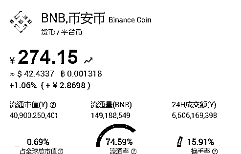

# 虚拟货币收割四部曲：循循善诱、请君入瓮、巧取豪夺

> 原文：[`mp.weixin.qq.com/s?__biz=MzIyMDYwMTk0Mw==&mid=2247509010&idx=2&sn=870a3bdfda18479bb353265441b97188&chksm=97cb6f2aa0bce63cd7b465e7ad7adc8cfdefbc843bcc0df926af2fdb94d911e94b30eccdbe0e&scene=27#wechat_redirect`](http://mp.weixin.qq.com/s?__biz=MzIyMDYwMTk0Mw==&mid=2247509010&idx=2&sn=870a3bdfda18479bb353265441b97188&chksm=97cb6f2aa0bce63cd7b465e7ad7adc8cfdefbc843bcc0df926af2fdb94d911e94b30eccdbe0e&scene=27#wechat_redirect)

一、序幕：循循善诱，让“小白”学会买入 USDT

提及买入 USDT，我们就要说说 OTC 交易，也就是场外交易。简单说就是将我们手里的法币（法币，即政府背书发行的法定货币，在中国，法币当然就是人民币），通过 OTC 商户兑换成数字货币。

这里的 OTC 商户啥意思？就像美食城的商户卖食品，OTC 商户就是在交易所搭建的一个“集市”进行数字货币和法币的双向交易的，你可以自行选择与你交易的商户，也可以让系统自动撮合。

具体购买时你可以指定要买入的 USDT 数量，也可以选择“法币”在 CNY 栏里填写你要买价值多少人民币的 USDT，接着点击购买。图中一个 USDT 等于 6.46 元人民币，所以 100 元人民币等于 15.479876 个 USDT，系统会给你自动算好。

接着你按照指定的方式向卖家转入人民币，就能在交易所获得同样价值的 USDT 了，这本身是一个中性的个人行为。但是在虚拟货币经济犯罪中，组织者往往希望吸引更多“币圈”之外的人参与，所以他们常常主动“破圈”，通过传统传销的渠道吸引参与者，然后循循善诱的跟你“普及”行业知识，教会你如何买币。

二、请君入瓮：诱使参与者将 USDT 充入指定平台

当你在交易所买入了 USDT，那么你就可以使用这些 USDT 了，对于诈骗和传销项目来说，项目方往往会循循善诱的教会你如何买入 USDT，紧接着就会诱导你把手上的 USDT 充值到项目平台，然后在该平台买入他发行的空气币。

为了大家理解这个过程，我们还是先选择通常的交易所，让大家熟悉这个过程。

通常，当你向一家交易所充值，严格来说是“充币”，交易所会要求你选择币种，然后给出充币地址。如果你选择的是 USDT，现在很多交易所可能又会让你在三种类型的 USDT 中做出选择：

三大类型的 USDT 包括：ERC-20、TRC-20，还有 OMNI，它们的区别是什么？其实它们都是由泰达（Tether）公司发行的 USDT，只是技术上选择发行的公链不同。

ERC20 USDT：基于以太坊网络发行的 USDT，它基于 ERC-20 协议标准发行,在以太坊地址间转账，每次转链上账时，需要消耗手续费 IE，被称为 Gas，具体要以 ETH 支付。

ERC20 USDT 的地址是以 0x 开头的 42 位字符串，例如：

TRC20 USDT：基于 TRON，也就是波场网络发行的 USDT，它基于 TRC-20 协议标准发行,在波场地址间转账，每次转链上账时，波场转账不需要手续费，因为这个特点，这一标准的 USDT 在近两年发展的很快。

TRC20 USDT 的地址为大写字母 T 开头，例如：

OMNI USDT:基于比特币网络发行的 USDT (基于 Omni 协议发行),除了转账需要比特币作为矿工费之外，每发起一笔 USDT 转账，都会对应地生成一笔数量极小的比特币转账。

OMNI USDT 的地址为 1、3 或 bc 开头，例如：

三、巧取豪夺：项目方如何用代币换取你的 USDT

USDT 的充币完成后，接下来就是买币，也就是所谓的“币币交易”，这块是双向的，逻辑上基本类似传统金融交易，我们还是先看一般交易所的情形。

如：BTC/USDT，这个交易对，

1）买入指的是用你账户里 USDT 去买 BTC

2）卖出指的是把你账户里 BTC 卖成 USDT

和交易所一样，各类骗局中所谓项目方们提供的平台上的交易对也都是以其发行的代币与 USDT 为主，让你用充入的 USDT 来购买所谓将连续暴涨，让你一夜暴富的空气币。这也就是我们此前揭示的此类骗局的本质，用空气币来换取你手上的有公认价值的 USDT。

这里我们所说的“空气币”，本身不是技术概念，而是基于其动机的俗称，它通常指的是没有实体项目支撑，或者没有系统的技术方向的，同时又缺乏市场普遍共识和价值认同的虚拟货币，它们本质上没有任何价值，纯粹靠营销手段，用“高利润”“只涨不跌”这种营销口吻，引诱投机者进场，随后把币统统卖出给投机者，撒手离场，也就是所谓的“割韭菜”。

进一步的，如果在这些空气币的营销和组织过程中，还存在鼓励会员以“拉人头”的方式赚取回报，本质上是以不断吸纳会员会费达到敛财目的，这可能就触及法律上“传销”的底线，这样的空气币也就成为“传销币”，将使参与者遭受更加严重的经济损失。

有时候，你还会在这些项目中听到所谓“平台币”的概念。事实上，平台币本身是一种虚拟货币的商业模式，就是数字交易平台发行的代币，如 OKEx 交易所平台发行的 OKB，币安交易所平台发行的 BNB。

平台币通常会以某种形式与交易平台业绩挂钩，这点上很类似一家公司发行的股票，让你可以分享其成长过程中的收益，当然，平台币在权益上不涉及股权。

只不过，在虚拟货币的骗局中，相关平台的“平台币”也只是借用一个概念，宣称其平台如何前途光明，号召投资者一起上船，但是从其价值本质到组织形式还是一眼可见诈骗或者传销。其实，这也是虚拟货币平台惯用招数，一旦有新的商业模式或者概念流行，便一定有骗局打着这些旗号登场，比如近一年“去中心金融”的 Defi 模式大火，很多骗局也打起了 Defi 的旗号。

四、反复收割：套路满满，让参与人欲罢不能

当你兑换了各种“空气币”后，那项目方就真的可以为所欲为，让你在其规则和操控下欲罢不能了。

以近期流行的模式来说，他们会让你参与项目方的所谓“挖矿”，规则定的诱惑动人，什么无限代无限算力。本质上就是只有邀请更多亲朋好友投入更多的钱，才能产生更多的算力，增大自己所谓的挖矿的产出。

项目方还可能采取反复收割的模式，比如自己开个“交易所”，让空气币上线交易，看上去有了变现渠道，稳住用户，甚至让他们产生新的动力。由于是自己发行的币，又在自己开的交易所，规则又可以自己定，这些空气币的价格自然可以想上就上，想崩就崩。

这就完了？不，还能继续骗，比如旧币换新币，母币质押挖子币的方式，让你感觉手上已经没有价值的币，还能挖出新的可能会有机会让自己翻身的新币，于是参与者们总觉得不甘心想扳回一局，却不知自己进了新的局，直到相关团伙彻底跑路。

就这样，这些项目方们以向你推介新技术，新机会的面目给你普及区块链财富机会，教会你如何买入 USDT，然后又诱导你将 USDT 充入他们的平台，接着再以他们发行的空气币换取你的 USDT，接下来就是一个他们为所欲为，对参与者反复收割的过程了。

来源：北京链安，反传 365

← 向右滑动与灰产圈互动交流 →

