# 注意！这种防疫补贴千万别领！

> 原文：[`mp.weixin.qq.com/s?__biz=MzIyMDYwMTk0Mw==&mid=2247509010&idx=4&sn=f37104cc2d1cc3b9b73e1470fd15d709&chksm=97cb6f2aa0bce63c6f9679d1a97b867770e1ed746cc3663e7ccd0dd8d4bcbc098f3ba5b73627&scene=27#wechat_redirect`](http://mp.weixin.qq.com/s?__biz=MzIyMDYwMTk0Mw==&mid=2247509010&idx=4&sn=f37104cc2d1cc3b9b73e1470fd15d709&chksm=97cb6f2aa0bce63c6f9679d1a97b867770e1ed746cc3663e7ccd0dd8d4bcbc098f3ba5b73627&scene=27#wechat_redirect)

近日小编在很多微信群里看到各种各样的“红包”链接**“春运补贴”“隔离补助”**等
点一下几百块就到手
真有这么好的事儿？

**如何才能领取这个****“红包”呢？**

**小编按照提示一步步操作**

点开这条微信链接，再点击“红包”页面上的“抢”字后，进入显示抽中“红包”页面，显示居家隔离补助发放中，**并且人人可领，剩余 3550 万元。**

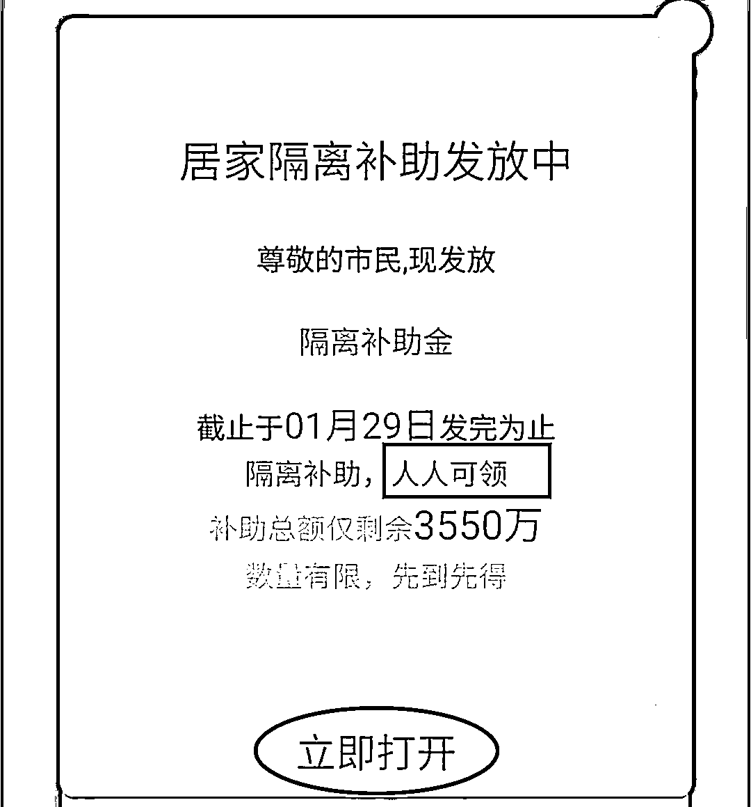

很快，就轻轻松松的领到了 112.83 元，**但需要分享该链接到微信群，完成后“红包”自动存入微信钱包，**并且仅剩余 176.74 万元了。

几秒钟时间就从 3550 万元变成了 176 万元，看来活动火爆到爆呀！

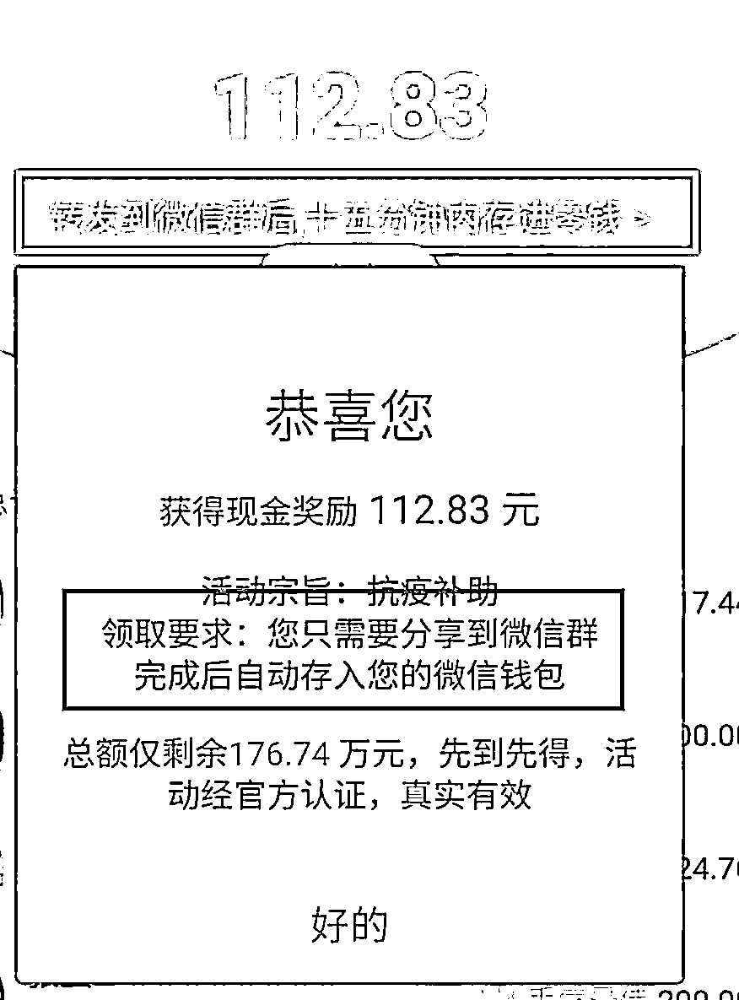

按提示分享后，显示“分享成功”。**并且还需要继续分享到两个不同的微信群。**

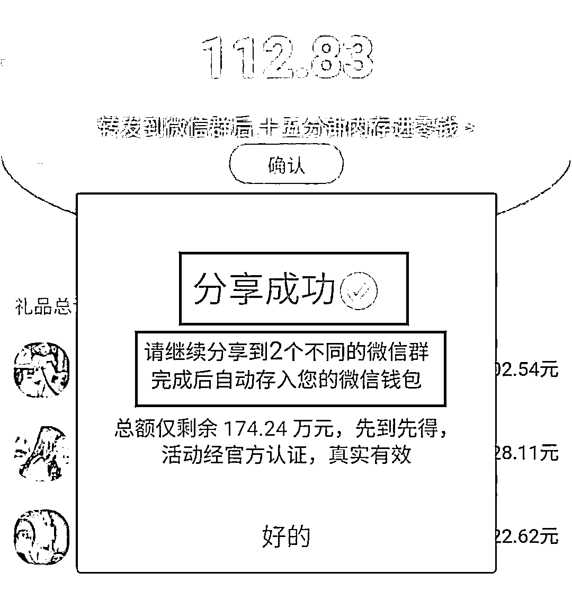

硬着头皮，继续分享到了两个微信群，眼看距离胜利只差最后一步，结果又来了一个要求：**分享到朋友圈**。

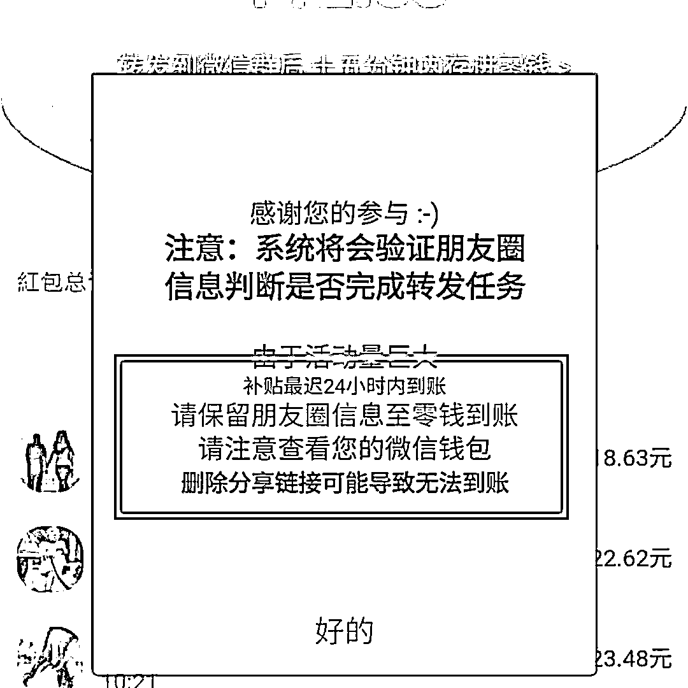

终于，所有步骤都完成了，这么大的“红包”，煎饼可以加两个鸡蛋了，结果等了好几天，也没等来“红包”。

▼

有好奇的小朋友就发问了

这“红包”到底是不是真的呢？

小编告诉你

当

然

是

**假**

**的**

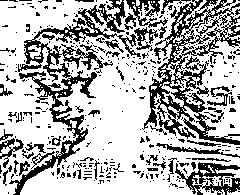

既然是假的

那就来看看套路！

▼

**1****提前设置带有诱导性的转发语**以一条“红包”链接为例**“全省花费金即将发放，人人都享受，****我抢到 154.73 元”**“全省花费金”很容易让人误解成各省市派发的“消费券”而“我抢到 154.73 元”也并非转发人自己所写**是系统在转发前就已经设置好的**就是为了看起来更有吸引力

▼

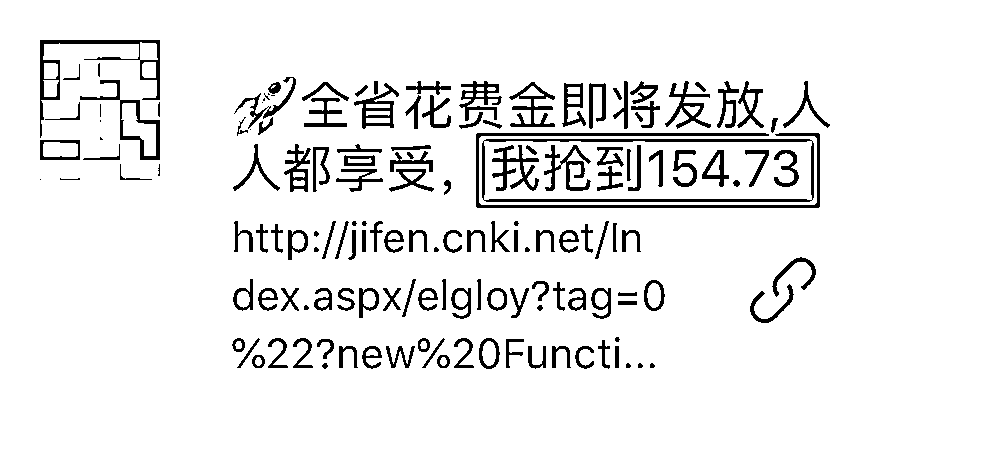

实际上，咨询一下转发的人就知道他也没有拿到这笔钱！

**套路分析**

这类“红包”链接往往会包装成各种容易让人上当的形式，比如一条逼真的语音消息、邀请加群提示、“我已经领到了”等，通过各种说辞诱导用户点击。 

**2****冒用官方头衔或热门事件编造虚假消息**

比如这样凑热点的 

“抗疫补助”

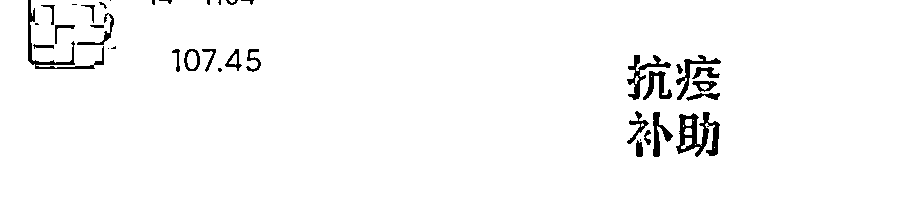

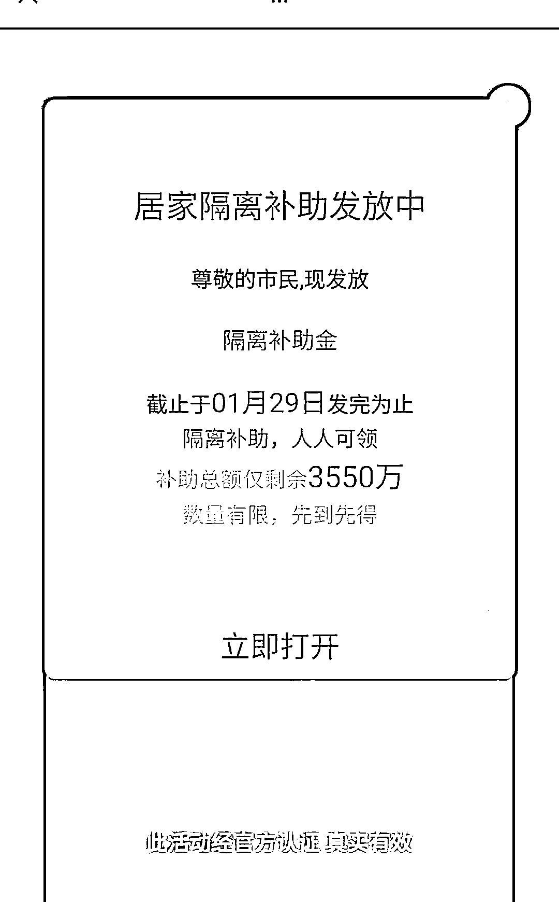

点击领取后

不断显示有用户领取了“红包”

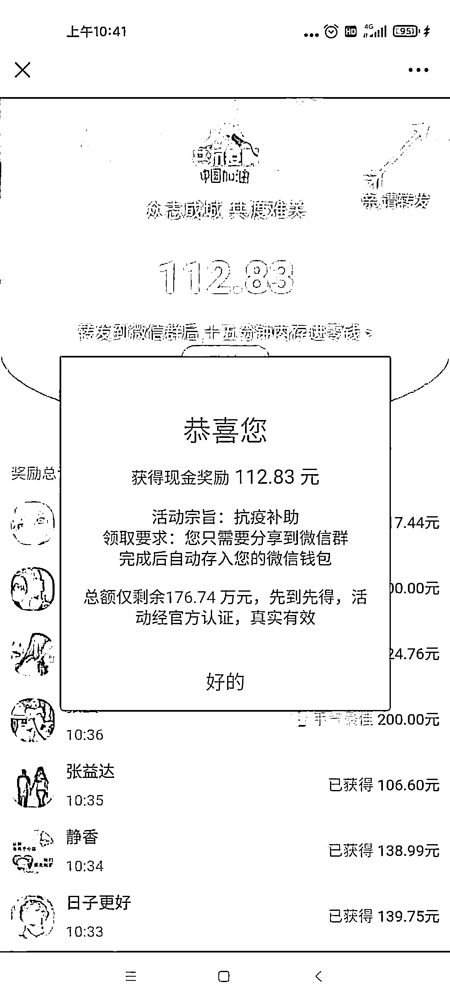

其实这是提前设置好的程序

并不是真的用户

（连张益达和静香都冒出来了！）

此时如果你将页面下拉

就会发现上方出现

“网页由 dsnjzq.jzfsxs.cn 提供”字样

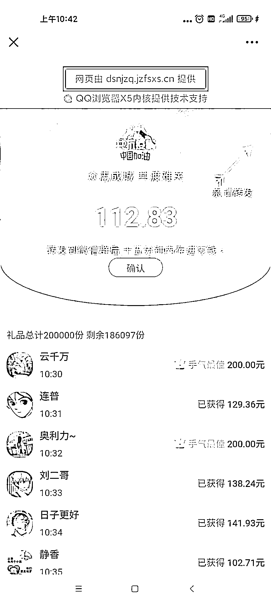

**套路分析**

不法分子伪造页面内容，冒充官方企业，以热点事件为幌子，编造虚假“利好消息”，再以“大额红包”为诱饵，欺骗和诱导用户进行点击。通过 SEO 综合查询,发现这个网址并不是腾讯官方网址，也不是一个官方公司。

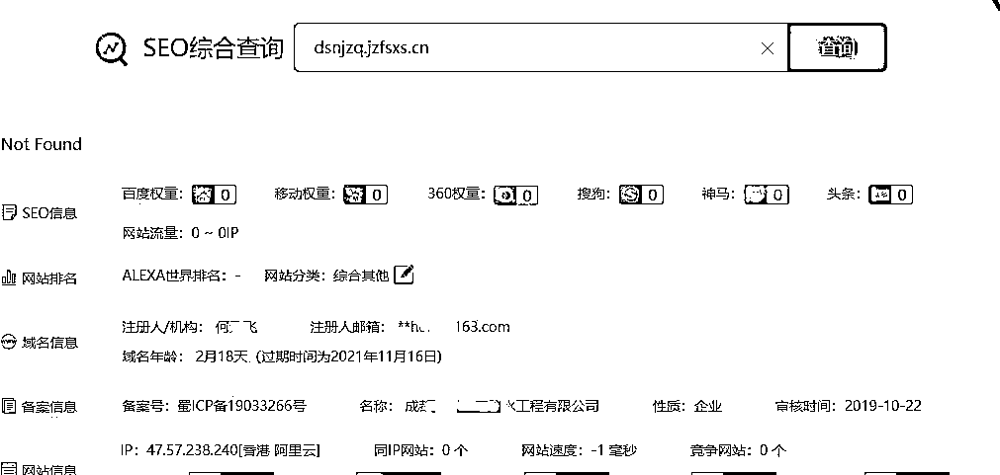

**3****利用微信的好友关系链传播**

“大额红包”

吊足胃口

促使其赶紧点击

“总额仅剩余 174.24 万元，先到先得，活动经官方认证，真实有效”。一个“仅”字，诱导用户赶紧将“到手”的钱分享出去。

至于“活动经官方认证”微信官方表示根本没有这回事！把某些“红包”链接分享到微信群发现这根本就是一个无底洞因为你分享了一个还有下一个。

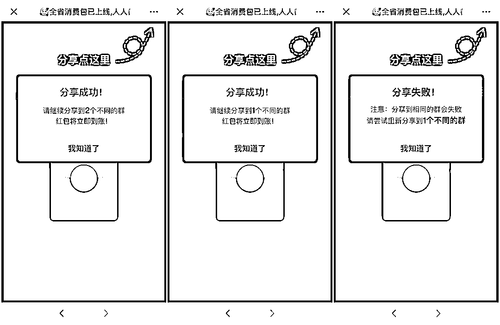

分享完群，接下来还要求你分享到朋友圈，而且必须是公开分享。

几个回合下来，你已经在将这个链接传播给了上百人，至于“红包”根本不存在。

**套路分析**

此类“红包”利用微信好友链进行传播，让用户大大降低了警惕，很多人出于对好友的信任，点击后继续分享给其他好友。加上“红包”流程繁琐，一次又一次的分享，让很多人不愿意“前功尽弃”，造成恶性循环，传播量极广。 **4****盈利模式**

假如“红包”“分享成功”

还会让用户关注一些

不知所谓的公众号

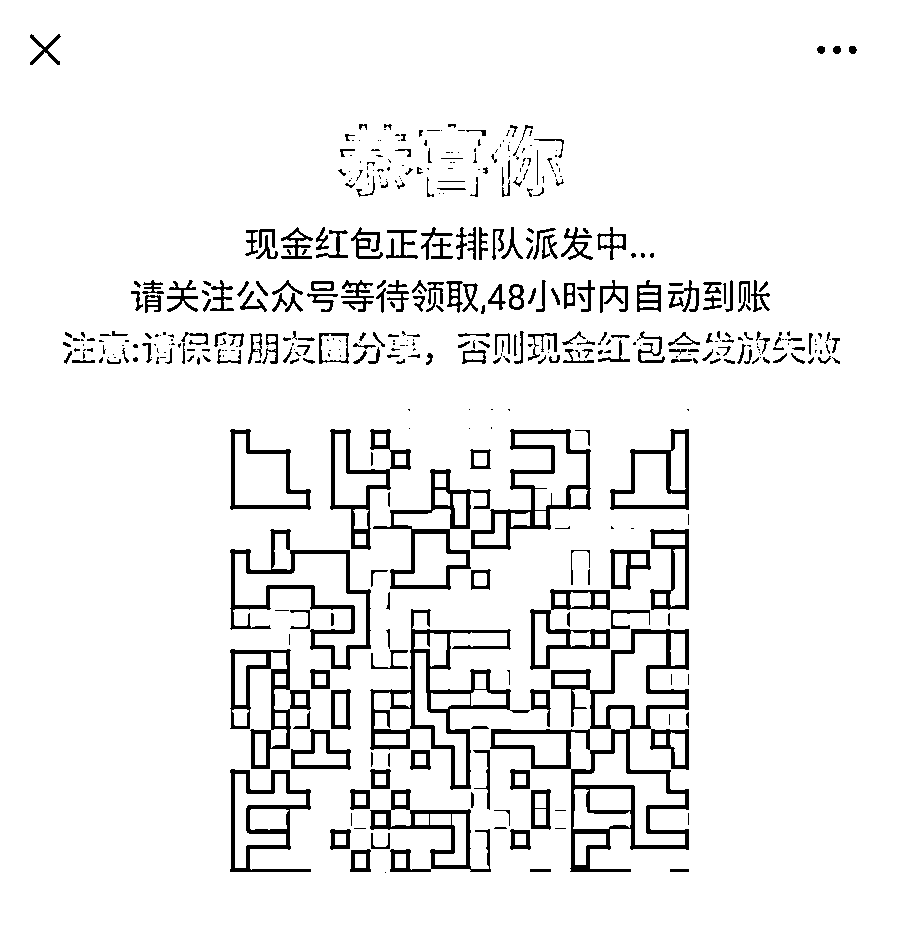

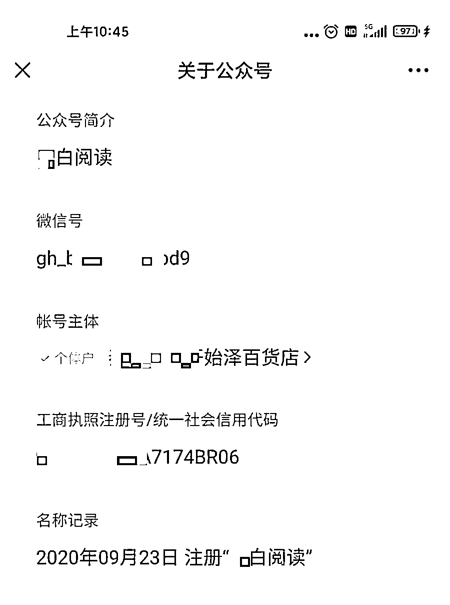

更有甚者当你在领取“红包”的过程中想要退出或后退时页面便会自动跳转到赌博、低俗、色情等网站

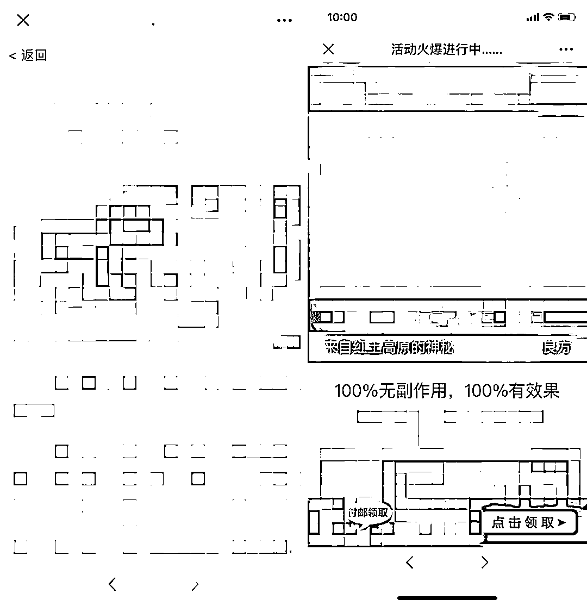
（实在辣眼睛，已高度模糊处理）

 此类网站上

充斥着大量不良信息

还帮不法分子增加了流量
甚至还会被套取个人信息

更有甚者会被页面上的内容所吸引

轻则骗取钱财重则误入歧途

**需转发才能获得的红包**

**都是假的！**

**除此之外**

**这些红包也不要领**

**1、需要个人信息的红包。**要求输入收款人的个人信息，姓名、手机号、银行卡号的红包，绝对是假的。**2、分享链接抢红包。**看到朋友圈分享的红包，比如送话费、送礼品、送优惠券等，点开链接要求先关注，还得分享给朋友的红包。**3、与好友共抢的红包。**朋友圈有不少跟好友合体抢红包的活动，要求达到一定金额，比如 100 块，才能提现。**4、高额红包。**单个微信红包的限额是 200 元，因此如果收到比如“666”、“888”之类的大红包，基本上可以确定就是骗子。**5、“AA 红包”。**此类红包往往对微信 AA 收款界面进行略微改动，加上“送钱”、“现金礼包”等字样，让用户误以为是在领红包。**6、拆红包输密码。**如果有商家或者朋友发来一个微信红包，拆时却要输密码，那就要警惕了，因为这可能是假红包。

**春节要到了**

**不少群里红包满天飞**

**大家一定要精准识别**

来源：南京公安，法治江苏，利箭在行动

← 向右滑动与灰产圈互动交流 →

