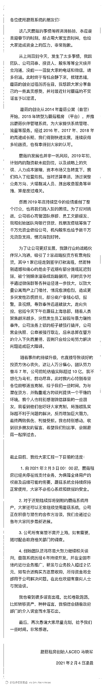

# 租金提现越拖越久，又一家长租公寓被传资金危机

> 原文：[`mp.weixin.qq.com/s?__biz=MzIyMDYwMTk0Mw==&mid=2247509010&idx=5&sn=03fb345b9c9eb6023338d968d780ffac&chksm=97cb6f2aa0bce63cac6f8a5a1cc7bac2a7f8d78eac80bacc6d5ae38f1afbc88cbed180974c0f&scene=27#wechat_redirect`](http://mp.weixin.qq.com/s?__biz=MzIyMDYwMTk0Mw==&mid=2247509010&idx=5&sn=03fb345b9c9eb6023338d968d780ffac&chksm=97cb6f2aa0bce63cac6f8a5a1cc7bac2a7f8d78eac80bacc6d5ae38f1afbc88cbed180974c0f&scene=27#wechat_redirect)

图片来源：公司官网 2 月 4 日，一家名为“蘑菇租房”的长租公寓服务平台被传出现资金危机。目前，蘑菇租房已经关停在线支付业务，近期即将到期的用户仍能正常使用蘑菇系统。当日凌晨，蘑菇租房创始人兼 CEO 马晓军发文致歉并澄清，称卷款跑路、转移资产为谣言。其在公开信中表示，2019 年初，因融资款未能到位，以及战略上的失误、人力成本激增，资本市场急转直下，公司陷入经营危机。而疫情又使整个长租公寓行业面临重创，公司核心高管团队停薪、员工欠薪缓发、创始团队向银行贷款、找朋友借钱筹集了千万元资金借给公司，机构股东也给予数千万元贷款支持，情况得到好转。此外，马晓军还表示，“公司所有高管不离开上海”、“欢迎有意收购方洽谈”。一位与蘑菇租房接近的运营商告诉界面新闻，马晓军的回应只是在回顾创业历程之艰辛，却没有任何实质性的解决方案。“这些钱去哪了，现在是什么状态，还能不能返还，后续具体怎么解决，这些才是外界关注的焦点。”上述人士还表示，去年蘑菇租房曾与行业内一家公司谈过收购事项，但当时对方已对蘑菇租房提现困难问题有所察觉，收购也不了了之。据媒体消息，2 月 3 日上午，数十名从各地赶来的公寓房东来到位于上海静安区的蘑菇租房总部，想要讨回租金，可蘑菇租房已无人办公。据悉，蘑菇租房从 2020 年 3 月开始已出现提现困难情况。从最开始的“秒提”到后面越拖越久，最终在今年年初集中爆发。界面新闻从黑猫投诉网站上了解到，目前针对蘑菇租房的投诉量有 859 条，投诉内容包括不退押金、提现无法到账等等。相关投诉中，涉及的租金额少则 1000 出头，多的有高达几十万。界面新闻尝试联系蘑菇租房，但电话一直处于未接听状态。天眼查 APP 显示，蘑菇租房于 2014 年在上海创立，隶属于上海朔羡网络科技有限公司，法定代表人许铁根。上海朔羡网络科技有限公司分别于今年 1 月 8 日和 1 月 12 日被上海市静安区人民法院列为被执行人。值得注意的是，2021 年 1 月 6 日，上海朔羡网络科技有限公司进行了工商变更，马晓军退出，新增许铁根；1 月 9 日，许铁根成为法定代表人；1 月 10 日，马晓军等六名董事从主要人员中退出。与蛋壳等 TO C 的长租公寓不同，蘑菇租房服务于 TO B 的公寓商家。资料显示，蘑菇租房为公寓运营商提供公寓 SaaS 管理系统，除了帮助企业管理房源，还对接了流量、电子合同、金融、支付、大数据、智能硬件等产品服务。成立之初，其前身蘑菇公寓获得平安创投和 IDG 的 3000 万元人民币 A 轮风险投资。同年，又获得了海通开元基金领投，IDG、平安创投跟投的 B 轮 2500 万美金风险投资。2015 年初，蘑菇公寓转型蘑菇租房，并于同年 8 月获得 KTB 投资的 B+轮 3000 万美元风险投资。两年后，蘑菇租房完成蚂蚁金服数千万美元的 C 轮战略投资，以及由云锋基金领投、巨人网络集团与蚂蚁金服跟投的 C+轮 3000 万美元融资。成立至今，蘑菇租房平台汇聚超 30000 家公寓出租机构，入驻平台房源超过 400 万间。业务覆盖北京、上海、深圳、杭州、南京、天津、广州、成都、重庆、西安、郑州、武汉、苏州、厦门、合肥、青岛、东莞等近 20 个城市。“光是目前集合的深圳运营商，所涉及的资金就超过了 3000 万，更不用说全国范围内了。”上述受害运营商表示。就目前来看，蘑菇租房事件还在发酵中，就其运营模式及规模来看，波及面不小。尽管创始人马晓军已发文回应，但后续蘑菇租房会拿出何种具体解决方案，才是重中之重。

（以上为蘑菇租房创始人兼 CEO 马晓军公开信）

来源：界面新闻 记者：陶婷

← 向右滑动与灰产圈互动交流 →

