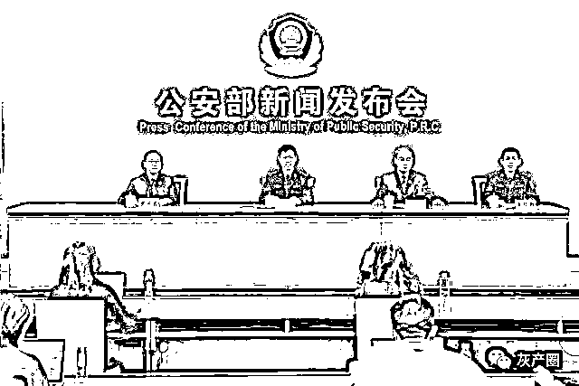
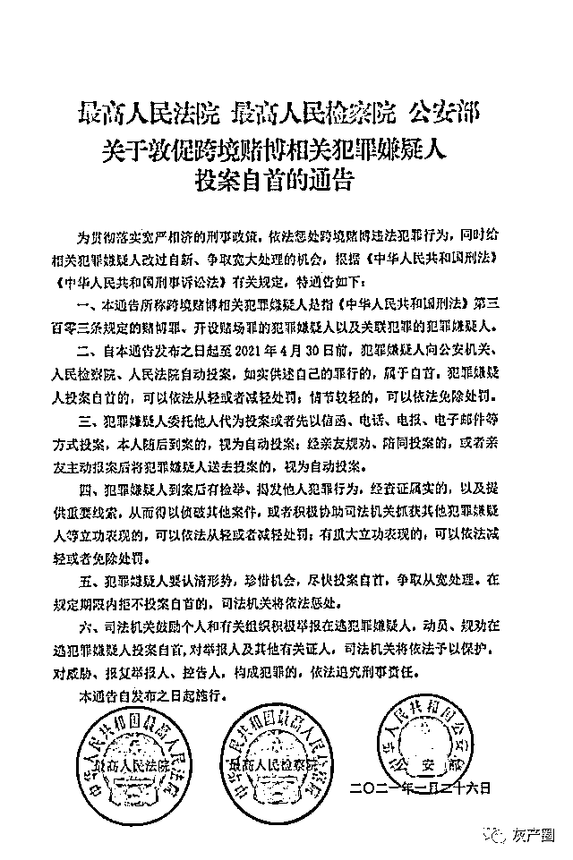

# 跨境赌博人员请于 4 月 30 日前投案自首！

> 原文：[`mp.weixin.qq.com/s?__biz=MzIyMDYwMTk0Mw==&mid=2247509069&idx=2&sn=cdf656367332dcbd9364c4815bb38d61&chksm=97cb6f75a0bce66399335c84faf0721cd5c5ff4675da437a4d8c42320f434d249ac35cabac3b&scene=27#wechat_redirect`](http://mp.weixin.qq.com/s?__biz=MzIyMDYwMTk0Mw==&mid=2247509069&idx=2&sn=cdf656367332dcbd9364c4815bb38d61&chksm=97cb6f75a0bce66399335c84faf0721cd5c5ff4675da437a4d8c42320f434d249ac35cabac3b&scene=27#wechat_redirect)

最高人民法院、最高人民检察院和公安部日前联合制定印发《关于敦促跨境赌博相关犯罪嫌疑人投案自首的通告》（以下简称“通告”），通告指出，跨境赌博相关犯罪嫌疑人 4 月 30 日前主动投案自首，可依法从轻或者减轻处罚，情节较轻的可依法免除处罚。

**只有悬崖勒马才是唯一出路******

****　　公安部 5 日在京召开新闻发布会，公安部国际合作局局长廖进荣表示，三家单位联合发布《通告》，充分表明依法严厉打击跨境赌博犯罪决心，也希望向仍在从事跨境赌博的犯罪嫌疑人讲清楚政策，最大限度地挽救失足人员。“无论什么原因走上这条违法犯罪道路，只有悬崖勒马才是唯一出路，否则必将把自己甚至整个家庭带入万劫不复的深渊。希望他们认清形势，珍惜机会，悬崖勒马，痛改前非，尽早开启新生活。”****

****通告对投案自首时限、自动投案情形、立功情形等进行认定，对拒不自首也明确了惩处措施，对涉赌犯罪举报将予以保护，对威胁、报复举报人、控告人，构成犯罪的，依法追究刑事责任。**** 

****　　通告明确，犯罪嫌疑人委托他人代为投案或者先以信函、电话、电报、电子邮件等方式投案，本人随后到案的，视为自动投案；经亲友规劝、陪同投案的，或者亲友主动报案后将犯罪嫌疑人送去投案的，视为自动投案。犯罪嫌疑人到案后有检举、揭发他人犯罪行为，经查证属实的，以及提供重要线索，从而得以侦破其他案件，或者积极协助司法机关抓获其他犯罪嫌疑人等立功表现的，可以依法从轻或者减轻处罚；有重大立功表现的，可以依法减轻或者免除处罚。在规定期限内拒不投案自首的，司法机关将依法严惩，绝不姑息。****

****4 月 30 日前无法回国的可托人代为投案************

****　　最高人民检察院第一检察厅副厅长罗庆东表示，对于犯罪嫌疑人来说，无论是在境内还是在境外，只要在 2021 年 4 月 30 日之前，向我国司法机关投案自首的，司法机关对其处理上将依法体现从轻精神，目的是解除相关人员疑虑，促使其早日归案，也可节约诉讼资源。希望相关人员把握好时机，及时按时自动投案。****

****　　需要说明的是，如果境内的犯罪嫌疑人因客观原因在规定期限内确实无法回国的，也可委托境内亲人、朋友等代为投案或者以信函、电话、电报、电子邮件等方式向办案单位投案，说明不能在期限内投案原因，之后主动回国到案接受司法机关处理的，按照投案自首相应的从宽处理政策。****

****对于投案自首的犯罪嫌疑人，检察机关将根据《通告》的规定，结合其犯罪事实、地位作用及到案认罪悔罪表现，在办案中全面贯彻“少捕慎诉”的司法理念，积极兑现从宽政策，对于符合不起诉条件的，依法作出不起诉处理；对于依法提起公诉的，将充分适用认罪认罚制度，对其依法提出从轻或者减轻处罚的量刑建议。而对于那些在规定期限内拒不投案自首的犯罪嫌疑人，将毫不手软地依法惩处。**** 

******开设赌场罪量刑最高为五年******************

******开设赌场犯罪行为已严重影响我国经济安全、社会稳定和国家形象。最高人民法院刑事审判第三庭副庭长李睿懿表示，刑法修正案（十一）把开设赌场罪刑罚由“处三年以下有期徒刑、拘役或者管制，并处罚金”调整为“处五年以下有期徒刑、拘役或者管制，并处罚金；情节严重的，处五年以上十年以下有期徒刑，并处罚金”，体现了对开设赌场犯罪刑事处罚力度的加大。****** 

******　　另外，打击对象是所有人员，包括中国公民和外国公民组织中国公民参与跨境赌博的都将受到我国法律制裁，体现了中国政府打击跨境赌博犯罪的坚定决心。其次，参与赌博的形式既包括赴国（境）外实体赌场参与赌博，也包括参与网络赌博，充分反映我国执法司法机关打击线上、线下赌博的实际需要，体现了对跨境赌博更宽范围、更为严厉的惩治。******

******　　李睿懿表示，人民法院将严格依法办案，正确适用法律，充分发挥审判职能作用，在全面把握犯罪事实和证据基础上，准确认定开设赌场犯罪，从严从快惩处开设赌场犯罪。重点惩治赌场经营人、实际控制人、投资人、管理人员或者从赌场获利人员、赌厅、赌台的实际控制人员，赌博网站、应用程序的建立者、提供者、使用者、参与利润分成的出资者、管理人、代理人等，同时注重适用财产刑和追缴、没收等财产处置手段，最大限度剥夺犯罪分子再犯能力。******

******　　最高人民法院将坚持贯彻宽严相济刑事政策，对于赌博犯罪集团中组织、指挥、策划者和骨干分子，赌博犯罪情节恶劣的犯罪分子，依法从严打击；对于从事与组织赌博活动无直接关联的一般人员，认罪悔罪、积极配合司法机关工作的被告人，切实体现从宽政策，严中有宽，宽以济严，最大限度地实现政治效果、法律效果和社会效果的有机统一。******

 ******[`v.qq.com/iframe/preview.html?width=500&height=375&auto=0&vid=k32260iqqlx`](https://v.qq.com/iframe/preview.html?width=500&height=375&auto=0&vid=k32260iqqlx)****** 

************************

******← 向右滑动与灰产圈互动交流 →******

************