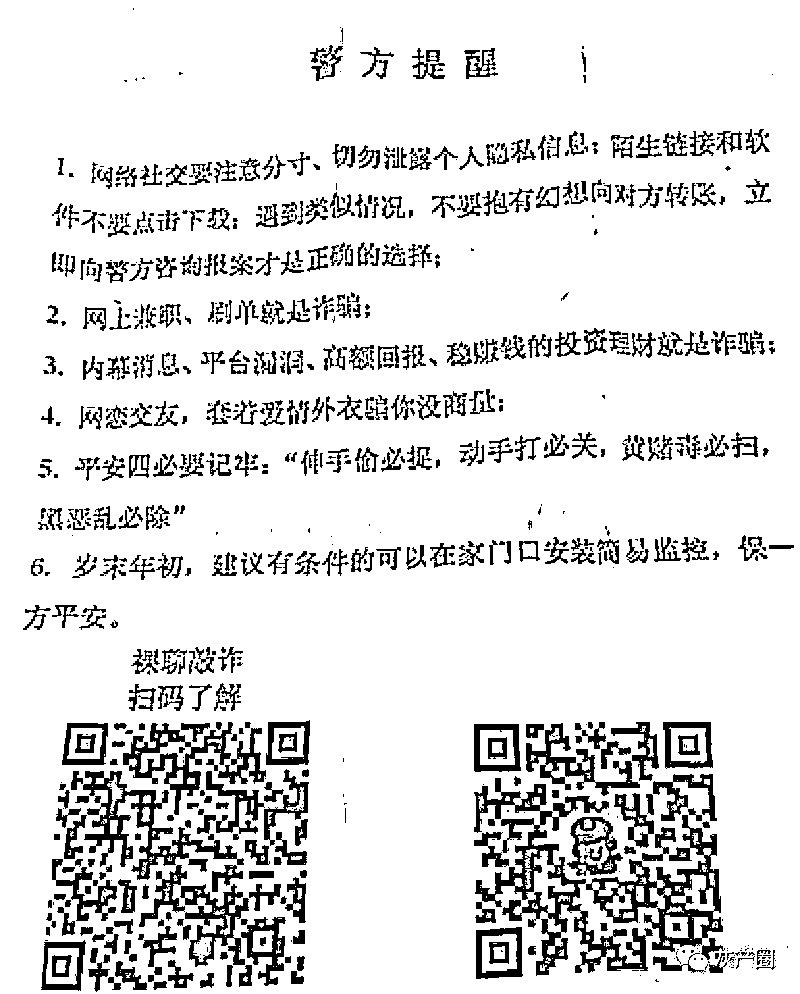
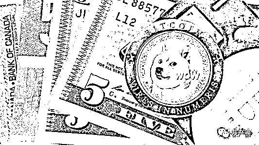
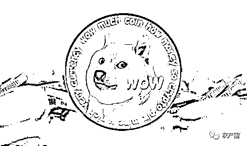

# 虚拟币投资新骗局：狗狗币暴涨暴跌后诈骗瞄准“90 后”

> 原文：[`mp.weixin.qq.com/s?__biz=MzIyMDYwMTk0Mw==&mid=2247509069&idx=4&sn=bb3d953eb2744858f9b4ed7ac69df932&chksm=97cb6f75a0bce6634dd969fdf229589ac7883142ccc225e9d7c1115d154624a8ea637f0609cb&scene=27#wechat_redirect`](http://mp.weixin.qq.com/s?__biz=MzIyMDYwMTk0Mw==&mid=2247509069&idx=4&sn=bb3d953eb2744858f9b4ed7ac69df932&chksm=97cb6f75a0bce6634dd969fdf229589ac7883142ccc225e9d7c1115d154624a8ea637f0609cb&scene=27#wechat_redirect)

岁末年初，各类电信诈骗又开始冒头，而打着虚拟币投资幌子的互联网诈骗则频频出现，引起监管和公安的关注。

“近期我们这幢楼有个不到 30 岁的女孩子因为炒虚拟货币亏了 30 多万元，还有附近一个男孩子投资比特币亏了 70 多万，所以我们现在挨家挨户发警方提醒传单，并且让家庭负责人填上信息，一方面是让大家警惕各类网络诈骗新手段；另外也是排查隐藏在各处的参与投资诈骗的人。”2 月 4 日，上海松江区某小区的社区民警对《华夏时报》记者表示。

该民警还表示，现在很多新型诈骗不再是盯着中老年人，而是把目光投向了“90 后”，通过微信、QQ 群等进行虚拟币投资诈骗。

事实上，随着近期以比特币为代表的虚拟数字货币的暴涨暴跌行情，以此带动一大波空气币出现暴涨，这让国内很多年轻人以为出现了投资机会，但是一些血淋淋的案例让上海公安部门向市民发出了警方提醒。

狗狗空气币大涨后的“阴谋”

“比特币价格太贵，不是普通人能玩得起的，但是比特币行情带动的空气币暴涨暴跌，就需要引起关注，当下混乱的市场不排除头部庄家联手做局的阴谋。”2 月 5 日，上海虚拟数字货币资深分析师王恒对此分析指出。

近日，作为空气币的“老牌鼻祖”狗狗币（DogeCoin），在 1 月 28 日以后突然出现大涨，而在北京时间 1 月 29 日早间，特斯拉创始人埃隆马斯克发布社交推文，图片包含狗狗币相关信息。由于马斯克曾多次公开提及狗狗币，该图被认为是其再度站台。当时，狗狗币价 24 小时涨幅约 260%；而到了 1 月 29 日午间，狗狗币与美元稳定币交易对的价格在 OKEx、币安和火币交易所最高达到约 0.085 美元稳定币，24 小时涨幅超过 900%。

根据 CoinMarketCap 数据显示，自 2018 年 2 月至日前，狗狗币价格长期未超过 0.01 美元，此番上涨让狗狗币登上各大交易所涨幅榜榜首，市值逼近百亿美元，一度跻身为市值前十的加密货币。相对于行情波动剧烈的小市值新发币种，“长寿”的狗狗币早在 2014 年已上线。对于狗狗币的暴涨，有加密货币行业人士一边“眼红”，一边直呼看不懂。

“本次狗狗币暴涨的背后，实际上是美国散户大战华尔街机构空头的延续。无论是游戏驿站（GME）股票的暴涨，还是狗狗币的拉高，可以用罗伯特·席勒的‘叙事经济学’来解释，加之媒体的推动下，形成的一种大众思维，众人纷纷加入这场叙事，带动了相关资产价格的上涨。”对此，OKEx Research 首席分析师 William 分析称。

但是在业内人士看来，狗狗币是名副其实的“空气币”。即使连狗狗币的创始人自己都承认开发狗狗币不过是玩笑制作，没想到狗狗币仍在全球流动，并且还打到了 20 亿美元的市值。

资料显示，狗狗币诞生于 2013 年，创始人为澳大利亚人杰克逊·帕尔默（Jackson Palmer）。2018 年，帕尔默在 Vice 网站发布署名文章简介称，其参与加密货币领域教育工作，持有多种加密货币，包括价值不足 50 美元的狗狗币。

“狗狗币是模仿加密代币，因为价格低廉以及对社区友好，活跃在 Reddit 社区。此后，有机会主义者在狗狗币社区，骗取了数百万美元。2015 年，诈骗分子消失，社区对狗狗币的兴趣下降。当年，我决定不再参与狗狗币和加密货币，并把狗狗币的开发交给信任和社区团队成员。我从未想到自己视作玩笑开发的狗狗币在 2018 年仍在全球流动，并达到 20 亿美元市值。”帕尔默在当时的文中就指出。

“正如创始人自己都称狗狗币是模仿代币，但是全球仍然有那么多人去追高它，反复地炒它，最关键的因素还是因为价格实在是太低廉了，对于普罗大众而言，折合人民币只有几分钱一枚的狗狗币谁都可以参与投资，即使亏了也无所谓，但是庄家吸引的就是 90 后的人群。”王恒称。

群聊喊单骗局需警惕

如何吸引“90 后”参与诸如狗狗币之类的虚拟币投资，电话、QQ、微信以及各类互联网社区都是渠道，也正是这些渠道，让很多人被狠狠的“割了韭菜”。

“玩币的都会收到所谓交易所或者来自币世界的电话，开局大概是‘你好，我是火币网的客服，请问你对数字货币感兴趣吗……’话术大致就是如此，但是你问他们的老板是谁，他们却支支吾吾，如果你相信了他们，那么他们就带你进群去‘收割’了。”对此，上海一位资深虚拟币投资者张佳（化名）对《华夏时报》记者表示。

事实上，去年，就有一批冒充“火币网”的犯罪团伙被抓。在 2019 年 5 月份左右，被告人龙某甲带着陈某甲、夏某甲、蒲某某、吕某某等人在江西南昌高新区紫阳明珠一楼房通过冒充“火币网”客服进行诈骗。被告人龙某甲会给工作人员规定每天的任务，工作时间从早上 9 点到晚上 9 点，每天平均至少拨打 100 多个电话，至多添加 5 个客户的微信。被告人龙某甲会提前买好工作用的手机和拨打电话的电话卡、加微信的流量卡，之后会给每人分两部或以上的手机，一部用来拨打电话，一部用来加微信，同时会给工作人员一张话术单，话术单的内容就是首先介绍自己是“火币网”，再询问是否对火币感兴趣。

而如果被害人对火币感兴趣，这些工作人员就会将已创建好的微信交流群让受害人进群，进群之后被告人龙某甲会安排所谓的专业“老师”来给群中的受害人讲课，听完课之后陈某甲等人就会在群中发一个投资的 FOB 平台的二维码或链接，群中的受害人就会下载注册这个平台，最终在这个平台上进行投资。而这个 FOB 平台就是被告人龙某甲等人找到的平台，他们通过“老师”微信号带单故意将受害人在平台上投资亏损，实际上“老师”微信号都是被告人龙某甲等人扮演，“老师”带的单都是在 FOB 平台上操作，操作方式是炒比特币、莱特币等币种，主要炒比特币，通过做合约的形式进行投资入金。计量单位是 U 币，1U 相当于 1 美元。

在平台上提币则需要平台上有 100U 以上的币，低于 100U 则需要充币到平台上，还是会收取一定的手续费，没有提出的币则会在平台管理者取出，从而也达到获利的目的。这样工作期一般都是一个月左右，大约前半个月通过打电话拉客户，后半个月就通过讲课拉人在平台上进行投资。被告人龙某甲会按照每个工作人员添加的微信客户数量及其添加客户投资金额的亏损额进行发放工资，底薪每人三千。以上人员这一轮领到 3000 元到 2 万元不等的工资，工资都是以现金的方式进行发放。

龙某甲还会给工作人员下发任务，每人每天平均至少拨打 100 个电话，添加至少 5 个客户的微信，工作时间从早上 9 点到晚上 9 点。龙某甲会提前准备好工作用的手机和电话卡，加微信用的流量卡，冒充“火币网”客服的话术，之后会给工作人员提供两部或以上的手机，一部用来拨打电话，另外的用来添加微信客户。

“不得不说，这些做诈骗的还真是努力，每天都有相应的 KPI 要求，毕竟自己的工资和诈骗的金额是息息相关的。我们对这些诈骗手段都已经见惯了，这些涉事人员都已经被依法提起公诉，因为是犯的诈骗罪，估计最后被判的都不轻，而且数额已经算巨大了，等待这些人的将是法律的制裁。”张佳称。

来源：华夏时报

← 向右滑动与灰产圈互动交流 →

# 

> 原文：[`mp.weixin.qq.com/s?__biz=MzIyMDYwMTk0Mw==&mid=2247509069&idx=5&sn=570e1354d186a3d1de03ead36fb61709&chksm=97cb6f75a0bce66326ac3f5a93b15069986d5685dd7a65f00c215d06df38294b9cf2d8fe2a71&scene=27#wechat_redirect`](http://mp.weixin.qq.com/s?__biz=MzIyMDYwMTk0Mw==&mid=2247509069&idx=5&sn=570e1354d186a3d1de03ead36fb61709&chksm=97cb6f75a0bce66326ac3f5a93b15069986d5685dd7a65f00c215d06df38294b9cf2d8fe2a71&scene=27#wechat_redirect)

# 原文：[`mp.weixin.qq.com/s?__biz=MzIyMDYwMTk0Mw==&mid=2247509136&idx=1&sn=85cdabcd097435e2b298c78e4bcbcff2&chksm=97cb6fa8a0bce6be0cbe351cd9fbcc964cf3a218e3766a67a74bdb3e90c42ed21d918a051aa2&scene=27#wechat_redirect`](http://mp.weixin.qq.com/s?__biz=MzIyMDYwMTk0Mw==&mid=2247509136&idx=1&sn=85cdabcd097435e2b298c78e4bcbcff2&chksm=97cb6fa8a0bce6be0cbe351cd9fbcc964cf3a218e3766a67a74bdb3e90c42ed21d918a051aa2&scene=27#wechat_redirect)