# 由"迪拜华人区块链首富"发起的原子币项目，了解一下？

> 原文：[`mp.weixin.qq.com/s?__biz=MzIyMDYwMTk0Mw==&mid=2247509136&idx=2&sn=2e0e8da5828d2cb79cca399918df3265&chksm=97cb6fa8a0bce6bec3a0caa12aec1e567aed243ee96e0df46135968dc898da40fc3fa9ef91a1&scene=27#wechat_redirect`](http://mp.weixin.qq.com/s?__biz=MzIyMDYwMTk0Mw==&mid=2247509136&idx=2&sn=2e0e8da5828d2cb79cca399918df3265&chksm=97cb6fa8a0bce6bec3a0caa12aec1e567aed243ee96e0df46135968dc898da40fc3fa9ef91a1&scene=27#wechat_redirect)

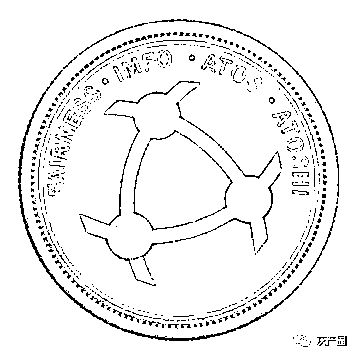

很多人想通过原子币这个项目实现财富自由，而我却一直当笑话来看的

由"迪拜华人区块链首富"发起的原子币项目，已经运行两年多。两年来，很多人想通过这个项目实现财富自由，而笔者却一直当笑话来看，因为这两年来，这个项目贡献了太多笑点，下面列举几点，笑不笑由你！

笑点一：制定版“首富”

人们说的首富，一般是指世界、全国、或某个区域范围内最有钱的人。

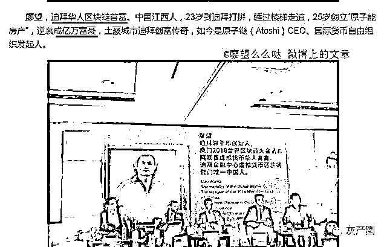

而原子币这个项目的操盘手么么哒，各种介绍里也称为“首富”，但这首富却加了“迪拜”“华人”“区块链”等定语，一听很高大上，但仔细一琢磨，这首富却只是迪拜这座 300 万人口的城市中约 20 万华人中的极少数玩区块链的群体（不知有没有一千人）中最有钱的.....

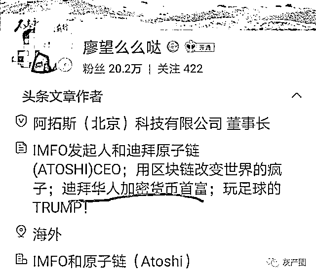

原来这“首富”是个人"定制"的。根据这样的定制，感觉笔者也可以成为首富：广西主业搬砖业余反传销 10 余年人士首富。嗯，戴上这首富的帽子，我腰杆子都直了好多，立马对自己佩服得不得了！

不过与其“首富”身份形成极大反差的是：其在国内注册的几家公司，实缴资本几乎都是“0”。

公司注册资本少，网友进行质疑，“原子恋科技”是这样回复和解释的：因为公司是致力于高新技术，重技术......不需要那么多的注册资本。不知在他们眼里，华为等高科技公司是不是假的高科技？

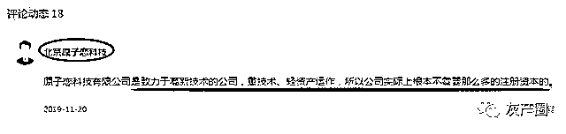

原子恋公司回应注册资本少的原因

笑点二：赢在起跑线

2019 年 1 月 6 日，第四届中国 CEO 新年峰会年度上， 么么哒荣获“2018 年度新经济领域最具创新力 CEO”。2019 年 1 月 12 日，么么哒被评为“中国区块链行业十大创新企业家”。

年度创新企业家

被评为 2018 年行业领军企业

原子恋公司还被评为"2018 年行业领军企业"。但是原子恋公司 2018 年 12 月 27 日才注册成立，也就是这家公司在 2018 年全年才存在 3 天，其公司和操盘手就拿下了三项 2018 年的全国年度大奖，成为行业领军，直接赢在了起跑线上，让人不得不佩服！

成立日期：2018-12-27

笑点三：终结美元霸权

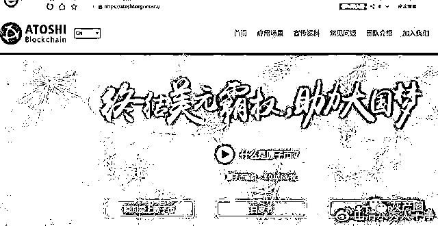

原子币的初心

么么哒反复称将用原子币“终结美元霸权”。由私人公司发行的原子币，竟然想通过炒作、流通、壮大，然后干掉世界第一货币？他比世界各国都牛？用原子币“终结美元霸权”与下图“专修航母”的大妈大爷相比，哪个更靠谱？

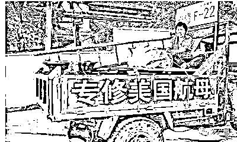

专修航母

现在原子币在国内运营、发展，如真如其宣传的那么厉害能干掉$，在干掉$之前，是不是包括¥在内的其他国家货币先被干掉？哪个国家允许原子币这么干？

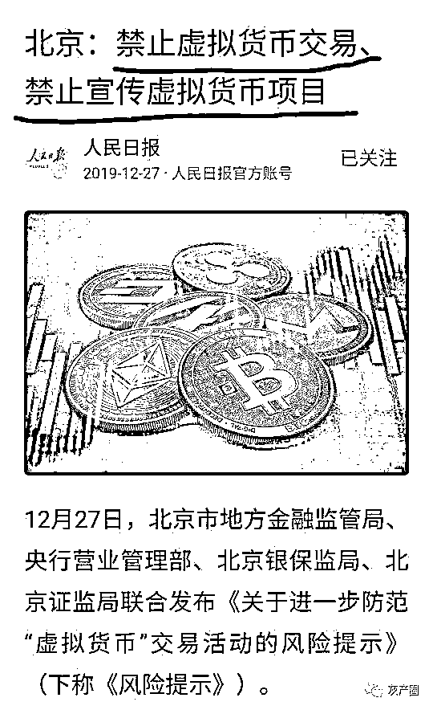

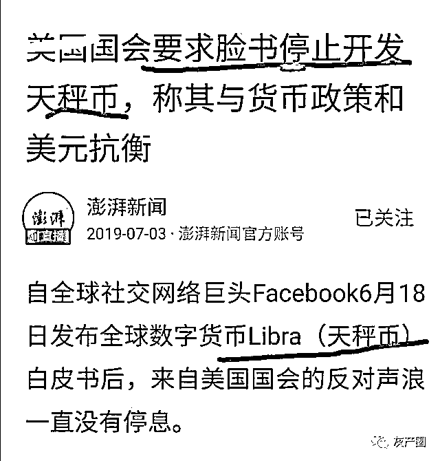

关键是如此高端大气上档次的项目，竟然都是些大爷大妈和没多少文化的人在玩，终结世界第一货币就靠这些人？

笑点四：央视专访

应央视《影响力人物》栏目邀请接受专访是么么哒反复提及的，甚至在微博上晒出《影响力人物》专刊，售价高达 188 元一本（同时“赠送”原子币）。

专访

“央视杂志”封面标注：开曼原子基金有限公司董事长

专访中么么哒头发凌乱，躯体语言和表情夸张，视频中除了展示豪宅豪车外，还用不少篇幅大谈其如何带领团队踢足球。给笔者的感觉就像是个山村里的人突然到大城市大开眼界后，又回到村里向邻里炫耀城市里的生活。笔者就纳闷了，央视栏目就这点水平？上央视网搜了下，根本搜不到《影响力品牌》栏目，再到出版广电总局网站搜，也没搜到能卖到 188 元的《影响力品牌》这么个刊物。

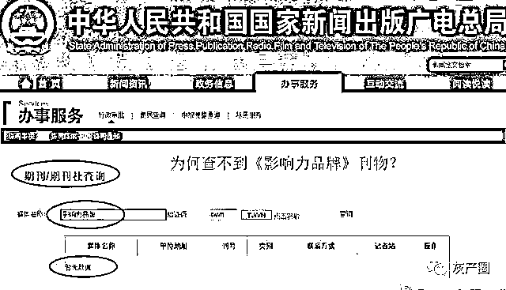

为何查不到？

网上倒是有个“品牌影响力栏目组”的网站，不过查备案号却是一家商贸公司的网站

这个“央视专访”，到底是哪个国家的央视专访？

笑点五：国家邀请参会

么么哒发微博和视频称，因其提出“以原子币终结美元霸权的想法，得到了国家的认可”，受到重视，被国家邀请参加数博会，并给配私人秘书、专车和司机、给补贴、报销机票云云......

后网友向官方求证，官方回应：其所言非实，已经要求其删了有关言论。

如真如其吹嘘的国家重视其原子币将终结美元霸权，国家还不大力扶持甚至收购？原子币项目也玩了两年多了，如此伟大又赚钱的项目，相关部门、银行、基金、各界名人为什么不加入？

笑点六：受聘客座教授

2020 年 12 月，原子恋又传来一个喜讯：么么哒获聘为客座教授啦！

发聘书的单位为某研究院旗下某研究所智库专家组。让笔者佩服得不得了

这证书的含金量有多高咱不知道，反正中国经营报官微曾报道，这国字号研究院旗下的二层机构可以“批发”近 400 种证书，收费公道，服务很到位，办证快......笔者恨不得都想给自己来几套。

几小时就能出证

也不知至今为止有没有哪一所大学正而八经地请么么哒去授过一次课？

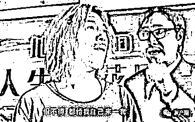

恨不得，都给自己也来一套

笑点六：隐形的翅膀

么么哒反复说原子币是开曼原子基金公司发行的，但对这个原子基金公司的资产状况、资金来源、经营范围、高层组成等等信息一概不提，至今这基金公司连一张图片都没有，更不用说其他信息了，它像是么么哒隐形的翅膀，带着么么哒和“原了币”飞 ......

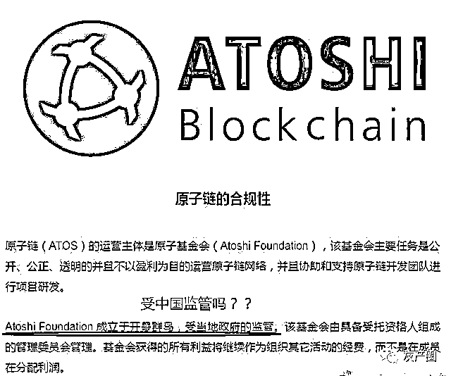

受当地政府监管的原子基金

官网介绍：该基金会主要任务是公开、公正、透明的并且不以盈利为目的运行原子链网络。公开了吗？公正了吗？透明了吗？连公司都隐形得没踪没影，这叫公开公正透明？（透明得看不见也是一种透明？）

口口声声说原子恋公司只是做技术开发的，运行原子币的是开曼原子基金，可作为海外企业发行的原子币，谁给他进入咱国内发行的资格？有许可证吗？有合格证吗？备案了吗？

也许有人说那比特币呢？你见比特币是哪个公司发行的吗？人家比特币没有发行方，币都是靠矿机挖出来的。而且国家明文规定，禁止以比特币进行交易！

笑点七：原子恋“没有”运营原子币

么么哒多次否定注册于国内的原子恋公司运行原子币。这都否认得了？当别人都是傻子吗？

1.原子币是不是原子恋公司一直在反复宣传和推广的？

2.参与者是不是通过原子恋公司宣传下载 APP 和注册的？

3.原子恋公司及么私哒不是一直反复提到“网官”就是 https://www.atoshi.org/ 这个开曼原子基金公司网站吗？

4.原子币是不是都是通过原子恋商城变相售出和送出的？

5.曾经开通了三天提现功能，是不是原子恋公司开通的，提现的钱来自哪个账户？

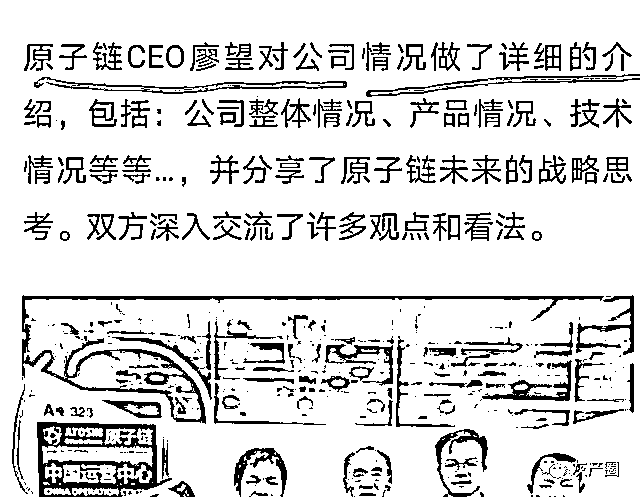

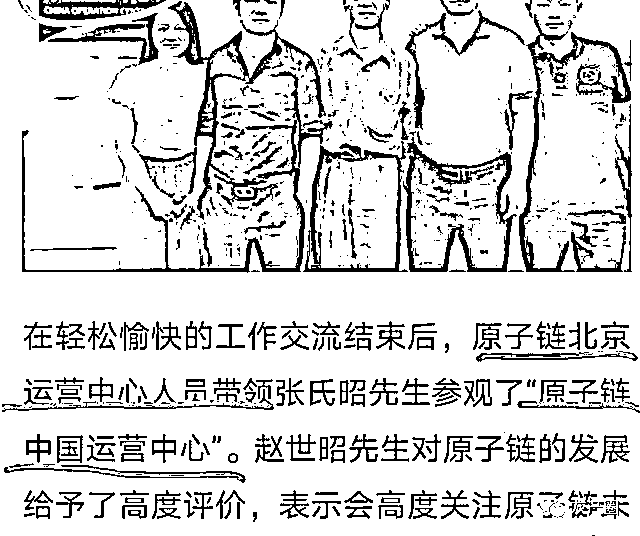

6.原子链运营中心是谁在运营？开曼原子基金？它在咱国内注册了吗？有经营许可吗？

.......

否认原子恋参与原子币的运行，玩小孩过家家呢？

笑点七：去中心化

么么哒直指比特币“算力过于集中于寡头矿池”不够去中心化，宣称原子币更加“去中心化”更先进......果真如此吗？

1.原子币并不存在真正的“挖矿”。所有的币都是创币时已经秒生成的，所以，参与者注册、拉人头、在原子恋商城上购物，么么哒至今都是无限量地“免费”赠送原子币，如果不是创币时就已经全部生成，试问么么哒是如何一下子“挖”出这么多币送给人家的？

发行总量分配表

2.关注原子币项目的人，很多人都看过上面这张图，这是原子币官网早期宣传时就公开发布过的。上面明确规定 1000 亿枚，原子币，基金会、合作方、创始团队独占 60%！剩下的社区奖励、捐赠和公开发售，要奖给谁，售给谁，也都由发行者说了算，币圈还有比这更大的“中心”吗？（此图也打脸了手机挖币：币的分配根本就没有留给“挖币”的份！）

3.所谓的手机端“挖币”只不过是近似于消消乐一样的游戏，“挖币”效率靠的不是算力，而是么么哒团队发明的“原力”。“原力”越多，“挖币”效率越高，而“原力”的多少还要看你在原子恋商城上购物的多少。也就是说，创币方控制所有原子币的出口不说，还控制每台手机的“算力”！有这样的去中心化吗？

4.不仅如此，么么哒团队还可以让所谓限量的原子币，瞬间变成 10 倍，也可以让持币人手中的币部分冻结，不带眨眼那种！（不知大家有没有想过，某种货币突然变 10 倍，会是什么后果？）

每个人手上的币可突然变成 10 倍

笑点八：免费送币

么么哒一直称原子币从未出售，都是免费“送”的。比如早期你要花钱向他购买原子币，对不起，他会要求你先备注钱是“捐助”的，他才“免费”赠送“等额”原子币给你。

“免费”获得原子币的方式还有：注册、发展他人注册、在原子恋商城上购物等。如在原子恋商城上购买一块 3800 元的手表，则可“免费”获得 18 万多（最高时是 20 多万）枚原子币和 3800“原力”。

原子恋商城上的“定制”款手表

而除了 LOGO，外观完全一样的表在某宝上却只卖 218 元。原子恋商城上贵了 2582 元，而拿 2582 元除以赠送的原子币的数量，则等于 0.0197....大体与当时的官网上的原子币的价格相当，很神奇吧！

某宝上的原版手表

上原子恋商城浏览就会发现，上面的商品基本上都是打着其商标的“定制”款，知道为什么不标注原品牌和原型号吗？你猜！

笑点九：囤币

前面说过，么么哒一直宣称原子币都是免费送的，同时也不止一次说过，原子币将会升值，甚至可能升值上万倍，他要求持币人囤币，甚至还公然说“你卖嘛，有一天你会拍大腿的”

增长上万倍时有风险

（上图）由么么哒发起创立的“国际货币自由组织”官方的风险提醒：原子币增长上万倍的同时是有风险的....如果赚了上万倍，你 1 万变成 1 亿，你谱写了财富传奇......。看得我都心动不已

“手上的币就相当于股权”利害吧！

我就纳闷了，既然原子币将来这么值钱，为什么么么哒自己不囤？为什么还要将“股权”免费送人？他不想赚钱吗？就算不囤币，将来能升值上万倍，现在打个折以 5000 倍、1000 倍、500 倍卖出去不香吗？

就算不卖币，开通提现功能也好啊，别人提现么么哒不就能收到更多的原子币了吗？万一将来升值上万倍呢，不是可以买下地球了吗.....看来么么哒是个视金钱如粪土的人

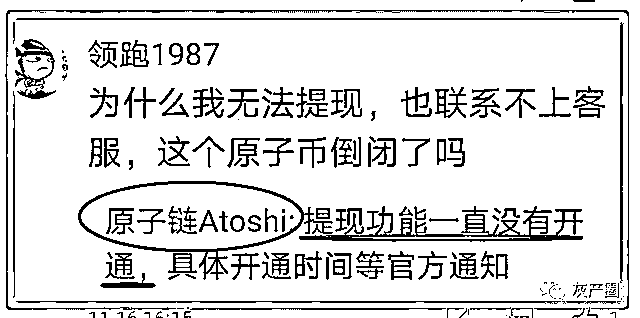

“官方”承认提现功能没开通（后来开通了三天）

为何么么哒要别人囤币而自己却免费赠送？懂原因的朋友可在评论区留言。

笑点十：涨、涨、涨

原子币自从创币以来，其官网上的价格不断上涨。我就奇怪了，原子币不是只送不卖吗，既然没有买卖，哪来的价格及价格变化？

早期的原子币价格

有人说，有场外交易啊！不是开通红包功能了吗？那我也纳闷啊，原子恋商城上有免费的币赠送，为什么还有人愿花钱去场外购买？在原子恋商城上花个 3800 块买个表，再把表卖了白得 18 万枚原子币不香吗？

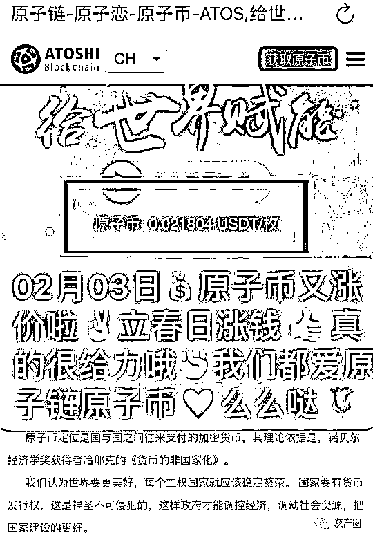

最近的原子币价格

放着免费的不领而花钱去购买原子币的人，到底是什么想的？！懂的朋友可在评论区告知。

只送不卖的原子币为何一直不断地稳定地“升值”，其实么么哒已经说明了原因（见下图）：根据持币人数、推广情况和技术进步，不断提价（提价、提价、提价），当原子币在官方网站上卖 1 块钱一枚的时候，投资 1 万（我也搞不明白，不是免费送币吗，何来投资？）就是 100 万.....

不断提价

不断提价--就是这么终结美元霸权的？

自该项目运行以来，“免费”送出来的原子币已经有数百亿枚了吧（按其说的已经近 600 万注册用户算，注册 1 人送 2000 枚原子币，光算这一项就已经送出近 120 亿枚，还没算购物动不动就送 10 几 20 万枚的）。币一直在不断地大量地增加，从来没有出现供不应求，么么哒是依据什么理论给原子币提价的呢？懂的朋友欢迎在评论区留言。

笑点十一：神奇的运作

官网上及么么哒微博上不止一次地提到：原子币全球出售筹来的资本，除去研发和运营费用，剩余资本的 50%用来投资各种加密货币，20%做天使投资，30%高潜力股票。每年投资利润 30-50% 用来回购原子币。也就是说卖原子币---将赚到的钱投资其他项目---投资其他项目赚的钱再回购原子币-----再卖币----再投资---再回购.....这是什么神操作？

官方上

如果原子币将升值 1 万倍，你还卖原子币转去投资股票等项目？投资股票等项目赚的钱，抵上得同一时间原子币的升值吗？这神操作到底是想说原子币值钱呢还是不值钱呢？

同样神奇的操作还有：1:10 映谢（增加 10 倍）和 冻结原子币（用户越多数量越少）

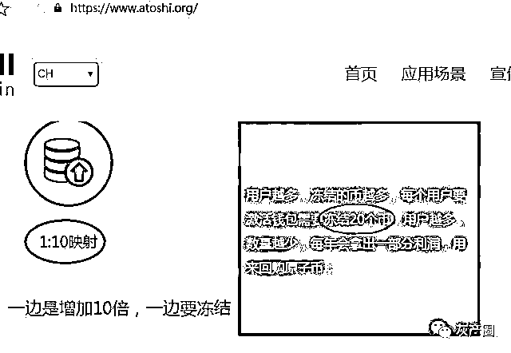

十倍映射与冻结原子币

“原子链团队”提醒参与者可场外交易

这些都是什么神操作？懂的朋友欢迎在评论区留言。

其他笑点还有“打造十倍阿里""成立国际组织""原子基金公司不以营利为目的"等等。

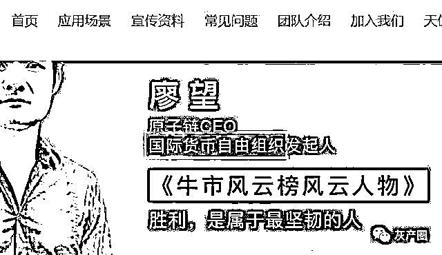

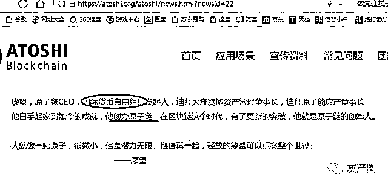

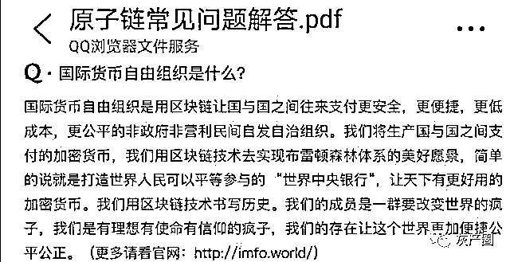

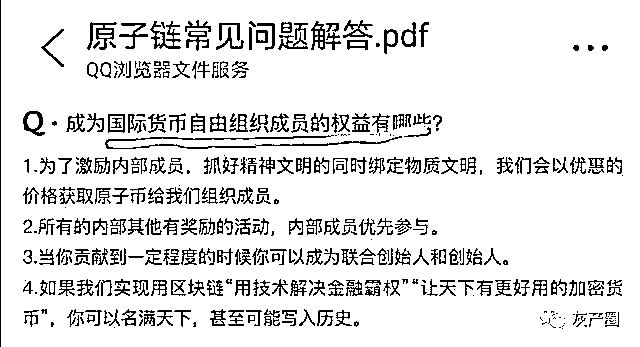

说开曼原子基金不以盈利为目的，官网上又说每年的第一季度公布原子链上年度的利润情况......嗯，两年过去了,公布过运营利润了吗？

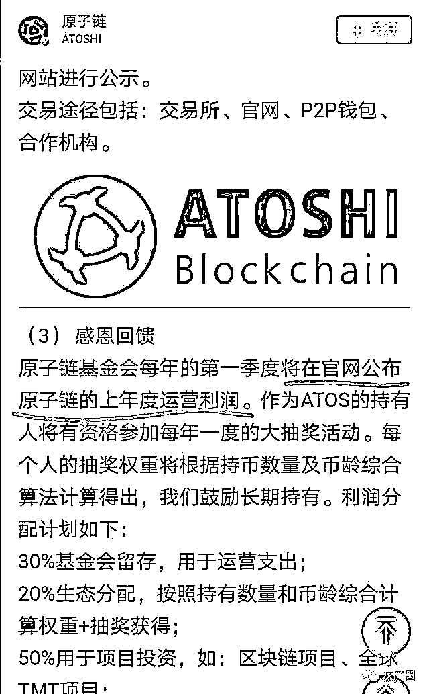

其他笑点，由于篇幅所限不再累述。

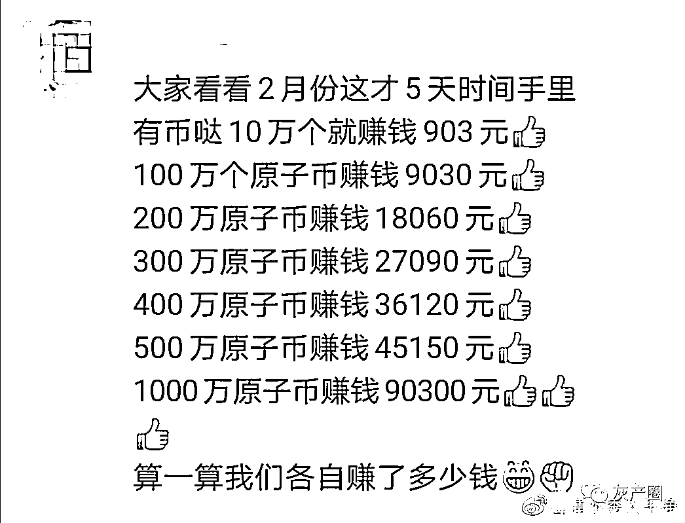

算盘打得噼啪响

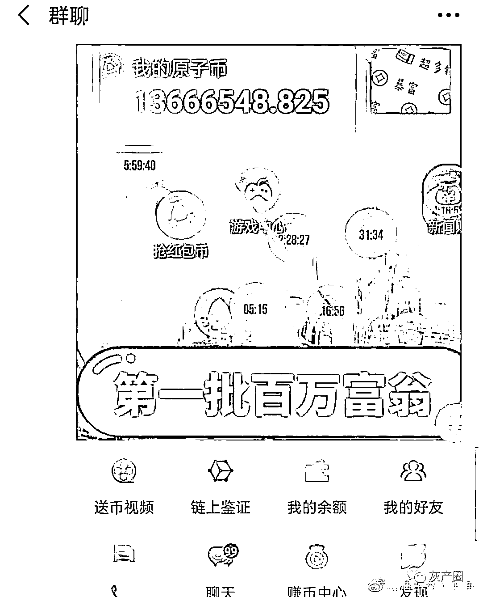

百万富翁

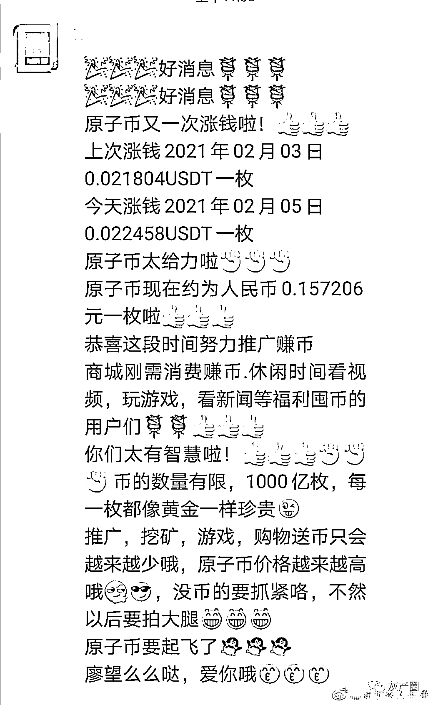

再不押房贷款投就等着拍大腿吧

在我看来，这个项目更像是一个完全没有考虑好和准备好就匆忙组织实施的小孩过家家游戏，所不同的是，这个过家家游戏，是投入真金白银去玩的，有的甚至是把棺材本都投进去了。想想也理解，马克思曾说：“50%的利润能使人铤而走险；100%的利润能使人践踏法律；300%的利润能使人敢于犯任何罪行包括冒杀头危险。”，他们可是认为原子币将升值上万倍呢，想想得有多少倍的利润！所以有些参与者不惜与妻子离婚、与子女断绝关系也要玩原子币，也就可以理解了。

来源：微博@山清水秀人干净，传销摧毁者

← 向右滑动与灰产圈互动交流 →

