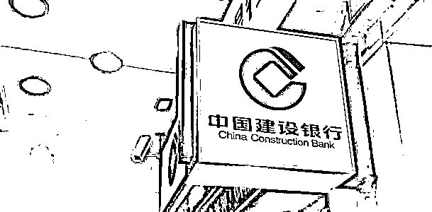

# 行长也懵了！男子在银行网点遭遇 95533 短信诈骗！

> 原文：[`mp.weixin.qq.com/s?__biz=MzIyMDYwMTk0Mw==&mid=2247509136&idx=4&sn=43d6dbe1369039768c0dea0ee7147fcc&chksm=97cb6fa8a0bce6be4ab0072c9b411c0dbf6cc2e7311d95d6dadc3fdfe6b260741b14922a5070&scene=27#wechat_redirect`](http://mp.weixin.qq.com/s?__biz=MzIyMDYwMTk0Mw==&mid=2247509136&idx=4&sn=43d6dbe1369039768c0dea0ee7147fcc&chksm=97cb6fa8a0bce6be4ab0072c9b411c0dbf6cc2e7311d95d6dadc3fdfe6b260741b14922a5070&scene=27#wechat_redirect)

万万没想到，消费者竟然在银行网点遇到了冒充银行短信的诈骗，而工作人员都辨别不出真假！

2020 年 12 月 20 日，在郑州一家公司当会计的窦先生收到了 95533 发的一条短信，说他身份信息过期要去认证。由于担心被骗，窦先生来到中国建设银行华南城支行咨询，经建设银行大堂经理确认，窦先生点开了短信里的链接，没想到前后不到 10 分钟，账户里的 11430 元瞬间被转走了！对此，建设银行华南城支行行长表示，让窦先生直接走司法途径。

无独有偶，据河南广电总台《大参考》栏目近日报道，郑州的李先生也因为收到一条“建设银行 95533”发来的短信，银行卡里的钱瞬间被转走。

[`mp.weixin.qq.com/mp/readtemplate?t=pages/video_player_tmpl&action=mpvideo&auto=0&vid=wxv_1729590204983803909`](https://mp.weixin.qq.com/mp/readtemplate?t=pages/video_player_tmpl&action=mpvideo&auto=0&vid=wxv_1729590204983803909)

视频来源自微博

“我做梦都没想到，收到建设银行官方 95533 发的一条信息，结果卡里 22800 元就被诈骗的不翼而飞，就剩下 9 毛 8”。李先生表示，1 月 14 号上午，他收到 95533 发来的一条短信，短信内容显示：“你在建设银行留存的身份信息已过期，需登陆短信中的网址进行认证”。李先生信以为真，立即点进短信中的网址，完成了修改密码等操作。

没想到，根据提示操作完之后，1 月 28 日，朋友转账到李先生的银行卡 2 万 3 千元，然后很快这笔钱就被分多笔转走，这让李先生非常纳闷，他再次点了短信提供的网址，发现网页已无法显示，当他调取了手机银行登录信息之后，更让他大吃一惊。

“从 1 月 14 号网站登录之后，我的手机银行一直被一个 VIVO 的手机用户登录，昨天去跟建行的银行主管见面了，主管说这种信息银行是不可能发的，但是我的手机短信上明明是 95533 发的信息”，李先生说。

通过建行 95533 发来的短信登录网站，竟然还能遭遇诈骗，那这个网站和建设银行到底是什么关系？

据了解，**上述两个案例都可能属于“伪基站”诈骗，即诈骗分子利用伪基站及改号软件，伪装银行或中国移动等服务机构的客户服务号码向客户发送类似比如说客户身份证过期冻结账户、银行要升级、信用卡要给你提高额度、银行个人信息核实认证、积分兑换等等这种内容的诈骗短信**，短信中一般带有钓鱼网址或者电话，因短信发送号码与相关的正式的服务机构客服号码完全一样，所以极具迷惑性，客户也很容易上当受骗。

诈骗分子的最终目的显而易见的，就是**想方设法套取客户的个人身份、银行账户以及交易验证码等私密信息，盗取客户资金**。

值得注意的是，“伪基站”是无线电发射设备的一种，成品生产必须由国家批准，并且必须经国家、地方批准后才可以使用。但由于全球移动通信系统是公开的技术，而设备零部件模块很多国家都没有纳入管理，只对成品有所规定，这就导致“伪基站”的研发与组装都处于十分容易的状态。

对此，**建设银行提醒用户称，95533 短信发送内容不包含网址链接。**客户如收到类似诈骗信息，请认真核实建行官方正确网址，必要时联系该行进行确认。银行将积极、坚决配合公安机关严厉打击电信诈骗行为，群策群力守护客户资金安全。

建设银行还从四大方面对用户识别、防范“伪基站”诈骗支招：

**首先要从“形式”上辨别诈骗**，这类短信发送号码经过伪基站改号器伪造自称“95533”，容易造成识别上的混淆；因此要仔细辨别短信的内容，如果短信内容中要求登录网站，比如 a.ccbt.icu，就可以准确判定为诈骗短信，建行 95533 号码发送的所有短信均不带任何形式的链接。

**其次是从“内容”上识别诈骗**，这类短信会提示客户身份证过期冻结账户、银行要升级、信用卡要给你提高额度、银行个人信息核实认证、积分兑换等等内容，看到这些字眼就要提高警惕了，可通过建行网点或拨打官方电话 95533 进行核实。

**第三是从“操作”上预防诈骗**。如果不小心点击了网址，对方要求你提供个人身份信息、银行账户、交易密码、短信验证码等各类信息，就要立即停止操作，不要在任何可疑网站、QQ 聊天、微信对话中留有个人身份、银行账户、密码等这些很重要的私密信息;银行、第三方支付机构等发来的"短信验证码"是非常重要的交易验证信息，绝对不能向任何机构和个人透露，任何索取均为诈骗。

**第四是从“行动”上阻击诈骗**。万一上当受骗，要立即向公安机关报案。

此外，对于利用“伪基站”诈骗的行径，公安部有关负责人曾表示，利用“伪基站”设备实施违法犯罪严重危害国家通讯安全，扰乱社会公共秩序，损害群众合法权益。公安机关将始终保持严打高压态势，什么犯罪突出、群众反映强烈，就打击什么犯罪，坚决维护人民群众的切身利益。

公安部同时提醒，人民群众应提高警惕，避免上当受骗。在发现使用“伪基站”设备实施违法犯罪行为时，应及时向当地公安机关报警。****█****

来源：新浪金融研究院

← 向右滑动与灰产圈互动交流 →

