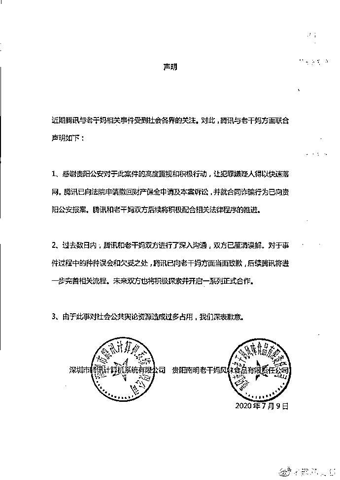

# “逗鹅”的代价！冒充老干妈骗走腾讯 1600 万，最新进展来了！

> 原文：[`mp.weixin.qq.com/s?__biz=MzIyMDYwMTk0Mw==&mid=2247509195&idx=1&sn=6fbec51aa1d83f7060192ddd993ea88b&chksm=97cb6ff3a0bce6e55237896948128664c0bf6b65248eae44b7cb56c9454c21807dba459a800e&scene=27#wechat_redirect`](http://mp.weixin.qq.com/s?__biz=MzIyMDYwMTk0Mw==&mid=2247509195&idx=1&sn=6fbec51aa1d83f7060192ddd993ea88b&chksm=97cb6ff3a0bce6e55237896948128664c0bf6b65248eae44b7cb56c9454c21807dba459a800e&scene=27#wechat_redirect)

    此前报道：

   [老干妈 KO 腾讯火爆事件背后，竟然是年入百万的灰色产业链！](http://mp.weixin.qq.com/s?__biz=MzIyMDYwMTk0Mw==&mid=2247501095&idx=1&sn=f983f541f9d52aa7976d0136c8acdb21&chksm=97cb0e1fa0bc87091a8844983e3da02dceaee67ed47e99db9906a40c592a72f890878b71bd9c&scene=21#wechat_redirect)

“逗鹅冤”有了新进展。

2021 年 2 月 7 日，贵阳市南明区人民检察院依法将冒充“老干妈”公司工作人员行骗的曹某等三人向贵阳市南明区人民法院提起公诉。

冒充老干妈员工的三人 

以合同诈骗罪追究刑事责任

## 2020 年，轰动全网冒充老干妈员工骗了腾讯 1624 万的三人，有了最新进展。

## 2021 年 2 月 7 日，贵阳市南明区人民检察院依法将冒充“老干妈”公司工作人员行骗的曹某等三人向贵阳市南明区人民法院提起公诉。 

检察机关在审查起诉阶段，依法告知了被告人曹某、郑某君、刘某利享有的诉讼权利，依法讯问了被告人，并听取了辩护人意见。贵阳市南明区人民检察院起诉书指控：被告人曹某、郑某君、刘某利以非法占有为目的，在签订、履行合同过程中，冒充“老干妈”公司员工骗取腾讯公司财物，数额特别巨大，依法应当以合同诈骗罪追究三被告人刑事责任。

事件回顾

6 月 30 日，广东省深圳市南山区人民法院在 4 月发布了一则民事裁定书，原告方为深圳市腾讯计算机系统有限公司，被告方贵阳南明老干妈风味食品销售有限公司及贵阳南明老干妈风味食品有限责任公司。

裁定书显示，原告向法院提出财产保全的申请，请求查封、冻结被告贵阳南明老干妈风味食品销售有限公司、贵阳南明老干妈风味食品有限责任公司名下价值人民币 1624.06 万元的财产，担保人新疆前海联合财产保险有限公司深圳分公司和中国人民财产保险股份有限公司深圳分公司联合为本案财产保全提供信用担保。

广东省深圳市南山区人民法院称，原告的申请符合法律规定，裁定查封、冻结被告贵阳南明老干妈风味食品销售有限公司、贵阳南明老干妈风味食品销售有限公司名下价值 1624.06 万元的银行存款或查封、扣押其等值的其他财产。

裁判文书仅称，腾讯诉老干妈此案是因为服务合同纠纷，腾讯方面暂未披露其他更具体原因。

6 月 30 日，腾讯公司介绍称，此事系老干妈在腾讯投放了千万元广告，但无视合同长期拖欠未支付，腾讯被迫依法起诉，申请资产保全，法院裁定冻结对方企业账户。

然而，6 月 30 日晚间，老干妈表示，收到上述文书后，公司给予高度重视并立即开展调查，“经核实，我司从未与腾讯公司或授权他人与腾讯公司就‘老干妈’品牌签署《联合市场推广合作协议》，且我司从未与腾讯公司进行过任何商业合作。”

该回应一出，轰动全网。腾讯也自嘲：自己是个傻白甜。

随后，贵阳公安双龙分局发布通报称：近日，我局接贵阳南明老干妈风味食品有限责任公司(以下简称“老干妈公司”)报案称：有不法人员冒充该公司名义与深圳市腾讯计算机系统有限公司(以下简称“腾讯公司”)签订合作协议，导致被腾讯公司起诉。

经我局初步查明，系犯罪嫌疑人曹某(男，36 岁)刘某利(女，40 岁)、郑某君(女，37 岁)伪造老干妈公司印章，冒充该公司市场经营部经理，与腾讯公司签订合作协议。其目的是为了获取腾讯公司在推广活动中配套赠送的网络游戏礼包码，之后通过互联网倒卖非法获取经济利益

目前，曹某等 3 人因涉嫌犯罪已被我局依法刑事拘留。案件正在进一步办理中。

**腾讯和老干妈厘清误解** 

**并当面致歉**

误会解开了，腾讯跟老干妈最后还是握手言和了。

腾讯公司 7 月 10 日发布消息称，腾讯老干妈握手言和。近期腾讯与老干妈相关事件受到社会各界的关注。对此，腾讯与老干妈方面联合声明如下：

1、感谢贵阳公安对于此案件的高度重视和积极行动，让犯罪嫌疑人得以快速落网。腾讯已向法院申请撤回财产保全申请及本案诉讼，并就合同诈骗行为已向贵阳公安报案。腾讯和老干妈双方后续将积极配合相关法律程序的推进。

2、过去数日内，腾讯和老干妈双方进行了深入沟通，双方已厘清误解。对于事件过程中的种种误会和欠妥之处，腾讯已向老干妈方面当面致歉，后续腾讯将进一步完善相关流程。未来双方也将积极探索并开启一系列正式合作。

3、由于此事对社会公共舆论资源造成过多占用，我们深表歉意。 

来源：中国基金报

← 向右滑动与灰产圈互动交流 →

