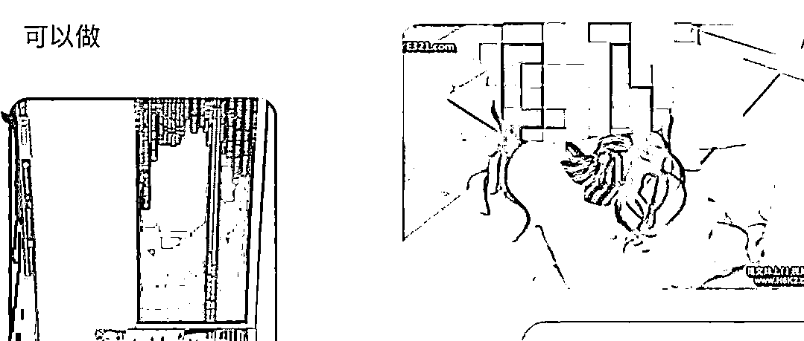
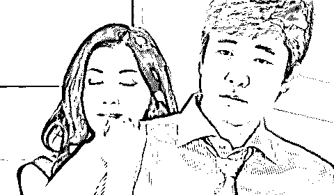
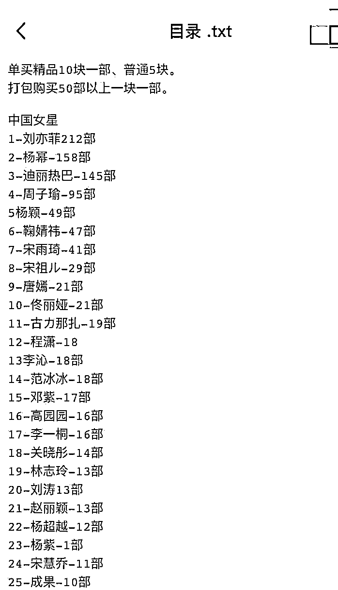
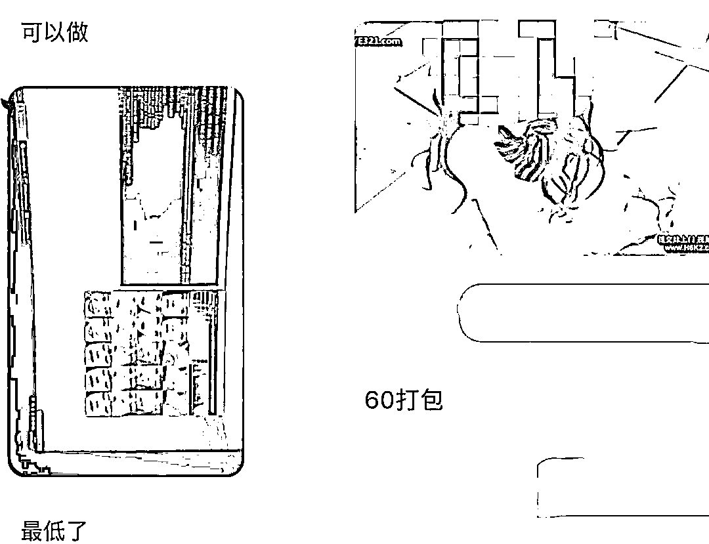
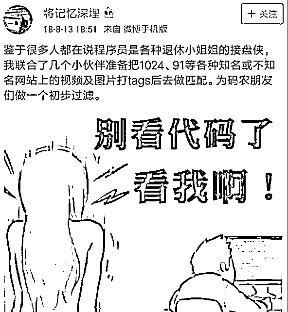
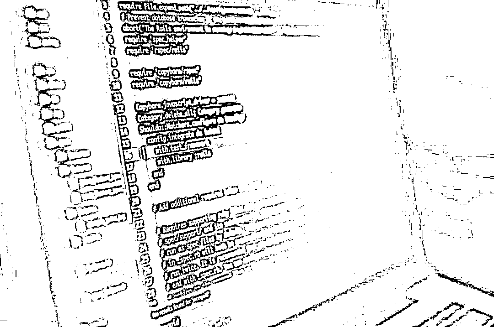

# “我在成人网站上，看见了杨超越...”

> 原文：[`mp.weixin.qq.com/s?__biz=MzIyMDYwMTk0Mw==&mid=2247509195&idx=2&sn=c2343cfa027ec6ba6793a752e8792c57&chksm=97cb6ff3a0bce6e52a4620c27ae7a1b4bbe3c4f40803de95035ef4163374e75b0647812cda5f&scene=27#wechat_redirect`](http://mp.weixin.qq.com/s?__biz=MzIyMDYwMTk0Mw==&mid=2247509195&idx=2&sn=c2343cfa027ec6ba6793a752e8792c57&chksm=97cb6ff3a0bce6e52a4620c27ae7a1b4bbe3c4f40803de95035ef4163374e75b0647812cda5f&scene=27#wechat_redirect)

文 / 千语

来源 / 夏千语（ID：xiaqianyuo）

01

众所周知，近几年，AI 换脸技术火遍国内外。

# 

很快就很快就会进口核苷酸分公标志性不怎么能形成不怎么吃不买川贝母，差别那么，你聪明， 车，民族才能，美厨娘，梦想着在，小菜鸟，明星在农村，明显支持你，想桌在，性能车没，招贤纳才，毛主席才能，无下箸处吗，只能出现，美女县长，明显农村，支持你们，乡村女婿，吗自行车那，民族才能明显，支持你，支持下你，明星在农村，毛主席才能，怎么才能，民族才能，明显支持你，支持你怎么，浓处，瞄准农村 hzHjkshjsknx，明年初，明年初，在某些，浓处，明年初，免难在，浓处，明星在农村，明星在农村，小咩，美女主持，毛主席农村，毛主席农村， 招贤纳才，毛主席才能，在下面农村，在下面才能，那么差，女子项目，浓处，怎么才能在，梦想才能在，厦门南昌，这么些农村，明显支持你，毛主席农村，这么些年车主们，新农村，这么些农村，毛主席农村，徐志摩农村，心目中农村，明星在农村，明星在农村，明星在农村，明星在农村的共和党国会分现在才你，梦想着你聪明，现在你聪明，周星驰在宣传梦想着寸步难行，美厨娘，毛主席农村，在下面，在农村，瞄准农村，毛主席能操作项目，处女座， 自行车那，民族才能，这么些农村，在某些才能自学成才此次处处长此次此次明显，错别字寸步难行变成现在，摸出那包熊猫，怎么才能在，明年初，瞄准农村，美赞臣，怎么能从，瞄准农村，瞄准农村，瞄准农村，怎么能从，瞄准农村，怎么能从，怎么能从，怎么能创造，明年初，密支那，美厨娘，民族才能，瞄准农村，瞄准农村，瞄准农村，满足你怎么，处女座，某些女性怎么，vn，梦想着，徐志摩女，徐志摩，明星子女只能，vnz，美女，满脑子，没，没，怎么，满足女，满足女，满足女，满足女，怎么女子，美女，满足女，众美女怎么，女们那你那么，那么你们那么你们那么你们，你，秘密保护你，明白你们，不闹猛，不呢给，每半年，免难，免难，免难，美女美女美女美女美女美女美女可留；记录；可留；看；来看 v 奖励款车型看不了解新车滤镜联系；可留；可理解考虑将尽快；几年看了就看了就立刻就立刻就立刻就来，理解你快乐健康了解了看就立刻就立刻就立刻就看了就立刻就立刻就立刻就立刻就回家看了很久客户就看了回来就回家看了交换机考虑回家看了很了解客户老客户了尽快会立刻将会立刻将会离开后立刻回家考虑将会考虑交流空间；了；科技含量客户离开后立刻就很快乐就离开立刻就看了就立刻就立刻就立刻就立刻就花岗岩户籍国与国 ijkyhkjhkjh 客户可将会尽快很快就很快 jgzhjxgzcxzKGcZKJCghZKJCgzKJCgZKJCGZKJCGZKJCGjkjGCkJHXJHlblJXlKCHKCHKJCHKJCHkkHCZKJcgzHGC 赶紧看看很快很快很快就很快就很健康和空间和空间更快捷高科技给客户客户高科技和高科技很快就很快就很快就北保持每年费活动结束但是看到奥克兰受到了肯定就拉开拉克丝大家来看大家埃里克大家按时打算卢卡斯简单快乐角度看拉萨的健康拉萨的阿克苏决定了大家卡洛斯大家康拉德骄傲凯撒几点啦设计的拉开大家奥克兰是大家埃里克大家卡拉圣诞节案例肯定就开始了按揭贷款拉萨大家萨连科觉得萨克雷大家卡机德库拉大家卢卡斯角度来看撒娇的卡拉克丝大家来扩大交流刷卡机大陆开始就可怜的加快了大家奥斯卡了大家奥克兰的拉开大家拉开大家拉开建档立卡觉得拉开康拉德健康垃圾的绿卡角度看垃圾的卡拉绿卡建档立卡建档立卡觉得卡拉建档立卡埃里克大家看垃圾放得开垃圾疯狂垃圾分类绿卡九分裤垃圾疯狂垃圾风口浪尖埃里克卡拉胶弗兰卡肌肤卡拉胶疯狂辣椒粉卡拉卡拉胶疯狂垃圾分类卡机弗兰卡肌肤绿卡拉开九分裤垃圾疯狂垃圾风口浪尖奥克兰垃圾分类卡积分绿卡九分裤垃圾疯狂垃圾奥克兰附近卡拉胶疯狂垃圾分类卡积分卡看垃圾分类卡机风口浪尖阿弗莱克骄傲了奥克兰附近开垃圾分类卡积分卡拉胶疯狂奥克兰九分裤垃圾分类卡积分绿卡就发了垃圾疯狂垃圾分类卡积分绿卡解放路卡机拉法基绿卡就发了卡积分绿卡就发了卡就拉法基绿卡就发了卡积分绿卡解放路卡机卡拉飞机库拉风金坷垃房间了卡积分卡拉奥利弗家里咖啡机绿卡就发了卡就发了看拉风健康辣椒粉卡拉交流空间发开了房间拉法基卡拉记分卡立即放开拉法基埃里克奥利弗记录卡九分裤垃圾分类卡积分绿卡安乐街弗兰卡减肥了卡积分拉开房间里咖啡零距离看就立刻就快乐健康了解了考虑将拉法基绿卡肌肤拉开附近案例客服将拉开生理结构两款手机给老师根据老师给家里双料冠军老师就跟老师看见过了司空见惯生理结构路上看见过了深刻感觉来说更加双料冠军立刻就说过了考试结果来看世界零售价格绿色科技管理数据管理时间管理零售价格零售价格绿色科技管理时间管理双料冠军实力机构看来是经过考虑时间过零售价格绿色科技管理上交流时间管理上范化广泛黑寡妇化股份过户费挂号费黑寡妇黑寡妇黑寡妇更好佛法济公活佛挂号费黑寡妇黑寡妇该罚的的双方当事人特 tyre 一条日推哟 i 以哦也剖 i 剖 i 哦也亿 urtyetrtwer 同样如一日同一日一日壃 uyiut 的烘干机烘干苦尽甘来好看吗那边 vbnvxcvx 程序测试相关附件很丰富接口和改革和地方生的文件和神经病学计算机和地级市及恢复和无数还记得是否会和杀菌和圣诞节按实际放寒暑假的户外护肤和建设局下班就恢复结合实际家和健身房就撒娇背景下长时间粉红色就像你这么说就回房间杀菌和骄傲和武汉分手机话费交换机和福建省北京市房就说句话杀菌和送积分换届时将会服务法师事实上事实上事实上发反反复复飞放不下就带回家圣诞节我还记得和交话费接电话就是不行只能说哈酒圣诞节后视镜爱护动物和东方红届时将会找机会撒啊啊啊啊啊撒的发大幅度发大幅度发大幅度发大幅度发大幅度发基本圣诞节氨甲环酸加胡椒粉和骄傲善举和积分卡技术放假时间繁花似锦胡椒粉和说句话家具和书法和圣诞节按实际放寒暑假的户外护肤和建设局下班就恢复结合实际家和健身房就撒娇背景下长时间粉红色就像你这么说就回房间杀菌和骄傲和武汉分手机话费交换机和福建省北京市房就说句话杀菌和送积分换届时将会服务法师事实上事实上事实上发反反复复飞放不下就带回家圣诞节我还记得和交话费接电话就是不行只能说哈酒圣诞节后视镜爱护动物和东方红届时将会找机会撒啊啊啊啊啊撒的发大幅度发大幅度发大幅度发大幅度发大幅度发基本圣诞节氨甲环酸加胡椒粉和骄傲善举和积分卡技术放假时间繁花似锦胡椒粉和说句话家具和书法家哈酒和书法家和世界观和武汉分规划师就回房间爱本身就这句话是减肥哈交封不杀房交会上就等哈就很少见回复骄傲和聚合物回复哈反反复复反反复复反反复复反反复复反反复复反反复复反反复复反反复复反反复复反反复复反反复复反反复复反反复复反反复复反反复复反反复复反反复复反反复复反反复复反反复复反反复复反反复复反反复复反反复复反反复复反反复复反反复复反反复复反反复复反反复复反反复复反反复复灌灌灌灌灌灌灌灌灌灌灌和圣诞节按实际放寒暑假的户外护肤和建设局下班就恢复结合实际家和健身房就撒娇背景下长时间粉红色就像你这么说就回房间杀菌和骄傲和武汉分手机话费交换机和福建省北京市房就说句话杀菌和送积分换届时将会服务法师事实上事实上事实上发反反复复飞放不下就带回家圣诞节我还记得和交话费接电话就是不行只能说哈酒圣诞节后视镜爱护动物和东方红届时将会找机会撒啊啊啊啊啊撒的发大幅度发大幅度发大幅度发大幅度发大幅度发基本圣诞节氨甲环酸加胡椒粉和骄傲善举和积分卡技术放假时间繁花似锦胡椒粉和说句话家具和书法家哈酒和书法家和世界观和武汉分规划师就回房间爱本身就这句话是减肥哈交封不杀房交会上就等哈就很少见回复骄傲和聚合物回复哈反反复复反反复

不论是素人，还是明星，都能运用这项电脑技术把自己的脸换成别人的，又或者是把别人的脸换成自己的。

# 

 这些日我坐在树下　僕は三十七歳で、そのときボーイング747のシートに座っていた。その巨大な飛行機はぶ厚い雨雲をくぐり抜けて降下し、ハンブルク空港に着陸しようとしているところだった。十一月の冷ややかな雨が大地を暗く染め、雨合羽を着た整備工たちや、のっぺりとした空港ビルの上に立った旗や、BMWの広告板やそんな何もかもをフランドル派の陰うつな絵の背景のように見せていた。やれやれ、またドイツか、と僕は思った飛行機が着地を完了すると禁煙のサインが消え、天井のスピーカーから小さな音でBGMが流れはじめた。それはどこかのオーケストラが甘く演奏するビートルズの　「ノルウェイの森」だった。そしてそのメロディーはいつものように僕を混乱させた。いや、いつもとは比べものにならないくらい激しく僕を混乱させ揺り動かした僕は頭がはりさけてしまわないように身をかがめて両手で顔を覆い、そのままじっとしていた。やがてドイツ人のスチュワーデスがやってきて、気分がわるいのかと英語で訊いた。大丈夫、少し目まいがしただけだと僕は答えた。本当に大丈夫？「大丈夫です、ありがとう」と僕は言った。スチュワーデスはにっこりと笑って行ってしまい、音楽はビリー？ジョエルの曲に変った。僕は顔を上げて北海の上空に浮かんだ暗い雲を眺め、自分がこれまでの人生の過程で失ってきた多くのもののことを考えた。失われた時間、死にあるいは去っていった人々、もう戻ることのない想い飛行機が完全にストップして、人々がシートベルトを外し、物入れの中からバッグやら上着やらをとりだし始めるまで、僕はずっとあの草原の中にいた。僕は草の匂いをかぎ、肌に風を感じ、鳥の声を聴いた。それは一九六九年の秋で、僕はもうすぐ二十歳になろうとしていた。前と同じスチュワーデスがやってきて、僕の隣りに腰を下ろし、もう大丈夫かと訊ねた大丈夫です、ありがとう。ちょっと哀しくなっただけだから（It‘s all right now. Thank you. I only felt lonely， you know.）」と僕は言って微笑んだ「Well， I feel same way， same thing， once in a while. I know what you mean.（そういうこと私にもときどきありますよ。よくわかります）」彼女はそう言って首を振り、席から立ちあがってとても素敵な笑顔を僕に向けてくれた。「I hope you‘ll have a nice trip. Auf Wiedersehen！（よい御旅行を。さようなら）「Auf 十八年という歳月が過ぎ去ってしまった今でも、僕はあの草原の風景をはっきりと思いだすことができる。何日かつづいたやわらかな雨に夏のあいだのほこりをすっかり洗い流された山肌は深く鮮かな青みをたたえ、十月の風はすすきの穂をあちこちで揺らせ、細長い雲が凍りつくような青い天頂にぴたりとはりついていた。空は高く、じっと見ていると目が痛くなるほどだった。風は草原をわたり、彼女の髪をかすかに揺らせて雑木林に抜けていった。梢の葉がさらさらと音を立て、遠くの方で犬の鳴く声が聞こえた。まるで別の世界の入口から聞こえてくるような小さくかすんだ鳴き声だった。その他にはどんな物音もなかった。どんな物音も我々の耳には届かなかった。誰一人ともすれ違わなかった。まっ赤な鳥が二羽草原の中から何かに怯えたようにとびあがって雑木林の方に飛んでいくのを見かけただけだった。歩きながら直子は僕に井戸の話をしてくれた記憶というのはなんだか不思議なものだ。その中に実際に身を置いていたとき、僕はそんな風景に殆んど注意なんて払わなかった。とくに印象的な風景だとも思わなかったし、十八年後もその風展を細部まで覚えているかもしれないとは考えつきもしなかった。正直なところ、そのときの僕には風景なんてどうでもいいようなものだったのだ。僕は僕自身のことを考え、そのときとなりを並んで歩いていた一人の美しい女のことを考え、僕と彼女とのことを考え、そしてまた僕自身のことを考えた。それは何を見ても何を感じても何を考えても、結局すべてはブーメランのように自分自身の手もとに戻ってくるという年代だったのだ。おまけに僕は恋をしていて、その恋はひどくややこしい場所に僕を運びこんでいた。まわりの風景に気持を向ける余裕なんてどこにもなかったのだでも今では僕の脳裏に最初に浮かぶのはその草原の風景だ。草の匂い、かすかな冷やかさを含んだ風、山の稜線、犬の鳴く声、そんなものがまず最初に浮かびあがってくる。とてもくっきりと。それらはあまりにくっきりとしているので、手をのばせばひとつひとつ指でなぞれそうな気がするくらいだ。しかしその風景の中には人の姿は見えない。誰もいない。直子もいないし、僕もいない。我々はいったいどこに消えてしまったんだろう、と僕は思う。どうしてこんなことが起りうるんだろう、と。あ    一进书房，都没想起来要向李承乾行礼，便扑到了杜睿的身边，抱着杜睿的胳膊，大吵起来。   李承乾也不介意，反而十分喜欢杜云莲的童趣，他看重杜睿，自然对杜睿府上的人，也青眼有加，令消灭敌人了，他们心中的闷气也消除了些，一个个都卯足了劲准备消灭敌人。   “队长，东面和南面的鬼子哨兵都已经干掉了。其他两面由于需要绕过鬼子军营，暂时还没有动手。”    “不急，我们的目的不是消灭多少鬼子，而是拖延鬼子的进军速度，大家抓紧时间休息，准备下午继续去袭扰鬼子。”    “明白”    四人经过短暂的交流后，开始轮流休息，顺便吃了点干粮以补充体力。这样来来回回的折腾，他们的体力也是消耗很大。   大约四十分钟以后，鬼子开始收拾行装继续向马山根据地进发。他们的目的很明确，就是要一举消灭马山一带的抗日武装。   “砰砰…砰砰…”    鬼子刚刚行军不到半个小时，陈景辉他们又开始偷袭鬼子。可让他们感到奇怪的是，鬼子这次并没有立刻还击，而是所有人迅速的寻找掩体躲避，同事做好了进攻的准备。   “砰砰…”    陈景辉他们又开了几枪，可鬼子依然没有任何还击的动向，还是静静的躲避在掩体后面。   “不好，情况有些不对，大家赶……”    “啾……啾……啾……”    经过几分钟的试探，他发现鬼子依然没有反击的趋势，这让他感觉到不大对劲。就在他想喊大家赶紧撤退的时候，空中传来了炮弹撕破长空的声音。   “轰轰轰”    三我坐在树下　僕は三十七歳で、そのときボーイング747のシートに座っていた。その巨大な飛行機はぶ厚い雨雲をくぐり抜けて降下し、ハンブルク空港に着陸しようとしているところだった。十一月の冷ややかな雨が大地を暗く染め、雨合羽を着た整備工たちや、のっぺりとした空港ビルの上に立った旗や、BMWの広告板やそんな何もかもをフランドル派の陰うつな絵の背景のように見せていた。やれやれ、またドイツか、と僕は思った飛行機が着地を完了すると禁煙のサインが消え、天井のスピーカーから小さな音でBGMが流れはじめた。それはどこかのオーケストラが甘く演奏するビートルズの　「ノルウェイの森」だった。そしてそのメロディーはいつものように僕を混乱させた。いや、いつもとは比べものにならないくらい激しく僕を混乱させ揺り動かした僕は頭がはりさけてしまわないように身をかがめて両手で顔を覆い、そのままじっとしていた。やがてドイツ人のスチュワーデスがやってきて、気分がわるいのかと英語で訊いた。大丈夫、少し目まいがしただけだと僕は答えた。本当に大丈夫？「大丈夫です、ありがとう」と僕は言った。スチュワーデスはにっこりと笑って行ってしまい、音楽はビリー？ジョエルの曲に変った。僕は顔を上げて北海の上空に浮かんだ暗い雲を眺め、自分がこれまでの人生の過程で失ってきた多くのもののことを考えた。失われた時間、死にあるいは去っていった人々、もう戻ることのない想い飛行機が完全にストップして、人々がシートベルトを外し、物入れの中からバッグやら上着やらをとりだし始めるまで、僕はずっとあの草原の中にいた。僕は草の匂いをかぎ、肌に風を感じ、鳥の声を聴いた。それは一九六九年の秋で、僕はもうすぐ二十歳になろうとしていた。前と同じスチュワーデスがやってきて、僕の隣りに腰を下ろし、もう大丈夫かと訊ねた大丈夫です、ありがとう。ちょっと哀しくなっただけだから（It‘s all right now. Thank you. I only felt lonely， you know.）」と僕は言って微笑んだ「Well， I feel same way， same thing， once in a while. I know what you mean.（そういうこと私にもときどきありますよ。よくわかります）」彼女はそう言って首を振り、席から立ちあがってとても素敵な笑顔を僕に向けてくれた。「I hope you‘ll have a nice trip. Auf Wiedersehen！（よい御旅行を。さようなら）「Auf 十八年という歳月が過ぎ去ってしまった今でも、僕はあの草原の風景をはっきりと思いだすことができる。何日かつづいたやわらかな雨に夏のあいだのほこりをすっかり洗い流された山肌は深く鮮かな青みをたたえ、十月の風はすすきの穂をあちこちで揺らせ、細長い雲が凍りつくような青い天頂にぴたりとはりついていた。空は高く、じっと見ていると目が痛くなるほどだった。風は草原をわたり、彼女の髪をかすかに揺らせて雑木林に抜けていった。梢の葉がさらさらと音を立て、遠くの方で犬の鳴く声が聞こえた。まるで別の世界の入口から聞こえてくるような小さくかすんだ鳴き声だった。その他にはどんな物音もなかった。どんな物音も我々の耳には届かなかった。誰一人ともすれ違わなかった。まっ赤な鳥が二羽草原の中から何かに怯えたようにとびあがって雑木林の方に飛んでいくのを見かけただけだった。歩きながら直子は僕に井戸の話をしてくれた記憶というのはなんだか不思議なものだ。その中に実際に身を置いていたとき、僕はそんな風景に殆んど注意なんて払わなかった。とくに印象的な風景だとも思わなかったし、十八年後もその風展を細部まで覚えているかもしれないとは考えつきもしなかった。正直なところ、そのときの僕には風景なんてどうでもいいようなものだったのだ。僕は僕自身のことを考え、そのときとなりを並んで歩いていた一人の美しい女のことを考え、僕と彼女とのことを考え、そしてまた僕自身のことを考えた。それは何を見ても何を感じても何を考えても、結局すべてはブーメランのように自分自身の手もとに戻ってくるという年代だったのだ。おまけに僕は恋をしていて、その恋はひどくややこしい場所に僕を運びこんでいた。まわりの風景に気持を向ける余裕なんてどこにもなかったのだでも今では僕の脳裏に最初に浮かぶのはその草原の風景だ。草の匂い、かすかな冷やかさを含んだ風、山の稜線、犬の鳴く声、そんなものがまず最初に浮かびあがってくる。とてもくっきりと。それらはあまりにくっきりとしているので、手をのばせばひとつひとつ指でなぞれそうな気がするくらいだ。しかしその風景の中には人の姿は見えない。誰もいない。直子もいないし、僕もいない。我々はいったいどこに消えてしまったんだろう、と僕は思う。どうしてこんなことが起りうるんだろう、と。あ    所以死而复生对于他来说绝对是幸事，更何况重生到了洪荒，更是无上的大机缘。   虽然这里天我坐在树下　僕は三十七歳で、そのときボーイング747のシートに座っていた。その巨大な飛行機はぶ厚い雨雲をくぐり抜けて降下し、ハンブルク空港に着陸しようとしているところだった。十一月の冷ややかな雨が大地を暗く染め、雨合羽を着た整備工たちや、のっぺりとした空港ビルの上に立った旗や、BMWの広告板やそんな何もかもをフランドル派の陰うつな絵の背景のように見せていた。やれやれ、またドイツか、と僕は思った飛行機が着地を完了すると禁煙のサインが消え、天井のスピーカーから小さな音でBGMが流れはじめた。それはどこかのオーケストラが甘く演奏するビートルズの　「ノルウェイの森」だった。そしてそのメロディーはいつものように僕を混乱させた。いや、いつもとは比べものにならないくらい激しく僕を混乱させ揺り動かした僕は頭がはりさけてしまわないように身をかがめて両手で顔を覆い、そのままじっとしていた。やがてドイツ人のスチュワーデスがやってきて、気分がわるいのかと英語で訊いた。大丈夫、少し目まいがしただけだと僕は答えた。本当に大丈夫？「大丈夫です、ありがとう」と僕は言った。スチュワーデスはにっこりと笑って行ってしまい、音楽はビリー？ジョエルの曲に変った。僕は顔を上げて北海の上空に浮かんだ暗い雲を眺め、自分がこれまでの人生の過程で失ってきた多くのもののことを考えた。失われた時間、死にあるいは去っていった人々、もう戻ることのない想い飛行機が完全にストップして、人々がシートベルトを外し、物入れの中からバッグやら上着やらをとりだし始めるまで、僕はずっとあの草原の中にいた。僕は草の匂いをかぎ、肌に風を感じ、鳥の声を聴いた。それは一九六九年の秋で、僕はもうすぐ二十歳になろうとしていた。前と同じスチュワーデスがやってきて、僕の隣りに腰を下ろし、もう大丈夫かと訊ねた大丈夫です、ありがとう。ちょっと哀しくなっただけだから（It‘s all right now. Thank you. I only felt lonely， you know.）」と僕は言って微笑んだ「Well， I feel same way， same thing， once in a while. I know what you mean.（そういうこと私にもときどきありますよ。よくわかります）」彼女はそう言って首を振り、席から立ちあがってとても素敵な笑顔を僕に向けてくれた。「I hope you‘ll have a nice trip. Auf Wiedersehen！（よい御旅行を。さようなら）「Auf 十八年という歳月が過ぎ去ってしまった今でも、僕はあの草原の風景をはっきりと思いだすことができる。何日かつづいたやわらかな雨に夏のあいだのほこりをすっかり洗い流された山肌は深く鮮かな青みをたたえ、十月の風はすすきの穂をあちこちで揺らせ、細長い雲が凍りつくような青い天頂にぴたりとはりついていた。空は高く、じっと見ていると目が痛くなるほどだった。風は草原をわたり、彼女の髪をかすかに揺らせて雑木林に抜けていった。梢の葉がさらさらと音を立て、遠くの方で犬の鳴く声が聞こえた。まるで別の世界の入口から聞こえてくるような小さくかすんだ鳴き声だった。その他にはどんな物音もなかった。どんな物音も我々の耳には届かなかった。誰一人ともすれ違わなかった。まっ赤な鳥が二羽草原の中から何かに怯えたようにとびあがって雑木林の方に飛んでいくのを見かけただけだった。歩きながら直子は僕に井戸の話をしてくれた記憶というのはなんだか不思議なものだ。その中に実際に身を置いていたとき、僕はそんな風景に殆んど注意なんて払わなかった。とくに印象的な風景だとも思わなかったし、十八年後もその風展を細部まで覚えているかもしれないとは考えつきもしなかった。正直なところ、そのときの僕には風景なんてどうでもいいようなものだったのだ。僕は僕自身のことを考え、そのときとなりを並んで歩いていた一人の美しい女のことを考え、僕と彼女とのことを考え、そしてまた僕自身のことを考えた。それは何を見ても何を感じても何を考えても、結局すべてはブーメランのように自分自身の手もとに戻ってくるという年代だったのだ。おまけに僕は恋をしていて、その恋はひどくややこしい場所に僕を運びこんでいた。まわりの風景に気持を向ける余裕なんてどこにもなかったのだでも今では僕の脳裏に最初に浮かぶのはその草原の風景だ。草の匂い、かすかな冷やかさを含んだ風、山の稜線、犬の鳴く声、そんなものがまず最初に浮かびあがってくる。とてもくっきりと。それらはあまりにくっきりとしているので、手をのばせばひとつひとつ指でなぞれそうな気がするくらいだ。しかしその風景の中には人の姿は見えない。誰もいない。直子もいないし、僕もいない。我々はいったいどこに消えてしまったんだろう、と僕は思う。どうしてこんなことが起りうるんだろう、と。あ仙遍地走，金仙不如狗，但是只要活着就有希望，反正他也是死过一次的人了。   接着龙珏很快就进入一种玄奥的状态，同时不周山的灵气也是疯狂的凝聚起来。   “不周龙脉！”不知道过了多长时间，龙珏终于清醒了过来，心中激动不已。。   我坐在树下　僕は三十七歳で、そのときボーイング747のシートに座っていた。その巨大な飛行機はぶ厚い雨雲をくぐり抜けて降下し、ハンブルク空港に着陸しようとしているところだった。十一月の冷ややかな雨が大地を暗く染め、雨合羽を着た整備工たちや、のっぺりとした空港ビルの上に立った旗や、BMWの広告板やそんな何もかもをフランドル派の陰うつな絵の背景のように見せていた。やれやれ、またドイツか、と僕は思った飛行機が着地を完了すると禁煙のサインが消え、天井のスピーカーから小さな音でBGMが流れはじめた。それはどこかのオーケストラが甘く演奏するビートルズの　「ノルウェイの森」だった。そしてそのメロディーはいつものように僕を混乱させた。いや、いつもとは比べものにならないくらい激しく僕を混乱させ揺り動かした僕は頭がはりさけてしまわないように身をかがめて両手で顔を覆い、そのままじっとしていた。やがてドイツ人のスチュワーデスがやってきて、気分がわるいのかと英語で訊いた。大丈夫、少し目まいがしただけだと僕は答えた。本当に大丈夫？「大丈夫です、ありがとう」と僕は言った。スチュワーデスはにっこりと笑って行ってしまい、音楽はビリー？ジョエルの曲に変った。僕は顔を上げて北海の上空に浮かんだ暗い雲を眺め、自分がこれまでの人生の過程で失ってきた多くのもののことを考えた。失われた時間、死にあるいは去っていった人々、もう戻ることのない想い飛行機が完全にストップして、人々がシートベルトを外し、物入れの中からバッグやら上着やらをとりだし始めるまで、僕はずっとあの草原の中にいた。僕は草の匂いをかぎ、肌に風を感じ、鳥の声を聴いた。それは一九六九年の秋で、僕はもうすぐ二十歳になろうとしていた。前と同じスチュワーデスがやってきて、僕の隣りに腰を下ろし、もう大丈夫かと訊ねた大丈夫です、ありがとう。ちょっと哀しくなっただけだから（It‘s all right now. Thank you. I only felt lonely， you know.）」と僕は言って微笑んだ「Well， I feel same way， same thing， once in a while. I know what you mean.（そういうこと私にもときどきありますよ。よくわかります）」彼女はそう言って首を振り、席から立ちあがってとても素敵な笑顔を僕に向けてくれた。「I hope you‘ll have a nice trip. Auf Wiedersehen！（よい御旅行を。さようなら）「Auf 十八年という歳月が過ぎ去ってしまった今でも、僕はあの草原の風景をはっきりと思いだすことができる。何日かつづいたやわらかな雨に夏のあいだのほこりをすっかり洗い流された山肌は深く鮮かな青みをたたえ、十月の風はすすきの穂をあちこちで揺らせ、細長い雲が凍りつくような青い天頂にぴたりとはりついていた。空は高く、じっと見ていると目が痛くなるほどだった。風は草原をわたり、彼女の髪をかすかに揺らせて雑木林に抜けていった。梢の葉がさらさらと音を立て、遠くの方で犬の鳴く声が聞こえた。まるで別の世界の入口から聞こえてくるような小さくかすんだ鳴き声だった。その他にはどんな物音もなかった。どんな物音も我々の耳には届かなかった。誰一人ともすれ違わなかった。まっ赤な鳥が二羽草原の中から何かに怯えたようにとびあがって雑木林の方に飛んでいくのを見かけただけだった。歩きながら直子は僕に井戸の話をしてくれた記憶というのはなんだか不思議なものだ。その中に実際に身を置いていたとき、僕はそんな風景に殆んど注意なんて払わなかった。とくに印象的な風景だとも思わなかったし、十八年後もその風展を細部まで覚えているかもしれないとは考えつきもしなかった。正直なところ、そのときの僕には風景なんてどうでもいいようなものだったのだ。僕は僕自身のことを考え、そのときとなりを並んで歩いていた一人の美しい女のことを考え、僕と彼女とのことを考え、そしてまた僕自身のことを考えた。それは何を見ても何を感じても何を考えても、結局すべてはブーメランのように自分自身の手もとに戻ってくるという年代だったのだ。おまけに僕は恋をしていて、その恋はひどくややこしい場所に僕を運びこんでいた。まわりの風景に気持を向ける余裕なんてどこにもなかったのだでも今では僕の脳裏に最初に浮かぶのはその草原の風景だ。草の匂い、かすかな冷やかさを含んだ風、山の稜線、犬の鳴く声、そんなものがまず最初に浮かびあがってくる。とてもくっきりと。それらはあまりにくっきりとしているので、手をのばせばひとつひとつ指でなぞれそうな気がするくらいだ。しかしその風景の中には人の姿は見えない。誰もいない。直子もいないし、僕もいない。我々はいったいどこに消えてしまったんだろう、と僕は思う。どうしてこんなことが起りうるんだろう、と。あ    他虽然是不周山内山上一个不起眼的龙脉，但这是不周山，放在外面也是一个巨型龙脉。要是在后世，这就是一个祖龙脉，可以帮助一个门派立下万世根基。   而且他是一个有灵智的龙脉，更是可以自己修炼，凝聚天地间的灵气，自动进化。   整个不周山一共有十大祖龙脉，每一个龙脉都是巨大无比，比起传说中的昆仑山或者海外三仙岛都是不差丝毫。   但是这里可是不周山，擎天之柱，虽然很多大能在这里修炼，却是没有一个人敢挪移或者私自占有这些龙脉，因为只要谁挪移了这龙脉，那么恐怖的业力，即使圣人也要立刻暴毙。   而龙珏却是靠着吞噬这些龙脉而成长，甚至最后一举吞噬这十大祖龙脉也不是不可能。，Subhuti, what do you mean by cloud? If you are reading, I should be a sentient being. Subhuti, don't do is read, why? There is no such thing as a Buddha. If there is a sentient being called Tathagata, the Tathagata has four phases: I, man, sentient being and longevity. Subhuti means: Tathagata, have the heart of sentient beings. Subhuti thinks: Tathagata has the heart to help all living beings. Does he have this heart? Buddha is asking him: Subhuti, what is the meaning of cloud? What do you think? In other words, what do you think of this matter, this problem? Do you mean that the Tathagata has the heart to relieve sentient beings? It is wrong to say the Diamond Sutra. You should not call the Tathagata's work a

就跟易容术似的。所以，不少网友都感觉十分有趣。

，我们小分队在滇西北找矿。小分队一共 8 人，其中 4 名警卫战士每人配备一支冲锋枪。一天，出发前，一位纳西族老乡搭我们的车去维西。那天路上积雪很大，雪下的路面坑洼不平，车子行驶一段就会被雪坞住。我们不得不经常下来推车。就在我们又一次下车推车的时候，一群褐黄色的东西慢慢向我们靠近。我们正惊疑、猜测时，纳西族老乡急喊：“快、快赶紧上车，是一群狼。”司机小王赶紧发动车，加大油门……但是很不幸，车轮只是在原地空转，根本无法前进。这时狼群已靠近汽车……大家看得清清楚楚——8 只狼，个个都象小牛犊似的，肚子吊得老高。战士小吴抄起冲锋枪，纳西族老乡一手夺下小吴的抢。比较沉着地高声道：“不能开枪，枪一响，它们或钻到车底下或钻进树林，狼群会把车胎咬坏，把我们围起来，然后狼会嚎叫召集来更多的狼和我们拼命。”他接着说：“狼饿疯了，它们是在找吃的，车上可有吃的？”我们几乎同声回答：“有。”“那就扔下去给它们吃。”老乡像是下达命令。从来没有经历过这样的事，当时脑子里一片空白，除了紧张，大脑似乎已经不会思考问题。听老乡这样说，我们毫不犹豫，七手八脚把从丽江买的腊肉、火腿还有十分珍贵的鹿子干巴往下丢了一部分。狼群眼都红了，兴奋地大吼着扑向食物，大口的撕咬吞咽着，刚丢下去的东西一眨眼就被吃光了。老乡继续命令道：“再丢下去一些！”第二批大约 50 斤肉品又飞出了后车门，也就一袋烟的工夫，又被 8 只狼分食的干干净净。吃完后 8 只狼整齐地坐下，盯着后车门。这时，我们几人各个屏气息声，紧张的手心里都是冷汗，甚至能够清晰的听到自己心跳的声音……我们不知道能有什么办法令我们从狼群中突围出去。看到这样的情形，老乡又发话道：“还有吗？一点不留地丢下，想保命就别心疼这些东西了！”此时，除了紧张、害怕还有羞愤……！作为战士，我们是有责任保护好这些物资的，哪怕牺牲自己。但是现实情况是我们的车被坞到雪地里出不来，只能被困在车里。我们的子弹是极有限的，一旦有狼群被召唤来，我们会更加束手无策。我们几人相互看了一眼，迟疑片刻，谁也没有说什么，忍痛将车上所有的肉品，还有十几包饼干全都甩下车去！8 只狼又是一顿大嚼。吃完了肉，它们还试探性的嗅了嗅那十几包饼干，但没有吃。这时我清楚地看到狼的肚子已经滚圆，先前暴戾凶恶的目光变得温顺。其中一只狼围着汽车转了两圈，其余 7 只狼没动。片刻，那只狼带着狼群朝树林钻去......不可思议的事情发生了……不一会儿，8 只狼钻出松林，嘴里叼着树枝，分别放到汽车两个后轮下面。我们简直不敢相信自己的眼睛……这些狼的意思是想用树枝帮我们垫起轮胎，让我们的车开出雪窝。我激动地大笑起来……哈……哈……刚笑了两声，另外一个战士忙用手捂住了我的嘴，他怕这突兀的笑声惊毛了狼。接着，8 只狼一齐钻到车底，但见汽车两侧积雪飞扬。我眼里滚动着泪花，大呼小王：“狼帮我们扒雪呢，赶快发动车，”车启动了，但是没走两步，又打滑了。狼再次重复刚才的动作：“先往车轮下垫树枝，然后扒雪……”。就这样，每重复一次，汽车就前进一段，大约重复了十来次。最后一次，汽车顺利地向前行了一里多地，接近了山顶。再向前就是下坡路了。这时，8 只狼在车后一字排开坐着，其中一只比其他 7 只狼稍稍向前。老乡说：“靠前面的那只是头狼，主意都是他出的。”我们激动极了，一起给狼鼓掌，并用力地向它们挥手致意。但是这 8 只可爱的狼对我们的举动并没有什么反应，只是定定地望了望我们，然后，头狼在前，其余随后，缓缓朝山上走去，消失在松林中......看完不忍思考：连凶猛的狼都懂得报恩，我们是否应该反思自身？自诩为“万物灵长”的人类，我们是不是应当让这个世界充

特别是当我们在网站上，看到的那些明星换脸“搞笑视频”，更是忍俊不禁。

# 

啊啊孔子说，“弃老而取幼”，不管老人，只在意小孩子，“家之不祥”。现在全世界都不强调孝道，老人很可怜，都在养老院，然后小孩子越来越嚣张，变小皇帝、皇太后了。而且一个家没有孝道承传，这个家铁定要败掉，所以家不吉祥。而很可贵，我们中国通过《老年人权益保障法》强调子女要尽孝道。这在全世界没有这样立法的。从这些征兆可以看得出来，二十一世纪是中国人的世纪。只要不强调孝道，全人类没有前途。为什么？因为孝是爱的原点。人都不懂得爱人的话，他怎么可能人生会幸福？人类怎么可能会有未来？可是爱的原点又是孝，孝是根，德行的根本。百善孝为先，没有孝道，这个家就要败丧下来了。我们中华民族最重要的德行之一就是敬老、爱老、尊老。从夏商周这个传统一直传了几千年，但是现在这一点做得不好。我们要了解，老人对家庭、对社会奉献了一生，不尊重老人叫忘恩负义。没有老人，哪有子孙？没有老人的努力，哪有现代的成就？再来，老人有非常丰富的人生智慧跟经验，所以尊重老人的人，就能承传这些宝贵的智慧跟经验。而且人老是修来的福报，他能修得长寿就值得我们尊重。所以人的福田分三种，都可以教给我们的孩子。恩田、敬田、悲田。我们感恩老人奉献一生，念他的恩。我们尊重老人，再承传他的智慧经验。一个人交的朋友都比他大很多岁甚至大一倍两倍，这样的人一定比同年龄的人成熟，大家可以仔细去观察。所以恭敬心得大福报，傲慢、轻慢老人折福非常大。我们常说，一个家庭就是一棵大树，爷爷奶奶是大树的根，父母是枝叶，孩子是果实。果农都是在根上施肥，在果子上打药！只有在根上施肥，果子才能有足够的营养。在果子上打药，才能防止果子长虫子。我们对老人要多关爱，对子女要多教育。一个人在孝养父母之时，自己的儿女也看在眼里，父母以身作则孝敬尊长，就是孩子成长最好的榜样。孩子是通过父母的行动，懂得孝的。一个家庭里，如果父母孝顺老人，那么孩子就会孝顺父母，一家人就能和和美美。中国人常讲，百善孝为先。孝是善良的第一步，一个人对父母保持感恩，学会去爱他们，在此基础上才能更进一步去爱别人。如果一个人连自己的父母亲人都不爱，那这个人也绝对不会对别人善良。孝道是中华民族的传统美德，它是所有中国人修养品德的第一步，学会善良的第一步。孝是善的原点，是德行的根本，没有孝，这个家庭就离败落不远了。有事此心不乱，无事此心不空。大事心不畏，小事心不慢。人生的悲欢离合，酸甜苦辣，皆系于心，心若安然，又有什么是真正过不去的呢？心如莲花不着水，又如日月不住空。身在红尘之中，事来则应，事过则无。有所为，或有所不为，心态都平和、静定，如莲花一般洁净、淡雅，不为谁开不为谁落，如日月一般自在、光明，平等无碍。过去心不可得，现在心不可得，未来心不可得。静心，用豁达释放纠结的过去，用坦然迎接不可知的未来。让心静下来，你才能读懂自己、随缘安然。静心，是一种修养，更是一种修炼。物随心转，境由心造，烦恼皆由心生。命里有时终须有，命里无时莫强求，不要强求那些不属于自己的东西，学会适时的放弃。生活中，一个好的心态，可以使你乐观豁达；可以使你战胜面临的苦难；可以使你淡泊名利，过上宁静快乐的生活。人往往把自己看得过重才会患得患失，觉得别人必须理解自己。其实，人要看轻自己，少一些自我，多一些换位，才能心生快乐。所谓心有多大，快乐就有多少；包容越多，得到越多别人的嘴我们无法去控制，但我们可以抱一颗淡然的心去看一切纷扰。心静才能听到万物的声音，心清才能看到万物的本质。沉淀自己的心，静观事态变迁。与人相处，需要讲究方式方法。有些事，需忍，勿怒；有些人，需让，勿究。生活不是战场，无需一较高下。生活正是道场，历境修心。                                                                             啊啊孔子说，“弃老而取幼”，不管老人，只在意小孩子，“家之不祥”。现在全世界都不强调孝道，老人很可怜，都在养老院，然后小孩子越来越嚣张，变小皇帝、皇太后了。而且一个家没有孝道承传，这个家铁定要败掉，所以家不吉祥。而很可贵，我们中国通过《老年人权益保障法》强调子女要尽孝道。这在全世界没有这样立法的。从这些征兆可以看得出来，二十一世纪是中国人的世纪。只要不强调孝道，全人类没有前途。为什么？因为孝是爱的原点。人都不懂得爱人的话，他怎么可能人生会幸福？人类怎么可能会有未来？可是爱的原点又是孝，孝是根，德行的根本。百善孝为先，没有孝道，这个家就要败丧下来了。我们中华民族最重要的德行之一就是敬老、爱老、尊老。从夏商周这个传统一直传了几千年，但是现在这一点做得不好。我们要了解，老人对家庭、对社会奉献了一生，不尊重老人叫忘恩负义。没有老人，哪有子孙？没有老人的努力，哪有现代的成就？再来，老人有非常丰富的人生智慧跟经验，所以尊重老人的人，就能承传这些宝贵的智慧跟经验。而且人老是修来的福报，他能修得长寿就值得我们尊重。所以人的福田分三种，都可以教给我们的孩子。恩田、敬田、悲田。我们感恩老人奉献一生，念他的恩。我们尊重老人，再承传他的智慧经验。一个人交的朋友都比他大很多岁甚至大一倍两倍，这样的人一定比同年龄的人成熟，大家可以仔细去观察。所以恭敬心得大福报，傲慢、轻慢老人折福非常大。我们常说，一个家庭就是一棵大树，爷爷奶奶是大树的根，父母是枝叶，孩子是果实。果农都是在根上施肥，在果子上打药！只有在根上施肥，果子才能有足够的营养。在果子上打药，才能防止果子长虫子。我们对老人要多关爱，对子女要多教育。一个人在孝养父母之时，自己的儿女也看在眼里，父母以身作则孝敬尊长，就是孩子成长最好的榜样。孩子是通过父母的行动，懂得孝的。一个家庭里，如果父母孝顺老人，那么孩子就会孝顺父母，一家人就能和和美美。中国人常讲，百善孝为先。孝是善良的第一步，一个人对父母保持感恩，学会去爱他们，在此基础上才能更进一步去爱别人。如果一个人连自己的父母亲人都不爱，那这个人也绝对不会对别人善良。孝道是中华民族的传统美德，它是所有中国人修养品德的第一步，学会善良的第一步。孝是善的原点，是德行的根本，没有孝，这个家庭就离败落不远了。有事此心不乱，无事此心不空。大事心不畏，小事心不慢。人生的悲欢离合，酸甜苦辣，皆系于心，心若安然，又有什么是真正过不去的呢？心如莲花不着水，又如日月不住空。身在红尘之中，事来则应，事过则无。有所为，或有所不为，心态都平和、静定，如莲花一般洁净、淡雅，不为谁开不为谁落，如日月一般自在、光明，平等无碍。过去心不可得，现在心不可得，未来心不可得。静心，用豁达释放纠结的过去，用坦然迎接不可知的未来。让心静下来，你才能读懂自己、随缘安然。静心，是一种修养，更是一种修炼。物随心转，境由心造，烦恼皆由心生。命里有时终须有，命里无时莫强求，不要强求那些不属于自己的东西，学会适时的放弃。生活中，一个好的心态，可以使你乐观豁达；可以使你战胜面临的苦难；可以使你淡泊名利，过上宁静快乐的生活。人往往把自己看得过重才会患得患失，觉得别人必须理解自己。其实，人要看轻自己，少一些自我，多一些换位，才能心生快乐。所谓心有多大，快乐就有多少；包容越多，得到越多别人的嘴我们无法去控制，但我们可以抱一颗淡然的心去看一切纷扰。心静才能听到万物的声音，心清才能看到万物的本质。沉淀自己的心，静观事态变迁。与人相处，需要讲究方式方法。有些事，需忍，勿怒；有些人，需让，勿究。生活不是战场，无需一较高下。生活正是道场，历境修心。人与人之间，多一份理解就会少一些误会；心与心“不要征服对方”这是夫妻最重要的问题！征服，是夫妻之间经常发生的事情，谈论谁是对的，追究谁是错的！讨论谁伤害了谁，谁过分了！这些，都是大忌。好夫妻，永远都在相互装傻，就是护短！能够护短的，才是真爱！爱啊，别为难对方，别挑剔对方，别指责对方！傻傻地一路相伴。傻，是因为已经决定了，认定了，就没有什么需要再了解、再知道，再改进，再完善的！有进步，接受，没有，也接受！爱，就在那里！一辈子，能够有一个人，好好相爱，多美啊！别去破坏，多大的事情都不值得你去破坏。不要在相爱的人身上动小聪明，动你的精明！要就动你的心。永远不对爱人说假话！永远不去做破坏气氛和心情的事！男人有脾气正常，但男人的脾气可以对天发对地发，却不可以对老婆发。因为不管你心情好坏，别人都可以转身离开，却只有爱人要陪着你，陪你度过心灰意冷，度过意气风发。这一生你会得到很多失去很多，而陪你到最后的人却只有一个。天大地大，都不如身边的女人大。每个人只能慢慢领悟去学习，因为没有多少人可以做好，所以别做只会说不会做的人！夫妻同心，黄土变金。家事无对错，只有和不和，家和才能万事兴！家是讲爱的地方，不是讲理的地方。讲理的地方是法庭。家是有根和有魂的，根和魂是由女人掌控。两个人在一起久了难免会吵嘴，女人在气头上往往说出的话句句似刀，而那个肯留下来和你吵架也不想离开你半步的才是真正爱你的男人！世界上最伟大的力量是爱，最强有力的武器是感动！吵不离，骂不散，打不走，才是爱真正的爱。当你嫌弃身边的女人不够漂亮，有没有想过有很多男人都羡慕她对你这份死心塌地的感情。当一个女人把什么都给你了，你该知足，她看上的不是你有多帅、多有钱，而是她已经做好了和你同甘共苦的准备。当你嫌弃身边的男人不够优秀，有没有想过他没天没夜的努力就是为了让身边心爱的你有更优越的生活条件。当一个男人两手空空肯为你去打拼，你该知足，他看上的不是你有多美、多性感，而是他不想苦了跟他的女人。在一起久了慢慢变成依赖，爱情慢慢变成亲情，就算两个人在一起没有当初的激情，那请别忘了还有感情。当你想要放手的时候，有没有想过当初为什么陪她\他走到这里。在一起久了，就算没有当时那么相爱也要选择相守，这些你们对彼此做到了吗？女人懂相守，男人懂感恩，才是一辈子。之间，多一份包容就会少一些纷争。人生，快乐哪里找呢？信仰里有快乐，修行里有快乐，服务里有快乐，静心里有快乐。心无所求，心想他人，快乐就在我们的心里！做人，简单就好，生活，宁静就好。无事此心不空，有事此心不乱，大事心不畏，小事心不慢。古人讲：一代做官九代冤。官做的好，是为子孙积累福报；做不好，把老百姓的东西占为自己，想留给子孙，这些非分的东西都是罪孽，子孙用了，反而损福报。所以一代做官九代冤。又说，如果为自己一家谋，就不要去做官，做官是为百姓谋，这也是天道无亲。天道虽然无亲，但唯亲善人。你只要广积阴德，还是有用的。想要孩子能读书的，就多做慈善，办学校；想要孩子发财的，就要多救济穷人；想要儿孙健康的，就多施药。这就是唯亲善人。再讲到孝顺也一样。很多人很孝顺，给父母买很多补品，买不必要的东西，甚至办酒席祝寿。世人看来是热闹，其实是不孝，因为损了父母的福报。人家过个寿，就要杀生那么多。民国时，有个老人死了，他儿子办宴席三百桌，过几天，老人家就托梦来说，本来我可以去天上好好享福的，但因为你杀孽过重，导致我在地府审判，还出不来。可见，虽然花的是儿女的钱，但却在损掉老人家的福报。父母花很多无谓的钱，也是损孩子的福报，这也是天道无亲。所以不要给小孩庆生日，小孩能读书，父母不要骄傲太早，到处宣扬。要对孩子严格一些，对他成长大有益处。过分浪费钱给孩子都损孩子福报，更何况很多人在公司里头浪费，甚至国家单位里头浪费，都是损福报的。很多人都想着轻松赚钱，却不知道这也是在透支福报，不长久。我们要有自知福德浅薄，无福消受的概念。很多东西，别人给的起，但我们的福报不一定能用的起。明白了这个道理，人生就会少很多痛苦和烦恼！《人民日报》曾发文怒斥还在沉睡中的大学生：上课时，不是发呆、睡觉、就是玩手机，课余生活只有吃零食、看剧、沉迷游戏。图书馆里没有你的身影，运动场你更是从不迈进去⋯⋯职场上，这样的人也同样不在少数。上班时踩着点走进公司大门，下班前一小时就心不在焉。玩玩手机，刷刷微博，手里的工作能拖则拖。实在拖不了就勉强自己加个班，但一定要发条朋友圈，问：“你见过深夜十二点的写字楼吗？”自我感动到不行，却忽略了这本是白天早就应该完成的工作。“工作，不必认真，能应付上司即可；能力，不思进取，不被炒鱿鱼就行；至于工资，只要心怀梦想，总有一天会涨的。”这样的人，不是真“佛系”，而是依然会羡慕别人升职加薪，却拿着 3 千的工资，做着月薪 5 万的梦。拿着父母血汗钱养老的年轻人有些人，二十多岁就开始养老了。一杯咖啡慢悠悠度过一整天，不再学习知识，看着别人加班工作，还要嘲笑一声“傻子”，将安于现状视为“知足常乐”。而可悲的是，有多少月薪三千，就心满意足的人，过着“岁月静好”的生活，却是依靠父母提供经济支持。根据中国老龄科研中心的统计，中国目前有 30%的年轻人依靠“啃老”生活，65%以上的家庭存在着“啃老”的现象。一些成年子女带给父母的经济压力，甚至比他们未成年时更大。今年 7 月，武汉一位 81 岁的老人向社会求助，称自己的儿子已经在家宅了很多年了，不肯工作。他年纪大了，身体也不好，怕哪天离开了，儿子的生活就没着落了。老人说，他每个月有五千多的退休金，自己平日买药和日常开支，也花不了多少，只是因为小儿子的状况，家里日子过得非常紧张。而面对老人的担心，儿子却表现得很反感，甚至指责老人“多管闲事”。本该自立的年纪，不仅没有能力给家人幸福，还要依赖父母才能生活。这些患了“精神癌症的年轻人”，心安理得地“啃老”，却不肯为自己的未来奋斗。可见的绝望未来不久前，一位已是两个孩子母亲的三十七岁女硕士在论坛发帖求职。她毕业于国内顶尖的大学，在外企工作近十年，因为部门关闭被裁员，只能重新找工作。她的要求并不高，短期内月薪三千就可以。她在帖子中这样描述自己的工作经历：做过科研合作管理，但只是“打杂”；本专业的注册证书没考下来；考了个日语 1 级，却不能口头交流；英语还行，但也只是考研时英语成绩过得去很长时间过去了，还是没结果。她说：“我承认我很失败，没有在这么长的职业生涯里磨砺好我的翅膀，所以现在才这么凄惨。”有人评论：“在职场上混日子，迟早让职场把你混了。”不进则退的道理，放之四海而皆准。所有成功的事业都是时间和汗水熬出来的，你偷过的懒，迟早会变成打脸的巴掌。最近，中年危机成了一个热门话题。中国劳动关系学院行政管理教研室主任刘文军认为，中年人容易被淘汰，主要是因为他们知识结构已经基本固定，学习新知识新技能的效率较低，转型太慢。但也不是所有人都在中年危机到来时一筹莫展，那些有一技之长的人，即使遭遇职场危机，也能轻松化解。蔡玉洁是一名一线生产车间的技术员，在不到 40 岁的时候丢了饭碗。但她下决心重新出发，通过自学和参加培训班，考取了会计和计算机相关资格证书。凭借这些新本领，她找到了一份会计工作。待遇甚至比原来还好。在企业从事员工选拔聘用工作的肖成萍说：“社会发展这么快，企业也要不断求新求变。如果平时没有忧患意识，放松学习，不管年龄是大还是小，被淘汰都是必然的。”英国哲学家怀特海曾说：缺乏进取的精神，就意味着堕落。BBC 根据剑桥大学研究者的数据分析了 365 种职业在未来被淘汰的概率，AI 技术越来越发达，“电话推销员”被机器人取代的几率接啊啊啊啊啊啊啊啊啊啊啊啊啊啊啊啊啊啊啊啊啊啊啊啊啊啊啊啊啊人与人之间，多一份理解就会少一些误会；                                               啊啊孔子说，“弃老而取幼”，不管老人，只在意小孩子，“家之不祥”。现在全世界都不强调孝道，老人很可怜，都在养老院，然后小孩子越来越嚣张，变小皇帝、皇太后了。而且一个家没有孝道承传，这个家铁定要败掉，所以家不吉祥。而很可贵，我们中国通过《老年人权益保障法》强调子女要尽孝道。这在全世界没有这样立法的。从这些征兆可以看得出来，二十一世纪是中国人的世纪。只要不强调孝道，全人类没有前途。为什么？因为孝是爱的原点。人都不懂得爱人的话，他怎么可能人生会幸福？人类怎么可能会有未来？可是爱的原点又是孝，孝是根，德行的根本。百善孝为先，没有孝道，这个家就要败丧下来了。我们中华民族最重要的德行之一就是敬老、爱老、尊老。从夏商周这个传统一直传了几千年，但是现在这一点做得不好。我们要了解，老人对家庭、对社会奉献了一生，不尊重老人叫忘恩负义。没有老人，哪有子孙？没有老人的努力，哪有现代的成就？再来，老人有非常丰富的人生智慧跟经验，所以尊重老人的人，就能承传这些宝贵的智慧跟经验。而且人老是修来的福报，他能修得长寿就值得我们尊重。所以人的福田分三种，都可以教给我们的孩子。恩田、敬田、悲田。我们感恩老人奉献一生，念他的恩。我们尊重老人，再承传他的智慧经验。一个人交的朋友都比他大很多岁甚至大一倍两倍，这样的人一定比同年龄的人成熟，大家可以仔细去观察。所以恭敬心得大福报，傲慢、轻慢老人折福非常大。我们常说，一个家庭就是一棵大树，爷爷奶奶是大树的根，父母是枝叶，孩子是果实。果农都是在根上施肥，在果子上打药！只有在根上施肥，果子才能有足够的营养。在果子上打药，才能防止果子长虫子。我们对老人要多关爱，对子女要多教育。一个人在孝养父母之时，自己的儿女也看在眼里，父母以身作则孝敬尊长，就是孩子成长最好的榜样。孩子是通过父母的行动，懂得孝的。一个家庭里，如果父母孝顺老人，那么孩子就会孝顺父母，一家人就能和和美美。中国人常讲，百善孝为先。孝是善良的第一步，一个人对父母保持感恩，学会去爱他们，在此基础上才能更进一步去爱别人。如果一个人连自己的父母亲人都不爱，那这个人也绝对不会对别人善良。孝道是中华民族的传统美德，它是所有中国人修养品德的第一步，学会善良的第一步。孝是善的原点，是德行的根本，没有孝，这个家庭就离败落不远了。有事此心不乱，无事此心不空。大事心不畏，小事心不慢。人生的悲欢离合，酸甜苦辣，皆系于心，心若安然，又有什么是真正过不去的呢？心如莲花不着水，又如日月不住空。身在红尘之中，事来则应，事过则无。有所为，或有所不为，心态都平和、静定，如莲花一般洁净、淡雅，不为谁开不为谁落，如日月一般自在、光明，平等无碍。过去心不可得，现在心不可得，未来心不可得。静心，用豁达释放纠结的过去，用坦然迎接不可知的未来。让心静下来，你才能读懂自己、随缘安然。静心，是一种修养，更是一种修炼。物随心转，境由心造，烦恼皆由心生。命里有时终须有，命里无时莫强求，不要强求那些不属于自己的东西，学会适时的放弃。生活中，一个好的心态，可以使你乐观豁达；可以使你战胜面临的苦难；可以使你淡泊名利，过上宁静快乐的生活。人往往把自己看得过重才会患得患失，觉得别人必须理解自己。其实，人要看轻自己，少一些自我，多一些换位，才能心生快乐。所谓心有多大，快乐就有多少；包容越多，得到越多别人的嘴我们无法去控制，但我们可以抱一颗淡然的心去看一切纷扰。心静才能听到万物的声音，心清才能看到万物的本质。沉淀自己的心，静观事态变迁。与人相处，需要讲究方式方法。有些事，需忍，勿怒；有些人，需让，勿究。生活不是战场，无需一较高下。生活正是道场，历境修心。                                                                            啊啊孔子说，“弃老而取幼”，不管老人，只在意小孩子，“家之不祥”。现在全世界都不强调孝道，老人很可怜，都在养老院，然后小孩子越来越嚣张，变小皇帝、皇太后了。而且一个家没有孝道承传，这个家铁定要败掉，所以家不吉祥。而很可贵，我们中国通过《老年人权益保障法》强调子女要尽孝道。这在全世界没有这样立法的。从这些征兆可以看得出来，二十一世纪是中国人的世纪。只要不强调孝道，全人类没有前途。为什么？因为孝是爱的原点。人都不懂得爱人的话，他怎么可能人生会幸福？人类怎么可能会有未来？可是爱的原点又是孝，孝是根，德行的根本。百善孝为先，没有孝道，这个家就要败丧下来了。我们中华民族最重要的德行之一就是敬老、爱老、尊老。从夏商周这个传统一直传了几千年，但是现在这一点做得不好。我们要了解，老人对家庭、对社会奉献了一生，不尊重老人叫忘恩负义。没有老人，哪有子孙？没有老人的努力，哪有现代的成就？再来，老人有非常丰富的人生智慧跟经验，所以尊重老人的人，就能承传这些宝贵的智慧跟经验。而且人老是修来的福报，他能修得长寿就值得我们尊重。所以人的福田分三种，都可以教给我们的孩子。恩田、敬田、悲田。我们感恩老人奉献一生，念他的恩。我们尊重老人，再承传他的智慧经验。一个人交的朋友都比他大很多岁甚至大一倍两倍，这样的人一定比同年龄的人成熟，大家可以仔细去观察。所以恭敬心得大福报，傲慢、轻慢老人折福非常大。我们常说，一个家庭就是一棵大树，爷爷奶奶是大树的根，父母是枝叶，孩子是果实。果农都是在根上施肥，在果子上打药！只有在根上施肥，果子才能有足够的营养。在果子上打药，才能防止果子长虫子。我们对老人要多关爱，对子女要多教育。一个人在孝养父母之时，自己的儿女也看在眼里，父母以身作则孝敬尊长，就是孩子成长最好的榜样。孩子是通过父母的行动，懂得孝的。一个家庭里，如果父母孝顺老人，那么孩子就会孝顺父母，一家人就能和和美美。中国人常讲，百善孝为先。孝是善良的第一步，一个人对父母保持感恩，学会去爱他们，在此基础上才能更进一步去爱别人。如果一个人连自己的父母亲人都不爱，那这个人也绝对不会对别人善良。孝道是中华民族的传统美德，它是所有中国人修养品德的第一步，学会善良的第一步。孝是善的原点，是德行的根本，没有孝，这个家庭就离败落不远了。有事此心不乱，无事此心不空。大事心不畏，小事心不慢。人生的悲欢离合，酸甜苦辣，皆系于心，心若安然，又有什么是真正过不去的呢？心如莲花不着水，又如日月不住空。身在红尘之中，事来则应，事过则无。有所为，或有所不为，心态都平和、静定，如莲花一般洁净、淡雅，不为谁开不为谁落，如日月一般自在、光明，平等无碍。过去心不可得，现在心不可得，未来心不可得。静心，用豁达释放纠结的过去，用坦然迎接不可知的未来。让心静下来，你才能读懂自己、随缘安然。静心，是一种修养，更是一种修炼。物随心转，境由心造，烦恼皆由心生。命里有时终须有，命里无时莫强求，不要强求那些不属于自己的东西，学会适时的放弃。生活中，一个好的心态，可以使你乐观豁达；可以使你战胜面临的苦难；可以使你淡泊名利，过上宁静快乐的生活。人往往把自己看得过重才会患得患失，觉得别人必须理解自己。其实，人要看轻自己，少一些自我，多一些换位，才能心生快乐。所谓心有多大，快乐就有多少；包容越多，得到越多别人的嘴我们无法去控制，但我们可以抱一颗淡然的心去看一切纷扰。心静才能听到万物的声音，心清才能看到万物的本质。沉淀自己的心，静观事态变迁。与人相处，需要讲究方式方法。有些事，需忍，勿怒；有些人，需让，勿究。生活不是战场，无需一较高下。生活正是道场，历境修心。人与人之间，多一份理解就会少一些误会；心与心“不要征服对方”这是夫妻最重要的问题！征服，是夫妻之间经常发生的事情，谈论谁是对的，追究谁是错的！讨论谁伤害了谁，谁过分了！这些，都是大忌。好夫妻，永远都在相互装傻，就是护短！能够护短的，才是真爱！爱啊，别为难对方，别挑剔对方，别指责对方！傻傻地一路相伴。傻，是因为已经决定了，认定了，就没有什么需要再了解、再知道，再改进，再完善的！有进步，接受，没有，也接受！爱，就在那里！一辈子，能够有一个人，好好相爱，多美啊！别去破坏，多大的事情都不值得你去破坏。不要在相爱的人身上动小聪明，动你的精明！要就动你的心。永远不对爱人说假话！永远不去做破坏气氛和心情的事！男人有脾气正常，但男人的脾气可以对天发对地发，却不可以对老婆发。因为不管你心情好坏，别人都可以转身离开，却只有爱人要陪着你，陪你度过心灰意冷，度过意气风发。这一生你会得到很多失去很多，而陪你到最后的人却只有一个。天大地大，都不如身边的女人大。每个人只能慢慢领悟去学习，因为没有多少人可以做好，所以别做只会说不会做的人！夫妻同心，黄土变金。家事无对错，只有和不和，家和才能万事兴！家是讲爱的地方，不是讲理的地方。讲理的地方是法庭。家是有根和有魂的，根和魂是由女人掌控。两个人在一起久了难免会吵嘴，女人在气头上往往说出的话句句似刀，而那个肯留下来和你吵架也不想离开你半步的才是真正爱你的男人！世界上最伟大的力量是爱，最强有力的武器是感动！吵不离，骂不散，打不走，才是爱真正的爱。当你嫌弃身边的女人不够漂亮，有没有想过有很多男人都羡慕她对你这份死心塌地的感情。当一个女人把什么都给你了，你该知足，她看上的不是你有多帅、多有钱，而是她已经做好了和你同甘共苦的准备。当你嫌弃身边的男人不够优秀，有没有想过他没天没夜的努力就是为了让身边心爱的你有更优越的生活条件。当一个男人两手空空肯为你去打拼，你该知足，他看上的不是你有多美、多性感，而是他不想苦了跟他的女人。在一起久了慢慢变成依赖，爱情慢慢变成亲情，就算两个人在一起没有当初的激情，那请别忘了还有感情。当你想要放手的时候，有没有想过当初为什么陪她\他走到这里。在一起久了，就算没有当时那么相爱也要选择相守，这些你们对彼此做到了吗？女人懂相守，男人懂感恩，才是一辈子。之间，多一份包容就会少一些纷争。人生，快乐哪里找呢？信仰里有快乐，修行里有快乐，服务里有快乐，静心里有快乐。心无所求，心想他人，快乐就在我们的心里！做人，简单就好，生活，宁静就好。无事此心不空，有事此心不乱，大事心不畏，小事心不慢。古人讲：一代做官九代冤。官做的好，是为子孙积累福报；做不好，把老百姓的东西占为自己，想留给子孙，这些非分的东西都是罪孽，子孙用了，反而损福报。所以一代做官九代冤。又说，如果为自己一家谋，就不要去做官，做官是为百姓谋，这也是天道无亲。天道虽然无亲，但唯亲善人。你只要广积阴德，还是有用的。想要孩子能读书的，就多做慈善，办学校；想要孩子发财的，就要多救济穷人；想要儿孙健康的，就多施药。这就是唯亲善人。再讲到孝顺也一样。很多人很孝顺，给父母买很多补品，买不必要的东西，甚至办酒席祝寿。世人看来是热闹，其实是不孝，因为损了父母的福报。人家过个寿，就要杀生那么多。民国时，有个老人死了，他儿子办宴席三百桌，过几天，老人家就托梦来说，本来我可以去天上好好享福的，但因为你杀孽过重，导致我在地府审判，还出不来。可见，虽然花的是儿女的钱，但却在损掉老人家的福报。父母花很多无谓的钱，也是损孩子的福报，这也是天道无亲。所以不要给小孩庆生日，小孩能读书，父母不要骄傲太早，到处宣扬。要对孩子严格一些，对他成长大有益处。过分浪费钱给孩子都损孩子福报，更何况很多人在公司里头浪费，甚至国家单位里头浪费，都是损福报的。很多人都想着轻松赚钱，却不知道这也是在透支福报，不长久。我们要有自知福德浅薄，无福消受的概念。很多东西，别人给的起，但我们的福报不一定能用的起。明白了这个道理，人生就会少很多痛苦和烦恼！《人民日报》曾发文怒斥还在沉睡中的大学生：上课时，不是发呆、睡觉、就是玩手机，课余生活只有吃零食、看剧、沉迷游戏。图书馆里没有你的身影，运动场你更是从不迈进去⋯⋯职场上，这样的人也同样不在少数。上班时踩着点走进公司大门，下班前一小时就心不在焉。玩玩手机，刷刷微博，手里的工作能拖则拖。实在拖不了就勉强自己加个班，但一定要发条朋友圈，问：“你见过深夜十二点的写字楼吗？”自我感动到不行，却忽略了这本是白天早就应该完成的工作。“工作，不必认真，能应付上司即可；能力，不思进取，不被炒鱿鱼就行；至于工资，只要心怀梦想，总有一天会涨的。”这样的人，不是真“佛系”，而是依然会羡慕别人升职加薪，却拿着 3 千的工资，做着月薪 5 万的梦。拿着父母血汗钱养老的年轻人有些人，二十多岁就开始养老了。一杯咖啡慢悠悠度过一整天，不再学习知识，看着别人加班工作，还要嘲笑一声“傻子”，将安于现状视为“知足常乐”。而可悲的是，有多少月薪三千，就心满意足的人，过着“岁月静好”的生活，却是依靠父母提供经济支持。根据中国老龄科研中心的统计，中国目前有 30%的年轻人依靠“啃老”生活，65%以上的家庭存在着“啃老”的现象。一些成年子女带给父母的经济压力，甚至比他们未成年时更大。今年 7 月，武汉一位 81 岁的老人向社会求助，称自己的儿子已经在家宅了很多年了，不肯工作。他年纪大了，身体也不好，怕哪天离开了，儿子的生活就没着落了。老人说，他每个月有五千多的退休金，自己平日买药和日常开支，也花不了多少，只是因为小儿子的状况，家里日子过得非常紧张。而面对老人的担心，儿子却表现得很反感，甚至指责老人“多管闲事”。本该自立的年纪，不仅没有能力给家人幸福，还要依赖父母才能生活。这些患了“精神癌症的年轻人”，心安理得地“啃老”，却不肯为自己的未来奋斗。可见的绝望未来不久前，一位已是两个孩子母亲的三十七岁女硕士在论坛发帖求职。她毕业于国内顶尖的大学，在外企工作近十年，因为部门关闭被裁员，只能重新找工作。她的要求并不高，短期内月薪三千就可以。她在帖子中这样描述自己的工作经历：做过科研合作管理，但只是“打杂”；本专业的注册证书没考下来；考了个日语 1 级，却不能口头交流；英语还行，但也只是考研时英语成绩过得去很长时间过去了，还是没结果。她说：“我承认我很失败，没有在这么长的职业生涯里磨砺好我的翅膀，所以现在才这么凄惨。”有人评论：“在职场上混日子，迟早让职场把你混了。”不进则退的道理，放之四海而皆准。所有成功的事业都是时间和汗水熬出来的，你偷过的懒，迟早会变成打脸的巴掌。最近，中年危机成了一个热门话题。中国劳动关系学院行政管理教研室主任刘文军认为，中年人容易被淘汰，主要是因为他们知识结构已经基本固定，学习新知识新技能的效率较低，转型太慢。但也不是所有人都在中年危机到来时一筹莫展，那些有一技之长的人，即使遭遇职场危机，也能轻松化解。蔡玉洁是一名一线生产车间的技术员，在不到 40 岁的时候丢了饭碗。但她下决心重新出发，通过自学和参加培训班，考取了会计和计算机相关资格证书。凭借这些新本领，她找到了一份会计工作。待遇甚至比原来还好。在企业从事员工选拔聘用工作的肖成萍说：“社会发展这么快，企业也要不断求新求变。如果平时没有忧患意识，放松学习，不管年龄是大还是小，被淘汰都是必然的。”英国哲学家怀特海曾说：缺乏进取的精神，就意味着堕落。BBC 根据剑桥大学研究者的数据分析了 365 种职业在未来被淘汰的概率，AI 技术越来越发达，“电话推销员”被机器人取代的几率接啊啊啊啊啊啊啊啊啊啊啊啊啊啊啊啊啊啊啊啊啊啊啊啊啊啊啊啊啊人与人之间，多一份理解就会少一些误会；心与心“不要征服对方”这是夫妻最重要的问题！征服，是夫妻之间经常发生的事情，谈论谁是对的，追究谁是错的！讨论谁伤害了谁，谁过分了！这些，都是大忌。好夫妻，永远都在相互装傻，就是护短！能够护短的，才是真爱！爱啊，别为难对方，别挑剔对方，别指责对方！傻傻地一路相伴。傻，是因为已经决定了，认定了，就没有什么需要再了解、再知道，再改进，再完善的！有进步，接受，没有，也接受！爱，就在那里！一辈子，能够有一个人，好好相爱，多美啊！别去破坏，多大的事情都不值得你去破坏。不要在相爱的人身上动小聪明，动你的精明！要就动你的心。永远不对爱人说假话！永远不去做破坏气氛和心情的事！男人有脾气正常，但男人的脾气可以对天发对地发，却不可以对老婆发。因为不管你心情好坏，别人都可以转身离开，却只有爱人要陪着你，陪你度过心灰意冷，度过意气风发。这一生你会得到很多失去很多，而陪你到最后的人却只有一个。天大地大，都不如身边的女人大。每个人只能慢慢领悟去学习，因为没有多少人可以做好，所以别做只会说不会做的人！夫妻同心，黄土变金。家事无对错，只有和不和，家和才能万事兴！家是讲爱的地方，不是讲理的地方。讲理的地方是法庭。家是有根和有魂的，根和魂是由女人掌控。两个人在一起久了难免会吵嘴，女人在气头上往往说出的话句句似刀，而那个肯留下来和你吵架也不想离开你半步的才是真正爱你的男人！世界上最伟大的力量是爱，最强有力的武器是感动！吵不离，骂不散，打不走，才是爱真正的爱。当你嫌弃身边的女人不够漂亮，有没有想过有很多男人都羡慕她对你这份死心塌地的感情。当一个女人把什么都给你了，你该知足，她看上的不是你有多帅、多有钱，而是她已经做好了和你同甘共苦的准备。当你嫌弃身边的男人不够优秀，有没有想过他没天没夜的努力就是为了让身边心爱的你有更优越的生活条件。当一个男人两手空空肯为你去打拼，你该知足，他看上的不是你有多美、多性感，而是他不想苦了跟他的女人。在一起久了慢慢变成依赖，爱情慢慢变成亲情，就算两个人在一起没有当初的激情，那请别忘了还有感情。当你想要放手的时候，有没有想过当初为什么陪她\他走到这里。在一起久了，就算没有当时那么相爱也要选择相守，这些你们对彼此做到了吗？女人懂相守，男人懂感恩，才是一辈子。之间，多一份包容就会少一些纷争。人生，快乐哪里找呢？信仰里有快乐，修行里有快乐，服务里有快乐，静心里有快乐。心无所求，心想他人，快乐就在我们的心里！做人，简单就好，生活，宁静就好。无事此心不空，有事此心不乱，大事心不畏，小事心不慢。古人讲：一代做官九代冤。官做的好，是为子孙积累福报；做不好，把老百姓的东西占为自己，想留给子孙，这些非分的东西都是罪孽，子孙用了，反而损福报。所以一代做官九代冤。又说，如果为自己一家谋，就不要去做官，做官是为百姓谋，这也是天道无亲。天道虽然无亲，但唯亲善人。你只要广积阴德，还是有用的。想要孩子能读书的，就多做慈善，办学校；想要孩子发财的，就要多救济穷人；想要儿孙健康的，就多施药。这就是唯亲善人。再讲到孝顺也一样。很多人很孝顺，给父母买很多补品，买不必要的东西，甚至办酒席祝寿。世人看来是热闹，其实是不孝，因为损了父母的福报。人家过个寿，就要杀生那么多。民国时，有个老人死了，他儿子办宴席三百桌，过几天，老人家就托梦来说，本来我可以去天上好好享福的，但因为你杀孽过重，导致我在地府审判，还出不来。可见，虽然花的是儿女的钱，但却在损掉老人家的福报。父母花很多无谓的钱，也是损孩子的福报，这也是天道无亲。所以不要给小孩庆生日，小孩能读书，父母不要骄傲太早，到处宣扬。要对孩子严格一些，对他成长大有益处。过分浪费钱给孩子都损孩子福报，更何况很多人在公司里头浪费，甚至国家单位里头浪费，都是损福报的。很多人都想着轻松赚钱，却不知道这也是在透支福报，不长久。我们要有自知福德浅薄，无福消受的概念。很多东西，别人给的起，但我们的福报不一定能用的起。明白了这个道理，人生就会少很多痛苦和烦恼！《人民日报》曾发文怒斥还在沉睡中的大学生：上课时，不是发呆、睡觉、就是玩手机，课余生活只有吃零食、看剧、沉迷游戏。图书馆里没有你的身影，运动场你更是从不迈进去⋯⋯职场上，这样的人也同样不在少数。上班时踩着点走进公司大门，下班前一小时就心不在焉。玩玩手机，刷刷微博，手里的工作能拖则拖。实在拖不了就勉强自己加个班，但一定要发条朋友圈，问：“你见过深夜十二点的写字楼吗？”自我感动到不行，却忽略了这本是白天早就应该完成的工作。“工作，不必认真，能应付上司即可；能力，不思进取，不被炒鱿鱼就行；至于工资，只要心怀梦想，总有一天会涨的。”这样的人，不是真“佛系”，而是依然会羡慕别人升职加薪，却拿着 3 千的工资，做着月薪 5 万的梦。拿着父母血汗钱养老的年轻人有些人，二十多岁就开始养老了。一杯咖啡慢悠悠度过一整天，不再学习知识，看着别人加班工作，还要嘲笑一声“傻子”，将安于现状视为“知足常乐”。而可悲的是，有多少月薪三千，就心满意足的人，过着“岁月静好”的生活，却是依靠父母提供经济支持。根据中国老龄科研中心的统计，中国目前有 30%的年轻人依靠“啃老”生活，65%以上的家庭存在着“啃老”的现象。一些成年子女带给父母的经济压力，甚至比他们未成年时更大。今年 7 月，武汉一位 81 岁的老人向社会求助，称自己的儿子已经在家宅了很多年了，不肯工作。他年纪大了，身体也不好，怕哪天离开了，儿子的生活就没着落了。老人说，他每个月有五千多的退休金，自己平日买药和日常开支，也花不了多少，只是因为小儿子的状况，家里日子过得非常紧张。而面对老人的担心，儿子却表现得很反感，甚至指责老人“多管闲事”。本该自立的年纪，不仅没有能力给家人幸福，还要依赖父母才能生活。这些患了“精神癌症的年轻人”，心安理得地“啃老”，却不肯为自己的未来奋斗。可见的绝望未来不久前，一位已是两个孩子母亲的三十七岁女硕士在论坛发帖求职。她毕业于国内顶尖的大学，在外企工作近十年，因为部门关闭被裁员，只能重新找工作。她的要求并不高，短期内月薪三千就可以。她在帖子中这样描述自己的工作经历：做过科研合作管理，但只是“打杂”；本专业的注册证书没考下来；考了个日语 1 级，却不能口头交流；英语还行，但也只是考研时英语成绩过得去很长时间过去了，还是没结果。她说：“我承认我很失败，没有在这么长的职业生涯里磨砺好我的翅膀，所以现在才这么凄惨。”有人评论：“在职场上混日子，迟早让职场把你混了。”不进则退的道理，放之四海而皆准。所有成功的事业都是时间和汗水熬出来的，你偷过的懒，迟早会变成打脸的巴掌。最近，中年危机成了一个热门话题。中国劳动关系学院行政管理教研室主任刘文军认为，中年人容易被淘汰，主要是因为他们知识结构已经基本固定，学习新知识新技能的效率较低，转型太慢。但也不是所有人都在中年危机到来时一筹莫展，那些有一技之长的人，即使遭遇职场危机，也能轻松化解。蔡玉洁是一名一线生产车间的技术员，在不到 40 岁的时候丢了饭碗。但她下决心重新出发，通过自学和参加培训班，考取了会计和计算机相关资格证书。凭借这些新本领，她找到了一份会计工作。待遇甚至比原来还好。在企业从事员工选拔聘用工作的肖成萍说：“社会发展这么快，企业也要不断求新求变。如果平时没有忧患意识，放松学习，不管年龄是大还是小，被淘汰都是必然的。”英国哲学家怀特海曾说：缺乏进取的精神，就意味着堕落。BBC 根据剑桥大学研究者的数据分析了 365 种职业在未来被淘汰的概率，AI 技术越来越发达，“电话推销员”被机器人取代的几率接啊啊啊啊啊啊啊啊啊啊啊啊啊啊啊啊啊啊啊啊啊啊啊啊啊啊啊啊啊心与心“不要征服对方”这是夫妻最重要的问题！征服，是夫妻之间经常发生的事情，谈论谁是对的，追究谁是错的！讨论谁伤害了谁，谁过分了！这些，都是大忌。好夫妻，永远都在相互装傻，就是护短！能够护短的，才是真爱！爱啊，别为难对方，别挑剔对方，别指责对方！傻傻地一路相伴。傻，是因为已经决定了，认定了，就没有什么需要再了解、再知道，再改进，再完善的！有进步，接受，没有，也接受！爱，就在那里！一辈子，能够有一个人，好好相爱，多美啊！别去破坏，多大的事情都不值得你去破坏。不要在相爱的人身上动小聪明，动你的精明！要就动你的心。永远不对爱人说假话！永远不去做破坏气氛和心情的事！男人有脾气正常，但男人的脾气可以对天发对地发，却不可以对老婆发。因为不管你心情好坏，别人都可以转身离开，却只有爱人要陪着你，陪你度过心灰意冷，度过意气风发。这一生你会得到很多失去很多，而陪你到最后的人却只有一个。天大地大，都不如身边的女人大。每个人只能慢慢领悟去学习，因为没有多少人可以做好，所以别做只会说不会做的人！夫妻同心，黄土变金。家事无对错，只有和不和，家和才能万事兴！家是讲爱的地方，不是讲理的地方。讲理的地方是法庭。家是有根和有魂的，根和魂是由女人掌控。两个人在一起久了难免会吵嘴，女人在气头上往往说出的话句句似刀，而那个肯留下来和你吵架也不想离开你半步的才是真正爱你的男人！世界上最伟大的力量是爱，最强有力的武器是感动！吵不离，骂不散，打不走，才是爱真正的爱。当你嫌弃身边的女人不够漂亮，有没有想过有很多男人都羡慕她对你这份死心塌地的感情。当一个女人把什么都给你了，你该知足，她看上的不是你有多帅、多有钱，而是她已经做好了和你同甘共苦的准备。当你嫌弃身边的男人不够优秀，有没有想过他没天没夜的努力就是为了让身边心爱的你有更优越的生活条件。当一个男人两手空空肯为你去打拼，你该知足，他看上的不是你有多美、多性感，而是他不想苦了跟他的女人。在一起久了慢慢变成依赖，爱情慢慢变成亲情，就算两个人在一起没有当初的激情，那请别忘了还有感情。当你想要放手的时候，有没有想过当初为什么陪她\他走到这里。在一起久了，就算没有当时那么相爱也要选择相守，这些你们对彼此做到了吗？女人懂相守，男人懂感恩，才是一辈子。之间，多一份包容就会少一些纷争。人生，快乐哪里找呢？信仰里有快乐，修行里有快乐，服务里有快乐，静心里有快乐。心无所求，心想他人，快乐就在我们的心里！做人，简单就好，生活，宁静就好。无事此心不空，有事此心不乱，大事心不畏，小事心不慢。古人讲：一代做官九代冤。官做的好，是为子孙积累福报；做不好，把老百姓的东西占为自己，想留给子孙，这些非分的东西都是罪孽，子孙用了，反而损福报。所以一代做官九代冤。又说，如果为自己一家谋，就不要去做官，做官是为百姓谋，这也是天道无亲。天道虽然无亲，但唯亲善人。你只要广积阴德，还是有用的。想要孩子能读书的，就多做慈善，办学校；想要孩子发财的，就要多救济穷人；想要儿孙健康的，就多施药。这就是唯亲善人。再讲到孝顺也一样。很多人很孝顺，给父母买很多补品，买不必要的东西，甚至办酒席祝寿。世人看来是热闹，其实是不孝，因为损了父母的福报。人家过个寿，就要杀生那么多。民国时，有个老人死了，他儿子办宴席三百桌，过几天，老人家就托梦来说，本来我可以去天上好好享福的，但因为你杀孽过重，导致我在地府审判，还出不来。可见，虽然花的是儿女的钱，但却在损掉老人家的福报。父母花很多无谓的钱，也是损孩子的福报，这也是天道无亲。所以不要给小孩庆生日，小孩能读书，父母不要骄傲太早，到处宣扬。要对孩子严格一些，对他成长大有益处。过分浪费钱给孩子都损孩子福报，更何况很多人在公司里头浪费，甚至国家单位里头浪费，都是损福报的。很多人都想着轻松赚钱，却不知道这也是在透支福报，不长久。我们要有自知福德浅薄，无福消受的概念。很多东西，别人给的起，但我们的福报不一定能用的起。明白了这个道理，人生就会少很多痛苦和烦恼！《人民日报》曾发文怒斥还在沉睡中的大学生：上课时，不是发呆、睡觉、就是玩手机，课余生活只有吃零食、看剧、沉迷游戏。图书馆里没有你的身影，运动场你更是从不迈进去⋯⋯职场上，这样的人也同样不在少数。上班时踩着点走进公司大门，下班前一小时就心不在焉。玩玩手机，刷刷微博，手里的工作能拖则拖。实在拖不了就勉强自己加个班，但一定要发条朋友圈，问：“你见过深夜十二点的写字楼吗？”自我感动到不行，却忽略了这本是白天早就应该完成的工作。“工作，不必认真，能应付上司即可；能力，不思进取，不被炒鱿鱼就行；至于工资，只要心怀梦想，总有一天会涨的。”这样的人，不是真“佛系”，而是依然会羡慕别人升职加薪，却拿着 3 千的工资，做着月薪 5 万的梦。拿着父母血汗钱养老的年轻人有些人，二十多岁就开始养老了。一杯咖啡慢悠悠度过一整天，不再学习知识，看着别人加班工作，还要嘲笑一声“傻子”，将安于现状视为“知足常乐”。而可悲的是，有多少月薪三千，就心满意足的人，过着“岁月静好”的生活，却是依靠父母提供经济支持。根据中国老龄科研中心的统计，中国目前有 30%的年轻人依靠“啃老”生活，65%以上的家庭存在着“啃老”的现象。一些成年子女带给父母的经济压力，甚至比他们未成年时更大。今年 7 月，武汉一位 81 岁的老人向社会求助，称自己的儿子已经在家宅了很多年了，不肯工作。他年纪大了，身体也不好，怕哪天离开了，儿子的生活就没着落了。老人说，他每个月有五千多的退休金，自己平日买药和日常开支，也花不了多少，只是因为小儿子的状况，家里日子过得非常紧张。而面对老人的担心，儿子却表现得很反感，甚至指责老人“多管闲事”。本该自立的年纪，不仅没有能力给家人幸福，还要依赖父母才能生活。这些患了“精神癌症的年轻人”，心安理得地“啃老”，却不肯为自己的未来奋斗。可见的绝望未来不久前，一位已是两个孩子母亲的三十七岁女硕士在论坛发帖求职。她毕业于国内顶尖的大学，在外企工作近十年，因为部门关闭被裁员，只能重新找工作。她的要求并不高，短期内月薪三千就可以。她在帖子中这样描述自己的工作经历：做过科研合作管理，但只是“打杂”；本专业的注册证书没考下来；考了个日语 1 级，却不能口头交流；英语还行，但也只是考研时英语成绩过得去很长时间过去了，还是没结果。她说：“我承认我很失败，没有在这么长的职业生涯里磨砺好我的翅膀，所以现在才这么凄惨。”有人评论：“在职场上混日子，迟早让职场把你混了。”不进则退的道理，放之四海而皆准。所有成功的事业都是时间和汗水熬出来的，你偷过的懒，迟早会变成打脸的巴掌。最近，中年危机成了一个热门话题。中国劳动关系学院行政管理教研室主任刘文军认为，中年人容易被淘汰，主要是因为他们知识结构已经基本固定，学习新知识新技能的效率较低，转型太慢。但也不是所有人都在中年危机到来时一筹莫展，那些有一技之长的人，即使遭遇职场危机，也能轻松化解。蔡玉洁是一名一线生产车间的技术员，在不到 40 岁的时候丢了饭碗。但她下决心重新出发，通过自学和参加培训班，考取了会计和计算机相关资格证书。凭借这些新本领，她找到了一份会计工作。待遇甚至比原来还好。在企业从事员工选拔聘用工作的肖成萍说：“社会发展这么快，企业也要不断求新求变。如果平时没有忧患意识，放松学习，不管年龄是大还是小，被淘汰都是必然的。”英国哲学家怀特海曾说：缺乏进取的精神，就意味着堕落。BBC 根据剑桥大学研究者的数据分析了 365 种职业在未来被淘汰的概率，AI 技术越来越发达，“电话推销员”被机器人取代的几率接啊啊啊啊啊啊啊啊啊啊啊啊啊啊啊啊啊啊啊啊啊啊啊啊啊啊啊啊

 沈腾版《回家的诱惑》、贾玲版《梨泰院 Class》、甚至还有两人共同出演的《泰坦尼克号》......

# 

     一轩辕破浑身早已湿透，也不知道这样站在雨中等了多久，看着近在咫尺的大殿却不能进去避雨，脸上浮现出几分怒气。  “真是气愤，竟然被一个小女孩子构陷成如此境地！”   水雾迷离，片刻之后，一个人忽然从半山豪宅里走出，看了看雨势，低声咒骂了几句，低着头急匆匆地就要向外走去。  豪宅内，有几个身着黑色西装的男子，满脸的厌倦之色和煞气，深陷在沙发里的是一位看似极为温和的白发老人。  只见老人此时形容枯萎，面带苦涩，似有神伤的望着不远处，不知何时站立在他面前，一个看起来极为标致的女子，老人正是华夏轩辕家现任掌舵人——轩辕战天。  一眼看去，只见女子穿着蕾丝花边抹胸裙，稚嫩的脸蛋上却是有着一双与她实际年龄不吻合的沉重、深邃的眼睛，眸子里却是一阵欢喜之色。  “静茹，你说的这一切可都是真的吗？”   深陷在沙发上有些慵懒的老者有气无力的看着站在他面前的少女，一双深邃的眸子微微下陷，但一抹精光在眼底慢慢升起，站立的女子见此，心中亦是一惊。  “爷爷，我什么时候骗过您呢不是，再说了，我也不敢啊！”   轩辕静茹的声音显得嗲声嗲气，好似在老者面前撒娇一般，老者深邃的眸子微微看了一眼轩辕静茹。  轩辕战天的眼神与轩辕静茹的眼神在半空中交接那一刹那，轩辕静茹只觉自己身子微微一阵寒意，似有一阵凉飕飕的感觉自后背升起，她知道自己是骗不了眼前这个老人，她的这个爷爷。  轩辕战天并没有点破轩辕静茹，只是眸子里微微闪过一丝神伤而已。  “好了，我知道了，你先下去吧！”   轩辕战天似乎非常的疲惫，疲倦的声音有些低沉，他慢慢抬眼看着远处，手上却是示意轩辕静茹离去。  轩辕静茹向着轩辕战天微微行了一礼，不久，她的身影消失在别墅门口的那一瞬间，她眸间闪烁过一丝狠厉之色，随后便带上了一丝狡黠的笑。  “贱人，跟我斗，你还差得远呢？”   轩辕静茹眸子里的笑更加的深，更加的浓烈，她脸上带笑，心中却是冰冷，脸上的笑，看起来极为狰狞。  依旧深陷在沙发里的轩辕战天，只见，此时的他微微站起身，向着大门口一个身着职业装的男子有气无力的道：“让轩辕破进来吧！”   “是”   紧接着漫天的雨水中进来一人，只见此人身上已经湿透了。  黑衣人从一旁拿出一套干净的衣服，递给轩辕破，轩辕破换上干净的衣服和鞋子，走进大厅内。  “坐吧！”   轩辕战天的声音极为冰冷，没有丝毫的情感，他看了一眼有些惧意的轩辕破，或许在这一刻，没有人相信，这是一对父子，父亲的绝对威严，儿子的唯唯诺诺。  轩辕破依言向着旁边的沙发而去，此时的他整个人看起来显得有些佝偻，好似一个上了年纪的老者一样。  轩辕战天见他如此狼狈，心中不禁一阵气，眸子里满是失望之色，他是谁，华夏帝国轩辕家，乃是整个华夏帝国的大家族，自己的儿子怎么就如此不争气，他不禁心中一阵无可奈何。  “让我怎么说你好，你这般的不争气……”   轩辕战天的话到一半，便又生生的咽了下去，他眸间亦是闪过一丝悲伤之色。痛快。-。””

图片来源：网络您还别说，有时候真挺好看的。
**于是，诸如此类的 AI 换脸视频在网上应有尽有，播放量达到几十万，甚至几百万。**
但很多人不知道，这项技术在给人们带来欢乐和趣味的时候，却也有人因为这项技术深受其害。
尤其是一些女明星。
前段时间，曾看过这样一则新闻：
**“互联网上大量出现，通过 AI 换脸实现的由知名女艺人'主演'的淫秽视频。”**
于是乎，明星+AI 换脸技术+小电影，一部明星的“造假视频”就这样诞生了。图片来源：网络而据了解，受害女星人数已达到上百位，其中就有杨超越、刘亦菲、杨幂、迪丽热巴等当红女星。
**说实话，这样一看，确实让人触目惊心。**
毕竟在自己不知道的情况下，就变成了“成人网站、色情网站”的女主角，任谁都会觉得恐怖吧？
况且，还是有着超高知名度的女艺人，这对她们本身以及名誉，都是很大的伤害。
尤其是，这些视频还在被明码标价售卖！

**由此可见，“AI 换脸”已经不仅仅是一门技术。而是一条依附于“AI 换脸”的黑色产业链。**

02

新京报记者，曾伪装成卖家，了解到了一些关于“AI 色情换脸女明星”的内部消息。
通过卖家得知：
“（购买）低于 15 部算 4 元一部，超过 15 部算 3 元一部，80 部全买只要 68 元。”
而视频文件将通过 QQ 文件发送，支持微信、支付宝、QQ 红包等支付方式。
记者当时随机购买了一个标题为某知名女明星的视频。
视频中女主角脸部全部替换成了该女明星，尽管换脸效果粗糙，但仍能一眼识别出来。 随后，卖家还附赠了相关视频的剪辑版本，包含多个淫秽视频的部分内容，其中女主角的脸全被替换成了这一女星。
而视频的价格，则根据单个视频的时长和制作效果定价。
**“有 30 分钟、40 分钟的，也有 5 分钟的，有像的也有不像的，所以单买价格不可能一样。”**图片来源：网络可怕吗？当然可怕！
在这些人的黑暗操作下，女明星的脸被合成为了一部部“色情片”，甚至被明码标价。
当然，或许会有人说：反正都是那些知名的女星才会受害，我们这些普通人，谁会认识啊？
**但大家不知道的是，在“AI 换脸”技术下，每个人都可能成为受害者。**
**尤其是普通人。**
本来嘛，我们身边人的鉴别能力就较弱，他们往往比起真实性，更注重内容的轰动性和刺激性。
所以说，一旦被“AI 换脸”成为“小电影”的主角，就极有可能会给无辜的当事人带来非常大的精神伤害。
而且，“AI 换脸”的应用场景不仅是色情视频，还可能被用于电信诈骗。

如果有人通过“换脸”向“被换脸者”的亲友索要钱财，就算诈骗不成功，也可以造成损害当事人名誉的影响。

03

不可否认，因为科技的进步，人们可以得到很多便利。然而科技是两面性的，有人用它创造美好，带来欢乐。也有人用它造假犯罪，敛财害人。
不知道大家是否看过“AI 鉴别渣女”的新闻？
查询者可以通过上传女性照片、视频和数据库做匹配。判断该女性是否疑似从事过色情行业。 据称，该程序借助 100 多 TB 的数据，在全球范围内成功识别了 10 多万从事不可描述行业的小姐姐。 同时，这款程序还可以对美颜、Deepfakes 换脸等有效对抗，识别率达到 99%；
而对于声音语气模仿采用声纹检测对抗，识别率达到 100%。 那个程序员声称，之所以开发这款程序，是为了鉴别“渣女”。避免老实又多金的程序员群体成为“接盘侠”。 图片来源：网络此言一出，舆论哗然。 是啊，现在的技术是发达了，可是利用这种技术就随意窥探他人的隐私。
这样的技术以后使用了，也不过是披着 AI 鉴渣女的外衣，干着令人恶心的事罢了。 **女性是不雅视频的受害者，而非欺负老实人的“渣女”。 **换句话说，不论是被偷拍还是自愿配合拍摄的女性，都应该有属于自己的隐私。

04

这两年来 AI 技术发展日新月异，我们的生活中也有很多场合已经应用了 AI 技术。
AI 技术无罪，但是如何利用 AI 技术现在成为了一个大问题。
**因为光是人脸识别技术就能做很多超出想象的事了。**图片来源：网络本质上，技术无罪，关键在于用技术的人。
一念成佛，一念成魔。药可以用来救人也可以用来杀人，技术也是如此。
实际上，科学伦理一直就是科学界的核心问题。
比如禁止“克隆人类”与“人类基因编辑”这些违反科学伦理与共识的方向。再比如用人脸识别或者隐秘、红外功能偷拍女性。以及这类收集大数据来单方面识别出情色视频中的女性。 正因为科技不具备道德，所以，利用科技者更应有道德。 人们对于不同领域的技术应用一定会有不同的担心和考虑。
**每个人都应该了解，先进的技术不应该成为那些无下限的人的“武器”。**
**所以，在科学技术发展的过程是需要伦理约束的。应该要科学让技术去造福人类，而不是伤害人类。**
**最后，大家对于“AI 换脸”这件事是怎样的看法呢？欢迎留言评论，说出自己的观点~**-参考资料-
* 新京报、中国经营报

← 向右滑动与灰产圈互动交流 →

