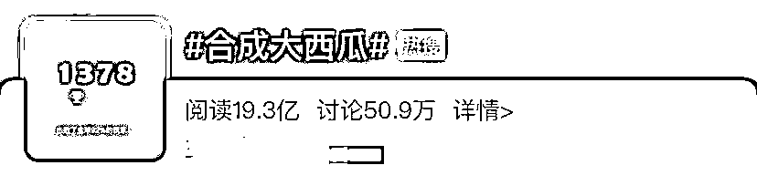
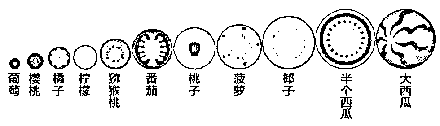
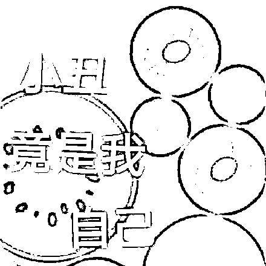
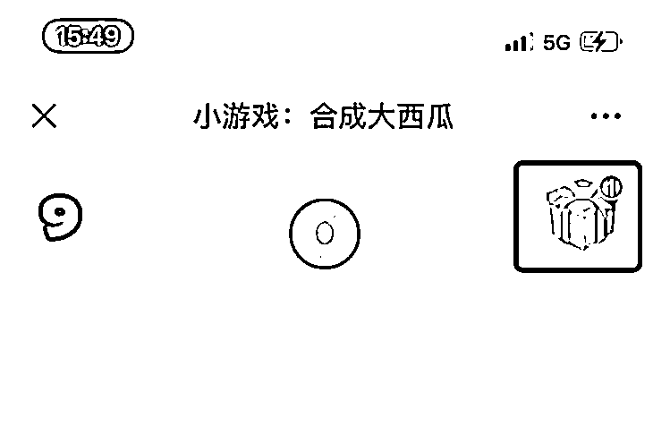
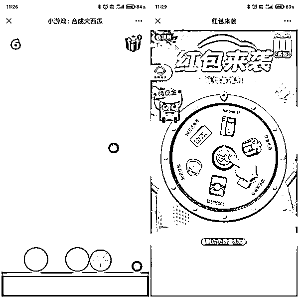
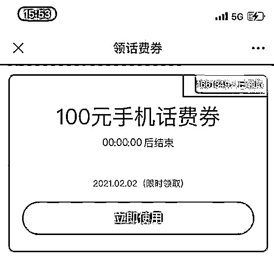
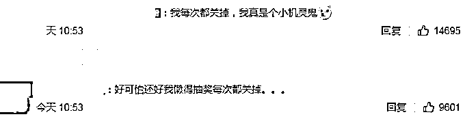
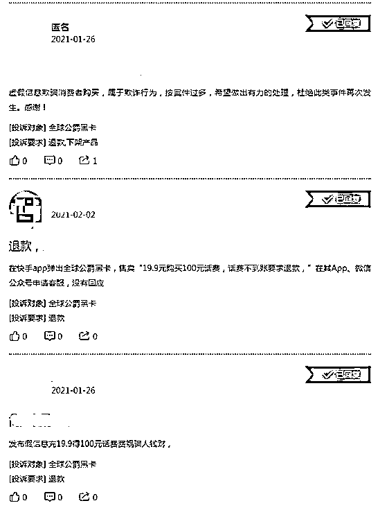
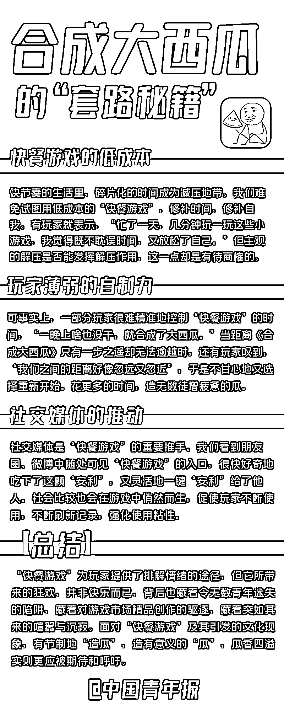

# 玩一次被骗 19.9 元？这款火爆全网的游戏现“骗局”……

> 原文：[`mp.weixin.qq.com/s?__biz=MzIyMDYwMTk0Mw==&mid=2247509195&idx=3&sn=872fb401f4f2d2735377d224bdea5f8c&chksm=97cb6ff3a0bce6e5248e1737a1249696f3c7efb01ea16db9211e84f00c4830f0eb0ff3174b65&scene=27#wechat_redirect`](http://mp.weixin.qq.com/s?__biz=MzIyMDYwMTk0Mw==&mid=2247509195&idx=3&sn=872fb401f4f2d2735377d224bdea5f8c&chksm=97cb6ff3a0bce6e5248e1737a1249696f3c7efb01ea16db9211e84f00c4830f0eb0ff3174b65&scene=27#wechat_redirect)

近日，小游戏《合成大西瓜》频上热搜，单个话题阅读近 20 亿，不少人直呼“玩到停不下来”！ 

简单来说，这款游戏玩法就是“俄罗斯方块 + 2048”。游戏正上方会随机出现一种水果，点击你想让水果摆放的位置，水果就会落下。相同的水果接触后，会合成一个更大的水果，**最大的水果就是大西瓜。**

但在 2 月 6 日，话题**#玩合成大西瓜一次被骗 19.9 元#**冲上热搜后，不少网友惊觉自己才是那颗待摘的“瓜”。

被游戏骗钱投诉无门

近日，有网友反映，玩微伞游戏开发的《合成大西瓜》被骗 19.9 元，且投诉无门。

中国新闻网报道称，进入这款游戏后，页面右上角会出现“礼物”图标，点进去会看到抽奖大转盘，每次点击后几乎都会显示**中奖“100 元手机话费券”，**再点击后则提示**需要支付 19.9 元，**且称**“领不到话费，全额退****款。”**

支付后，页面则弹出让你下载某款 APP，去该 APP 领取话费。可很多网友反映，**根本就没有话费，退款也遇到阻碍，**申请退款迟迟收不到退款，“在公众号申请客服也没有回应。”

相关页面显示**超 166 万人已领取所谓的“手机话费券”，**这样算下来，每个人支付 19.9 元，**涉及的总金额已超 3000 万元。**

相关页面显示超 166 万人已领取。

**有网友评论：**

还好我每次都关掉抽奖页面……

有网友称

在其他 APP 上

也有大量的类似套路

根据《互联网广告管理暂行办法》，互联网广告应当具有可识别性，显著标明“广告”。而这款《合成大西瓜》**并未标注“广告”，**“礼物”图标也在游戏页面右上角最显眼的位置，很容易让众多玩家理解成是游戏方自己的“礼物”。

记者实测发现，如今游戏中的“礼物”标识及相关广告链接**已经消失。**湖南金州律师事务所律师易旭表示，消费者基于对游戏的信任而完成支付行为，但却未获得相应的服务，**平台难以排除消费欺诈之嫌。** 

**小编提醒：****如果遭遇上述退款难，通过官网、公众号等渠道无法退款时，可试着直接联系收款企业。****另外，支付过上述“会员费”的网友最好去微信支付“扣费服务”里面检查是否开通了自动扣费服务。**

# **被“快餐游戏”偷走的时间**

除了“黑心”大西瓜骗人钱财，沉迷流连、难以自拔的背后，“合成大西瓜”的魔力到底是什么？早在 2 月 2 日，中国青年报就曾剖析过《合成大西瓜》这类**“快餐游戏”的“秘籍”↓↓↓**

**再次提醒大家**

**天上不会掉馅饼** 

**来路不明的链接** 

**千万别点！**

来源：长沙晚报、中国青年报、中国新闻网、广州日报、深圳晚报

← 向右滑动与灰产圈互动交流 →

