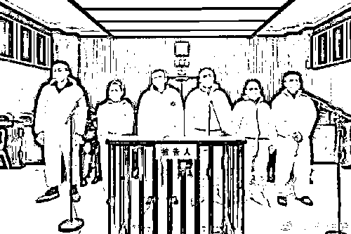
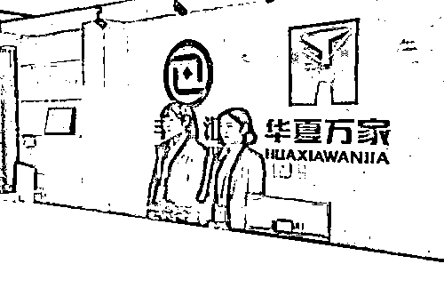
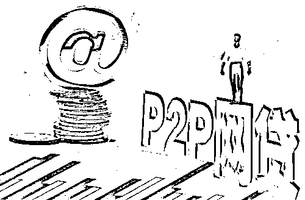
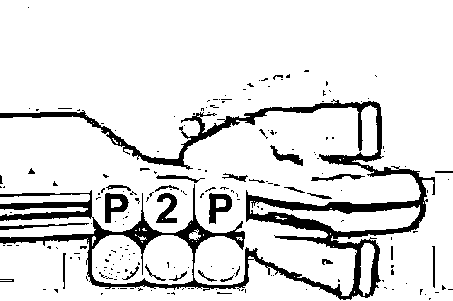

# 你还记得斐讯“0 元购”嘛？有最新进展了！

> 原文：[`mp.weixin.qq.com/s?__biz=MzIyMDYwMTk0Mw==&mid=2247509195&idx=4&sn=6d7857ffc31a06682e60bfa290f2e39a&chksm=97cb6ff3a0bce6e5f51fde98315273bedc30d9d157ba5e987cad87a3a1f238209b7c328b5bad&scene=27#wechat_redirect`](http://mp.weixin.qq.com/s?__biz=MzIyMDYwMTk0Mw==&mid=2247509195&idx=4&sn=6d7857ffc31a06682e60bfa290f2e39a&chksm=97cb6ff3a0bce6e5f51fde98315273bedc30d9d157ba5e987cad87a3a1f238209b7c328b5bad&scene=27#wechat_redirect)

    近期上海一中法院对一桩震惊市场的集资诈骗案进行审理，顾国平、侬锦等人通过**“联璧金融”“华夏万家金服”平台非法集资 830 余亿元，造成 110 余万人损失 120 余亿元。其手段为“0 元购”、诱骗社会公众买理财产品。**

基金君发现，顾国平曾拥有多重身份，不仅是曾经的上海斐讯实控人，还是 ST 慧球前董事长，但后来他被终身市场禁入，所持股权司法拍卖多次，暂时也无人问津。

法院审理 830 亿集资诈骗案

110 万人损失 120 亿

2 月 5 日晚间，上海市第一中级人民法院官微发布消息，2021 年 2 月 4 日、5 日，对被告人顾国平、侬锦、陈雨、朱军、王晶晶、张冀敏集资诈骗案一审公开开庭审理。

公诉机关指控：2015 年 7 月至 2018 年 6 月，被告人顾国平、侬锦通过上海联璧电子科技（集团）有限公司，与上海斐讯数据通信技术有限公司（以下简称斐讯公司）合作推出购买斐讯公司产品并注册“联璧金融”APP 会员可获全额返还的“0 元购”活动；

并指使被告人陈雨、王晶晶组织设计虚假资产包或定向投资项目等各类理财产品，承诺保本付息和高额利息，诱骗社会公众在“联璧金融”APP 上投资购买。被告人朱军、张冀敏分别参与了钱款转移、系统维护等行为。

2017 年 5 月，顾国平还收购了四川省成都市华夏万家（北京）金融服务外包有限公司（以下简称华夏万家公司），并自同年 9 月起至 2018 年 8 月，擅自以斐讯公司名义与华夏万家公司合作推出“0 元购”活动，采用前述手段诱骗社会公众在“华夏万家金服”APP 上购买理财产品，非法募集资金，并指使朱军非法转移钱款。

**经审计，顾国平等人通过“联璧金融”“华夏万家金服”平台非法集资共计人民币 830 余亿元，造成 110 余万名被害人损失共计人民币 120 余亿元。**集资钱款被用于兑付投资人本息，支付运营费用、货款及归还债务等。

公诉机关认为，被告人顾国平、侬锦、陈雨、朱军、王晶晶、张冀敏以非法占有为目的，共同使用诈骗方法非法集资，数额特别巨大，其**行为均应当以集资诈骗罪追究刑事责任。**庭审中，公诉机关出示了相关证据。辩护人针对被告人的行为性质、犯罪数额、主从犯、自首情节的认定等问题发表了相应意见。

上海一中院表示，此次案件庭审持续到 2 月 5 日 16 时 40 分。根据疫情防控工作的相关要求，被告人家属、被害人等 30 余人通过视频方式旁听了庭审。合议庭将在评议后依法对本案择期宣判。

联璧金融、华夏万家

利用“0 元购”等手段吸引投资者

**联璧金融曾经和钱宝、雅堂金融和唐小僧，并称为“四大高返利平台”**。天眼查信息显示，上海联璧电子科技（集团）有限公司成立于 2014 年 5 月 8 日，注册资本 1.67 亿元，实缴 1 亿元。

联璧金融通过上海斐讯进行“0 元购”营销，上海斐讯在国内某大型电商平台的官方旗舰店的部分产品被打上“0 元购”标签，打上标签的每一台数码产品底部都印有一串 k 码。

拿到 k 码后，用户可以在“联璧金融”App 中激活，取回所有购物款，资金全部返还至“联璧金融”的账户内。这样，买路由器的用户就成了“联璧金融”的新用户，不少不用直接将钱留在了平台，购买里面所谓“利润丰厚”的理财产品。

2018 年 6 月 21 日，上海市公安局松江分局对上海联璧电子科技有限公司涉嫌非法吸收公众存款案立案侦查，其实控人顾国平、法定代表人侬锦等 10 人因涉嫌集资诈骗罪及非法吸收公众存款罪被松江区人民检察院批准逮捕。

经警方调查，联璧金融未经有关部门批准，设立联璧金融线上投资理财平台，**通过公开宣传的方式，对外承诺 6%-12%不等的年化收益，向社会不特定公众非法募集资金**。

值得注意的是，对于此案，上海公安机关成立了联合侦破组，先后对 30 余名犯罪嫌疑人采取刑事强制措施，并于 2018 年 8 月将出逃境外的侬锦抓捕归案、押解回国。

另一家华夏万家（北京）金融服务外包有限公司，成立于 2014 年 10 月 27 日，注册资本 16.60 亿元，实缴 4.30 亿元。2017 年 5 月，顾国平收购了华夏万家。

据“金融虎”消息，2018 年 10 月有投资人爆料显示，华夏万家因涉嫌非法吸收公众存款，被警方立案侦查，立案告知书显示，华夏万家运营主体华夏万家（北京）金融服务外包有限公司涉嫌非法吸收公众存款一案符合刑事立案条件，成都市公安局锦江分局决定立案，立案告知书显示的立案时间为 2018 年 9 月 29 日。

据了解，华夏万家主要从事互联网供应链金融服务，有活期理财产品“零钱罐”，年化收益率 7%；也有定期理财的“U 享计划”，按锁定期限从 30 天到 360 天的不同又细分为 ABCD 四种，预期年化收益从 7.8%到 12.8%。

华夏万家也曾从 2017 年 9 月起与斐讯联合推出“0 元购”。据了解，2017 年 9 月，斐讯与华夏万家签订合作协议，投资人在购买斐讯的 K 码体脂秤后，可登陆华夏万家激活 K 码，购买商品的费用则会在华夏万家平台分期返还，在指定时间后即可提现。

**据公诉机关披露，顾国平等人通过“联璧金融”“华夏万家金服”平台非法集资共计人民币 830 余亿元，造成 110 余万名被害人损失共计人民币 120 余亿元。**集资钱款被用于兑付投资人本息，支付运营费用、货款及归还债务等。

曾经想借壳上市

如今资产被变卖

公开资料显示，现年 44 岁的顾国平在 2008 年 11 月成立上海斐讯数据通信技术有限公司，生产销售交换机、手机、路由器等通信设备，这家公司曾经销售额和利润逐年增加，2014 年营业额突破 100 亿。

但是，他并不满足于此。2014 年 3 月，作为上海斐讯的实际控制人，顾国平和上市公司北生药业（后改名慧球科技）谈定借壳上市。他以上海斐讯股权为抵押，动用杠杆资金入主上市公司，但后来遇上了市场暴跌，2016 年被迫转让了其持有的上海斐讯股权。

2016 年 1 月，慧球科技发布公告称，公司董事长、控股股东、实际控制人顾国平通过资管计划德邦慧金 1 号增持的公司股票被平仓，顾国平实际控制股份比例由 8.79%下降为 6.66%。随后，顾国平的另一个资管计划华安汇增 3 号也因低于止损线而被要求追加资金。

2016 年 7 月，顾国平辞去慧球科技董事长、总经理职务，后还辞去了董事以及其他一切职务。

2017 年 2 月下旬，顾国平收到证监会的罚单，他被认定为证券市场禁入者，自证监会宣布决定之日起，终身不得从事证券业务或者担任上市公司董事、监事、高级管理人员职务。证监会查明其几个违法事实，包括顾国平作为慧球科技实际控制人，对上市公司隐瞒其实际控制慧球科技的情况。

2018 年 6 月 21 日，根据群众举报，上海市公安局松江分局对联璧金融涉嫌非法吸收公众存款罪立案侦查，包括顾国平、侬锦在内的 10 人因涉嫌集资诈骗罪及非法吸收公众存款罪被松江区人民检察院批准逮捕。

值得注意的是，顾国平所持上海斐讯数据通信技术有限公司 19.45%股权作为执行标的物，如今正在阿里司法拍卖网上拍卖，变卖价为 7.284 亿元，目前近上万人围观，却没有人出手，该拍卖从 2020 年 12 月 21 日开始到 2021 年 2 月 19 日结束。

其实，去年 1 月，杭州市中级人民法院就在阿里拍卖网站对顾国平持有的斐讯 19.45%股权进行了两轮司法拍卖，第一次拍卖底价为 7.97 亿元，第二次底价为 7.28 亿元。但是都最终以流拍结束。

来源：中国基金报

← 向右滑动与灰产圈互动交流 →

