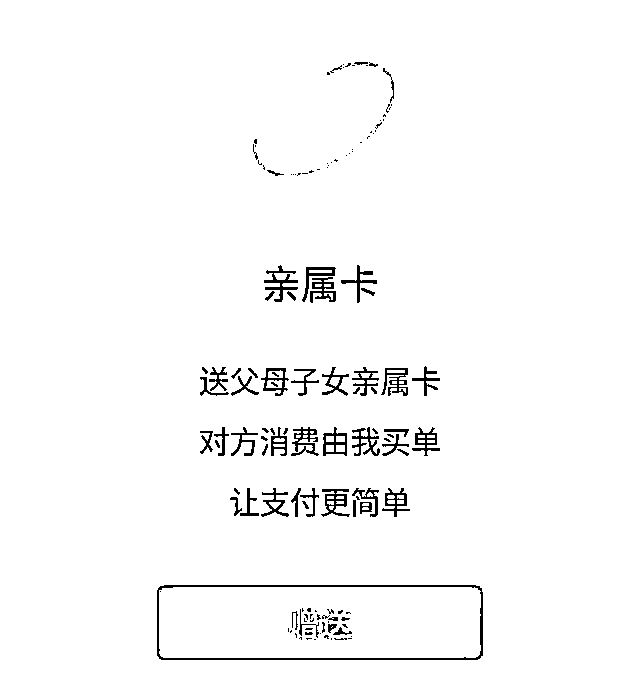
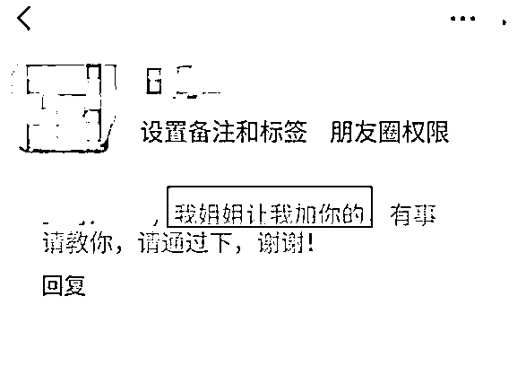
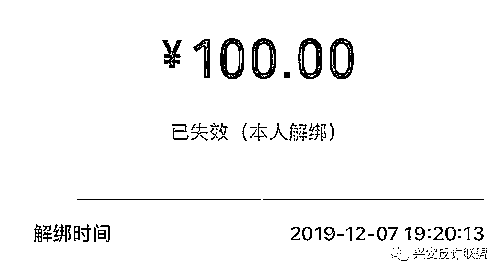

# 微信 “ 亲属卡 ”：小心被别人绑定！

> 原文：[`mp.weixin.qq.com/s?__biz=MzIyMDYwMTk0Mw==&mid=2247509195&idx=5&sn=3ee58a76075bad5377d7c6409d1775a1&chksm=97cb6ff3a0bce6e5186b7f64c68724bdbc159b5760c699cc521435e162ccfb19c33e8bc61b8f&scene=27#wechat_redirect`](http://mp.weixin.qq.com/s?__biz=MzIyMDYwMTk0Mw==&mid=2247509195&idx=5&sn=3ee58a76075bad5377d7c6409d1775a1&chksm=97cb6ff3a0bce6e5186b7f64c68724bdbc159b5760c699cc521435e162ccfb19c33e8bc61b8f&scene=27#wechat_redirect)

微信“亲属卡”功能你用过吗？诈骗分子盯上了这个微信功能已经有不少人中招！什么是微信“亲属卡”？微信“亲属卡”是微信自带的代付功能，用户可在微信里赠送“亲属卡”给父母、子女作消费使用。代付方通过设置“亲属卡”的每月消费额度上限，将额度控制在 0.01 到 3000 元之间，每月自动延续，当父母、子女使用“亲属卡”消费时，消费资金将自动从代付方的支付账户扣除。微信“亲属卡”设置的主要目的就是让父母付款更简单，享受网络支付带来的便利。同时，家长通过这样的方式给孩子零花钱，更直接地掌握孩子零花钱的去向。

微信“亲属卡”

如何成为犯罪工具？

**案例：瞒天过海绑定受害人“亲属卡”**

近日，广东省广州市黄埔区检察院办理了一起网络犯罪案件，被告人在网络贷款群中冒充贷款中介人和贷款审核员与被害人沟通，诱使被害人与其建立了微信“亲属卡”，从而成功盗取了被害人微信账户内的资金。被告人吴某在网络贷款群中将自己包装成贷款中介人和贷款审核员与被害人沟通，谎称曾经在网上成功申请小额贷款，以“亲身经历”与被害人“交心”，降低被害人的提防。 待时机成熟，吴某骗取了被害人的信任，再以核实微信是否为被害人本人使用，或者出于审核当日资金安全、需要互发红包通过测试等为由，瞒天过海将自己的微信与被害人微信中的“亲属卡”进行绑定。绑定过程很简单，吴某赠送给被害人“亲属卡”，“亲属卡”虽标有额度但并不能完成支付，之后吴某会迅速向被害人发信息索要同等金额的“亲属卡”，被害人按照指令完成绑定。 随后，吴某又要求被害人下载聊天软件进行“视频审核”，当着被害人的面进入对方的微信账户中操作所谓的“资金流水审核”，“审核”完毕后没有立刻退出账户，反而修改了被害人“亲属卡”中的支付额度，为盗取被害人的资金做好铺垫。 最后，吴某以需要证明被害人有还款能力为由，诱骗被害人向被害人自己的微信账户转入现金，继而用其一个手机微信号扫其另一个手机微信号的收款码，将被害人账户内的现金转入其本人的微信账户内。 可见，吴某正是利用了被害人对软件功能的不熟悉和急于借贷的心态完成一系列的忽悠，进而非法获取了被害人的钱财。2020 年 6 月 5 日，黄埔区检察院就该案向黄埔区法院提起公诉，2020 年 6 月 24 日，黄埔区法院认定被告人犯盗窃罪，判处有期徒刑十个月，缓刑一年八个月，并处罚金人民币四千元。**套路：骗子给你的“亲属卡”其实是“空头支票”**当你收到类似添加好友申请，就请提高警惕了！对方不仅能准确无误地叫出你的名字，且声称是“我姐姐让我加你”，除“姐姐”，还可能是“阿姨”“爸爸”“舅舅”......如果你在半信半疑之间，同意了对方的添加好友申请，或许已开始一步步走进骗子的圈套。**套路一：**假装是被害人熟人或亲戚，把被害人拉到股票、微商等微信群中，通过群里的“托儿”，哄骗被害人购买商品，甚至是“投资”或赌博。**套路二：**迅速“拷贝”被害人的个人信息，比如微信名、地区、朋友圈等内容，然后使用被害人的个人信息，向被害人的亲友开启下一轮骗局。

骗子如何使用

微信“亲属卡”诈骗？

1．假装熟人、亲戚添加微信好友。2．套路满满地嘘寒问暖，通过平常聊天让受害人感觉到骗子的善意。3．当受害人没有了提防心，时机成熟后，骗子莫名送一张“亲属卡”给受骗者，然后迅速和受骗者发信息索要同等金额的亲属卡或转账金额。4．然而，骗子赠送的这张“亲属卡”虽标有额度但并不能完成支付。

注意！

下面问题来了

**1．骗子是以什么理由来要回亲属卡的？** 答：亲！我想给家人亲属卡，不小心发给你了，现在亲人在外面等着结账，非常着急，帮我退回来吧。（感情招牌） **2．对方先给我发的，我先去消费了再退还不就行了？**答：当被害人用骗子给的“亲属卡”消费时，会发现这张卡无法使用，骗子便以“需要互相赠送相同额度才能激活”为由，让被害人回送骗子一张同等额度的“亲属卡”。（利用对软件功能的不熟悉忽悠你！） **3．为什么对方发来的“亲属卡”无法使用，我发出去的就可以使用？**答：因为对方微信余额里面根本就没有钱，而且绑定的银行卡也是一张空卡，根本就无法完成支付。（关键环节） **4．我已经给对方转款过去了，对方微信余额里面应该有钱了？**答：没错，的确有钱了，拼速度的时候到了，骗子桌子上早就准备好了一张收款二维码，你敢发 ta 就敢消费！ **5．我正好也在消费，看看谁快！**答：那咱们就拼一下速度好了，民警亲自体验了一下，原来还可以进行以下操作： 一秒迅速解绑**↓**↓****↓******6．再之后呢？**答：没有之后了，此时你已经被对方拉黑了，你收到的只是一张“空头支票”。 

**检察官提醒：**

绑定“亲属卡”等同于默认对方从自己的微信中或绑定的银行卡中自动扣费，为了避免踩坑中招，请广大微信用户给他人发送“亲属卡”时一定要谨慎，不要让一些人成为“套路”自己的“亲人”。来源：法制日报、广州日报、首都网警、兴安反诈联盟、利箭在出击

← 向右滑动与灰产圈互动交流 →

