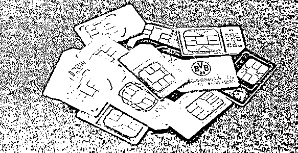
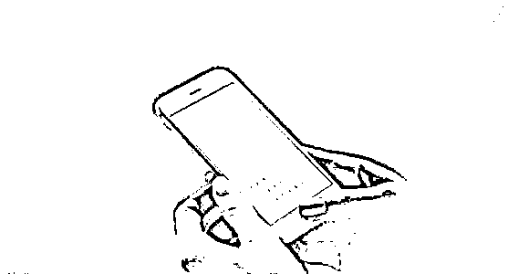
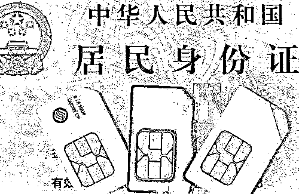

# 你的卡被封停了吗？

> 原文：[`mp.weixin.qq.com/s?__biz=MzIyMDYwMTk0Mw==&mid=2247509195&idx=6&sn=638e6218536d8ae023daed29b824a959&chksm=97cb6ff3a0bce6e59510775863af15376f24c654d7011615206fae86108def3b4ef1cc7a7823&scene=27#wechat_redirect`](http://mp.weixin.qq.com/s?__biz=MzIyMDYwMTk0Mw==&mid=2247509195&idx=6&sn=638e6218536d8ae023daed29b824a959&chksm=97cb6ff3a0bce6e59510775863af15376f24c654d7011615206fae86108def3b4ef1cc7a7823&scene=27#wechat_redirect)

自去年 10 月公安部开展“断卡”行动以来

不少人的手机卡或银行卡被封停

给生活带来极大不便

不少自认守法的良好市民表示无辜与不满

但，事实真是这样吗？

截至目前为止，在我市开展的“断卡”行动中，共**训诫 573 人**，**惩戒 802 人**，**取保候审 6 人**，**刑拘 82 人**，**逮捕 10 人**，**采取其他强制措施 17 人**。

**封停问题手机卡、银行卡**

**是“断卡”行动的一项重要惩戒措施**

由于这部分卡极有可能涉嫌电信网络诈骗

所谓“无辜”是少之又少

在此，要说

**法律意识淡薄是造成被封停的根本原因**

**是否涉嫌违法只关乎一个动作**

**手机卡被封停的真实案例**

**01**

**卖卡的学生**

东区 L 女士在大学期间变卖手机卡，只为增加零花钱。然而，在今年的“断卡”行动中，她所有手机卡均被封停。几经确认，原来是当时变卖的手机卡涉嫌了电信网络诈骗。

**02**

**被利用的店主**

小榄 L 先生是一家手机店的店主。某天，有两个客户进来购买价值 1000 元的手机。随后，客户声称朋友要转一笔钱给他，自己没有支付宝，所以想转给 L 先生，另付 50 元作为辛苦费。L 先生收到 5000 元后，随即向对方转账 4950 元。而当晚便有一女子联系 L 先生，表示那 5000 元是自己被骗的资金。L 先生的所有手机卡也因此被封停。

**03**

**为了刷单提交手机卡**

N 女士长期参与网络刷单，曾在刷单群里被要求要寄出手机卡。为了蝇头小利，N 女士照做了。事隔一年之后，N 女士被封停电话卡。经过确认，原来是当初寄走的电话卡涉嫌电信网络诈骗导致 N 女士所有手机号码均被封停。

**04**

**手机卡丢失不及时注销**

阜沙 W 先生曾经为了能多刷单而多注册了一个手机号码。后来本想注销，但运营商表示需先还清欠费，因此 W 先生为了省钱就没有注销。今年 1 月份 W 先生所有手机号码均被封停，到派出所确认才发现涉嫌违法的就是当初没注销的号码。

**05**

**被网络贷款诈骗**

东升 C 女士曾于 2019 年在网络上申请贷款，对方表示需提供一张全新的手机卡，于是 C 女士开通了一张手机卡提交给对方。后来不仅贷款没有通过，手机卡也没有退回。谁知在“断卡”行动中她的所有手机卡均被封停。

在此强调

切勿**出租、出借、贩卖**手机卡、银行卡

丢失以上两卡要及时做注销处理

**下面，划重点了！**

**涉“两卡”人员将面临什么惩戒**

**01**

**手机卡方面：**被公安机关认定的电信网络诈骗涉案电话号码（含互联网连接帐号）登记的自然人及法人需要纳入不良信用电话用户和管理，基础电信企业按照公安机关要求关停其名下登记的所有移动电话号码，且 2 年内限制其身份证件或组织机构代码等证件办理移动电话新入网、过户电信业务。限制期满后，自然解除限制。

**02**

**银行卡方面：**公安机关认定的失信用户，实施只保留 1 张银行卡，5 年内不得新开帐户、暂停非柜面业务、支付帐户所有业务的惩戒措施。同时，纳入金融信用数据管理，录入个人征信。

**温馨提示**

**1**

请身份证有遗失经历、前期电话卡或者银行卡有异常情况的人，一定要抽空去查询名下是否有不知情的电话卡或者银行卡存在，以免被当做“违法犯罪嫌疑人”进行打击、惩戒，影响个人生活。

严禁买卖、出租、出借电话卡、银行卡，此行为涉嫌《中华人民共和国刑法》规定的“帮助信息网络犯罪活动或诈骗罪”，公安机关将依法严厉打击。

**2**

**3**

具有出租、出售、出借电话卡、银行卡情形的个人(单位)，请主动到银行、通信运营商网点注销开户。在规定期限内，不注销开户的个人(单位)，公安机关将依法严厉打击。

一旦发现卡被封停，请拨打 96110，由反诈工作人员进行处理。

**4**

来源：中山市反诈骗中心

← 向右滑动与灰产圈互动交流 →

