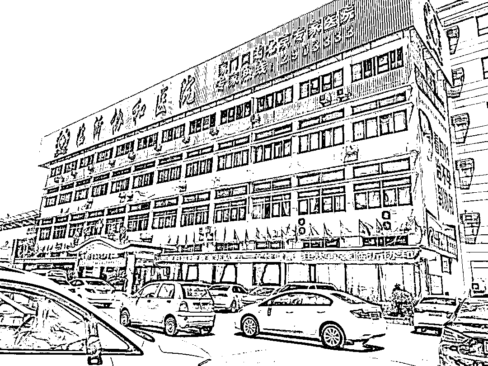
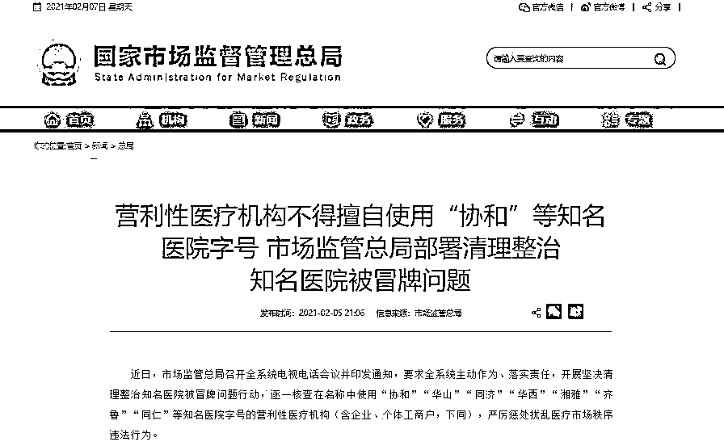
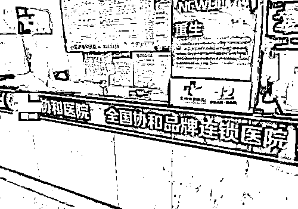
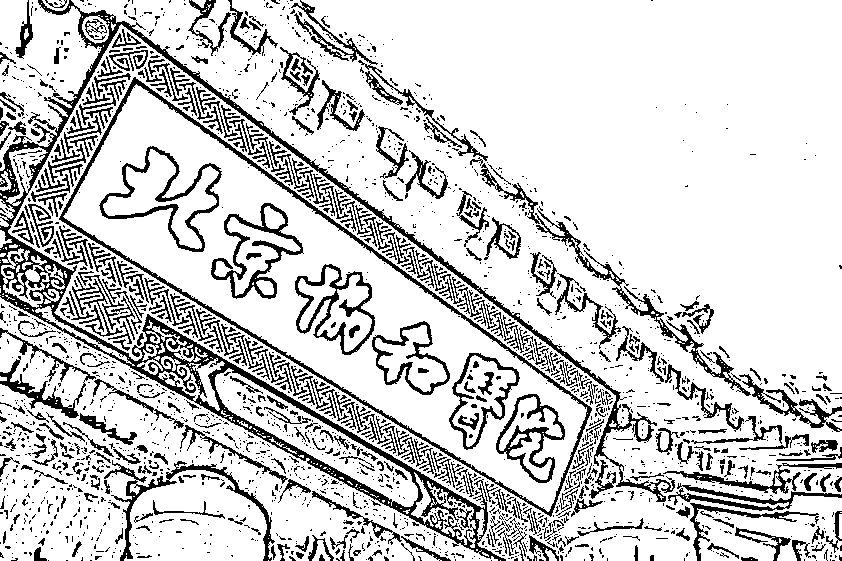
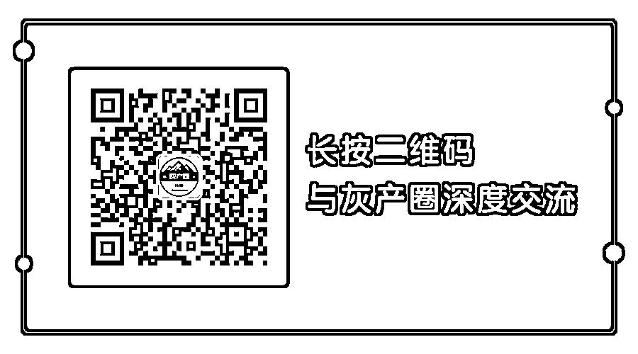

# 假的？！这个名头响当当的医院，全国有 100 多家冒牌货

> 原文：[`mp.weixin.qq.com/s?__biz=MzIyMDYwMTk0Mw==&mid=2247509220&idx=2&sn=232fa8945a8350d23e26b7e831767155&chksm=97cb6fdca0bce6ca85bd21b060f869cee8c967394bf425f45bfc278f2b0ed7e5b45fbb0cfaea&scene=27#wechat_redirect`](http://mp.weixin.qq.com/s?__biz=MzIyMDYwMTk0Mw==&mid=2247509220&idx=2&sn=232fa8945a8350d23e26b7e831767155&chksm=97cb6fdca0bce6ca85bd21b060f869cee8c967394bf425f45bfc278f2b0ed7e5b45fbb0cfaea&scene=27#wechat_redirect)

近年来，社会上出现了很多**冒充知名医院的机构**。除了冒充协和医院，还有“华山”“齐鲁”“同济”“天坛”等医院都常常被假冒。

针对社会高度关注的部分医院“傍名牌”等问题，国家市场监管总局近日重拳出击，开展坚决清理整治知名医院被冒牌问题行动，**逐一核查在名称中使用“协和”“同济”“华西”等知名医院字号的营利性医疗机构**，严厉惩处扰乱医疗市场秩序违法行为。

100 多家“协和医院”

只有 2 家与北京协和医院有渊源

**记者今天（9 日）通过某商业企业信用信息平台检索**“协和医院”，共计出现 100 多条结果**。有的说自己是“协和医院某某分院”，有的说属于“协和医疗集团”，还有的沿用“地名+协和医院”的套路。此外，**“同济医院”也有上百个，普通群众难以区分**。**

****

**△图片源自中央广电总台中国之声**

**北京协和医院宣传处常务副处长陈明雁接受采访时介绍，**除“北京协和医院”，只有 2 家与北京协和医院有历史渊源的医院，一个是“华中科技大学同济医学院武汉协和医院”，另一个是“福建医科大学附属协和医院”**。**

**市场监管总局登记注册局名称登记管理处处长金长峰说：“我们看到有一些地市或者区县，也有一些叫‘协和医院’‘湘雅医院’，**实际上并没有得到这些知名医院的授权，它们之间没有任何关系**，这样没有授权关系的医院，我们就要进行纠正。”**

****

**△官网截图**

****知名医院被“傍名牌”的乱象由来已久**，近年来监管部门也不断出手整治此类扰乱医疗市场秩序的行为。2020 年 6 月，市场监管总局就发布《关于对知名医院等机构被冒牌问题开展清理整治的通知》，各地也都开展部署了相关工作。**

**今年 1 月份，国家市场监督管理总局登记注册局局长杨红灿曾表示：“去年新冠肺炎疫情发生以后，将火神山、雷神山等敏感字词纳入到系统管理之中，我们配合相关部门部署开展知名医院等机构被冒牌的问题进行了清理整治行动。”**

************

**“名医坐诊”、夸大病症**

**屡禁不止的“山寨医院”套路多**

****“山寨医院”医疗水平一般，却很会营销。****

**有的**通过编造“名医坐诊”、夸大病症、术中术后加价等违法行为获益，有的甚至利用互联网搜索引擎竞价等方式吸引患者**。尽管监管部门多次采取整治措施，但“山寨医院”依然屡禁不止。** 

****

**△图片源自中央广电总台中国之声**

**湖南金州律师事务所高级合伙人、律师邢鑫表示，这里面既有历史原因，也有现实困难。“**知名公立医院对商标没有引起足够的重视，比如协和医院没有对‘协和商标’和‘协和医院’商标进行有效的、相应的注册。**”**

**邢鑫表示，这就让各地的山寨医院有了钻法律空子的机会，不少山寨医院**盯准二三四线城市注册公司或医院**，抢占国内知名医院的商标或商号，建立了无数‘山寨医院’，以假乱真，迷惑大众。** 

****

**△资料图**

**此外，知名医院在打假维权的道路上，也存在多重阻力。**有些山寨医院故意登记与知名商标相同或相似的企业名称，并进行简化使用，从而规避商标侵权**。**

**清华大学法学院卫生法研究中心主任王晨光认为，这种明目张胆地盗用知名公立医院的名称去举办营利性医疗机构的行为，是明显的违法行为。“在这个领域中，监管的范围、机构、人员等方面都需要进一步加强。”**

************

**涉及“傍名牌”等侵权行为**

**登记机关有权予以纠正**

**     新修订的《企业名称登记管理规定》自今年 3 月起施行，企业名称登记，      将从过去 30 年来的预先核准制度，改变为自主申报。**

**但杨红灿表示，取消名称预先核准不代表登记机关不再审查企业名称。“对于存在违反法律法规，违反良俗和诚信意识以及‘傍名牌’等不正当行为的企业名称，市场监管部门也将严格按照有关的法律规定进行监督管理。”**

**邢鑫律师指出，新修订的《规定》强化了**企业名称登记事中事后监管**，明确涉及“傍名牌”等企业名称侵权行为的，被侵权主体可以请求登记机关予以纠正，也可以向人民法院提起诉讼。**

**市场监管总局介绍，全国市场监管部门今后将加大力度打击医疗机构擅自使用知名医院名称标识的行为，同时将加强与卫生健康等部门的协调沟通，建立知名医院品牌保护的长效机制。“对严重违法的要列入严重违法失信企业名单，进行失信联合惩戒。**

**来源：中央广电总台中国之声，浙江在线，利箭在行动**

********

**← 向右滑动与灰产圈互动交流 →**

****