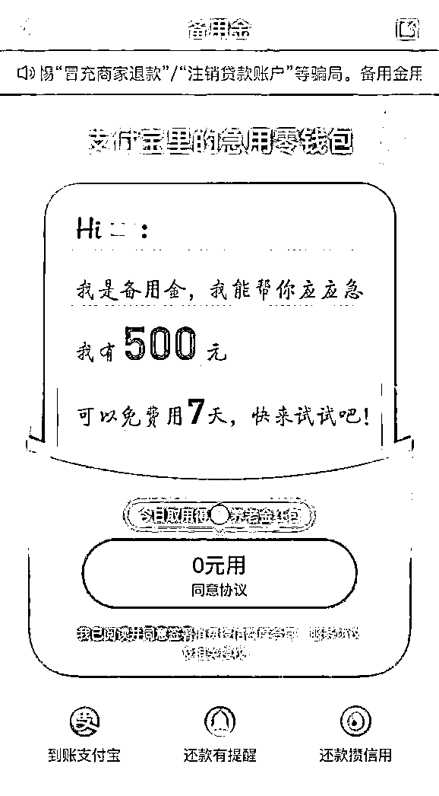
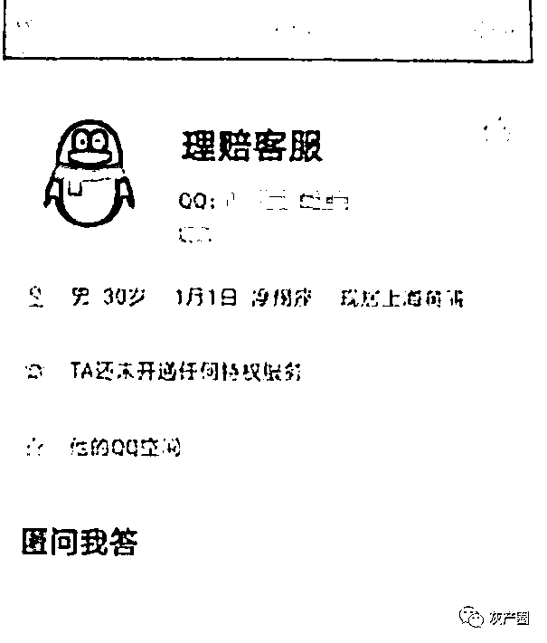
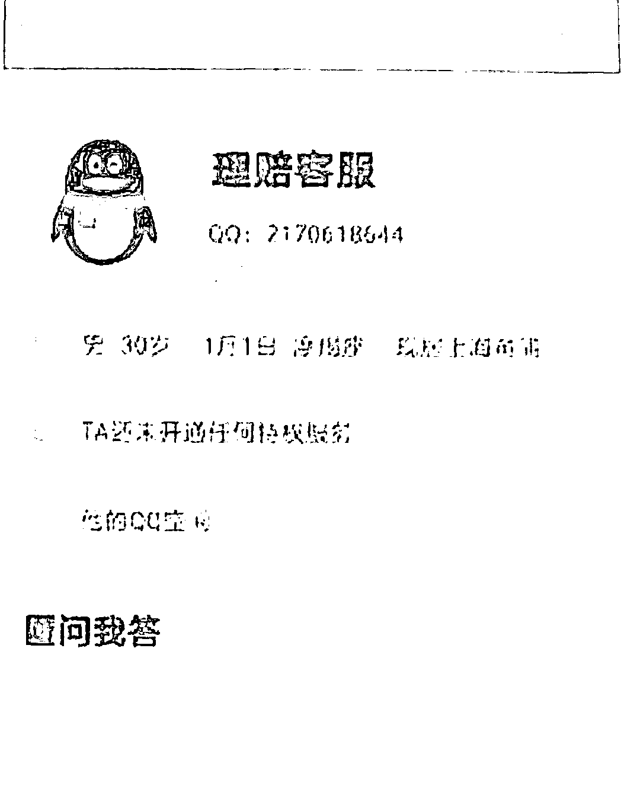
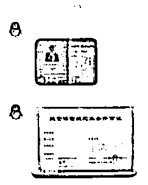
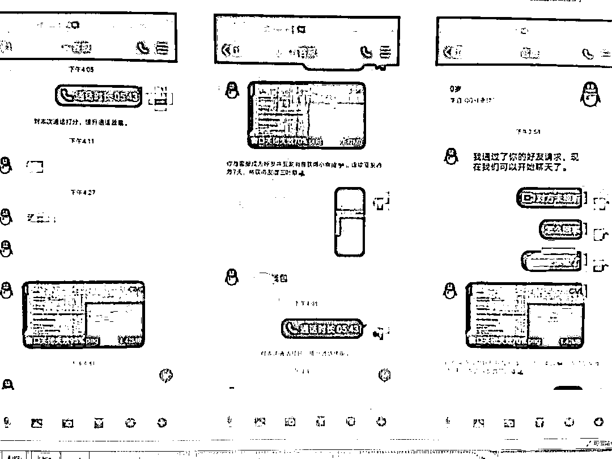
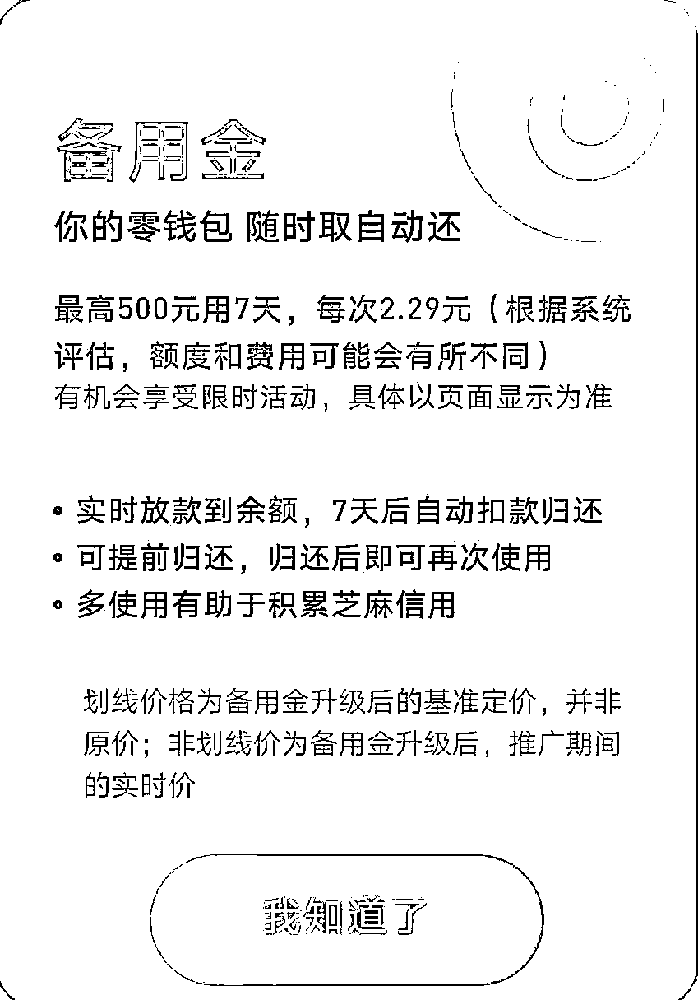
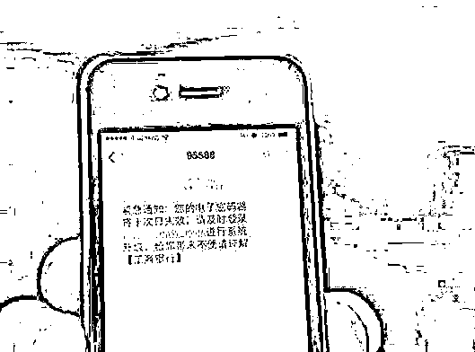
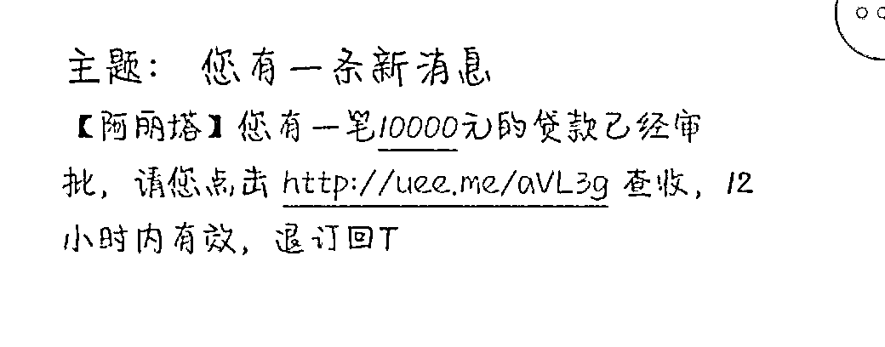

# 可怕！女子 18000 元瞬间没了！有支付宝的当心！

> 原文：[`mp.weixin.qq.com/s?__biz=MzIyMDYwMTk0Mw==&mid=2247509220&idx=3&sn=291157662f9b3b38643032a98bd5eab8&chksm=97cb6fdca0bce6caf27fb05b05a485390de2d7ce1a1a435fc61dd5506256b464a23646e861f3&scene=27#wechat_redirect`](http://mp.weixin.qq.com/s?__biz=MzIyMDYwMTk0Mw==&mid=2247509220&idx=3&sn=291157662f9b3b38643032a98bd5eab8&chksm=97cb6fdca0bce6caf27fb05b05a485390de2d7ce1a1a435fc61dd5506256b464a23646e861f3&scene=27#wechat_redirect)

临近春节 骗子又来“冲业绩”！**急转！急扩！****有支付宝的当心！****已有人被骗！** **警方发布紧急提醒！** 

**女子 18000 元瞬间没了！**

**警方曝光骗局！**

**近期当心！**

先问大家一个问题 

** 你知道****支付宝备用金是干什么用的吗？**

简单点说备用金就是你支付宝里的急用零钱包随时取自动还、最高 500 元用 7 天临近春节一些不法分子就盯上了这个“备用金”**利用大家不熟悉这项业务的情况****实施诈骗！** **厦门一女子就被套路了！** **赶快来看看！** 

**领了 178 元“理赔款”**

**却搭进 18000 元**

1 月 20 日中午，苏女士接到自称**“淘宝客服”**的电话，电话里“客服”称苏女士之前在网上购买的衣服有质量问题，可以**进行理赔**，随后会有保险公司人员联系事主。不久，苏女士接到“保险电话”，“保险人员”告诉苏女士**理赔款 178 元**已经打款到她的支付宝账户中。需要苏女士开通自己的备用金查看具体的理赔款项。
苏女士此前从未听说过备用金。她在支付宝内打开备用金，查看到里面金额有 500 元。不是 178 元，难道多给了？“保险人员”很快通知苏女士多出那部分“赔款”322 元需要她通过手机银行转账到**指定账户**苏女士按照“保险人员”的指示转款后，“备用金”余额没有变化。“保险人员”随后让苏女士添加他的 QQ 进行联系，在出具假身份证明取得信任后，“保险人员”开始“教”苏女士如何操作关闭备用金。“保险人员”看似专业地说明：系统将发放多倍资金到理赔窗口用于做资金流水认证，辅助关闭备用金窗口，请提醒客户领取并及时归还，以免影响客户体验，以及产生高额滞纳金及违约金。**简单说，就是骗子哄骗苏女士以某种方式划转资金到骗子账户上，称达到一定量，苏女士就能关闭备用金。**
在“保险人员”的引导下，苏女士下载“苏宁金融 app”提现**4500 元**并转账到指定账户；下载“小米金融 app”转账到指定账户**5500 元**；用“花呗”套现的方式提现转账到指定账户**8000 元**。在前后转账**18000 元**后，“保险人员”给苏女士一个电话号码，并声称 24 小时内这些金额会返还到苏女士的银行卡里。第二天说好会返还的资金**没有到账****苏女士拨打“保险人员”提供的电话****号码无人接听****她意识到自己被骗了**警方发布紧急提醒！据警方 苏女士遭遇的其实是常见的**“冒充客服”**骗术骗子冒充电商平台客服（淘宝、天猫、京东、小红书、拼多多、闲鱼等），谎称受害者购买的物品出现问题，以可给予被害人退款、理赔、退税等为由，诱导被害人泄露银行卡和手机验证码等信息，将被害人银行卡内钱款转走；或者因商品质量原因导致交易异常，将冻结被害人账户资金，让被害人将资金转入指定的安全账户实施诈骗。以上假客服套路大家都比较清楚现在骗子又想了新招**利用支付宝“备用金”实施诈骗****备用金**是一款小额的短期借款产品，可以申请放款到支付宝余额，满足用户小额应急的消费需求。简单说，备用金就是你的零钱包，随时取自动还、最高借 500 元用 7 天，与“花呗”不同的是，备用金可提现使用。假如还款逾期了会有相应的催收方式，类似于小额贷款。警方分析首先骗子会告诉受害者所谓退款已经到账了，当然，骗子不会真正转钱，这只是骗子想要骗受害者开通备用金的手段而已。但这个备用金只能一次性把五百块取出来，因为退款金额往往不到 500 元，所以忽悠成功以后，骗子还会让你把多出来的钱还给他。接下来骗子会以超时，需要银联认证等等各种离谱的理由，让受害者进行一套复杂的手续。如果受害者觉得太麻烦不会操作也没关系，这个时候骗子就会非常贴心的告诉受害者，他们可以提供 QQ 远程协助功能帮忙操作。**最终结果就是——**验证了半天，扫 N 次的二维码贷了好几个平台的款都没“理赔”成功受害者的钱包被掏空

[`mp.weixin.qq.com/mp/readtemplate?t=pages/video_player_tmpl&action=mpvideo&auto=0&vid=wxv_1716735787011997705`](https://mp.weixin.qq.com/mp/readtemplate?t=pages/video_player_tmpl&action=mpvideo&auto=0&vid=wxv_1716735787011997705)

（厦门市公安局刑侦支队民警 洪恒亮） **值得注意的是——**有的受害者觉得太麻烦不操作，骗子就会非常贴心地告诉受害者，他们可以提供 QQ 远程协助功能帮忙操作。借用受害者的身份在多平台借款后，把受害者的钱包掏空。警方提醒针对此类骗局警方提醒市民牢记一句话**凡是提到****“开通备用金领理赔款”的****都是诈骗！****警方提醒广大市民群众****↓↓↓**如果接到自称“客服”的电话，一旦提到“双倍或多倍赔偿”、“加好友退款”更需谨慎，可与官方客服或者卖家进行咨询核实，退货退款赔偿请在原先购物平台上进行操作。有任何疑问都可以拨打 96110 反诈劝阻专线进行咨询举报。看完苏女士的被骗经历提醒大家注意此类骗局不要轻信 眼下，正值春节到来骗子们也开始“冲业绩”活跃起来！

急转！急扩！

以下这些骗局千万别信！

厦门已有多人中招！

01 快递遗失？当心！家住集美孙坂的小张，1 月 19 日下午接到自称某快递公司快递员电话，称将其快递不小心遗失，愿意予以赔偿。

随后，该“快递员”便让小张搜索一个微信号，点开其头像（是一个二维码），直接扫描进入填写个人信息，信息中包含银行卡账号、密码和手机验证码。没过多久，对方又打来电话，称将小张卡里的 9900 元误扣，要再换个方式理赔。于是，小张又在对方的引导下，从支付宝中借出 40000 元，并提现到自己的银行卡，而很快这笔钱又被对方扣取，还声称这笔钱无需偿还，且会将之前的 9900 元归还。随后，对方又让小张去其他借贷 APP 上借出 48000 元，取现后转账至对方指定账户；再通过对方提供的二维码，扫码支付了 10000 元……最后当小张跟他人说起此事时才发现自己被骗了！02 朋友圈“投资盈利”？当心！去年 12 月，曾女士在其朋友圈中经常看到别人发布的“投资盈利”的信息。在每天都被这样的信息刷屏后，今年 1 月 16 日，曾女士终于心动，向对方咨询如何进行投资。第二天，对方发来一个二维码，让曾女士下载一款投资 APP，注册后联系客服进行充值。接着，客服发来了一个银行账号，让曾女士通过手机转账的方式先转入了 60000 元。大约半个小时候，曾女士惊喜地发现，其账户余额已变成 170000 元。接着，客服让曾女士联系一位技术员指导操作。可在对方的指导下，曾女士的 17 万元很快便全部输光，并且还被客服“指责”是由于自己操作不当，想要赚回来就要继续充值。于是，曾女士在对方的要求下充值了 10 万元。然而，这些钱并没有给曾女士再带来任何盈利，反而瞬间“输光”。在朋友的提醒下，曾女士发现自己被骗，赶紧报了警。03 这种短信链接，别点！近日，不少人都收到了带有链接的陌生短信**千万不要点****已有多人被骗！**

[`mp.weixin.qq.com/mp/readtemplate?t=pages/video_player_tmpl&action=mpvideo&auto=0&vid=wxv_1710810311215087619`](https://mp.weixin.qq.com/mp/readtemplate?t=pages/video_player_tmpl&action=mpvideo&auto=0&vid=wxv_1710810311215087619)

近期诈骗案例王先生收到一条贷款平台的短信，内容是告其仍有欠款未还清，同时附有详情链接。王先生随即点击了短信内的链接，然后发现手机桌面上自动下载了贷款平台的 APP，王先生点开 APP，误将可用额度当作欠款，王先生咨询客服并填写联系方式、身份证号码等个人资料，客服称若不还款将通过法院传票的形式起诉其，并威胁称将纳入个人征信系统，影响小孩读书等，如若缴纳 4500 元可解封账号。王先生担忧若不照做将对小孩读书造成影响，虽然怀疑但仍通过手机银行向对方提供的银行卡号缴纳 4500 元。事后，对方再次向王先生索要 19000 元，王先生才意识到被骗，于是报警。**警方提醒——**1、不要轻信陌生来源的网络贷款信息，更不要点击陌生的二维码、链接等。2、不要随意在网上留下联系方式、身份证号码等个人资料，警惕个人信息泄露。3、**切记！不点！不听！不转账！** 来源：海峡导报、 i 听厦门、厦门市反诈骗中心、厦门集美警方、厦门湖里警方 

← 向右滑动与灰产圈互动交流 →

