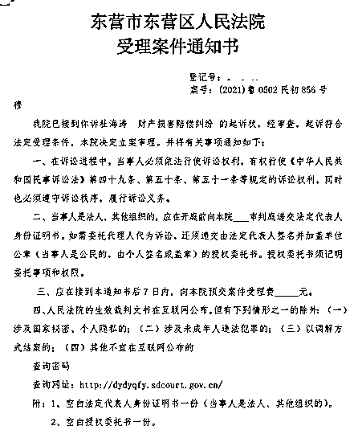
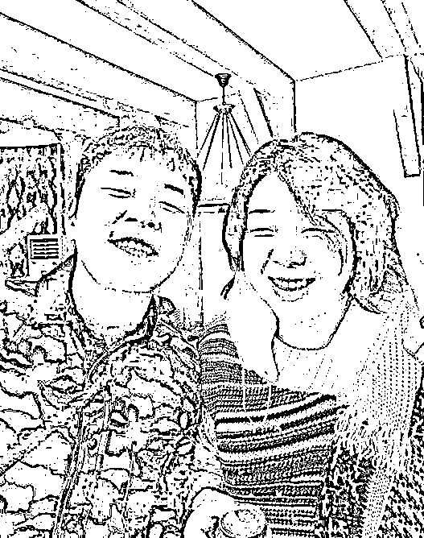
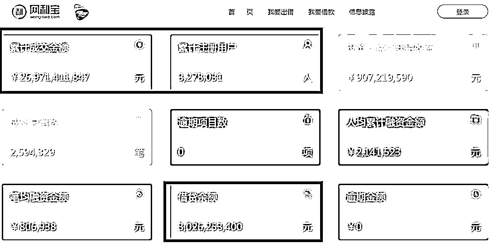
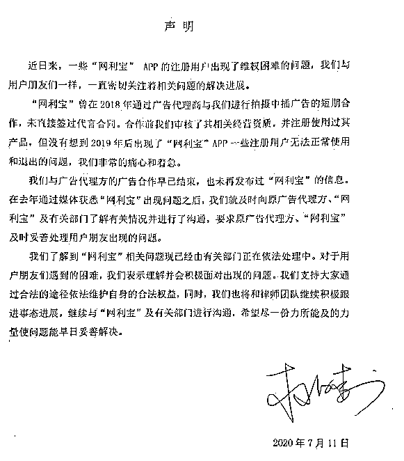
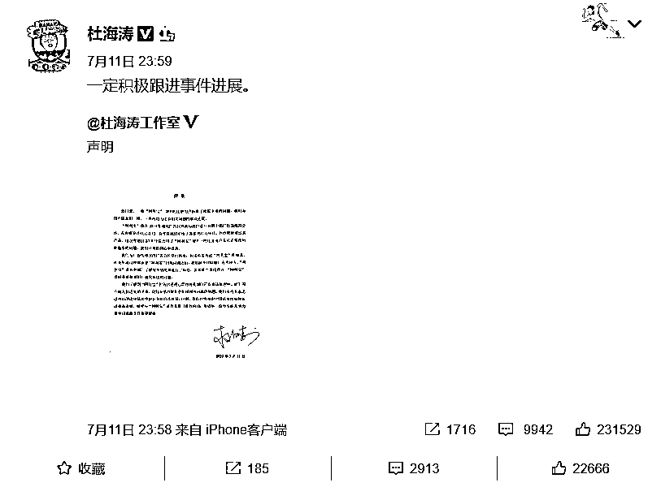
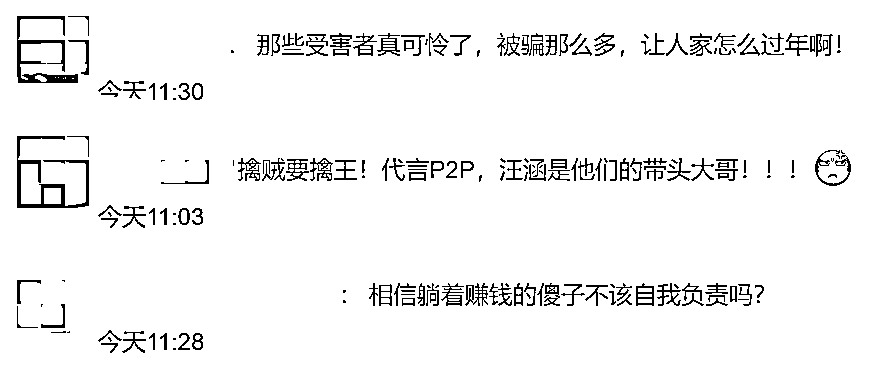
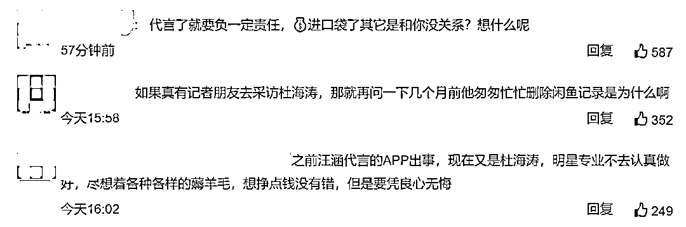
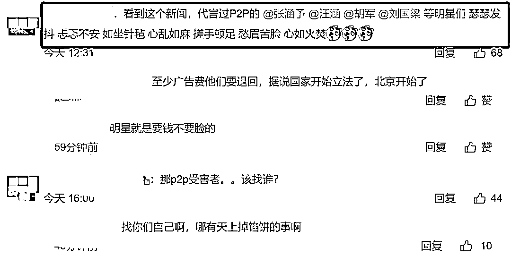
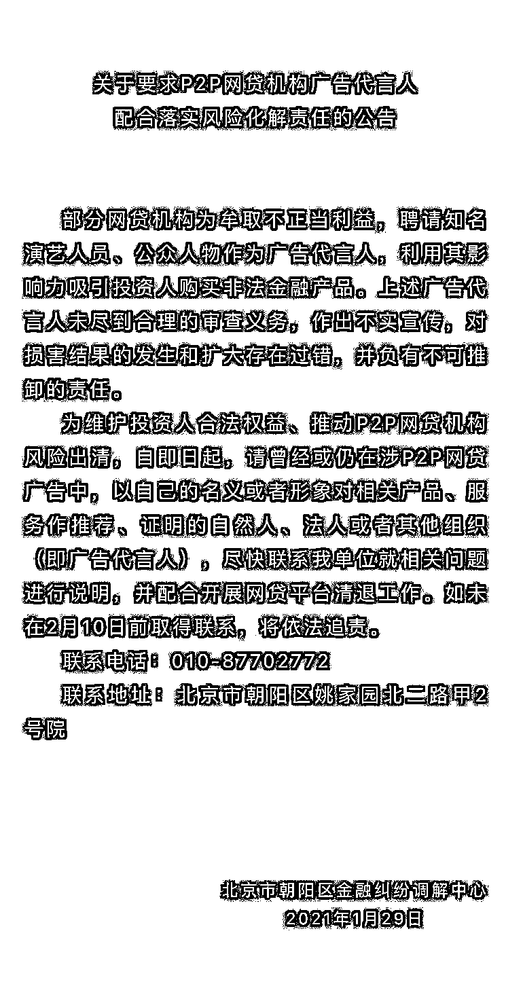
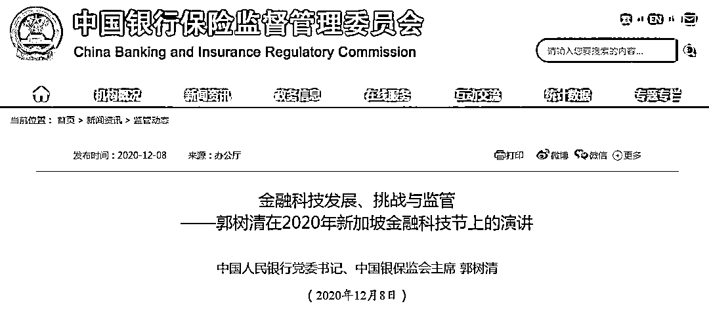

# 杜海涛又摊上大事：法院立案！网友点赞，明星们"瑟瑟发抖"

> 原文：[`mp.weixin.qq.com/s?__biz=MzIyMDYwMTk0Mw==&mid=2247509309&idx=1&sn=e2e145faa7c413c169b7bf372cd88bf0&chksm=97cb6e05a0bce713f5a9e163f372ad1c3788eb67a356149fc2b79ecbb031b53ff576864c60b8&scene=27#wechat_redirect`](http://mp.weixin.qq.com/s?__biz=MzIyMDYwMTk0Mw==&mid=2247509309&idx=1&sn=e2e145faa7c413c169b7bf372cd88bf0&chksm=97cb6e05a0bce713f5a9e163f372ad1c3788eb67a356149fc2b79ecbb031b53ff576864c60b8&scene=27#wechat_redirect)

    此前报道：[继汪涵、刘国梁危机后，杜海涛也翻车了？](http://mp.weixin.qq.com/s?__biz=MzIyMDYwMTk0Mw==&mid=2247501095&idx=3&sn=c0c6246cce998ec55e17034f941349a7&chksm=97cb0e1fa0bc8709b53b072d515fccfc7631a34028801c92043da4b4f517e2174e992d924a7a&scene=21#wechat_redirect)

   

   杜海涛以及其他代言爆雷 P2P 的明星们，这个年估计过得不踏实了。刚刚，消息爆出，网利宝受害者起诉杜海涛，称他拍视频声称投资网利宝躺着也赚钱。

    对此，法院已经立案审理，北京市朝阳区金融纠纷调解中心也发布公告称，广告代言人未尽到合理的审查义务，作出不实宣传，对损害结果的发生和扩大存在过错，并负有不可推卸的责任。

杜海涛被起诉

 法院立案：起诉符合法定受理条件 

    事情是这样的，2018 年，湖南卫视主持人杜海涛曾为网络投资平台“网利宝”拍摄数段视频广告。

[`v.qq.com/iframe/preview.html?width=500&height=375&auto=0&vid=r32278b9342`](https://v.qq.com/iframe/preview.html?width=500&height=375&auto=0&vid=r32278b9342)

    然而，2019 年“网利宝”爆雷。2019 年 5 月 17 日，“网利宝”已被北京市公安局朝阳分局经济犯罪侦查大队立案侦查。

“网利宝”爆雷后，很多投资者都无法拿回投资资金，有投资者认为杜海涛是网利宝的代言人，要求其帮忙要回血汗钱。然而杜海涛却发声明称：未直接签过代言合同，广告合作早已结束。 

    这让投资人怒了。一名山东投资者穆先生将杜海涛诉至法院，要求其赔偿相关损失。

    据投资人穆先生认为，相关广告中“工资就存网利宝、投资网利宝躺着也赚钱、安心又省心、老夫躺着赚钱、投资就用网利宝、我推荐网利宝”等广告语，涉嫌违反《广告法》相关法规，存在用让人误解的内容来欺骗、误导消费者，要求对“网利宝”广告中的经营者、发布者和代言人依法查处，并要求杜海涛赔偿其经济损失 4.6 万余元。

    2 月 4 日，山东东营一法院已立案审理此案。《受理案件通知书》称“我院已接到你诉杜海涛财产损害赔偿纠纷的起诉状，经审查，起诉符合法定受理条件，本院决定立案审理。”

    而近日，北京市朝阳区金融纠纷调解中心也发布公告称，部分网贷机构为牟取不正当利益，聘请知名演艺人员、公众人物作为广告代言人，利用其影响力吸引投资人购买非法金融产品。上述广告代言人未尽到合理的审查义务，作出不实宣传，对损害结果的发生和扩大存在过错，并负有不可推卸的责任。

**************杜海涛姐姐曾直播中怼网友：活该**

****    “网利宝”爆雷后，很多投资者都无法拿回投资资金，有投资者认为杜海涛是网利宝的代言人，投资人要求其帮忙要回血汗钱。****

****    2020 年 7 月，网友在杜海涛姐姐直播间里刷屏喊话，要求杜海涛发声，对此杜海涛姐姐称网友活该。****

 ****[`v.qq.com/iframe/preview.html?width=500&height=375&auto=0&vid=w3114s1eutw`](https://v.qq.com/iframe/preview.html?width=500&height=375&auto=0&vid=w3114s1eutw)**** 

****    虽然随后，杜海涛姐姐为直播中的不当言论发文道歉，但投资人并不买账。****

****杜海涛和他姐姐是龙凤胎，因此长相非常相近。她开直播多少有借着胞弟名声的意思，毕竟标题就是杜海涛姐姐。**** 

********

******************************************杜海涛曾公开澄清并非代言******

******    更具当时数据，网利宝累计成交金额为 259.71 亿元，累计注册用户为 327.80 万人；借贷余额为 30.26 亿元。截止去年 4 月 30 日，网利宝出借人数量为 40421 人，借款人数量为 3806 人，最大单一借款人待还金额占比 0.03%；累计代偿金额（第三方）500 万元，累计代偿笔数（第三方）3 笔。******

************

******    2020 年 7 月 11 日，杜海涛工作室发布声明称，“网利宝”曾在 2018 年通过广告代理商与其进行拍摄中插广告的短期合作，未直接签过代言合同，合作前其审核了相关经营资质还注册使用过产品，广告合作早已结束，未再发布过此产品信息。******

************

******杜海涛也转发称，一定积极跟进事情进展。****** 

******************************************************网友：其他代言明星瑟瑟发抖******

************

************

************

************************************

******除了杜海涛******

******哪些明星代言过 P2P？******

******    9 月 25 日，据报道，针对 P2P 平台“爱钱进”出借人的投诉，北京市东城区人民政府回复称，爱钱进平台已被东城区公安分局立案侦办，投诉人可持相关证据材料向公安部门报案。公开资料显示，爱钱进曾邀请汪涵、刘国梁等名人代言。后来，汪刘二人因爱钱进产品“爆雷”而陷入舆论漩涡。 ******

******    网上传出有投资者举牌喊出“爱钱进诈骗汪涵退代言费，汪涵请出来还我血汗钱”的标语。******

******    很多受骗的网友在各个平台都表示，当时都是看了汪涵的广告，相信汪涵才把钱放在涉事理财产品中，强调汪涵需要为此事负责。******

******    随后，汪涵、刘国梁就代言网贷平台道歉。 不久之后，湖南卫视主持人杜海涛也因代言网贷平台网利宝理财引发争议。******

******    随着网贷平台出现兑付问题，不断有明星代言人被“催债”。******

******    9 月 22 日，演员胡军的微博评论区突然涌入大量评论。网友主要反映的是，他们投资的悟空理财产品在下半年兑付延期情况增多，产品到期未回款。******

******    “有利网”的投资者在知名艺人杨迪微博下喊话，认为作为代言人的他应该为“有利网诈骗”一事给个交代。7 月 24 日，杨迪发表声明，称自己不是“有利网”代言人，录制宣传视频也未收取任何费用。目前，正在收集和了解情况，会协助此次事件被欺骗的用户追究到底。******

******    杨迪表示，对此次视频推荐承受损失的观众致以深深歉意，同时喊话“有利网”：“如网友所说属实，请给大家一个交代！”接着，杨迪工作室也发声表示，会协助受害者深究到底。******

******************************************北京开展清退 P2P 网贷广告代言人工作******

******    1 月 29 日，北京市朝阳区金融纠纷调解中心微信公众号发布关于要求 P2P 网贷机构广告代言人配合落实风险化解责任的公告。******

******    公告称，部分网贷机构为牟取不正当利益，聘请知名演艺人员、公众人物作为广告代言人，利用其影响力吸引投资人购买非法金融产品。**上述广告代言人未尽到合理的审查义务，作出不实宣传，对损害结果的发生和扩大存在过错，并负有不可推卸的责任。********

****    为维护投资人合法权益、推动 P2P 网贷机构风险出清，自即日起，请曾经或仍在涉 P2P 网贷广告中，以自己的名义或者形象对相关产品、服务作推荐、证明的自然人、法人或者其他组织（即广告代言人），**尽快联系我单位就相关问题进行说明，并配合开展网贷平台清退工作。******

****    如未在 2 月 10 日前取得联系，将依法追责。****

********

******************************************全国实际运营的 P2P 网贷机构全部归零******

****    2020 年 12 月 8 日中国银保监会主席郭树清在 2020 年新加坡金融科技节上演讲时再度表示，到 11 月中旬，实际运营的 P2P 网贷机构已经全部归零。****

********

****中国银保监会主席郭树清在 2020 年新加坡金融科技节上演讲表示，中国金融科技应用整体上在法律规范和风险监管等方面是“摸着石头过河”，遇到过不少问题，也积累了一些经验教训。**** 

****    提及经验教训时，郭树清以“全面整治 P2P 网贷机构”为其中的一个案例。郭树清称：****

****    P2P 网贷机构本来定位为金融信息中介，但在实践中，绝大多数机构事实上开展了信贷和理财业务。据统计，过去 14 年里先后有 1 万多家 P2P 上线，高峰时同时有 5000 多家运营，年交易规模约 3 万亿元，坏账损失率很高。近年来，我们持续清理整顿，到 11 月中旬实际运营的 P2P 网贷机构已经全部归零。****

****    郭树清表示，面对金融科技的持续快速发展，我们将坚持既鼓励创新又守牢底线的积极审慎态度，切实解决好面临的新问题新挑战。

    此外，郭树清还强调，要关注新型“大而不能倒”风险。少数科技公司在小额支付市场占据主导地位，涉及广大公众利益，具备重要金融基础设施的特征。一些大型科技公司涉足各类金融和科技领域，跨界混业经营。必须关注这些机构风险的复杂性和外溢性，及时精准拆弹，消除新的系统性风险隐患。****

****来源：中国基金报****

********

****← 向右滑动与灰产圈互动交流 →****

********