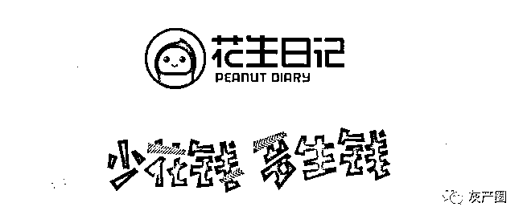
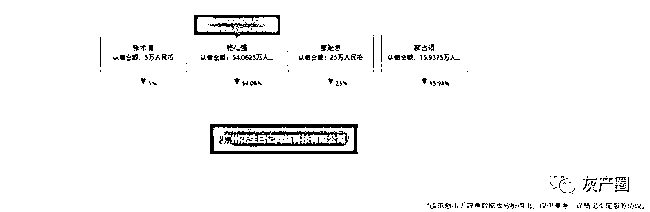
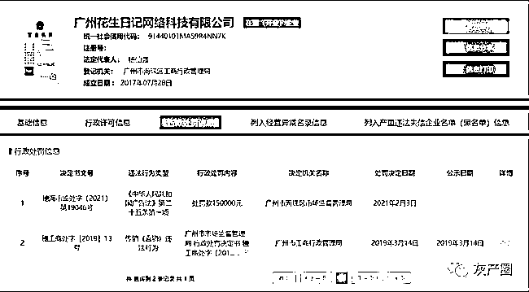
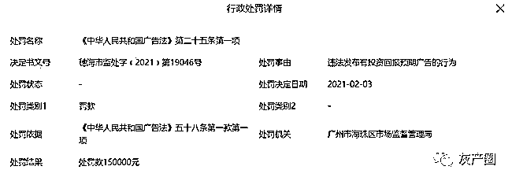
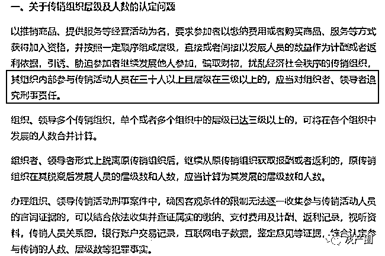
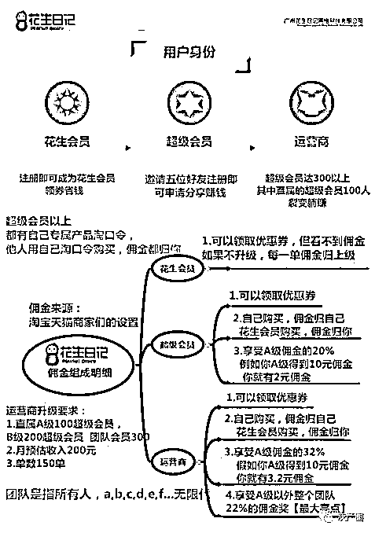
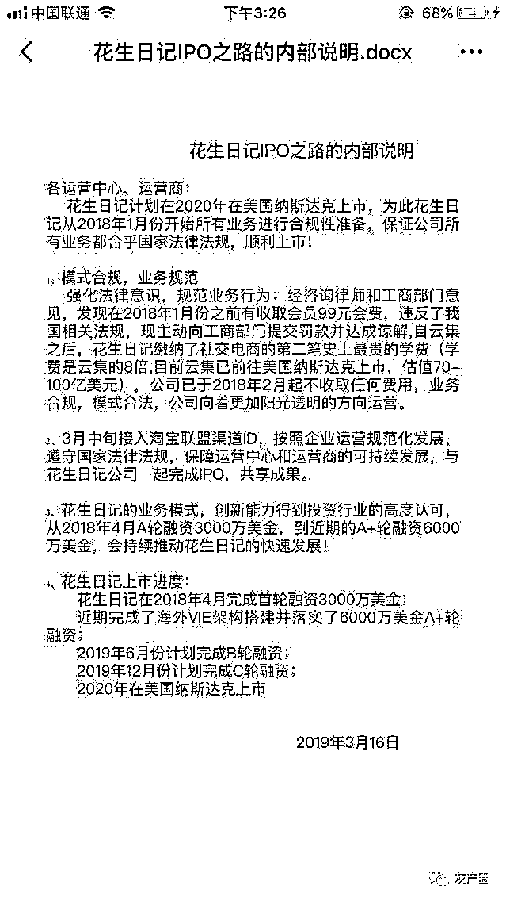
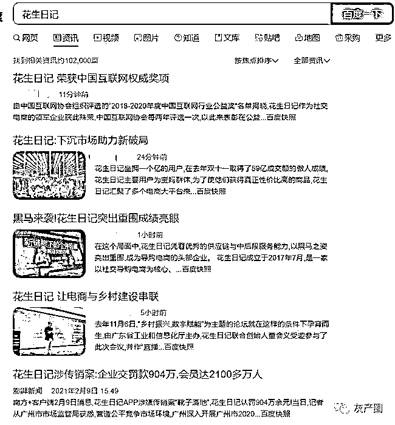

# 花生日记涉传销案：企业交罚款 904 万，会员达 2100 多万人

> 原文：[`mp.weixin.qq.com/s?__biz=MzIyMDYwMTk0Mw==&mid=2247509309&idx=2&sn=d9d87bffb95ca2728531be233f445db3&chksm=97cb6e05a0bce71361361a43d829ae55779b0ecaeb463113255d98015064012c4393bce13eb5&scene=27#wechat_redirect`](http://mp.weixin.qq.com/s?__biz=MzIyMDYwMTk0Mw==&mid=2247509309&idx=2&sn=d9d87bffb95ca2728531be233f445db3&chksm=97cb6e05a0bce71361361a43d829ae55779b0ecaeb463113255d98015064012c4393bce13eb5&scene=27#wechat_redirect)

　　此前报道：[花生日记涉嫌传销！会员竟达 51 级！被罚 7456 万！](http://mp.weixin.qq.com/s?__biz=MzIyMDYwMTk0Mw==&mid=2247494876&idx=3&sn=fab6b34928ec03e32419ec366f5187c8&chksm=97cb27e4a0bcaef27d1002db69a5ce0a29b8b3dbe1a499d0a66828935c3c3b91ab2173a2f012&scene=21#wechat_redirect)

      近日，据相关媒体报道，花生日记 APP 涉嫌传销案“靴子落地”，花生日记认罚 904 万余元。对于该处罚决定，广州花生日记网络科技有限公司表示，对执法部门调查的事实，公司违反了《禁止传销条例》第七条的相关规定，对此进行深刻检讨并全力配合开展合规整改工作。目前已缴纳相关罚款。

　　此外，根据海珠区市场监管局的行政处罚决定书，花生日记通过制定会员发展规则，要求“会员”交纳 99 元的升级费用升级成为超级会员，取得发展他人成为“超级会员”资格，牟取非法利益的行为涉传销。根据《禁止传销条例》规定，决定责令当事人改正违法行为，并对当事人作出没收违法所得 754 万余元，罚款 150 万元的处罚，共计 904 万余元。

　　

　　据天眼查 APP 显示，广州花生日记网络科技有限公司成立于 2017 年 7 月 28 日，实缴资本为 100 万元，杨仙强担任法人、执行董事兼总经理，持股 54.06%，廖贻志担任监事，持股 25%，郝占领持股 15.94%，张术清持股 5%。

　　

　　

　　值得注意的是，2021 年 2 月 3 日，该公司因“违法发布有投资回报预期广告的行为”被广州市海珠区市场监督管理局处罚 15 万元。

　　据悉，2019 年，“花生日记”APP 就曾因采取多层级佣金计提制度和会员升级费用等手段被指涉嫌传销。2019 年 3 月 14 日，花生日记遭广州市工商行政管理局罚没 7456 万余元。

　　据悉，此前社交电商花生日记通过设定“平台（分公司）—运营商—超级会员—超级会员... ...超级会员”的层级式管理架构，采取多层级佣金计提制度和会员升级费用等手段，发展会员 2100 多万人，会员层级最多达 51 级，会员遍及全国各省市，收取佣金金额达 456744401.69 元。

　　

　　根据国务院令第 444 号《禁止传销条例》文件显示，其组织内部参与传销活动人员在 30 人以上且层级在三级以上的，应当对组织者、领导者追究刑事责任。换言之，三级会员已经违法，而花生日记竟然多达 51 级。

　　“百足之虫，死而不僵”，花生日记遭到巨额罚款之后并没有销声匿迹。据悉，返利仍是花生日记吸引用户的手段，与此同时，多级分销的体系也有所收敛。

　　

　　据相关人士透露：“目前分为两个等级，其中注册账户既能成为超级会员，按照平台规则，自购可以拿到商家返佣，同时还能拿到直接推荐的用户的返佣佣金。只不过这样的方式能否持续维持增长，仍是个未知数。”

　　此外，2020 年 11 月 23 日，广东省通信管理局发布 APP 监管情况通报（2020 年 10 月）称，88 款 APP 存在数据安全隐患、违反用户个人信息保护规定等问题。其中就包括广州花生日记网络科技有限公司旗下的“花生日记”APP(4.7.8 版本)。

　　据通告显示，花生日记违规收集使用用户个人信息；更换头像时只同意存储权限不同意相机权限无法正常使用，违反必要原则；且未在隐私政策中逐一说明第三方信息共享，同时存在 Activity、Service 组件导出风险。广东省通信管理局要求包括花生日记在内的上述 APP 进行责令限期整改、跟踪复测，甚至下架、行政处罚等严厉处置。

　　

　　我们注意到，在资本的道路上，花生日记也飞速前进，此前完成了海外 VIE 架构建设，并计划在 2019 年 6 月完成 B 轮融资，2019 年 12 月计划完成 C 轮融资。根据亿邦动力报道，从一份疑似花生日记的内部文件了解到，花生日记还计划 2020 年在美国纳斯达克上市，但至今仍未有任何消息。

　　

　　更值得注意的是，面对网络媒体的质疑，部分媒体仍在为花生日记“歌功颂德”。

来源：经济新资讯

← 向右滑动与灰产圈互动交流 →

