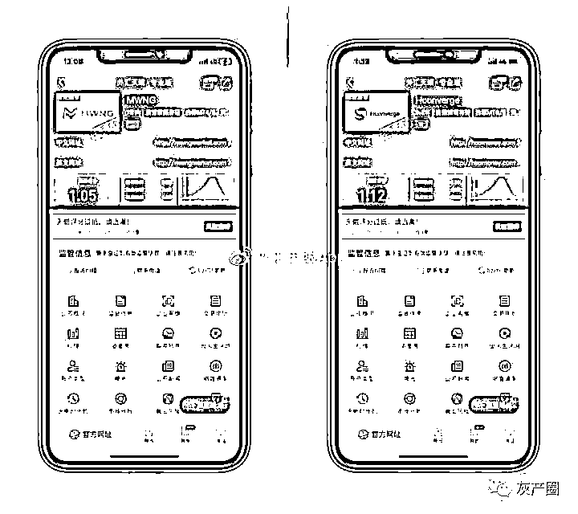

# 深不可测的外汇灰产，一个黑平台竟牵连出十几家平台

> 原文：[`mp.weixin.qq.com/s?__biz=MzIyMDYwMTk0Mw==&mid=2247509309&idx=3&sn=2166bf2b7fcffc69f257b82c0b442051&chksm=97cb6e05a0bce7132deb73d49b9faf3b5014cf56d432f61dff79465ecd5f830f4dafab6f781f&scene=27#wechat_redirect`](http://mp.weixin.qq.com/s?__biz=MzIyMDYwMTk0Mw==&mid=2247509309&idx=3&sn=2166bf2b7fcffc69f257b82c0b442051&chksm=97cb6e05a0bce7132deb73d49b9faf3b5014cf56d432f61dff79465ecd5f830f4dafab6f781f&scene=27#wechat_redirect)

在外汇行业有句玩笑话，“一入外汇深似海，从此钱包是路人”，这背后的原因当然有投资者投资亏损，但更多的是遇到黑平台，所有的钱被骗走。

　　在外汇灰产圈中，日收入过万并非夸大，也正因如此，无数不法分子知法犯法，当起了骗子，如今的外汇市场可以说是遍地都是黑平台。这其中一方面是因为骗子越来越多，另一方面则是这条产业链分工越来越明确，造一个黑平台太容易。这种现象的标志便是深扒一个黑平台往往拔出萝卜带出泥，牵扯出无数黑平台。

　　近日收到一起针对交易商 NWNG 的曝光投诉，顺着投资者提供的线索，我们发现了许多交易商与该平台有关联。

典型杀猪盘诈骗

**受害者自述：**我是通过 Instagram 和这位网友认识的，他在 3/10/2020 来跟我打招呼，之后就添加到 WhatsApp 聊天，过程男网友对我有要追求的意思。

　　男网友自我介绍名字：黄穆翔 1986 年男网友，在网络骗取我想共度未来结婚在一起的心态让我一起投资，男网友发来的链接设下的诈骗平台，会带我获取小小盈利后，男网友会说有大好行。情让我们多投入资金，男网友会利用自己的方式入金到我的 MT4 帐号里之后我要去出金,确说钱包地址出现异常，被冻结。

　　前后受害者损失共 3 万美元。该受害者的经历是典型的杀猪盘诈骗，之前已曝光过多次，各位投资者需引以为鉴。

偷龙换凤，转移平台账户

　　据该投资者描述，起初入金的平台并不是交易商 NWNG，而是 Hconverge。

　　这两个平台在中，一个评分 1.05 分，一个评分 1.12 分，都没有任何监管，无疑都是黑平台。

　　两个平台现在还在运营中，而且交易商 Hconverge 还有多个网址，其原因很可能是之前的客户有投诉，因此换个皮，诈骗刚入门的外汇小白。

　　再调查这两个公司的工商信息，两个平台都是国人在英国注册的壳公司。这些交易商之所以换平台，原因有很多，基本上都是前平台出了问题，换个皮继续诈骗，又或者和其他犯罪分子达成协议，将你卖给了其他的骗子。

　　其实各位投资者认真想想就能看出这是个骗局，账户转移怎么可能这么容易，再者更换平台监管也得换，不同平台牌照不能共用。

　　再查看 Hconverge 的关系族谱，多达 19 个相关白标，全部飘红，不是无监管就是套牌，无一例外。

外汇灰产链

　　通过查询交易商 NWNG，在曝光栏中，有投资者曝光该平台假冒平台 UBFX。

UBFX 原本是一个区块链公司。骗子假冒该公司，做了一个假的官网，网址为：https://www.ubex.xyz/，通过调查该网址，我们发现许多问题网站。

　　查询该网址的注册信息显示，该平台联系人为硕胡，反查该网站能看到不少黑网站。

　　如黑平台 Loex、Gold Sachs、Coinbene，这些网站扫描下载二维码就会显示，**该网址已被投诉，包含恶意文件，已停止访问。黑平台无疑。**

　　更有意思的是在其中还能找到曾经的外汇黑平台网站，下面这个就是曾经假冒大通金融的黑平台网站。

　　除此之外还有其他博彩类的非法网址。

结语

　　现如今的外汇市场，黑平台已经产业分工明确，有人制作网站、有人做黑平台、还有人专门从事黑平台之间的客户交易……正因如此，才会出现一个黑平台背后关联多个平台的现象。

　　一个平台竟能牵扯出这么多的黑平台，足见市场上有多少黑平台，投资者一定要小心谨慎，审核好交易商，切勿被“知心网友”，被“高利”所诱惑。

最后提醒广大投资者，在进行外汇交易前，一定要对平台进行多方面的考虑，

来源：外汇天眼

← 向右滑动与灰产圈互动交流 →

