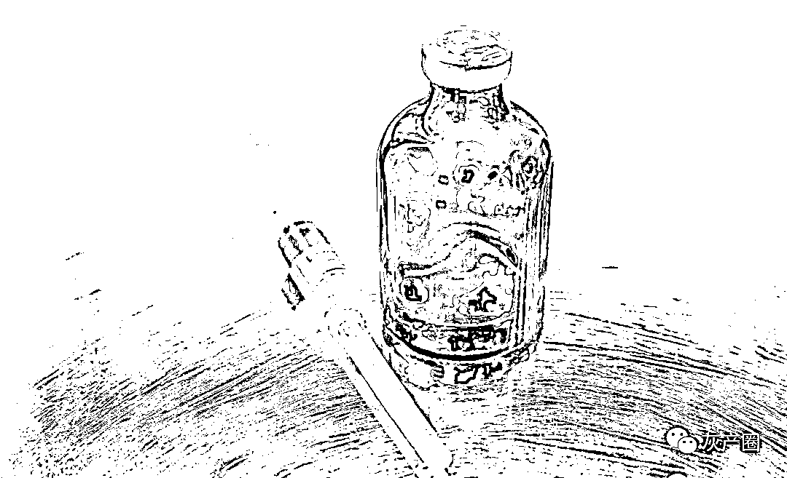
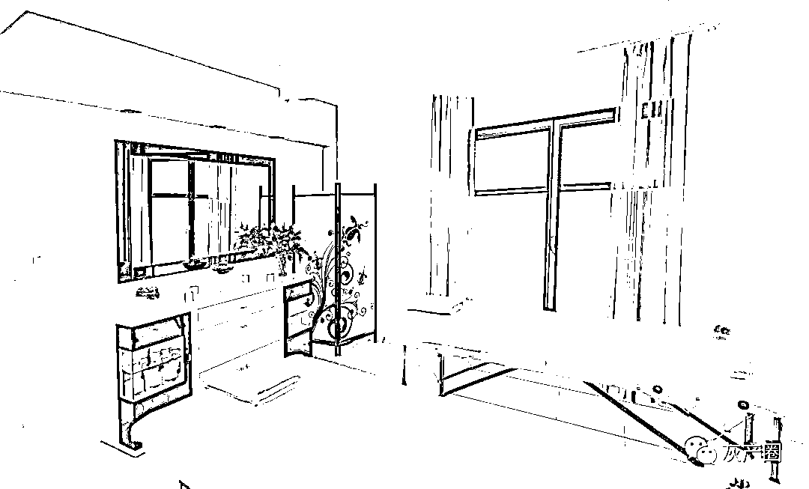
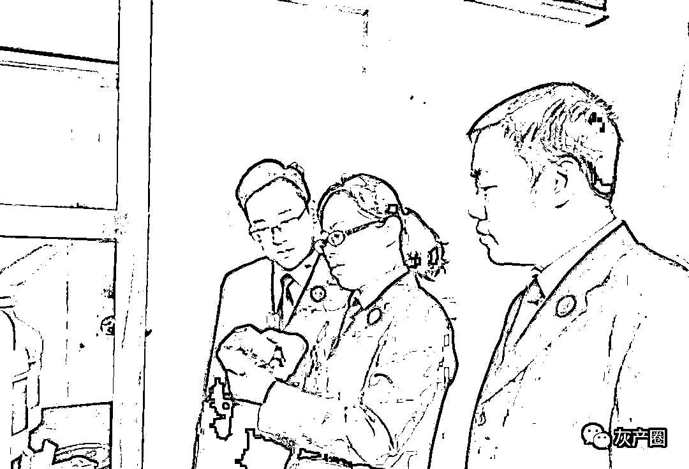

# 成本不到 10 元，效果竟“跟真的一样”？

> 原文：[`mp.weixin.qq.com/s?__biz=MzIyMDYwMTk0Mw==&mid=2247509309&idx=4&sn=b6ba87ffd7b937172974097768e3c521&chksm=97cb6e05a0bce713f5a6099e3397c69e3ed692c1237b1a77f3dfb3a4f182d605248ee2c89931&scene=27#wechat_redirect`](http://mp.weixin.qq.com/s?__biz=MzIyMDYwMTk0Mw==&mid=2247509309&idx=4&sn=b6ba87ffd7b937172974097768e3c521&chksm=97cb6e05a0bce713f5a6099e3397c69e3ed692c1237b1a77f3dfb3a4f182d605248ee2c89931&scene=27#wechat_redirect)

**检察机关会同公安、市场监管部门** 

**多次研讨，数次取样送检**

**最终涉案的“保妥适”仿冒产品**

**被认定为假药**

**……**

割双眼皮、打瘦脸针等“微整形”医疗美容项目越来越受消费者青睐，利益驱使下，一些不法商家动起歪脑筋，形成一条隐蔽的黑色产业链。

一支成本不足 10 元的仿冒“保妥适”，经过层层分销，利润竟翻了百余倍，且形成了涉及六省十地“产、供、销”一条龙的黑色产业链，给社会经济秩序和群众健康带来极大危害。**近日，天津市红桥区检察院审查起诉的梁某等 11 人涉嫌非法生产、销售假药案，将微整形美容行业背后的秘密大白于天下。**

成立公司

批量生产“赚大钱”

图片来源于网络，与正文无关

梁某原为重庆某制药公司的技术员，2009 年辞职后长期从事化妆品经营。近十年的摸爬滚打，练就了他敏锐的市场嗅觉。2018 年初，他从同行处听到有一种新药“保妥适”，这是一种临床和美容用注射药品，产自美国，主打祛皱、瘦脸，耐受性高、稳定性强、致敏性较低。 

“‘保妥适’可烧钱了，一针就得两三千呢！”同行的这句话让他动了心：正品这么贵，那要是找人仿制，成本就低多了，而且这效果都是因人而异，一般人发现不了。

2018 年 7 月，通过朋友的介绍，梁某认识了杜某。杜某一直在湖北某生物制药公司任职，具有丰富的生物技术研发经验，正希望通过技术变现赚外快。梁某很快通过南京某生物科技有限公司制作了必须使用的菌种，并交由杜某，由杜某进行研发。

**两个月后，杜某成功研制出仿冒“保妥适”产品，一瓶成本不到 10 元。梁某亲自试用后，觉得效果“跟真的一样”，便直接将样品发给客户使用，反馈很好。**经过一系列产品质量和市场需求调查后，二人信心满满，计划将产业做大。

承办此案的天津市红桥区检察院检察官杜颖向记者介绍，两名被告人从 2018 年底开始，陆续在山东日照、重庆永川、河北涿州的代工厂进行工艺试验，前后生产了几批向外销售。但由于设备问题产品合格率不高，于是，他们投资了 100 余万元成立公司进行批量生产。

杜某随后又从其他公司挖来自己的几个老朋友，说服他们技术入股，并承诺“一年最少给 30 万元”。**几人明知这是生产假药，但想想占股分红带来的高额回报，还是干了起来。**

经过反复试验，几人终于打磨出一套完整的制作方法，一瓶底价不足 10 元的仿冒“保妥适”肉毒素冻干粉就诞生了。

层层转销

渐成黑色产业链

图片来源于网络，与正文无关

在寻找上游“技术”支持的同时，梁某并没有闲着，从 2018 年底第一批仿冒产品制成开始，就积极拓展下游销售渠道。他想起了以前认识的某药业工作人员洪某。 

“洪老板，记得之前说的货吗，我这边有了，你来看看？”经过一番讨价还价，梁某最终以单价 20 元的价格，向洪某出售肉毒素冻干粉。经过中间商层层转销，2019 年 3 月，部分肉毒素冻干粉到了经销商吴某、崔某和孙某手里。

为了以假乱真，孙某等人想了很多办法：**采用制装分离的模式，将冻干粉、说明书、标签、内托、包装盒分别寄送至仓库，由“自己人”进行包装，在外包装上用的是“保妥适”在国外销售的版本，这样“货源”可信度就大大增加了。**

除了向固定的客户发货之外，崔某和孙某还不断扩大经营。他们在山东省济宁市某别墅区租用了一幢别墅当“大本营”，招募了 9 名销售员向外销售，并承诺：“产品没有统一价格，公司底价不低于 65 元，大家可以自行加价出售，差价归自己所有；你们只负责卖产品，发货和售后都由公司负责。”

经过简单的美容知识、包装工作培训后，借助网络电商平台、微信群组、参加美博会推广等，销售们锁定目标人群，努力向外推销仿冒“保妥适”的 A 型肉毒素，产品流向众多美容院、整形工作室和广大消费者。据了解，该产品在美容院售价普遍在 1000 元以上，利润翻了百余倍。

杜颖介绍，这款仿冒产品也含有一些有效成分，祛皱、瘦脸效果因人而异，大部分使用者使用后并无明显不适，加之价格相对较低，在市场上大受欢迎，但安全性毫无保证。直到一名家住天津市红桥区的消费者在使用后感到不舒服，怀疑是假药并报警才使该案浮出水面。

经公安机关侦查后分别在山东省济宁市、湖北省武汉市等六省十地将 11 名犯罪嫌疑人抓获，并缴获仿冒“保妥适”“粉毒”“白毒”等进口品牌的 A 型肉毒素 5 万余支。

抽丝剥茧

破解疑难问题

检察官在查看仿冒的“保妥适”

“由于该案生产、储存、销售地点涉及湖北、山东、广东等六省十地，且经过数名中间商层层转手，交易量大、交易品种庞杂、交易方式隐蔽，给侦查取证工作带来很大挑战。我院在第一时间提前介入、研判案情，引导侦查。”杜颖说。 

据了解，案件办理正值《中华人民共和国药品管理法》修订后实施期间，相关法条发生变化，该案究竟是生产、销售假药还是非法经营？

**“为准确界定案件性质，我们会同公安、市场监管部门多次研讨，数次取样送检，结合中国食品药品鉴定研究院的检测报告及‘保妥适’生产厂家 Allergan 公司出具的鉴别说明，逐步明确鉴定了所需的证据支撑，最终涉案的‘保妥适’仿冒产品被认定为假药，确定该案以涉嫌生产、销售假药罪移送审查起诉。”**杜颖对案件定性问题的解决显得非常高兴。

该案移送天津市红桥区检察院审查起诉。杜颖和其他检察官逐份梳理案件事实和证据，撰写了 13 万字的审查报告，逐条逐项列明疑点难点，发现在已扣押涉案假药的数量、各犯罪嫌疑人销售金额、梁某犯罪主观故意等重点问题上缺少足够的证据支撑。

为此，检察官与公安民警一起到仓库清点扣押药品，理清与案件无关的扣押物。经反复核对，从扣押的 5 万余支药品中清点出不同包装的仿冒“保妥适”产品 1 万余瓶，与公安机关再次对犯罪嫌疑人进行讯问，明确每名犯罪嫌疑人的具体销售金额。同时，就犯罪嫌疑人犯罪主观故意、销售金额等重点问题列出 10 余条补充侦查意见，通过补查重报的光盘 U 盘、电子证据检验报告、犯罪嫌疑人口供等进一步夯实证据链条。经查，梁某等 11 人共生产、销售“保妥适”等肉毒素冻干粉 1.3 万瓶。

前不久，**红桥区法院作出判决，采纳了检察机关的公诉意见，分别对梁某等 11 人作出不同刑期的有罪判决并处以罚金。**

杜颖在采访结束时对记者说，借此提醒广大爱美人士，医疗美容要选择有执业许可证的医疗机构和有资质的医生，特别是在购买、使用药品时，要检查药品外包装，仔细辨别产品批号、生产日期、有效期等信息是否符合国家规定，切勿贪图便宜，落入陷阱。

来源：检察日报

← 向右滑动与灰产圈互动交流 →

