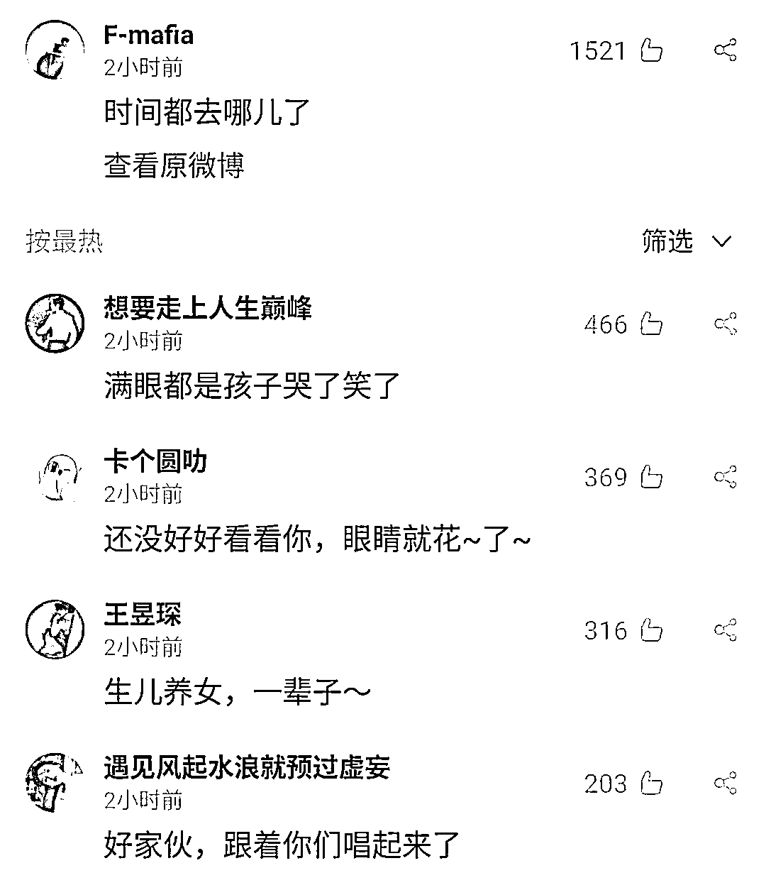

# “一天已不足 24 小时”，网友沸了

> 原文：[`mp.weixin.qq.com/s?__biz=MzIyMDYwMTk0Mw==&mid=2247509309&idx=5&sn=96be44be35a8cceb274fb9c87bc7cc36&chksm=97cb6e05a0bce713f8ff0faca9e3321a13b9e8f5c13490655a84d86547e4ce20a6033ebd11e7&scene=27#wechat_redirect`](http://mp.weixin.qq.com/s?__biz=MzIyMDYwMTk0Mw==&mid=2247509309&idx=5&sn=96be44be35a8cceb274fb9c87bc7cc36&chksm=97cb6e05a0bce713f8ff0faca9e3321a13b9e8f5c13490655a84d86547e4ce20a6033ebd11e7&scene=27#wechat_redirect)

近日，

“地球自转加快一天已不足 24 小时”

登上微博热搜第一到底是怎么回事？

据央视新闻，研究显示，**从 2020 年年中以来，地球的自转速率呈加快趋势，自转速度已达过去 50 年来最快速度，这意味着，一天已不足 24 个小时了！**

[`v.qq.com/iframe/preview.html?width=500&height=375&auto=0&vid=u32278zmp8s`](https://v.qq.com/iframe/preview.html?width=500&height=375&auto=0&vid=u32278zmp8s)

地球自转为什么突然变快了？全球变暖在其中产生哪些影响？2021 年会过得更快吗？

据新华视点报道，科学地来讲，**2021 年确实会比以往年份稍短。**

作为浩瀚宇宙中的一员，地球无论是公转还是自转，都会受到星际间作用力的影响，在不断地加减速中调整。仅就当下而言，**地球的自转在加快，意味着一天在变短。**

“专业数据显示，现在时间的流逝比过去半个世纪的任何时候都要快。这是因为地球自转速率为 50 年来最快。”科普专家、中国科学院国家授时中心党委书记窦忠表示，相关科研发现，自 2020 年的年中以来，地球的自转速率呈现加快趋势。

图为 2020 年 1-12 月地球自转速度变化。自 2020 年年中，地球的自转开始加速。中科院国家授时中心供图

地球的自转速率比以往更快，能够说明一年会更快过去？这要从时间的测量说起。时间测量的基础单位就是秒，再细化还有毫秒、微秒、纳秒等等。

如今用于测量时间的高精度原子钟已达到阿秒级，即 10 的负 18 次方秒（10－18）。有多短？总之就是很短了，人体感官察觉不到的那种短。自 20 世纪 60 年代以来，高精度原子钟一直以超高精度记录每日时长。研究人员在观测原子钟时发现，**在过去 50 年里，地球完成一次自转所需的时间很少短于 24 小时，即 86400 秒。然而，如今一天的时长则短于 86400 秒。**

中科院国家授时中心工作人员正在一组铯原子钟前工作。刘潇 摄

窦忠表示，根据英国媒体近日的报道，研究人员发现**2020 年的 7 月 19 日短了 1.4602 毫秒，成为有记录以来最短的一天**。这样的极细微差别，尽管在人们的日常生活中无从体现，但却**会在通讯、电力、导航等领域产生重要影响。**

那么，地球自转变快的原因是啥？可能与地球表面形态的变化有关。就像花样滑冰运动员或芭蕾舞者做转体动作身体越聚拢转速能越快一样，当物质向更中心聚集时，地球的自转也会变快。以全球气候变暖为例，**当冰川、冰盖融化流入海洋，地球质量就进行了重新分配，物质较以往更靠近中心，那么地球自转就会变快。**

地球自转示意图。制图：刘潇

“但是，地球表面形态的变化终究只是暂时的。**从长远来看，地球转速越来越慢的大趋势不会改变**。”窦忠表示，因为日月潮汐引力的作用，相当于一直为地球自转轻点着“刹车”。而如果变慢达到了一个临界点，全世界的时间工作者就要启动“闰秒”这个撒手锏。

据悉，近 50 多年来，我们已经加了近 30 个“闰秒”，还没有减过秒。

上一次加秒，发生在北京时间 2017 年 1 月 1 日 7 时 59 分 59 秒后，增加 1 秒出现 7 时 59 分 60 秒。

而此次因为地球自转速率呈加快趋势，专家称，面临的可能是首次“负闰秒”，即“减一秒”，**但是否减秒目前没有定论。**

看到热搜上这个消息，打工人发出了灵魂疑问，最关心的果然是……

有网友回应道，变少的不是上班时间，而是……

有网友问道，那么，一天还是 24 小时吗？

还有网友发出了声音评论……

看到这，你已花了好几分钟阅读本文

读完有没有种想要“争分夺秒”的感觉？

**愿大家牛年牛气冲天！**

来源：澎湃新闻、南方都市报、自央视新闻、新华视点

← 向右滑动与灰产圈互动交流 →

