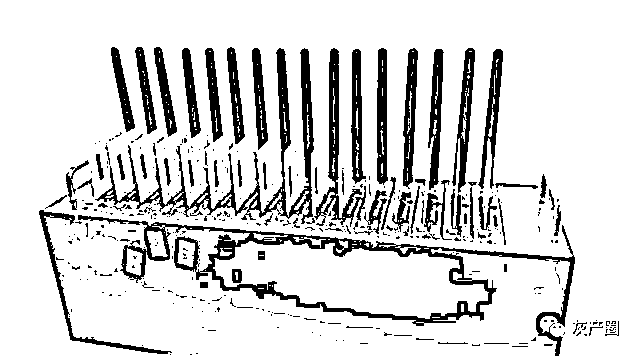
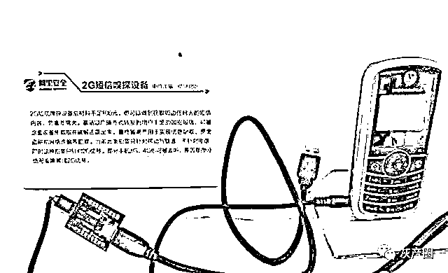
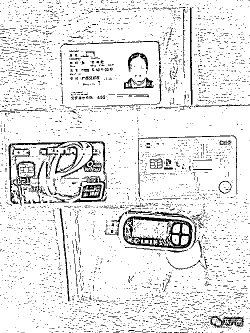
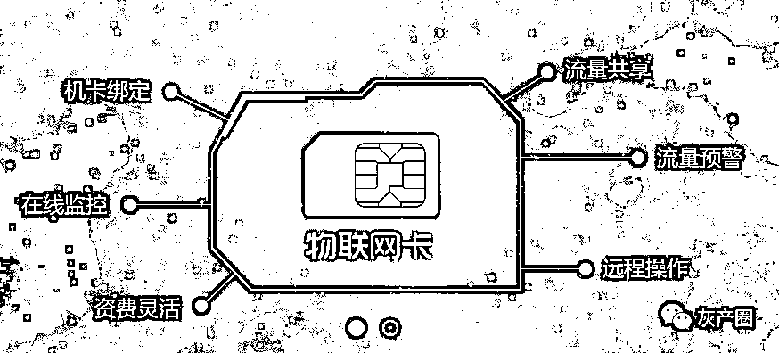
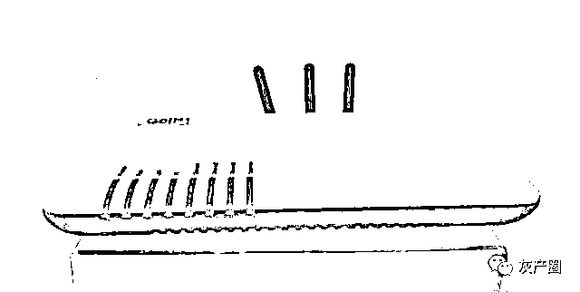
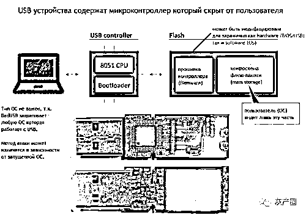
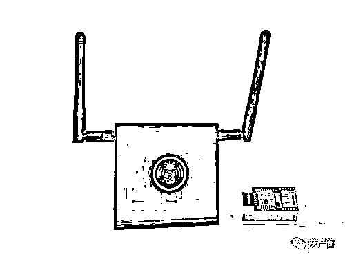
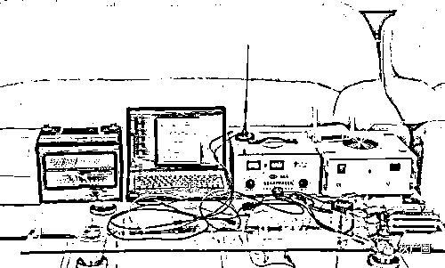

# 信息窃听、薅羊毛、电信诈骗和流量劫持……网络黑灰产业链工具大曝光！

> 原文：[`mp.weixin.qq.com/s?__biz=MzIyMDYwMTk0Mw==&mid=2247509383&idx=1&sn=c05a860a92cda605fee973210d9bd546&chksm=97cb6ebfa0bce7a9049da0732987079a695a9ab77a8940f8df3e692115389b75e03d6ab41e62&scene=27#wechat_redirect`](http://mp.weixin.qq.com/s?__biz=MzIyMDYwMTk0Mw==&mid=2247509383&idx=1&sn=c05a860a92cda605fee973210d9bd546&chksm=97cb6ebfa0bce7a9049da0732987079a695a9ab77a8940f8df3e692115389b75e03d6ab41e62&scene=27#wechat_redirect)

信息窃听、薅羊毛、电信诈骗和流量劫持……

互联网时代，信息安全事件频发，公民个人信息是如何被泄露、流入黑灰产业链的？

设备 1：猫池

涉及黑灰产类型：大规模薅羊毛、电信诈骗

作案方法：在猫池设备上，可以同时管理大规模的电话手机卡，通过配套的软件可以实现同时接收、发送短信，拨打电话的功能。黑灰产的猫池上的电话卡，常为通过黑产渠道拿到的非实名认证的廉价电话卡。猫池常被黑灰产用来在各大电商平台上进行大规模网络手机账号垃圾注册，为薅羊毛提供必须的账号资源。

设备 2：2G 短信嗅探设备

涉及黑灰产类型：电信诈骗、信息窃听

作案方法：2G 短信嗅探设备可以做到获取周边任何人的短信内容，危害非常大。基站以广播方式转发到用户手里的加密短信，可被这套设备所截取并破解还原出来，最终被黑产用于实现信息窃取、资金盗刷和网络诈骗等犯罪。当前此类犯罪只针对移动与联通，不针对电信，同时这种犯罪只针对 2G 信号。部分手机 3G、4G 也可被监听，原因是部分信号会降频成 2G 信号。

设备 3：公民个人信息四件套

  

涉及黑灰产类型：电信诈骗、洗钱

作案方法：黑产人员经常到偏远乡村，以 100 元到 300 元不等的低廉价格，购买当地农民的身份证，以及用这些身份证办理的银行卡和手机卡。最终形成了黑产口中的个人信息四件套，即“银行卡，身份证，手机号卡，网银 U 盾”。购买者多将“四件套”用于电信诈骗、伪卡盗刷、洗钱、销分等犯罪活动中。

设备 4：移动 AP+物联网卡

  

涉及黑灰产类型：电信诈骗

作案方法：匿名防追踪是电信诈骗人员最关注的自保措施。近年来，黑产已经远离公共家庭无线、有线网络环境，转向了便携可移动的无线设备，来达到反追踪的效果，便携、低价的移动 AP 已成为黑产常用移动网络设备。此外，产生的流量卡更多是来自实名制度还未完全覆盖的物联网卡。无固定点位，网络身份未实名，这些特点加大了办案人员的侦察难度。

设备 5：VOIP/GOIP 网络电话设备

涉及黑灰产类型：电信诈骗

作案方法：根据公安部的资料，近年发生的电信诈骗案中，使用网络改号电话作案的占 90%以上。VOIP 协议能够将网络语音转成网络数据包，用户收到的存储在该网络数据包中的来电号码可被修改，不法分子正是使用此原理将来电号码进行了任意替换。当前展示的 GOIP 设备是近年来诈骗电话的另外一个方向，该设备能够将传统电话信号转为网络信号，从而起到不法分子隐藏真实身份反侦察的效果。

设备 6：BadUSB

  

涉及黑灰产类型：病毒木马

作案方法：2014 年，位于柏林的 SR 安全研究实验室专家发现了一个代号“BadUSB”的重大 USB 安全漏洞，该漏洞影响全球数十亿设备。使用 BadUSB 设备，可以对目标主机发起物理攻击，插入 U 盘后，该设备可以自动运行提前设置好的攻击代码，从而控制被害人的电脑，更为致命的是，由于是硬件发起的攻击，因此当前还没出现一个有效的解决方案。提醒：为了安全起见，日常请勿随意使用你无法确保安全的 USB 设备。

设备 7：大菠萝 WiFiPineapple

涉及黑灰产类型：信息窃听、流量劫持

作案方法：大菠萝路由器的原理是网络中间层入侵劫持，这种设备可以伪装出一个免费的 WiFi 信号，让用户上钩从而达到获取用户个人信息或推送伪装过的后台程序的目的。当任意用户连接上由此设备创建的 WiFi 时，用户的浏览记录就会被监听，用户访问网页时候的站点也可以随时被修改替换。经过简单配置，此设备也可以强制使附近的客户端连接到自己创建的伪装 WiFi ，而不需要用户去主动连接。提醒：请谨慎使用公共场合的 WiFi 热点。

设备 8：伪基站

  

涉及黑灰产类型：电信诈骗

作案方法：伪基站设备是嫌疑人私自组装生产的一种违法高科技仪器，能够强制连接用户手机信号，摄取一定半径范围内的手机信息，可以任意冒用手机或公用服务号码强行向用户手机发送短信。伪基站设备实施违法犯罪是一种新型犯罪，涉及地域广、社会危害大，严重危害国家通讯安全，扰乱社会公共秩序，影响人民群众安全感。

来源：新疆反电信网络诈骗中心

← 向右滑动与灰产圈互动交流 →

