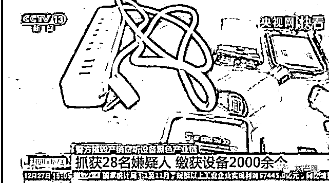
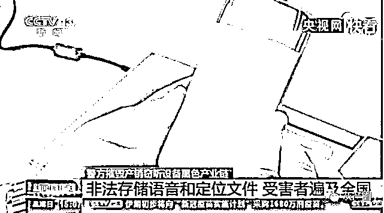
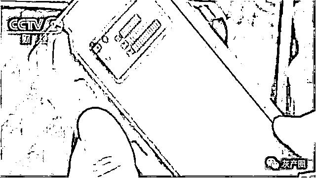
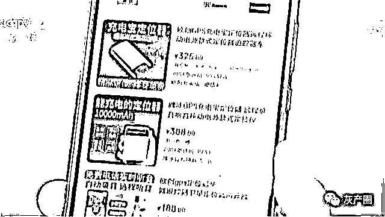
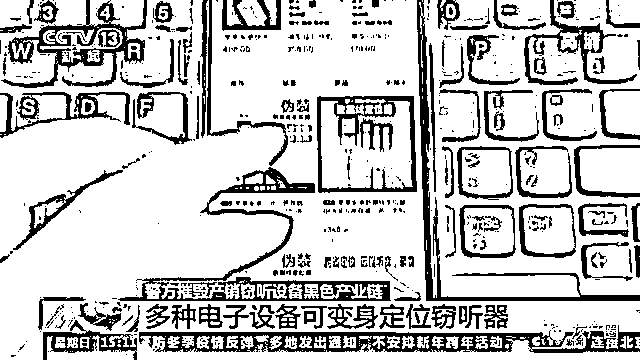
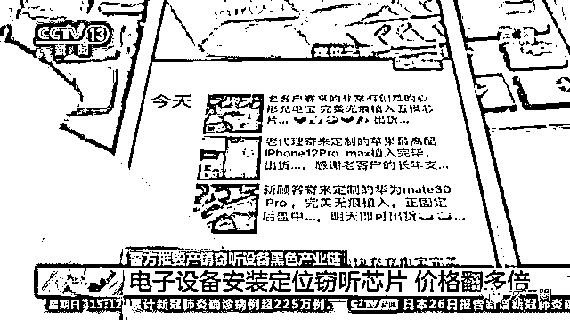
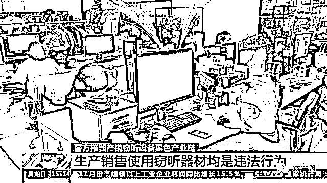

# 定位、窃听、偷拍网络黑色产业链

> 原文：[`mp.weixin.qq.com/s?__biz=MzIyMDYwMTk0Mw==&mid=2247509383&idx=2&sn=4d575b0a34804e3b01dc71ddf46771ce&chksm=97cb6ebfa0bce7a9513bee6aa2206362a74202c7eaceefc3c2c14a187d5d97cc99c85fb3baa2&scene=27#wechat_redirect`](http://mp.weixin.qq.com/s?__biz=MzIyMDYwMTk0Mw==&mid=2247509383&idx=2&sn=4d575b0a34804e3b01dc71ddf46771ce&chksm=97cb6ebfa0bce7a9513bee6aa2206362a74202c7eaceefc3c2c14a187d5d97cc99c85fb3baa2&scene=27#wechat_redirect)

　近日，江苏省南京警方摧毁了一条包括生产厂家、销售代理在内的生产销售定位、窃听、偷拍设备的网络黑色产业链条，抓获犯罪嫌疑人 28 名，缴获相关设备 2000 多个。

　　警方调查发现，**这****些设备被生产者伪装成充电宝，可以在使用者不知情的情况下，被人远程定位、轨迹查询、远程录音等，涉嫌侵犯公民个人信息。**

　　此外，警方查获的企业，他们运维的网络平台上存储了大量非法收集的语音文件和定位文件，受害人遍及全国 31 个省、市、自治区。

　　

　　

**GPS 定位器变身窃听器 有公司因此损失上千万******

****　　一提起窃听，很多人可能最先想到的都是谍战剧的剧情。****

****　　然而，这些我们在电影电视里看到的情节很有可能就发生在我们身边。****

****　　今年 8 月，央视网曾报道，北京一家安防公司就因为商业机密被窃听，企业竞标失败，蒙受了重大损失，而窃听器竟然是我们常见的 GPS 定位器。****

****　　在北京一家安防公司，记者见到了这样一个小黑盒。工作人员告诉记者，企业讨论营销方案的会议是高度保密的，但没人想到，座椅下却藏着这个小黑盒。****

****　　**由于商业机密泄露，企业竞标失败，从而蒙受了上千万元的损失。******

****　　这种小黑盒子，叫做 GPS 定位器，它广泛用于汽车防盗和企业运营车辆管理。****

******** 

****　　而这样的产品是如何用来非法窃听的呢？************

****　　记者尝试买了一个产品进行测试，拆开产品的包装，是一个火柴盒大小的塑料盒，记者按使用说明书在手机上安装好 APP，打开 APP，果然在上面就能实时观察车辆的行驶轨迹。****

****　　接下来要尝试的是远程监听。两位记者约定，一位和定位器一起留在车内，另一位记者回到办公室准备听音。****

****　　结果证实，不管被窃听者的声音是大还是小，监听到的声音就像跟对方打电话那么清楚。此外，在 APP 的界面中，还有一个“远程录音”的按钮，启动后，这段对话就被存到了手机里。****

****　　也就是说，**只要在被窃听者身边放置这样一个 GPS 定位器，就相当于放了一个保持通话的手机。一切声音会被传到窃听者的手机上，甚至被录音，被而窃听者对发生的这一切却浑然不知。******

****　　GPS 定位器广泛用于私家车的防盗和企业进行车辆管理。****

****　　但是，当 GPS 定位器被设计成小巧易于隐蔽、能远程听音的时候，就让产品变了味。****

****　　而且一些生产厂家和销售商家也正是利用监管盲区，在一些电子产品销售推广广告中进行或多或少的明示暗示其隐藏功能。****

****　　这种能够远程收音的 GPS 定位器，内部结构非常简单：一块物联网芯片，还有一块为它供电的电池。芯片接收卫星数据，将数据传输至信号塔，再经信号塔将定位数据传至服务器，使用者向服务器发送请求，就能获取芯片的精准位置。相比一般的物联网芯片，这块芯片上多加了一个微型的麦克风。****

******** 

****　　目前，GPS 定位器这类产品尚未列入国家强制性产品认证目录。****

****　　但在此基础上增加麦克风收音等功能却没有相关管理规定，形成监管的盲区。而生产厂家和销售商家也正是利用这种监管盲区，在这类产品销售推广广告中，进行或多或少的明示暗示其隐藏功能。****

****　　电商公开销售，窃听设备可“私人订制”************

****　　记者调查发现，目前各大电商平台上并没有限制定位窃听设备的售卖，而且很多商家还以“定位、远程听音”等关键词为噱头来吸引眼球，甚至有的商家还能提供私人订制，把具有定位和窃听功能的芯片植入各种电子设备中。****

****　　当记者输入“定位、远程听音”等关键词进行搜索后，电商平台中出现了大量相关的产品，这里面除了充电宝以外，手机充电插头、数据线等设备都变身成了定位窃听器。****

******** 

****　　记者点击进入了一个名为“柏林斯官方旗舰店”的店家，发现这里专营各类定位窃听设备，在一个数据线的产品页面上，被标注了醒目的“伪装”两个字，介绍中写到“精准定位”“专注监听”，而且还能“插卡即用”，这样一根具备定位和窃听功能的数据线售价 348 元。在产品的评价区，还有用户给出了“使用效果非常好”“很好很强大”等评价。****

****设备安装定位窃听芯片，价格翻多倍************

****　　记者发现，这些原本售价只有几十元至百元的产品，**在经过伪装植入定位窃听功能后，价格往往就会翻很多倍**，一个充电宝卖 399 元，一个手机充电插头甚至卖到 709 元。****

****　　而除了售卖成品以外，一些商家甚至还有所谓的“私人订制”服务，就是用户把自己的物品寄给商家，由商家进行定位窃听芯片的植入安装。****

******** 

****　　记者在电商平台试着联系了一个可以私人订制的商家，客服给记者提供了一个微信号，在聊天中，这个微信名为“定位之家”的商家声称，大部分电子产品都可以安装定位窃听芯片，费用基本都要上千元不等。记者在“定位之家”的微信朋友圈看到，被改装的除了手机、充电宝以外，还有苹果无线耳机、车载空气净化器等电子设备。****

****　　改装商家：苹果的第二代蓝牙无线耳机完美无痕植入，出货。****

****　　改装商家：已经帮你接好电了，你登录上去之后就通知我，我告诉你怎么操作。****

****　　专家：保护个人信息，应从生产源头开始堵截****

****　　2015 年起实施的《禁止非法生产销售使用窃听窃照专用器材和“伪基站”设备的规定》明确禁止自然人、法人及其他组织非法生产、销售、使用窃听窃照专用器材。我国《最高人民法院关于行政诉讼证据若干问题的规定》第五十七条也明确规定，以窃听手段获取的材料不但不能作为定案依据，行为人很可能还要承担相关的法律责任。对此，专家指出，随着科技的发展，法律应该同步跟进，对利用新技术手段实施的各类违法行为进行规范。****

******** 

****　　中国政法大学传播法研究中心副主任朱巍：“对个人信息实际上在各个国家，包括中国在内都是一个最高位阶的保护。不能靠企业自律，也不能通过个案来处理，应该是一个常态化的过程。必须是线上线下结合起来，从它的生产源头开始堵截才可以。”****

****来源：央视新闻****

****************

****← 向右滑动与灰产圈互动交流 →****

********