# 很多人投资 69800 元，真实搞传销经历...

> 原文：[`mp.weixin.qq.com/s?__biz=MzIyMDYwMTk0Mw==&mid=2247509383&idx=4&sn=30626ec015dac24d559d93b773a47fa7&chksm=97cb6ebfa0bce7a9137176672c00624a922dfe792a6221f7dfcc5b0a3cf7521aa031de3a5835&scene=27#wechat_redirect`](http://mp.weixin.qq.com/s?__biz=MzIyMDYwMTk0Mw==&mid=2247509383&idx=4&sn=30626ec015dac24d559d93b773a47fa7&chksm=97cb6ebfa0bce7a9137176672c00624a922dfe792a6221f7dfcc5b0a3cf7521aa031de3a5835&scene=27#wechat_redirect)

近些年要说什么最多

那应该就属骗子了

相信大家在生活中也有遇到过

今天冒充“你领导” 明天是“你爸”

后天又成了“公检法”

**简单点~骗我的方式简单点~**

阿朔觉得

在众多骗术里面

虽然模式并不复杂（拉人头发展下线）

但却更加防不胜防

咱朔州上当受骗的就非常多

毫不夸张的说

你周围的亲戚朋友没一两个

搞传销的都不正常

传销人员搞活动或集会的时候

场面疯狂程度是这样的

▼

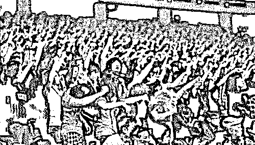

**非法传销毕竟非法呀**

到最后他们只能是这样的

▼

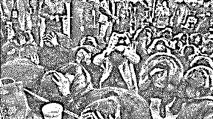

“

**常将有日思无日，**

**莫待无时想有时。**

 2014 年 10 月初

有着工作瓶颈、生活压力的我趁假期

从上海回到了朔州老家

从事 C 语言软件开发不到两年

可有些工作任务总是不能快速高效的完成

甚至完不成

或许不是很适合这种高强度脑力工作吧

讲真，这次回来有点不想去了

父母也劝我就在本地找点工作

亲戚朋友都在，多好啊

一天，关系很好的初中同学打来电话

叙旧、工作、恋爱...聊得很嗨

他现在在广东湛江

因为有个战友老家是湛江的

他过去玩儿，后来两人思慕着

退伍了暂时也没事干

就一起开了个饭店

规模不大，盈利还行，主做川菜、粤菜

人手不够，挺忙的

**（电话邀约铺垫）**

......

隔了三四天，朋友又打来电话

寒暄几句之后呢

说他们刚忙完，来海边游泳了

游完了顺带去渔民那里采购点海鲜

（描绘美丽图景、让你开始浮想翩翩）

劝我在家没事做了也过来玩一段时间

看海、游泳、没准还能找点事做...

**（第一次电话邀约）**

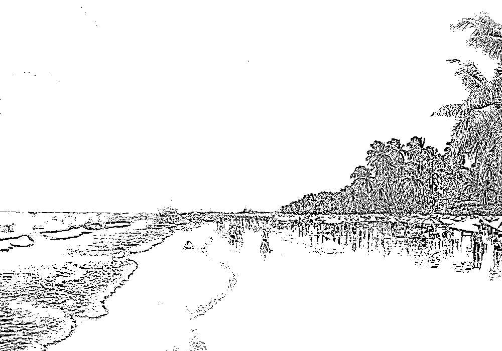

开始有点心动，开始有点按捺不住

**大部分北方人都有一颗看海的心**

是不是？

隔了两天朋友又打来电话了

**（第二次电话邀约）**

这次我开始有点犯嘀咕了

因为南方有些地方传销“泛滥成灾”

这个很多人都知道

但是我又把这个念头打消了

第一，我们两认识相处 10 多年了

第二，朋友初中辍学后便去了

朔城区招待所帮厨、学厨

后来去了太原并州饭店当厨子

再后来当了兵

所以他退伍后和战友开个自己的饭店也正常

**（第三次电话邀约）**

最终，我还是出于对朋友的信任

和躁动的看海心

出发了

和父母说到“广东湛江”玩几天

780 元大巴卧铺

一路向南

近 26 小时后

车却没有抵达湛江

而是到了

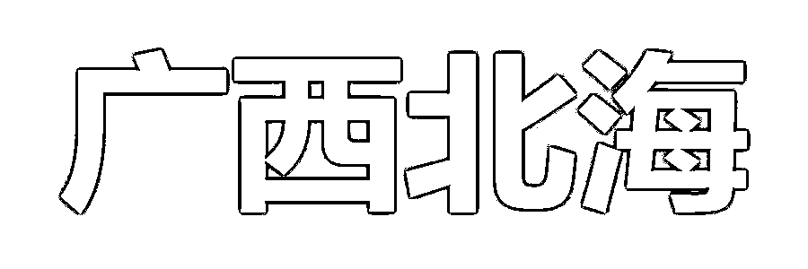

“朋友”解释说先和他到北海办点事儿

进点东西，这里的便宜

我也没想太多

反正能看海了

第二天他提议既然来了北海了就玩几天再说

然后订了两张北海一日游的旅游团票

白沙细腻的银滩

充满设计艺术的北部湾 1 号

古色古香的百年老街

......

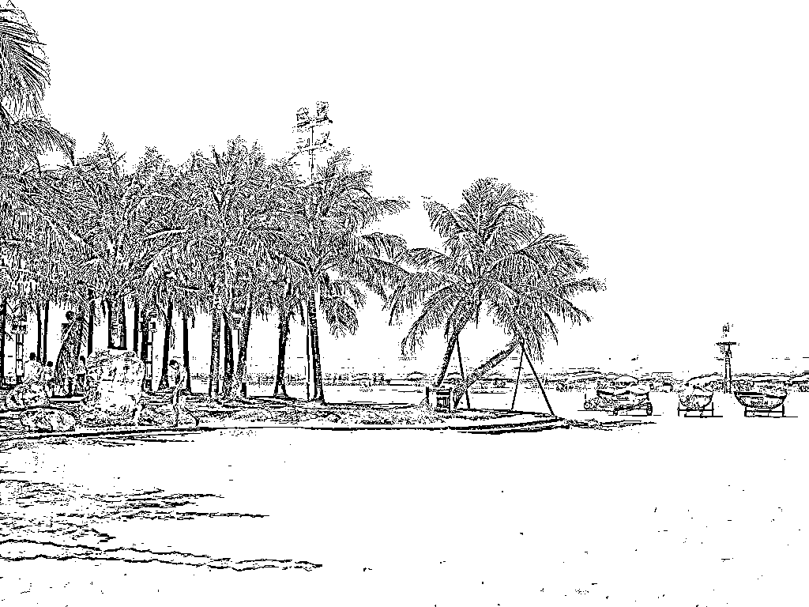

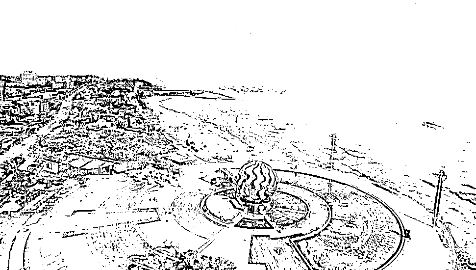

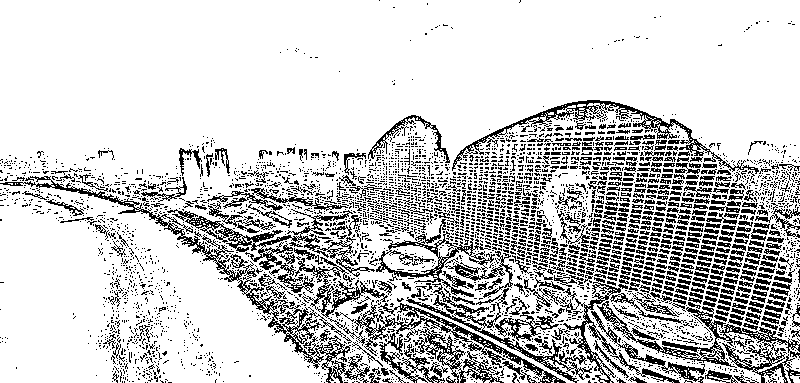

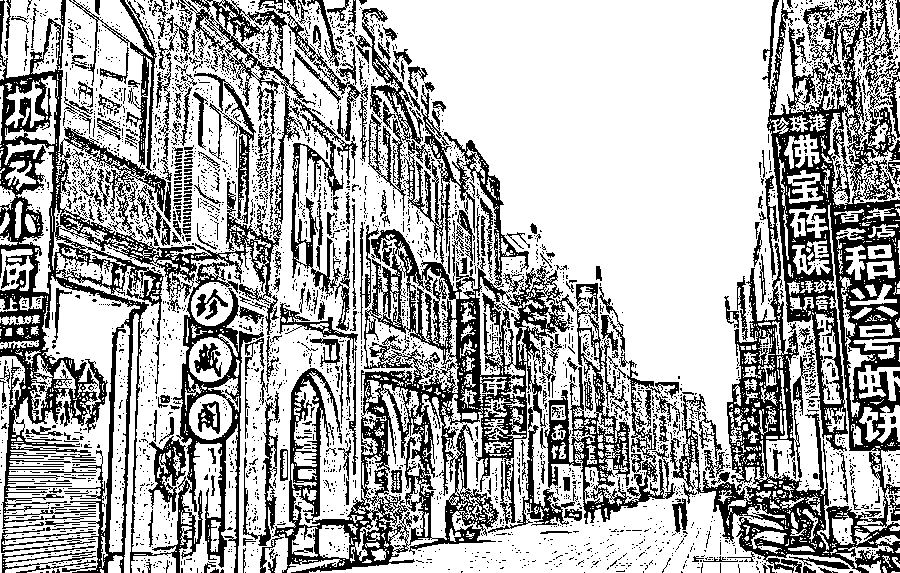

晚上还在海边吃了烧烤

似乎一切都很美好

美好到无以复加

吃喝玩乐“朋友白某”全包

秋风沉醉的那个晚上

我很开心 也有疑虑

针对白天大巴上我的种种困惑

他把话说开了

**没有饭店**

但有一个比饭店更好的“项目”

不急的话留下来边玩边了解下

这个也绝对不是传销

不扣手机、身份证、出入自由

想走给你买票

......

**缴纳 69800 元**

**获得入伙资格**

**当即返还 19000 元作为自己的提成**

**然后只需找 3 个合伙人也只能找 3 个**

**作为你的下线**

你叫来的下线会有你的提成

你下线叫来下线也会给你提成

5 级 3 晋制

业务员升到主任再到经理再到大经理

**最后你下面够 29 人时上“老总”**

**到最后出局赚到 1040 万**

**从此人生步入新间段**

**荣华富贵、人生巅峰**

......

这就是“声名显赫”的

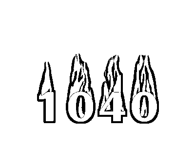

**“阳 光 工 程”**

所有这一切都会套上国家政策里的

**东盟自由贸易区和北部湾开发建设**

这张美丽外衣

“

**网上所有关于 1040 阳光工程的负面新闻都是****国家在宏观调控**

”

**名不正则言不顺**

**所有一切都是在为传销正名**

**所有一切都似乎那么美好**

**所有一切都似乎真假难辨**

很多人想不通的是

为何那么多大学生、研究生都也相信了？

为何那么多人抛家舍业也要去？

为何他们会如此坚定的认为那是真的？

就算过了很多年依旧如此

“让洗脑了”这是普遍的结论

所以还没接触过这一切的人

对“传销”、“洗脑”听闻色变 恐之不及

“1040 阳光工程”洗脑过程一般为七天

第一天，旅游大巴一日游

第二天，讲 5 级 3 晋制

第三天，讲宏观政策

第四天，带你各种现象，

北海银行多、北部湾广场、

北部湾 1 号象征意义

......

居住、吃喝都是在他们租的居民小区内

各方面条件相当可以，绝非多人混住

期间不限制自由，电话、身份证等都自由

**每个人听到自己被骗的时候都很愤怒** 

**但却被“温暖”的晓之以情动之以理说服着**

**有人选择离开**

**而我却选择了留下来**

投资了 69800 元

父母先后也来过

直到一年以后仍没有带来下线

也无后续经济来源才不得不离开

**走的时候北海仍有很多朔州人继续着**

**也不断有新的朔州人到来**

因为我贪、因为他们太厉害

**你不得不承认人是氛围的产物**

[`v.qq.com/iframe/preview.html?width=500&height=375&auto=0&vid=d00191aicq4`](https://v.qq.com/iframe/preview.html?width=500&height=375&auto=0&vid=d00191aicq4)

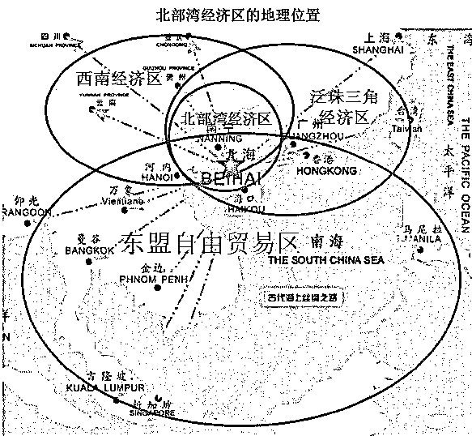

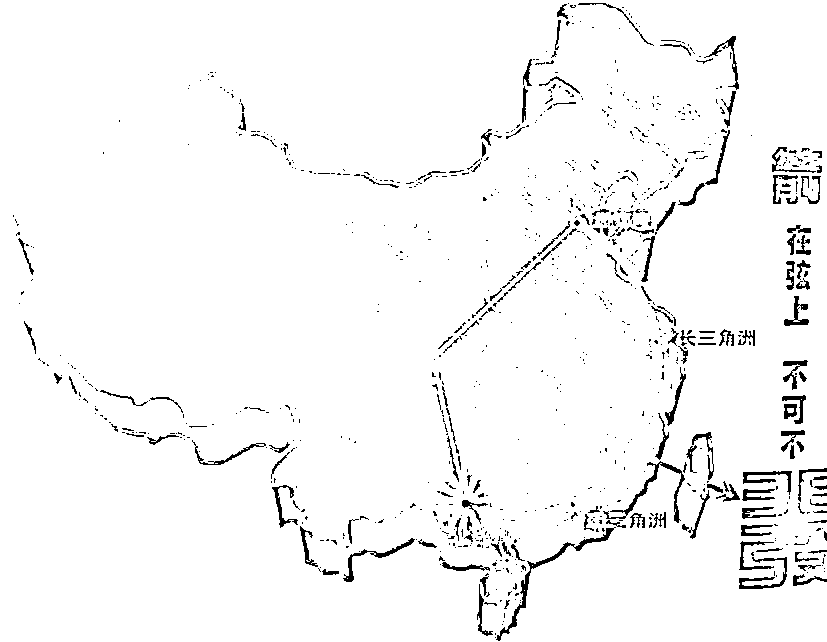

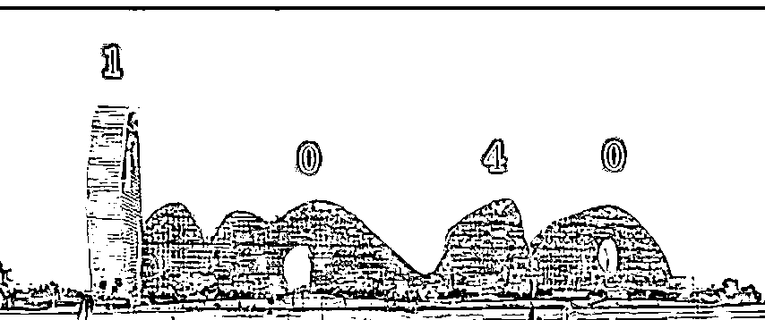

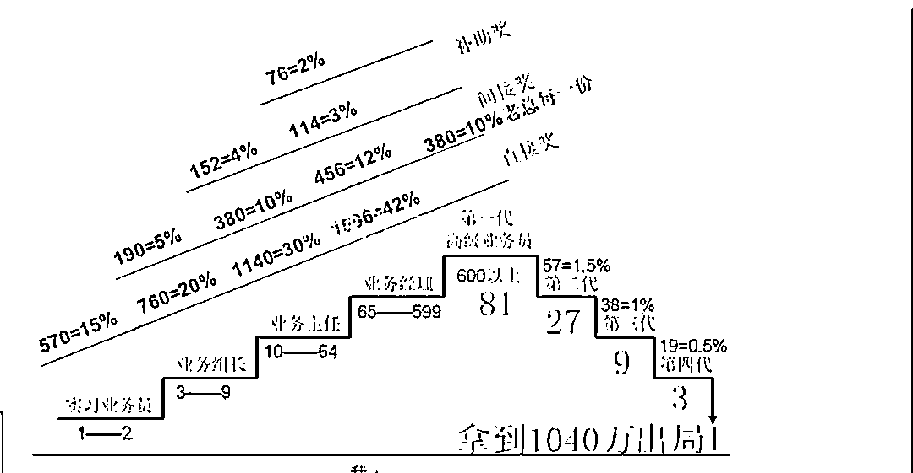

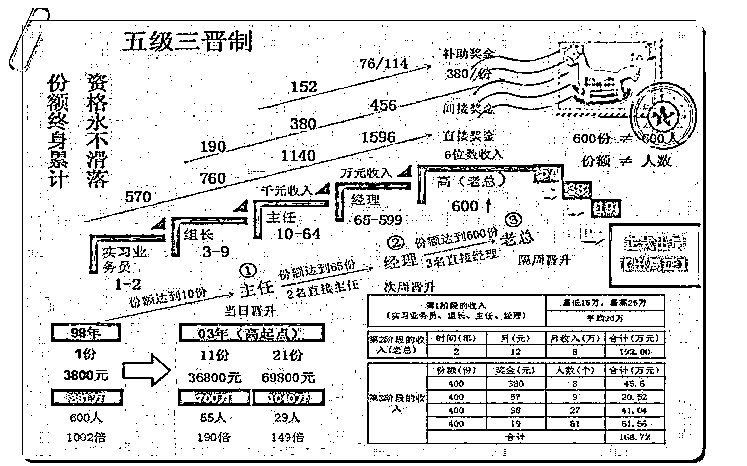

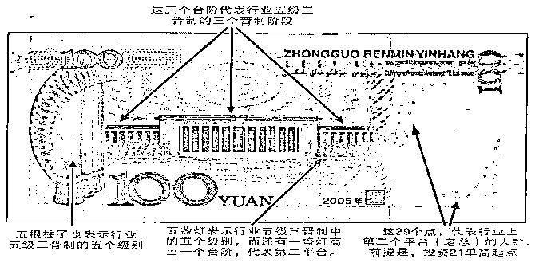

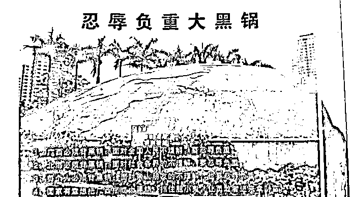

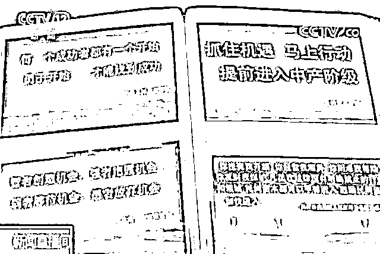

曹公《红楼梦》里说得好

**假作真时真亦假 无为有处有还无**

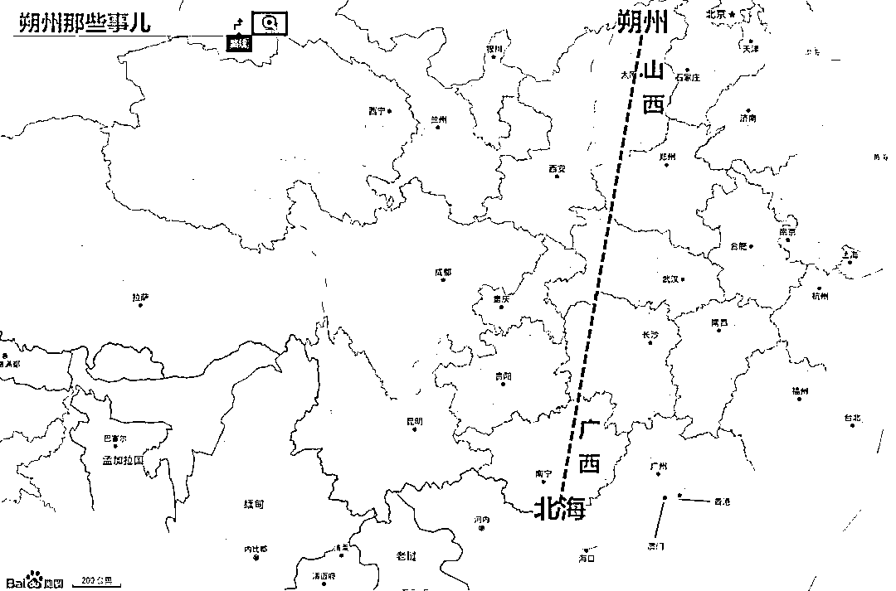

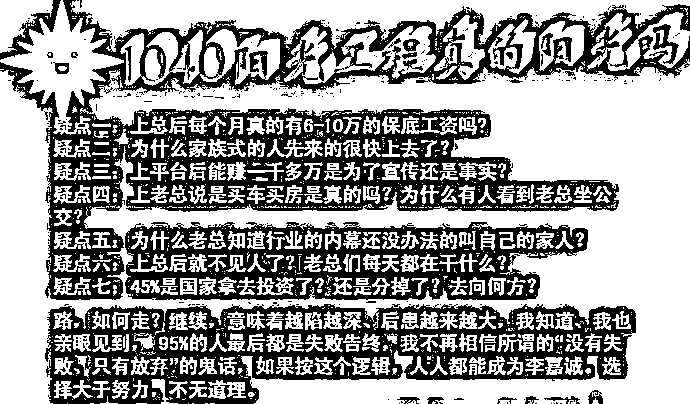

时间是检验真理的唯一标准

多年后，北海和 1040

偶尔还会出现在我心头

今天也算一吐为快

没有怨恨、没有自责、没有后悔

心情平静 

面对生活，我选择放下

恩怨情仇、是非功过

都是一种经历

我们不去问成长和成熟究竟是怎么样的

活着就是一场修行

**岁月不居 时节如流**

**认清生活的真相后**

**我依然去选择爱生活**

**你呢？**

来源： 朔州那些事儿，反传防骗热线 作者：夏洛

← 向右滑动与灰产圈互动交流 →

