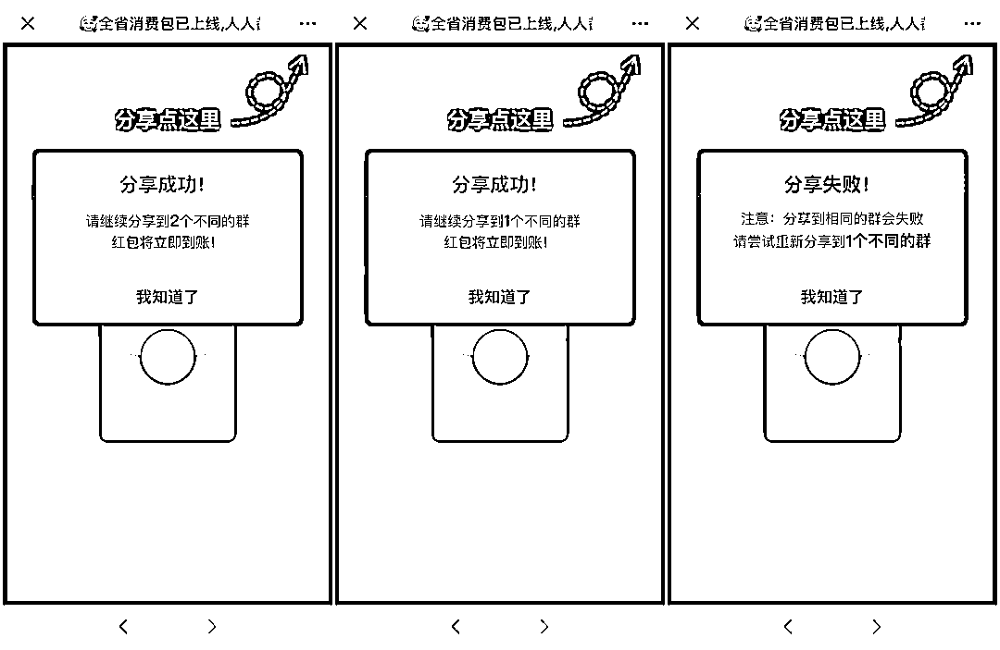
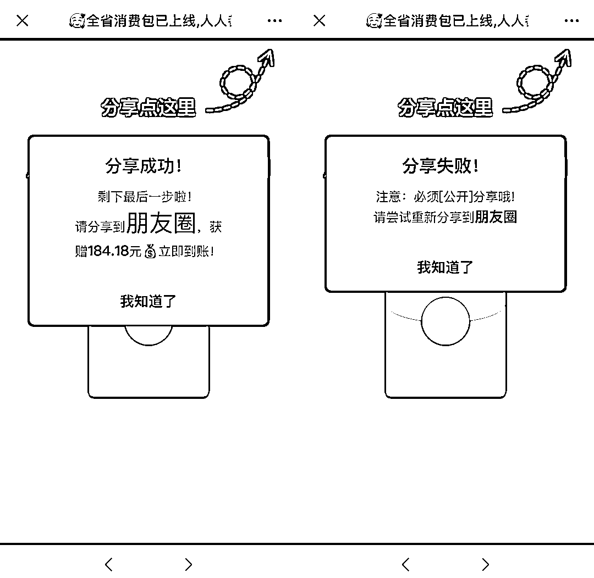

# 重要提醒！事关“微信红包”！

> 原文：[`mp.weixin.qq.com/s?__biz=MzIyMDYwMTk0Mw==&mid=2247509383&idx=5&sn=4ddbf5785f36d59f6b77bdb0a6c74662&chksm=97cb6ebfa0bce7a912812ce4c8691b69390a3293d935b05004b9c665912a118e9e340130967a&scene=27#wechat_redirect`](http://mp.weixin.qq.com/s?__biz=MzIyMDYwMTk0Mw==&mid=2247509383&idx=5&sn=4ddbf5785f36d59f6b77bdb0a6c74662&chksm=97cb6ebfa0bce7a912812ce4c8691b69390a3293d935b05004b9c665912a118e9e340130967a&scene=27#wechat_redirect)

春节来了！

微信红包封面火了

很多企业都发了限量的微信红包封面手快有，手慢无兴冲冲赶紧点开，没想到： 秒没！ **抢不到，那能不能买到呢？**很多网友 N 次抢红包封面失败后 不禁发出这样的疑问千万不要花钱买红包封面

小心被骗！

警惕有偿出售的微信红包封面

新闻记者注意到，微信红包封面热潮之下，有人已经开始以此盈利，甚至有灰黑产发现可乘之机。

 通常而言，微信红包封面是由品牌商家向消费者免费派发，但有些定制方做红包封面，并不是为了讨粉丝欢心，甚至压根没有粉丝，而就是当做商品出售。 在某二手平台上搜索红包封面，可看到不少卖家在卖微信红包封面的序列号，定价数元到数十元不等。**序列号，是微信红包封面的发放方式之一。**据微信红包封面开放平台，发放方式包括领取二维码、领取序列号、领取链接，定制方可根据活动场景、用户群体、领取规则等选择合适的发放方式。某二手平台上有不少卖家出售微信红包封面记者以 8 元购买了一款红包封面，卖家发送了一串序列号，并介绍了兑换方法：进入微信发红包界面、添加红包封面、输入序列号、领取红包封面。 记者兑换领取后，发现该卖家是以广州某公司运营的公众号名义进行的红包定制，该公司微信公众号没有发过消息，注册日期在今年 1 月。该卖家一共上架了四十余款商品，大部分为红包封面，**以 8 元计算，1 元作为定制成本，每卖出一个就有 7 元进账。**
在某网购平台上，有的卖家会在商品名称中写上“Gucci 红包封面古驰肖战”等热门红包封面信息，以此增加搜索曝光。但向客服沟通时，客服表示“古驰、王一博、LV 等明星大品牌红包封面没有现货”，让用户“根据现有款式选图”。以红包封面为关键词按销量排序，**排名靠前的卖家成交量都在数万单，以此计算交易额在十多万甚至数十万。** 但付费的形式，与微信红包封面最初的免费理念相悖。 据微信红包封面团队发布的信息：**自推出之日起，微信就明确规定，定制方不得因为微信红包封面而以任何形式，向用户收取任何费用。**前述卖家尚且提供真实的序列号，在黑猫投诉平台上，**一****位用户在去年发布的投诉中，自述了被骗的经历。** 他称自己在某电商平台上以 10 元购买了“红包封面”，找到卖家进行交易。“卖家表示因为虚拟产品，要求我马上确认收货才能发送。秉着诚信交易，我确认收货后。**卖家发送了一个假的序列号。**”该用户称。 微信已经注意到了灰黑产以此牟利的情况。微信红包封面团队早在 2020 年 1 月就曾发布《关于提醒定制方合理使用微信红包封面，杜绝有偿售卖微信红包封面的违规行为的公告》。 公告称，微信通过主动监控和用户投诉了解到，有极个别定制方通过微博客、社交媒体、电商平台等渠道，**向用户有偿销售微信红包封面，该等行为严重偏离了微信的初衷，损害了用户体验，也直接违反了《“微信红包封面”定制功能使用条款》的约定。** 确实，这种通过序列号方式出售自制红包封面的行为，相当于虚拟商品的交易，鱼龙混杂，黑灰产夹杂在真定制者中，难以辨别。 2 月 9 日，微信方面向记者回复称，针对该等向用户有偿销售微信红包封面的行为，微信将进行以下处理：**涉及到该等违规行为的定制方帐号，已通过审核的微信红包封面将被下架，已被领取的红包封面将无法继续使用，尚未发放的微信红包封面将无法继续发放；且该等定制方在一个月内将无法通过微信红包封面开放平台定制任何红包封面。**微信未来将持续打击任何形式的售卖微信红包封面、损害用户体验的行为，为定制方提供开放、健康、公正的生态环境。 不过，从前述情况来看，有偿红包封面的卖家可大致分为两类，一种是确实在进行设计定制的卖家，还有一种则是招摇撞骗的黑产。**除此之外** **这些微信红包** 

**也千万别领！**

提前设置带有诱导性的转发语

这类“红包”链接往往会包装成各种容易让人上当的形式，比如一条逼真的语音消息、邀请加群提示、“我已经领到了”等，通过各种说辞诱导用户点击。冒充官方编造虚假消息

不法分子伪造页面内容，冒充官方，以热点事件为幌子，编造虚假“利好消息”，再以“大额红包”为诱饵，欺骗和诱导用户进行点击。

利用微信的好友关系链传播

此类“红包”利用微信好友链进行传播，让用户大大降低了警惕，很多人出于对好友的信任，点击后继续分享给其他好友。加上“红包”流程繁琐，让很多人不愿意“前功尽弃”，造成恶性循环，传播量极广。

盈利模式

例如“红包”“分享成功”以后，会让用户关注一些不知所谓的公众号。

更有甚者，当你在领取“红包”的过程中，想要退出或后退，页面便会自动跳转到赌博、低俗、色情等非法网站，轻则被骗取钱财，重则误入歧途。重要提醒： **微信红包封面一定要通过正规渠道获得** **对来历不明的红包要做到** **不信、不点、不传播****提高警惕！**

来源：合肥日报

‍

← 向右滑动与灰产圈互动交流 →

