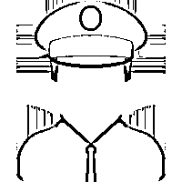
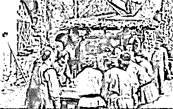

# 春节打麻将注意！公安部发话了

> 原文：[`mp.weixin.qq.com/s?__biz=MzIyMDYwMTk0Mw==&mid=2247509383&idx=6&sn=e5c285cb654a42dd5326fc7f397eab27&chksm=97cb6ebfa0bce7a923865df099b038017b1bba0758b557a7d670a21b0d25f3a71a492f519ac6&scene=27#wechat_redirect`](http://mp.weixin.qq.com/s?__biz=MzIyMDYwMTk0Mw==&mid=2247509383&idx=6&sn=e5c285cb654a42dd5326fc7f397eab27&chksm=97cb6ebfa0bce7a923865df099b038017b1bba0758b557a7d670a21b0d25f3a71a492f519ac6&scene=27#wechat_redirect)

春节来临

同学朋友聚会

是不是想打打麻将放松一下？

娱乐当然可以

但是一定不能赌博！！！

公安部 2 月 4 日在京举行新闻发布会，通报公安部部署全国公安机关统筹做好春运春节安保相关工作情况。**春节期间严厉打击地下流动赌场。**采取“挂牌督办、提级管辖、异地用警”等措施，深挖打击地下流动赌场的组织者、经营者、获利者和幕后“保护伞”，深入区域交界、城乡结合部、农村地区开展“拉网式”清查，及时查处涉赌突出问题，最大限度挤压赌博违法犯罪空间。

[`v.qq.com/iframe/preview.html?width=500&height=375&auto=0&vid=d3226nftqwo`](https://v.qq.com/iframe/preview.html?width=500&height=375&auto=0&vid=d3226nftqwo)

赌博的成本有多高？

一、轻者到看守所（拘留所）过年（1-15 天）+3000 元以下罚款；重者判刑（3 年以下有期徒刑、拘役或者管制+罚金，情节严重的 3 年以上 10 年以下有期徒刑+罚金）
二、违法犯罪记录伴随终生，个人考公务员、参军、入党、出国、留学、移民都受限制，律师等相关行业禁入；                                               
三、除了上述治安处罚和刑事处罚外，公职人员参赌被处罚后还面临着党政纪处分，甚至开除公职、开除党籍；                                                  
四、形成前科劣迹记录在案，以后有违法犯罪行为从重处罚                                                 
五、不光是自己，子女参军、入党、出国、留学同样受限制，参军入党招飞政审难通过。   

赌博最新处罚规定

《治安管理处罚法》第 70 条：以营利为目的，为赌博提供条件的，或者参与赌博赌资较大的，处 5 日以下拘留或者 500 元以下罚款；情节严重的，处 10 日以上 15 日以下拘留，并处 500 元以上 3000 元以下罚款。

什么是“赌资较大”?

上海市规定：《上海市公安局治安管理处罚裁量标准》规定，个人赌资在人民币 200 元以上的，就属赌资较大，可予以治安处罚。北京市规定：《北京市实施治安管理处罚法细化标准（试行）》规定，个人赌资 300 元至 500 元，处 500 元以下罚款；500 元至 1500 元，处五日以下拘留；1500 元以上，处十日以上十五日以下拘留。
四川省规定：《四川省公安机关行政处罚自由裁量权裁量标准》规定，现场收缴赌资价值合计在人民币 1000 元以上 4000 元以下的，属赌资较大。          
江苏省规定：起罚点是个人赌资或人均赌资达到 200 元。赌资 200 元以上不满 1000 元的，处 500 元以下罚款。个人赌资或者人均赌资 1000 元以上不满 3000 元的，处 5 日以下拘留。河北省规定：《河北省公安机关治安管理处罚裁量标准》规定，赌资较大是指个人赌资在 200 元以上；1000 元以上为情节严重。  武汉市规定：人均赌资 1000 元以上不满 3000 元的，处 500 元以下罚款；人均赌资 3000 元以上不满 5000 元的，处 5 日以下拘留；人均赌资 5000 元以上的，处 10 日以上 15 日以下拘留，并处 500 元以上 3000 元以下罚款。                                  
山东省规定：《山东省公安机关实施治安管理处罚法细化标准》规定，“参与赌博赌资较大”是指人均参赌金额在 200 元以上或者当场赌资在 600 元以上；为赌博提供条件，非法获利 500 元以上的，人均参赌金额 500 元以上或者当场赌资 2000 元以上的，等等，属于情节严重。
吉林省规定：《关于办理赌博违法案件裁量标准的指导意见》，把“赌资较大”定位于：个人平均赌资数额在 500 元以上不满 2000 元的，或者现场收缴赌资总数额在 2000 元以上不满 8000 元的。
深圳市规定：个人赌资在 500 元以上的算赌资较大。

刑事犯罪标准

下列行为和标准属于赌博犯罪（开设赌场罪），轻者三年以下有期徒刑，重者三年以上十年以下有期徒刑。
一、以营利为目的，以赌博为业的。
二、“聚众赌博”。组织 3 人以上赌博，抽头渔利数额累计达到 5000 元以上的；组织 3 人以上赌博，赌资数额累计达到 5 万元以上的；组织 3 人以上赌博，参赌人数累计达到 20 人以上的；组织中华人民共和国公民 10 人以上赴境外赌博，从中收取回扣、介绍费的。                                             
三、利用互联网、移动通讯终端等传输赌博视频、数据，组织赌博活动，建立赌博网站（微信群等）并接受投注的；建立赌博网站并提供给他人组织赌博的；为赌博网站担任代理并接受投注的；参与赌博网站利润分成的。
四、明知他人利用赌博机开设赌场，提供赌博机、资金、场地、技术支持、资金结算服务的；受雇参与赌场经营管理并分成的；为开设赌场者组织客源，收取回扣、手续费的；参与赌场管理并领取高额固定工资的；提供其他直接帮助的。
五、开设赌场。设置具有退币、退分、退钢珠等赌博功能的电子游戏设施设备（赌博机），并以现金、有价证券等贵重款物作为奖品，或者以回购奖品方式给予他人现金、有价证券等贵重款物组织赌博活动的
六、具有国家工作人员身份的；组织国家工作人员赴境外赌博的；组织未成年人参与赌博，或者开设赌场吸引未成年人参与赌博的，从重处罚。小编在这里再次郑重提醒过年多陪陪家人**千万不要赌博**

来源：红网、中国警察网、中国普法 

← 向右滑动与灰产圈互动交流 →

