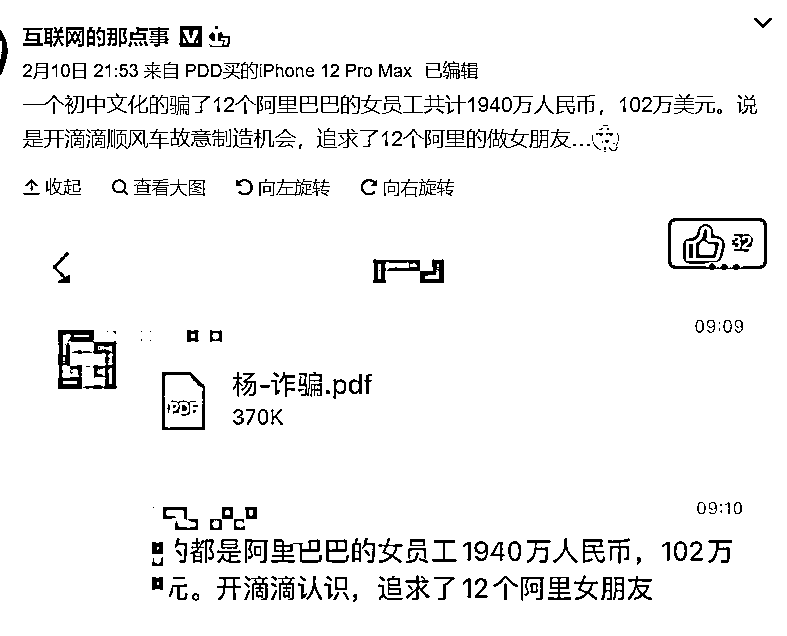
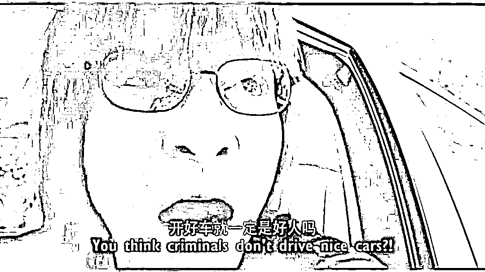
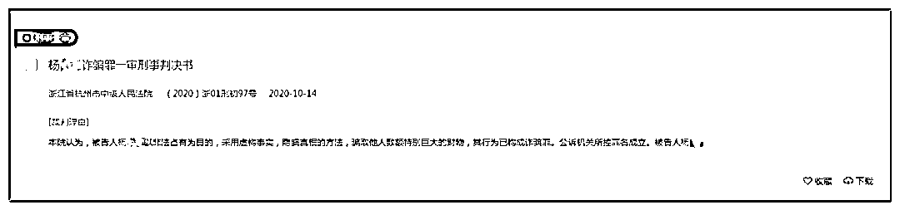
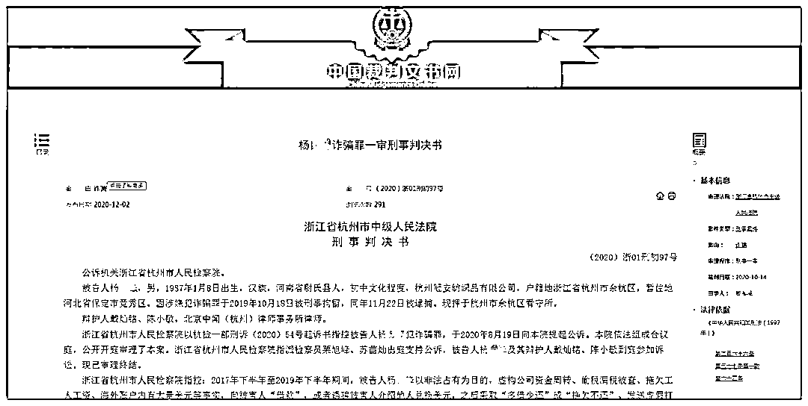
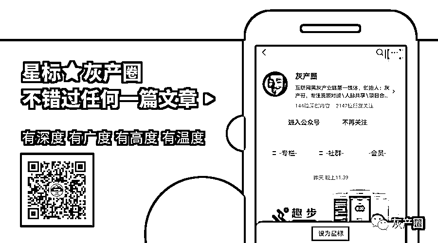

# 看呆了！阿里女员工被骗 500 多万！初中文化水平男子，滴滴开豪车，诈骗 4000 多万被判无期！

> 原文：[`mp.weixin.qq.com/s?__biz=MzIyMDYwMTk0Mw==&mid=2247509383&idx=7&sn=276ff1a382e95e2132252fd07ab6ad41&chksm=97cb6ebfa0bce7a98d484781680bc5dbd149219b4de4d66e1b0b2f1c2ae75ae7c1686017635a&scene=27#wechat_redirect`](http://mp.weixin.qq.com/s?__biz=MzIyMDYwMTk0Mw==&mid=2247509383&idx=7&sn=276ff1a382e95e2132252fd07ab6ad41&chksm=97cb6ebfa0bce7a98d484781680bc5dbd149219b4de4d66e1b0b2f1c2ae75ae7c1686017635a&scene=27#wechat_redirect)

没想到，竟然有阿里巴巴的女员工，也被遭遇了杀猪盘！

网传阿里巴巴 12 名女员工

被滴滴顺风车司机诈骗两千余万元

春节期间，一则关于诈骗的新闻，引发了很多网友的热议：一个初中文化水平男子开顺风车故意制造机会，和 12 个在杭州某互联网公司工作的女员工恋爱，最后诈骗钱财共计 1940 万人民币，102 万美元。

据网传案件办理情况图片所述，犯罪嫌疑人使用奥迪、保时捷等车辆在阿里公司附近开滴滴顺风车，接近阿里受骗女员工并添加微信好友后，有目的地展开追求，确立关系后通过资金周转、公司偷税漏税被查等借口，骗取受害人财产共计 1940 万人民币，102 万美元。

此事真假？我们一起来看看。

男子结识 12 名女性发展恋爱关系诈骗近四千多万

阿里员工被骗五百万

中国裁判文书网核实，发现确实有这个案子，但网传情况与判决书内容并不完全相符。

据杭州市中级人民法院 2020 年 10 月 14 日一份判决书中了解到：判决书显示，2017 年下半年至 2019 年下半年期间，杭州男子结识多名女性并发展恋爱关系，虚构公司资金周转、偷税漏税被查、拖欠工人工资、海外账户内有大量美元等事实，向被害人“借款”，或者诱骗被害人介绍他人兑换美元，之后采取“多借少还”或“拖欠不还”、发送虚假打款截图的方式骗取被害人陶某、陆某等 12 名受害人人民币共计 4050 余万元、美元共计 125 万余元，归还人民币共计 2110 余万元、美元共计 22 万余元，造成被害人损失人民币共计 1940 余万元，美元共计 102 万余元。

据北京青年报报道，被骗的女性中，有两人在阿里巴巴上班，系诈骗男子通过开网约车顺风车时认识。

杨某锋，1987 年生人，汉族，河南省尉氏县人，初中文化程度，户籍地浙江省杭州市余杭区，暂住地河北省保定市竞秀区。因涉嫌犯诈骗罪于 2019 年 10 月 18 日被刑事拘留，同年 11 月 22 日被逮捕。

据杭州市人民检察院指控：

杨某锋 2017 年下半年至 2019 年下半年期间，以非法占有为目的，虚构公司资金周转、偷税漏税被查、拖欠工资、海外账户有大量美元等事实，向被害人“借款”，或者诱骗被害人介绍他人兑换美元，之后采取“多借少还”或“拖欠不还”、发送虚假打款截图的方式骗取多名被害人共计 4050 余万元、美元共计 125 万余元，归还人民币共计 2110 余万元、美元共计 22 万余元，造成被害人损失人民币共计 1940 余万元，美元共计 102 万余元。

这起案件中，杭州某互联网公司有两名女员工被骗。检察机关指出：

1、2017 年 7 月，杨某锋通过开滴滴顺风车结识了陶某（在杭州某互联网公司工作），与陶某发展成恋爱关系后，杨某锋虚构公司资金周转、公司偷税漏税被查、被浙江电视台关押、拖欠员工工资，以及海外有美元账户可以兑换美元等事实，从 2017 年 8 月至 2019 年 8 月期间，不断向被害人陶某借款，骗取被害人陶某人民币共计 1151.7547 余万元，归还人民币共计 596.4208 万元；骗取被害人陶某美元共计 125.55 万元，归还美元共计 22.59 万元，造成陶某损失人民币共计 555.3332 万元、美元共计 102.96 万元。

2、2017 年 6、7 月，陆某乘坐顺风车认识了杨某锋，2018 年 2 月左右，两人正式确立男女朋友关系。虚构同样事实，从 2018 年 2 月至 2019 年 9 月期间，不断向被害人陆某借钱，骗取被害人陆某人民币共计 1288.92 万元，归还人民币共计 1117.804 万元，造成被害人陆某损失人民币共计 171.116 万元；骗取通过被害人陆某介绍欲兑换美元的被害人陈某 3 人民币共计 661.788 万元，至案发未归还。

3、2018 年 3 月，杨某锋采用上述同样手段结识被害人陈某 1 并确定恋爱后，虚构同样事实，从 2018 年 3 月至 2019 年 8 月期间不断向被害人陈某 1 借钱，骗取被害人陈某 1 人民币共计 147 万元，归还人民币共计 59.5 万元，造成被害人陈某 1 损失人民币共计 87.5 万。

4、2017 年 6、7 月份，杨某锋采用上述同样手段结识在杭州某互联网公司上班的庞某后，虚构同样事实，从 2017 年 10 月份至 2019 年 8 月份期间不断向被害人庞某借款，骗取被害人庞某人民币共计 15.71 万元，及被害人庞某为武某兑付美元的人民币 88 万元，杨某锋支付给武某 6500 美元后即以各种理由拖延，经庞某多次催讨，被告人杨某锋归还被害人庞某人民币共计 74.81 万元。被害人庞某将武某兑付美元剩余款人民币 84.922 万元退还至武某账户，造成被害人庞某损失人民币共计 25.822 万元；

5、2019 年 4 月，杨某锋与被害人范某 1 成为男女朋友关系后，杨某锋虚构同样事实，让被害人范某 1 介绍他人兑换美元，同年 10 月 7 日，被害人范某 1 联系到两个要兑换美元的人，次日其中一名男客户打给被害人范某 1 人民币共计 90 万元，另一名女客户打给范某 1 人民币共计 70 万元，被害人范某 1 将上述 160 万打入杨自锋账户，后女客户未收到兑换的美元，造成被害人范某 1 损失人民币共计 70 万元。

6、2019 年期间，杨某锋通过朋友认识被害人章某后，为归还债务，虚构自己香港账户内有数百万美元，现需兑换人民币的事实，取得被害人章某信任，于 2019 年 9 月 4 日，从被害人章某处骗取人民币共计 177.21 万元后，制作虚假的美元转账截图发送给被害人章某，经被害人章某多次催促，杨某锋归还人民币共计 72.21 万元，造成被害人章某损失人民币共计 105 万元。

7、2019 年 9 月份，杨某锋为归还债务，采用上述同样手段骗取被害人范某 2 钱款。2019 年 9 月 19 日，杨某锋从被害人范某 2 处骗取人民币共计 176.75 万元后，制作虚假的美元转账截图发送给被害人范某 2，后经被害人范某 2 多次催促，杨某锋归还人民币共计 90 万元，造成被害人范某 2 损失人民币共计 86.75 万元。

8、2019 年年初，杨某锋通过微信认识被害人银某后，为归还债务，2019 年 9 月 20 日虚构拖欠员工工资、员工欲闹事等事实，以借为名骗取被害人银某人民币 5 万元，经银多次催讨未归还。

9、2019 年期间，杨某锋通过朋友认识被害人韩某后，为归还债务，虚构自己香港账户内有数百万美元，现需兑换人民币的事实，让被害人韩某介绍身边需要兑换美元的朋友，后被害人韩某介绍被害人肖某 1、苏某向杨某锋兑换美元。2019 年 9 月 24 日，杨某锋骗取被害人肖某 1 人民币 71.3 万元，骗取被害人苏某人民币 20 万元后，制作虚假的美元转账截图发送给被害人肖某 1、苏某，后归还被害人苏某人民币 10 万元，造成被害人肖某 1 损失人民币共计 71.3 万元，苏某损失人民币共计 10 万元；

10、2018 年年底，被告人杨某锋通过朋友认识被害人方某后，为归还债务，虚构上述同样事实，让被害人方某介绍身边需要兑换美元的朋友，之后被害人方某介绍赵某向杨某锋兑换美元。2019 年 9 月 25 日、26 日，杨某锋骗取被害人赵某人民币共计 102.3227 万元后，制作虚假的美元转账截图发送给被害人赵某，造成被害人赵某损失人民币共计 102.3227 万元。

11、2015 年期间，杨某锋通过微信认识被害人陈某 2 后，为归还债务，虚构急付货款的事实，于 2019 年 9 月 27 日骗取被害人陈某 2 人民币 1 万元，造成被害人陈某 2 损失人民币 1 万元。

综上，杨某锋以非法占有为目的，虚构事实、隐瞒真相，骗取被害人人民币共计 4146.7554 万元、美元共计 125.55 万元，归还人民币共计 2110.7448 万元、美元共计 22.59 万元，造成被害人损失人民币共计 1952.9326 万元，美元共计 102.96 万元。2019 年 10 月 17 日杨某锋在河北省保定市竞秀区××幢××单元××室被抓获归案。归案后杨某锋自愿认罪认罚并接受公诉机关的量刑建议。

杭州市中级人民法院审理后认为，被告人杨某锋以非法占有为目的，采用虚构事实，隐瞒真相的方法，骗取他人数额特别巨大的财物，其行为已构成诈骗罪。公诉机关所控罪名成立。被告人杨某锋自愿认罪认罚并接受公诉机关的量刑建议，公诉机关指控的罪名准确，量刑建议幅度合法、适当。

经审理认为，被告人杨某锋为实施诈骗活动，有目的的同时追求多名女性并形成恋爱关系，在获取被害人信任后即骗取钱财，被告人的行为不仅造成被害人的巨大经济损失，还造成了部分被害人的巨大心理创伤，后果严重，具有较大的社会危害性。

据此，依照《中华人民共和国刑法》第二百六十六条、第五十七条第一款、第六十四条之规定，判决如下：

一、被告人杨某锋犯诈骗罪，判处无期徒刑，剥夺政治权利终身，并处没收个人全部财产。

二、责令被告人杨某锋退赔违法所得，按比例发还被害人。

来源：中国基金报，北京青年报

← 向右滑动与灰产圈互动交流 →

