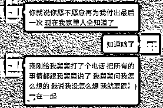

# 又抓了一批女主播！聊天记录曝光……

> 原文：[`mp.weixin.qq.com/s?__biz=MzIyMDYwMTk0Mw==&mid=2247509435&idx=1&sn=7988a57e5e47b0d8de18fa8bf682ac62&chksm=97cb6e83a0bce795d7b326c1df0774f5555aa5ee690763d62e005dc13ede780a464473bc3e88&scene=27#wechat_redirect`](http://mp.weixin.qq.com/s?__biz=MzIyMDYwMTk0Mw==&mid=2247509435&idx=1&sn=7988a57e5e47b0d8de18fa8bf682ac62&chksm=97cb6e83a0bce795d7b326c1df0774f5555aa5ee690763d62e005dc13ede780a464473bc3e88&scene=27#wechat_redirect)

外貌清纯甜美

性格温柔体贴

职业光鲜亮丽

家境富裕优越

这样优秀的女朋友你心不心动？

刚好，市民林先生就遇上了这么一个完美的她

▼

近日，林先生在交友软件上认识了网友雨晴，二人随后发展成了男女朋友，交往中林先生得知女友**本职工作是一名幼教，晚上兼职做做主播**。

没想到在之后的一次直播中，雨晴突然难过地**痛哭**起来，林先生这才得知女友身体不好，但公司**有强制直播任务**，只要礼物达标，她就可以提前下班休息。林先生没有多想便将自己的积蓄充入了直播平台，这时，女友表示平台结算时自己**能拿到 70%~75%的分红**，等收到后会**第一时间还钱**，让他不用担心。

之后的每一次直播雨晴都以**冲榜**为由，要求林先生借钱刷礼物，在**透支了 30 余万元**后，林先生实在拿不出钱了，雨晴却彻底拉黑了他。

其实这不仅仅是一个普通的看直播被骗事件

而是一场**有预谋有针对的骗局 **

▼

|  |  
**伎俩一：多重理由诱导受害人刷礼物**

 |

**理由①：**以平台开展活动为由，声称礼物**榜单排名第一的粉丝**可以获得和主播**免费双人游**的机会；

**理由②：**主动**与其他主播进行 PK**，一旦输掉比赛将面临惩罚，请求粉丝帮忙支持；

**理由③：**使用其他**虚构的账号在直播间辱骂、挑衅主播**，激起受害人的保护欲；

**理由④：****虚构生病等身体不适的情况**，营造带病直播的虚弱场面，声称完成任务才能下班，以此获取受害人同情。甚至提出完成任务量便和公司解约，与受害人结婚；

**理由⑤：**在情人节、生日等**特殊节日**，要求受害人以刷礼物的形式进行庆祝；

**理由⑥：****对其他账号进行包装**，利用平台资源将该账号打造成受害人的**“竞争对手”**，使其永远无法成为粉丝榜单上的第一名，以此激发斗志。

▼

|  |  
**伎俩二：口头承诺金钱、爱情等**

 |

在交往过程中，**虚构母亲、舅舅、相亲对象等身份**，向受害人表达坚定的结婚倾向，甚至商定好婚期，**用爱情捆绑对方为其消费**。

一旦对方产生怀疑，便许诺拿到钱款后就会退还刷礼物的金额。不断通过**口头承诺、索要银行卡账号等方式获取信任**，让受害人**加大投入**。

如果受害人拒绝刷款，便**以分手、抑郁、自杀等作为威胁**。

▼

|  |  
**伎俩三：拒不返还钱款**

 |

**理由①：****平台出错**，不能及时分成；

**理由②：****未完成要求的任务量**，无法结算；

**理由③：**存在**违约行为**，要进行赔偿；

▼

|  |  
**伎俩四：组织团伙分工明确**

 |

警方调查后发现确实有“雨晴”这个人

**和林先生视频的的确是“雨晴”**

**但和林先生聊天的又并非“雨晴”**

这又是怎么回事？

因为这是一个**架构清晰、组织严密、** 

**分工明确、涉案人员众多的诈骗犯罪团伙**！

▼

朱某负责注册公司，并聘用江某成为公司主播。为了快速牟取利用，朱某在各大招聘平台发布信息，聘用多名人员充当**“键盘手”**，并每人配发一部手机和一个头像昵称均为“雨晴”的微信号。

这些“键盘手”的任务便是游走于各类聊天交友软件里**结识单身男性**，再**以主播江某的名义进行聊天**，一旦对方产生怀疑，便让江某和受害人进行简短的视频聊天加深信任，一步步设下圈套实施诈骗。

受害人每天聊天中你侬我侬的**“雨晴”**大多是这样的**“抠脚大汉”。**

茶叶妹妹、支教美女、花篮老板娘、重症女友……

这些都是美女骗局的把戏！

只是不法分子**不断对形式进行包装**

但本质上依旧**换汤不换药**

往往在前期“铺垫”结束后

就以“欠下巨款”、“身患重病”等各种理由

要求受害人向其转账、汇款

**最终目的就是钱**

**你遇到过这样的陷阱吗？** 

**留言提醒更多人！**

来源：南京公安，反诈骗先锋

← 向右滑动与灰产圈互动交流 →

