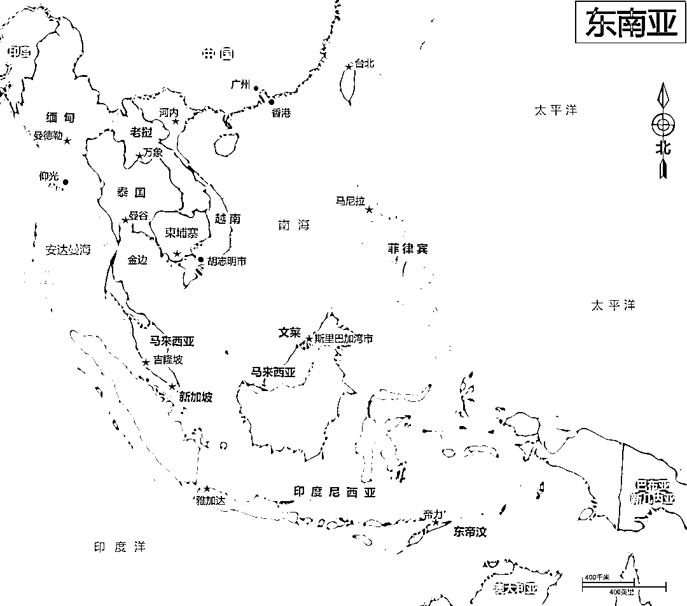
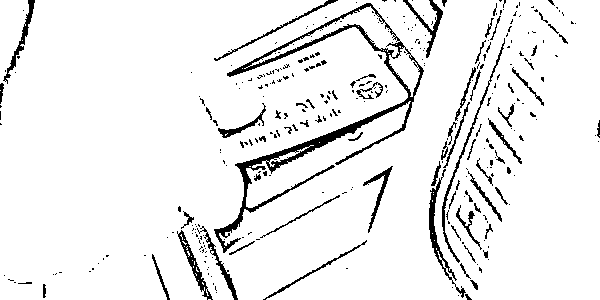
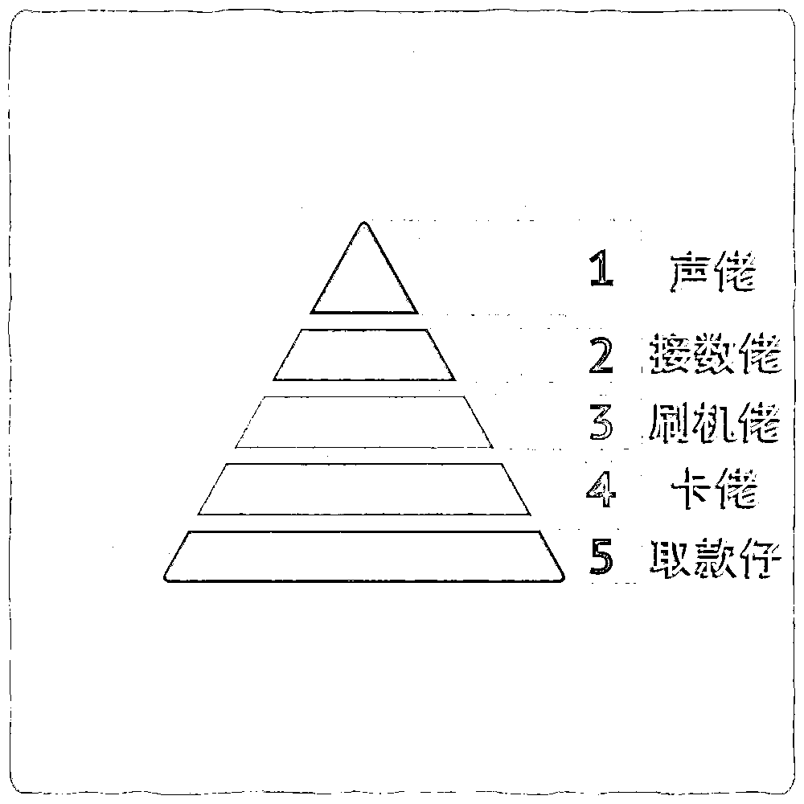
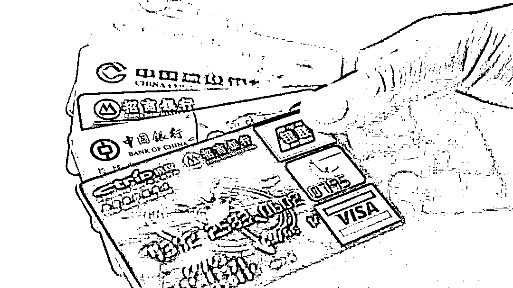
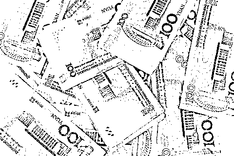

# 骗 子 是 怎 样 洗 钱 的 ？

> 原文：[`mp.weixin.qq.com/s?__biz=MzIyMDYwMTk0Mw==&mid=2247509487&idx=1&sn=430bbfba3f8194a605e5a457d12895cd&chksm=97cb6ed7a0bce7c1ad8119498e1750ca282da1d3af5243734988b5d09d17ea840c45b92d8fdc&scene=27#wechat_redirect`](http://mp.weixin.qq.com/s?__biz=MzIyMDYwMTk0Mw==&mid=2247509487&idx=1&sn=430bbfba3f8194a605e5a457d12895cd&chksm=97cb6ed7a0bce7c1ad8119498e1750ca282da1d3af5243734988b5d09d17ea840c45b92d8fdc&scene=27#wechat_redirect)

经常有

遭遇诈骗案的事主报案后不停地追问警察蜀黍

“骗我的人抓得到吗？”

“我被骗的钱能追得回来吗？”

“顺着网络查怎么就查不到人呢？”

“银行卡都是实名制的，一下子就查到了” 

……

你觉得不难说明你还不够了解骗子也不够了解我们****

**为什么骗子抓不到？**

[`mp.weixin.qq.com/mp/readtemplate?t=pages/video_player_tmpl&action=mpvideo&auto=0&vid=wxv_1426202517377040386`](https://mp.weixin.qq.com/mp/readtemplate?t=pages/video_player_tmpl&action=mpvideo&auto=0&vid=wxv_1426202517377040386)

**骗子都抓到了** **我被骗的钱为什么不给我？**

[`mp.weixin.qq.com/mp/readtemplate?t=pages/video_player_tmpl&action=mpvideo&auto=0&vid=wxv_1426290371839049730`](https://mp.weixin.qq.com/mp/readtemplate?t=pages/video_player_tmpl&action=mpvideo&auto=0&vid=wxv_1426290371839049730)

层层伪装的诈骗分子    **第 1 层：地理伪装**

骗子善用各种伪装，隐去一切可能会曝光自己身份的痕迹，且团队基本都在国外待着。

**第 2 层：身份伪装**大量丢失、被盗的第二代居民身份证，在网络黑市被公然叫卖，为诈骗分子提供了源源不断的身份信息资源。在普通人眼里，实名制是身份识别，但在诈骗分子眼中，**实名制成为了规避风险的最佳手段之一**。因为这些身份信息的所属人和诈骗分子压根没有关系。**第 3 层，技术伪装**

短信诈骗中最常用的就是伪基站群发器，只需一个笔记本电脑、一个软件、一个发射器，就可以向周边的手机用户发送编辑好的诈骗短信。想靠手机定位抓人？难！

浮动 IP 和改号平台也是诈骗分子较为常用的两种技术伪装的方式。浮动 IP 就是利用网络跳板不断掩盖真实 IP，利用虚假 IP 实施网络诈骗行为。改号平台则是掩盖其真实号码，将电话改成任何你想要的。若查询到了背后真实的身份，等警察准备好机票护照等一系列文件后，飞到定位地点一查，结果发现**是一台被黑客控制的私人电脑**，也就是“肉鸡”。

专业化的洗钱诈骗集团**诈骗洗钱集团内部分工极其精细，一般分为五个层级。****第一层称为“声佬”**，专门负责打电话、发信息、邮寄等工作；**第二层称为“接数佬”**，负责连接“声佬”和下一层；**第三层称为“刷机佬”**，顾名思义就是负责刷 POS 机，把钱刷到网上结算中心去；**第四层称为“卡佬”**，负责提供各种银行卡，分别转移；**第五层称为“取款仔”**，专门负责取钱，可以自己去取，也可以付费叫别人去取。

五个层级职责明确，跨级之间相互不认识也无联系，每个层级只能跟上一层对接，决不能也无法越级与上上层联系。

这样，即使“取款仔”被抓，一般也很难问出上一级的人是谁、在哪。**错综复杂的“子孙账户”**“子孙账户”通俗点解释就是，诈骗分子在收到骗款后，会对骗款进行拆分，通过银行账户和第三方支付平台进行 N+1 次的分散转账，之后再通过“车手”取现。钱款一旦进入到这一步，想要证明资金来源和冻结账户就难了。如果诈骗分子想更安全一点，则会找“水房”处理。水房这个词很多人可能第一次听，如它的字面意思一般，就是专门用来洗白赃款的新型犯罪窝点。一般“水房”都服务于多个诈骗团伙，洗白速度快，且最终款项大多都会流向海外账户，难以被追讨。

很多人遇到诈骗

无论金额大小，报警后

期望警察能快速立案，飞速处理

然后被骗的钱回到自己的手中

这是理想状态

但绝大多数的网络诈骗案

没有这么容易

👇

立案后，首要问题是警力分配！基层派出所的警察数量是固定的，加上辖区本身还有其他案件要侦破，警力该如何分配？同时，当案件涉及到**跨市、跨省、跨国时**，还需要与**其他省、市、国家的警察**联手合作。这也大大增加了侦破难度，尤其是小额诈骗案件。这是一个非常现实的问题，也就是办案成本。若你被诈骗的金额为 500 元，案件涉及到跨省、跨国，警察办案总共花费可能需要 50000 元。如果一个派出所，同时需要侦破十个网络诈骗案件，那么这个派出所基本可以停业修整三个月。虽然难！但警察仍然拼命在干！根据公安部通报，2020 年，全国共破获电信网络诈骗案件 25.6 万起，抓获犯罪嫌疑人 26.3 万名，拦截诈骗电话 1.4 亿个、诈骗短信 8.7 亿条，为群众直接避免经济损失 1200 亿元。

但是，毕竟绝大多数的钱，已经经过多次洗白，追不回来了。

所以 

**努力学习反诈知识**

**才是预防诈骗的最好方法**

牢记四个“不”

不轻易登录陌生网址链接

不轻易添加陌生 QQ 微信

不轻易下载陌生 APP

不向陌生账户转账

来源：禅城公安，反诈骗先锋

← 向右滑动与灰产圈互动交流 →

