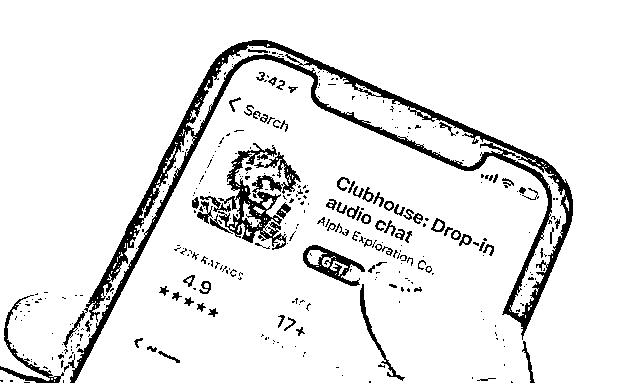

# 炸锅！“带货之王”马斯克一句话，年内暴涨 1900%的狗狗币突然崩了，原因竟是…

> 原文：[`mp.weixin.qq.com/s?__biz=MzIyMDYwMTk0Mw==&mid=2247509487&idx=4&sn=8345d917f42efbe222f3f135fda277e7&chksm=97cb6ed7a0bce7c13a48e537efcbd1734dc0250f33c2c4bce5c62c27a3f005070a0e907bac3a&scene=27#wechat_redirect`](http://mp.weixin.qq.com/s?__biz=MzIyMDYwMTk0Mw==&mid=2247509487&idx=4&sn=8345d917f42efbe222f3f135fda277e7&chksm=97cb6ed7a0bce7c13a48e537efcbd1734dc0250f33c2c4bce5c62c27a3f005070a0e907bac3a&scene=27#wechat_redirect)

论及带货，薇娅、李佳琦跟马斯克相比，简直弱爆了！ 

仅仅“Use Signal”、“Doge”、“Gamestonk!!”一两个单词就在资本市场掀起腥风血雨。无论是比特币、狗狗币的暴涨，还是游戏驿站的“韭菜收割机构”的大战，背后都有马斯克的身影。

昨天，马斯克又发推文了。推文称，将全力支持狗狗币主要持有者出售大部分货币。集中度太高是狗狗币唯一真正的问题。

狗狗币应声暴跌，日内最高跌幅超 20%，截至发稿仍然下跌 10.61%。 

此前 1 月底，马斯克因为在推特上不断安利狗狗币，使得狗狗币在近几周内价格飙升了 10 倍。 

**年内价格暴涨 19 倍**

**“狗狗币 CEO”开始唱空？**

**网友炸了**

****

****据了解，狗狗币是由前 IBM 工程师马库斯和 Adobe 软件工程师帕尔默（Jackson Palmer）于 2013 年创立。****

****为了嘲讽加密货币市场的投机热，帕尔默在 Twitter 上开玩笑称要创立 Dogecoin（狗狗币），而当时网络正流行柴犬 Doge 的表情包。得到网友鼓励后，帕尔默买下了 DogeCoin.com 的域名。****

********

****看到帕尔默的想法后，一直想自己推出加密货币的马库斯立刻加入，狗狗币由此成真。****

****推出后，价格低廉的狗狗币成为网络打赏的热门虚拟币。****

****但是年初还仅 0.4 美分的狗狗币，在马斯克的疯狂安利之后，价格一路上涨，甚至一度上涨至 8 美分，年内暴涨 19 倍。****

****早在 2019 年 4 月，他就曾发推表示，狗狗币可能是自己最喜欢的数字货币。**当时，他还把自己的推特简介改成了“狗狗币 CEO”。******

****1 月 29 日，马斯克发布了一张狗的图片，虽然一字未写，但却引发了狗狗币的暴涨，令狗狗币在 24 小时内的涨幅达到 260%。****

********

****进入 2 月，马斯克更是频频安利狗狗币。2 月 5 日，一个简单的“Dogecoin”单词，配合着蹿升的火焰，推动狗狗币迅速当天飙涨 50%。****

********

****随后，他转发了网友制作的恶搞图片——马斯克化身电影狮子王里的狒狒长老，高高举起“狗狗币”，并称“不用谢”，以回馈市场的“捧场”。****

********

****2 月 8 日，一句“是谁把狗狗放出来的”简单推文，直接把狗狗币价格推到 8 美分，创下历史新高；狗狗币的市值也一度达到 100 亿美元，成为第八大加密货币。****

********

****2 月 11 日，中国的除夕夜，马斯克表示已经给自己的孩子买了一些狗狗币，这样他就能成为一个蹒跚学步的持币人。****

********

****狗狗币短线再次拉升，一度收复 8 美分/枚关口，24 小时内涨幅扩大至超 11%。****

********

****但是在 2 月 11 之后，狗狗币的价格不断下滑，已经自高位下跌了 30%。虽然前今天，马斯克还表示“狗狗币的价格被低估了”**** 

****但是，今天马斯克发推表示，狗狗币的问题在于持币太过集中，支持狗狗币大玩家进行抛售。****

****这一态度大转变，让人实在是有点丈二和尚摸不着头脑。国外网友们纷纷跟帖，大骂马斯克是个“撒谎精”。****

********

****国内网友也议论纷纷，对马斯克的言论表示不理解。**** 

********

********

****火币大学校长，中国通信工业协会区块链专委会轮值主席于佳宁认为，狗狗币这一轮下跌和此前市场非理性投机的狂热举动冷静有关。此前美国散户对华尔街基金进行逼空后，情绪膨胀导致后续诸多非理性交易行为，包括炒高狗狗币。交易市场获利是零和博弈游戏，在无更多增量资金进入后，投资者情绪冷静，仍会以各自保护自身财产为主要动力。因此 2 月 9 日狗狗币接近前高后，即开始回落，今日马斯克的发声进一步加大了下跌力度。****

****于佳宁还表示，此前狗狗币的暴涨让市场看到了社群的力量，但这并不代表市场的方向。狗狗币后市即使再度大幅反弹，投资者都需要警惕，并且更应该关注价值逻辑清晰，未来成长路径明确的交易标的。****

****马斯克是最大庄家？************

****2 月 13 日据 Crypto globe 消息，Reddit 论坛用户发现，某神秘的 IP 地址持有超过 360 亿个狗狗币(25 亿美元)，控制着狗狗币流通总量的 27%，排名前 20 位的地址合计占代币总供应量的 50%。****

********

****论坛用户发现，持有量第一的 IP 地址交易的狗狗币数量一直为奇数，似乎可以被转录成二进制代码。有用户破译了其中一组数字，**为马斯克的生日**。****

****另有一些用户发现，**该地址进行交易的时间与马斯克在推特上为狗狗币发声的时间相当吻合。**他们推测，如果这个地址背后不是马斯克本人，那么也是马斯克的忠实信徒。****

****而此前，不断安利狗狗币的的马斯克在 2 月初的一个广播节目中表示，**“我有时候也只不过是拿狗狗币开个玩笑，就像狗狗币当时创立的初衷——就是用来取笑数字货币的。不过，命运有时候也和人们开玩笑。说不定哪天，狗狗币就成了全球通行的货币。”******

****狗狗币创始人已清仓************

****即便有所下跌，从今年初开始，狗狗币的价格已经上涨 1300%，市值一度高达 100 亿美元。不少美国散户都在 Reddit 高喊着，狗狗币将成为下一个游戏驿站，甚至能涨到 1 美元。****

****面对热潮，狗狗币联合创始人马库斯在散户根据地 Reddit 发表公开信，对狗狗币目前的发展趋势表示看不懂。****

****此前，他接受媒体采访时表示，狗狗币值 8 美分就像游戏驿站股价涨至 325 美元一样，根本就没有道理可言。****

********

****在公开信中，马库斯表示，到 2015 年当狗狗币圈的发展方向与他所期望的方向背道而驰时，他就退出了狗狗币项目。****

****当时马库斯刚被公司裁员，于是他连卖代送清空了自己持有的所有狗狗币，买了一辆二手本田思域。目前马库斯是一家教育公司的软件工程师。****

****他指出，很多人希望狗狗币涨到 1 美元，市值超过波音、IBM 等向上亿人提供服务的实体公司：**“狗狗币值这个价吗？这是我无法理解的，更不用说对这个问题作答。”******

****“带货之王”马斯克带火了****

****比特币、Clubhouse、Singal……****

********

****除了在狗狗币上呼风唤雨，“带货之王”马斯克近两年来犹如人生开了挂。**** 

****2020 年初，特斯拉遭遇华尔街做空，将马斯克逼近崩溃的边缘时，他在推特上表示，将以 420 美元的价格回购特斯拉股票。该消息彻底扭转了特斯拉的颓势。如今特斯拉不仅股价涨到 800 美元的上方，更是将马斯克一度送上了世界首富的位置。**** 

****除此之外，坚定支持比特币，并在 2 月 8 日宣布，特斯拉将开始接受比特币作为支付形式，并称作为 1 月最新投资政策的一部分，已对比特币投资总计 15 亿美元，并可能不时或长期获取和持有数字资产。****

****消息一出，比特币急剧拉升，迅速攀上 4 万美元关口，之后势头不减，一度逼近 5 万美元。截至目前，报 4.76 万美元/枚。****

********

****此外，1 月早些时候，WhatsApp 的竞争对手 Signal 股价一度暴涨 1500%，而暴涨的原因，仅仅是因为马斯克发布了一条推文：Use Signal。****

********

********

****今年 1 月底，那场著名的“游戏驿站暴动”中，更是少不了马斯克的声音。**** 

****1 月 27 日，随着 GME 的股价飞涨，马斯克用一个单词“Gamestonk！！”给足了散户“逼空”的信心，并助力其将 GME 股价屡屡推向新高。****

********

****而近日，随着马斯克的一场语音聊天，语音社交软件 Clubhouse 火遍全网。一时间从科技圈到金融圈，几乎所有人都在讨论 Clubhouse。****

********

****1 月 31 日，马斯克在社交平台发布了一条推文，他将于北京时间 2 月 1 日的下午两点在 Clubhouse 创建聊天室。之后马斯克的房间听众人数达到 5000 人上限，开播即爆满。他在这场直播中谈到了“移民火星的时间、比特币、创业”等多个劲爆话题，直接让 Clubhouse 火出圈了。****

****2 月 5 日，Facebook 首席执行官马克·扎克伯格也在 Clubhouse“开了个房”，聊起了 Facebook 的四到五年规划，引来了更多的流量。****

****除此之外，Clubhouse 的早期种子用户还包括脱口秀主持人欧普拉（Oprah）、喜剧泰斗凯文·哈特（Kevin Hart）、演员阿什顿·库彻（Ashton Kutcher）等各界名人。****

****一时间，Clubhouse 邀请码被炒出了“天价”，据说在 eBay 上已经卖到了快 200 美元一个，在国内一些电商平台上一个邀请码甚至卖到了人民币 999 元。****

********

****更夸张的是，在马斯克结束直播后，Clubhouse 背后的技术服务商 Agora（声网）市值飙升，暴涨逾 44%，创下每股 81.48 美元的历史新高。并且连并不相关的 Clubhouse Media Group 也跟着股价大涨，飙升逾 116%，达到每股 17.99 美元的高位。****

****让网友不禁惊叹，马斯克不愧是“顶流”啊……****

****来源：中国基金报****

****************

****← 向右滑动与灰产圈互动交流 →****

********