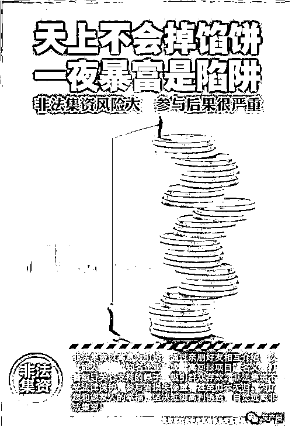

# 起底非法集资“套路” ：投 5 万就买到私募产品一定是骗子！

> 原文：[`mp.weixin.qq.com/s?__biz=MzIyMDYwMTk0Mw==&mid=2247509487&idx=5&sn=2a882cef2c2e2d083d3a16046545d044&chksm=97cb6ed7a0bce7c140c2445cefde8c14cbea743d7be501b57a8ad6b3c77e401c7801148f8b33&scene=27#wechat_redirect`](http://mp.weixin.qq.com/s?__biz=MzIyMDYwMTk0Mw==&mid=2247509487&idx=5&sn=2a882cef2c2e2d083d3a16046545d044&chksm=97cb6ed7a0bce7c140c2445cefde8c14cbea743d7be501b57a8ad6b3c77e401c7801148f8b33&scene=27#wechat_redirect)

“你看上了对方的高收益，对方看上了你的本金。”——非法集资卷走了不少家庭辛苦攒下的积蓄。那么如何防范非法集资呢?石家庄市打击和处置非法集资工作领导小组办公室（简称“石家庄市处非办”）提醒您，非法集资活动大多有四步，几大高风险领域要提防。

典型非法集资活动有四步

**第一步：画饼。**不法分子会编织一个或多个尽可能“高大上”的项目。以“新技术”“新革命”“新政策”“区块链”“虚拟货币”等为幌子，描绘一幅预期报酬丰厚的蓝图，把集资参与人的胃口“吊”起来，让其产生“不容错过”“机不可失”的错觉。非法集资人一般会把“饼”画大，尽可能吸引参与人眼球。

**第二步：造势。**利用一切资源把声势做大。不法分子通常会举办各种造势活动，比如新闻发布会、产品推介会、现场观摩会、体验日活动、知识讲座等；组织集体旅游、考察等，赠送米面油、话费等小礼品；大量展示各种或真或假的“技术认证”“获奖证书”“政府批文”；公布一些领导视察影视资料，公司领导与政府官员、明星合影；故意把活动选在政府会议中心、礼堂进行，其场面之大、规格之高极具欺骗性。

**第三步：吸金。**想方设法套取你口袋里的钱。不法分子通过返点、分红，给参与人初尝“甜头”，使其相信把钱放在他那儿不仅有可观的收入，而且比放在自己口袋里还安全，参与人不仅将自己的钱倾囊而出，还动员亲友加入，集资金额越滚越大。

**第四步：跑路。**不法分子往往会在“吸金”一段时间后跑路，或者因为原本就是“庞氏骗局”人去楼空，或者因为经营不善致使资金链断裂。集资参与人遭受惨重经济损失，甚至血本无归。

非法集资常见套路

不法分子为了引诱群众上当受骗，达到非法集资目的，通常采取以下手段骗取群众信任。

**1、装点公司门面，营造实力假象。**不法分子往往成立公司，办理工商执照、税务登记等手续，貌似合法，实则没有金融资质。这些公司或办公地点高档豪华，或宣传国资背景，或投入重金通过各类媒体进行包装宣传，或在高档场所举行推介会、知识讲座，邀请名人、学者和官员站台造势，展示与领导合影及各种奖项，欺骗性更强。

**2、编造投资项目，打消群众疑虑。**从过去的农林矿业开发、民间借贷、房地产销售、原始股发行、加盟经营等形式逐渐升级包装为投资理财、财富管理、金融互助理财、海外上市、私募股权等形形色色的理财项目，并且承诺有担保、可回购、低风险、高回报等。

**3、混淆投资概念，常人难以判断。**不法分子把在地方股交中心挂牌吹成上市，把在美国 OTCBB 市场挂牌混淆是在纳斯达克上市；有的利用电子黄金、投资基金、网络炒汇等新的名词迷惑群众，假称新投资工具或金融产品；有的利用专卖、代理、加盟连锁、消费增值返利、电子商务等新的经营方式，欺骗群众投资。

**4、承诺高额回报，编造“致富”神话。**高利引诱，是所有诈骗犯罪分子欺骗群众的不二法门。不法分子一开始按时足额兑现先期投入者的本息，然后是拆东墙补西墙，用后来人的钱兑现先前的本息，等达到一定规模后，便秘密转移资金，携款潜逃。

这些“理财”活动风险高

1、虚拟理财。一些不法分子打着“金融创新”“区块链”的旗号，通过发行所谓“虚拟货币”“虚拟资产”“数字资产”等方式吸收资金，侵害公众合法权益。此类活动并非真正基于区块链技术，而是利用炒作区块链概念行非法集资、传销、诈骗之实。

虚拟理财套路有三大特点：

**一是网络化、跨境化明显。**依托互联网、聊天工具进行交易，利用网上支付工具收支资金，风险波及范围广、扩散速度快。一些不法分子通过租用境外服务器搭建网站，实质面向境内居民开展活动，并远程控制实施违法活动。一些个人在聊天工具群组中声称获得了境外优质区块链项目投资额度，可以代为投资，极可能是诈骗活动。这些不法活动资金多流向境外，监管和追踪难度很大。

**二是欺骗性、诱惑性、隐蔽性较强。**利用热点概念进行炒作，编造名目繁多的“高大上”理论，有的还利用名人大 V“站台”宣传，以空投“糖果”等为诱惑，宣称“币值只涨不跌”“投资周期短、收益高、风险低”，具有较强的蛊惑性。实际操作中，不法分子通过幕后操纵所谓虚拟货币价格走势、设置获利和提现门槛等手段非法牟取暴利。

**三是存在多种违法风险。**不法分子通过公开宣传，以“静态收益”（炒币升值获利）和“动态收益”（发展下线获利）为诱饵，吸引公众投入资金，并利诱投资人发展人员加入，不断扩充资金池，具有非法集资、传销、诈骗等违法行为特征。

**2、炒汇理财。**目前存在大量面向境内用户、以“外汇交易”为旗号进行融资分红的平台，都不靠谱！近年来，已有多起外汇理财平台崩盘跑路、突然关闭或被定性为传销诈骗等风险的事件发生，它们的风险主要有四类：

**第一类是业务牌照涉嫌造假。**部分外汇理财平台为了吸引投资者往往声称自己受权威机构监管，或宣称拥有授权。近期，就有公司声称“获得英国 FCA 认可并受其全面监管的金融机构”，并附上了 FCA 代码，但经查询发现，代码对应的网站与该公司并不一致。

**第二类是交易过程不透明。**部分外汇理财平台对外宣称“资金安全，只赚不赔”。这些平台资金并未依法购汇并汇至境外投资，而是在交易过程中被“暗箱”操作、不断蚕食。例如，部分平台就是其客户的交易对手方。新手往往能够获得较高的收益，但投资者加大投入后会慢慢出现亏损的情形，在平台的建议下操作或者采用自动跟单的模式也会出现这样的情形。

**第三类是利用“传销模式”发展客户。**部分外汇平台以“互助理财”的名义，发展下线，按层级返利的方式不断吸引新投资者加入，这种模式涉嫌传销。

**第四类是打着“外汇交易”旗号“持续高额分红”。**部分平台以“外汇交易”为旗号融资，进行“持续高额分红”。这类模式成立的前提是建立在“外汇交易”盈利始终大于“分红”的基础上，而盈利有不确定性，这类平台宣称的持续盈利绝不可能，极可能就是“庞氏骗局”。

**3、私募基金。**私募基金领域非法集资具有较强的隐蔽性。一是公开向社会宣传，以虚假或夸大项目为幌子，以保本、高收益、低门槛为诱饵，向不特定对象募集资金。二是私募机构涉及业务复杂，同时从事股权投资、P2P 网贷、众筹等业务，导致风险在不同业务之间传导。

投资前，建议到中国证券投资基金业协会网站(http://gs.amac.org.cn)查询该私募基金公司是否登记，该私募产品是否备案。

同时，购买私募产品必须符合法定合格投资者条件，具备相应风险识别能力和风险承担能力，投资者金融资产不低于 300 万元或者最近三年个人年均收入不低于 50 万元。单只私募基金产品的投资金额不低于 100 万元。实际投资这只私募产品的总人数不能超过 200 人。私募产品不能向不特定对象销售。

所以，如果你投个 5 万元就买到了私募产品，那一定是遇到骗子了；如果你接到一个陌生推销电话或者短信，或者看到宣传单，然后买的私募产品，那一定是骗子；如果有人拉你免费旅游 ，然后在度假酒店开投资报告会，从此搭上了私募的幸福便车，那么你上当了。

来源：石家庄市处非办，鹰鉴

← 向右滑动与灰产圈互动交流 →

