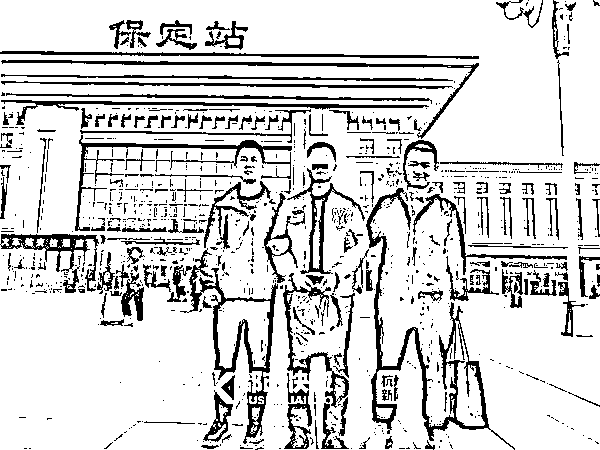
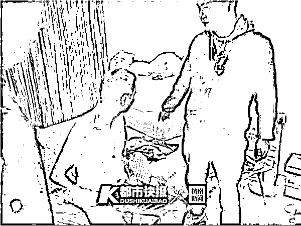
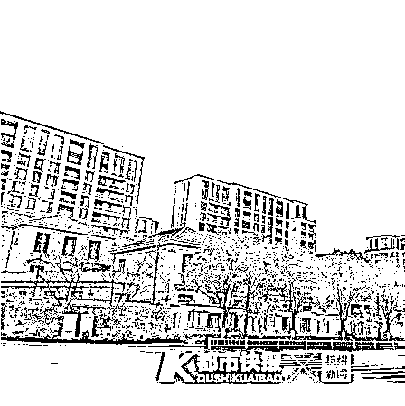
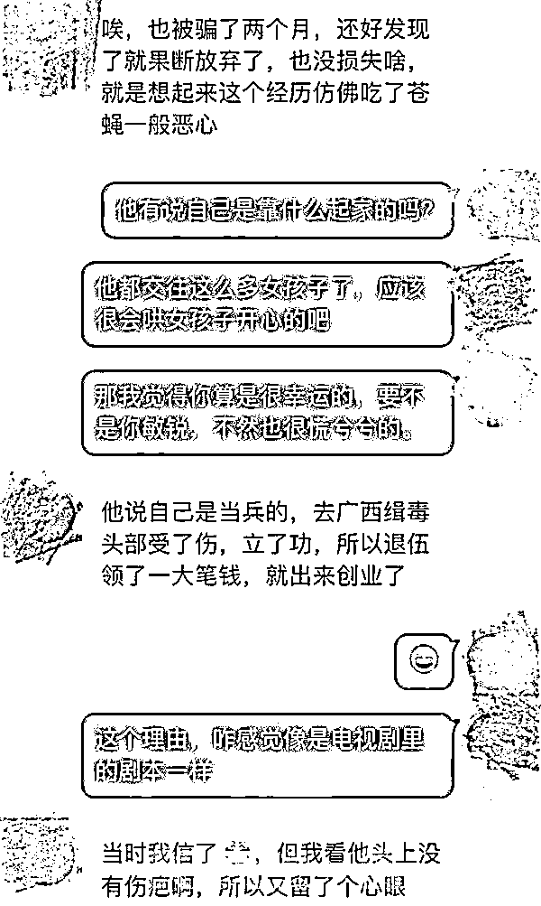
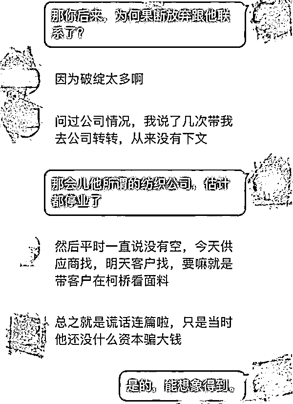

# 顺风车司机和 12 名女子“恋爱”，骗了 4000 多万！

> 原文：[`mp.weixin.qq.com/s?__biz=MzIyMDYwMTk0Mw==&mid=2247509519&idx=1&sn=df63faef728cbc3d56d6e648a4f8f390&chksm=97cb6d37a0bce421ff4eb187a9caec8ad3120942b5b7bbbf04413ec103d44a53baa798012770&scene=27#wechat_redirect`](http://mp.weixin.qq.com/s?__biz=MzIyMDYwMTk0Mw==&mid=2247509519&idx=1&sn=df63faef728cbc3d56d6e648a4f8f390&chksm=97cb6d37a0bce421ff4eb187a9caec8ad3120942b5b7bbbf04413ec103d44a53baa798012770&scene=27#wechat_redirect)

**前两天，****发生在杭州的一起诈骗案登上热搜。**35 岁的杨某，河南省尉氏县人，只有初中学历，居然骗了 12 个女子，总共诈骗人民币 4000 多万元、美元 125 万余元。杨某长相一般，以开顺风车为名故意制造机会，结识多名女性并骗取对方钱物，其中一女子被骗 1000 多万元。诈骗犯罪嫌疑人杨某目前，杨某一审被杭州市中院判处无期徒刑。**处处注重细节****“超级情圣”四步自我包装法**杨某老家在河南，截至案发被抓，他在杭州至少生活了 11 年。 杨某被抓时的情形 2010 年，杨某在杭州社交论坛“余杭情感”版块上开始发帖，都是关于情感话题，例如“我的青春我做主”，“原来我过得并不快乐”等。 当年，他在帖子里陆续发了多张自己购买彩票的截图，并感叹自己想拥有一辆车，表示身边的人都买车了，自己也有这个冲动，但身上没钱。另外，他还多次发文，如“求伴游，有意约”“有没有一起去义乌的小伙伴”等相关主题的帖子。断断续续地发帖，到了 2013 年，杨某再也没发过帖。**第一次婚姻娶了一纺织厂老板女儿**也就是在此前后，杨某在余杭一家纺织厂里做业务员，**之后认识了纺织厂老板女儿，并结了婚，倒插门。** 但这段婚姻**只维持两年**。这期间，杨某软饭硬吃，在外好面子、讲排场，在家却是个“甩手掌柜”，老婆称他“满嘴跑火车”。但最为关键的是，两人离婚时，纺织厂给了杨某。但杨某经手后，经营并不好。法院裁决书上显示，其中一证人说，2012 年，杨某的纺织公司成立，两年后就停业了，2017 年公司又开始经营，但仍一直亏损，仅 2018 年，该公司工资加上水电开销，**每个月亏本七八万元。**之后，杨某找这位证人借款维持公司运转。即便如此，发不出员工工资，杨某仍不同意裁员，案发后他交代，“有客户和朋友上门，看见员工人多、规模大，都‘信以为真’。”据都市快报 2019 年 11 月曾报道，**杨某很注重衣着打扮，穿的衣服、鞋子都是名牌，发型也精心打理，戴的手表自称是一只价值 30 万元的“拉菲”。**这时，杨某已经开始把自己包装成一名成功人士，让别人都以为他生意做得很大，最终目的，为了骗钱。很快，杨某又找到了新女友。**从 2014 年到 2016 年，他又结了两次婚，但均以离婚告终。****高谈阔论聊炒股、炒外汇**最后一次婚姻失败后，杨某“摇身一变”，除了自己的纺织公司外，又成立了一家文化传播公司，该公司注册时间是 2016 年，主要做广告、产品推广和策划类业务。 但杨某只有初中文化，也不擅长经营，大多数时间都花在出入高档会所和应酬交际上，公司接不到单子，一直亏损。另外一位证人李某说，自己入职该公司后 6 个月，老板杨某就联系不上了。杨某曾和他讲，过去一年亏了四五百万元。可在公司里，杨某从没表现出“入不敷出”的样子。他常常高谈阔论地聊炒股、炒外汇等，说起香港的投资市场也头头是道，有员工甚至主动拿出积蓄，想让他帮着一起做投资。但光靠“画大饼”是没法赚钱的。到了 2017 年 6 月，公司难以为继，杨某私底下做起了顺风车生意。**也就是在开顺风车期间，他陆续结识了四位女性。**一位受害人说，杨某平时开的是奥迪 A6 轿车，他自称是想体验生活的“霸道总裁”，一路上聊自己“父母双亡”的身世，聊自己在杭打拼的不易，博取对方同情。如果女乘客表现出好感，或者没有明显的抵触，他就会加对方微信，以便后续联系。**着重打造暖男人设**2019 年，当时民警在调查中发现，杨某的下手目标有一些共同特性。 **例如四位女性都是工作稳定的公司白领，且都已经成家，但夫妻关系并不是很融洽，杨某是通过聊天或观察发觉了这一点。**在之后的聊天中，他便时常对她们嘘寒问暖，做她们的“感情树洞”，博取好感。在这种“暖男”攻势下，女性受害人很快就沦陷了。交往时间越久，女性受害人越是对杨某“有钱人”的身份深信不疑，他生活中的种种痕迹，似乎都在说明这一点。**杨某住的是西溪某高档小区一间 200 多平方米的大平层，市场价每平方米四五万元，屋内采用中式装修，床、家具等都是实木的。**杨某租住在杭州某高档小区，对外宣称是自己的房产。杨某朋友圈里，经常会晒一些商业聚会的照片，照片里的他西装革履，一副老板做派。** “霸道总裁”风格**一位女性受害人说，杨某是个非常自信和自我的人，**就连讲话都是“霸道总裁”风格，比如给她们挑口红，不允许她自己选颜色，而是“我觉得好看才重要”。** 被骗金额最大的一位甚至为杨某离了婚。杨某每天都会给受害人发微信问候，每次“出差”会给她带香水、化妆品等礼物，有时还带着受害人去一些高档餐厅、会所吃饭娱乐。**礼物也不是白送的，交往一段时间之后，杨某便开始以公司资金周转不灵、公司需要补缴税款、外币兑换要手续费等种种理由向女友们借钱。**自己这么有钱为什么还要借钱？杨某对这些女受害人曾说，开公司的人流动资金总是有限的，谁没个调头的时候。他还给女友们看过自己的法人证书，证明自己在上海、北京、香港等地都有公司。有一回，杨某称公司有一笔大单子，但资金短缺，**该受害人奔忙了几天，借遍了身边的亲戚好友，又加上借贷平台上借来的钱，凑足了 320 万元交给杨某。**当时，杨某感动不已，**承诺一定会娶对方为妻，给她一个“最盛大的婚礼”。**该受害人没有想到，这些她好不容易借来的钱，**其实根本没有用于投资，全都被杨某吃喝玩乐挥霍掉了。****逃跑时带走了最年轻的“女友”**靠着“女友”们的“鼎力相助”，**短短两年时间里，杨某的奥迪 A6 换成了 100 多万元的保时捷，接着又换了一辆 460 万元的兰博基尼。** 起初，杨某还能拆东墙补西墙，维持着自己的“光鲜形象”，但纸终究包不住火，加上他花钱如流水，窟窿越来越大，已经无法填补。2019 年 9 月 27 日，负债累累的杨某再也想不出骗钱的理由，决定带着公司员工卓某一起私奔。卓某是杨某的女友中最年轻最漂亮的一个，她刚工作不久，没什么社会经验，对杨某言听计从。两个人逃到了卓某的老家河北保定，在卓某租的房子里一起生活了一段日子。**直到 2019 年 10 月 17 日，杨某被余杭警方抓获归案，卓某依然不肯相信，自己的男友竟然是个骗子。****一周三个女子报警寻找失踪男友**2019 年 10 月 1 日，杭州警方最先接到一位受害人报警，**称男友从她这里借走 1000 万元后失踪，她怀疑自己被骗了。** 随后一周，**又陆续有三个女子报警，都是来找失踪男友。**最后，**民警发现四个人的男友竟然是同一个人。**经调查，自 2017 年 6 月至 2019 年 9 月，杨某从四人处共“借”走 2000 余万元，但 2019 年 9 月下旬开始，他忽然就像人间蒸发一般，杳无音信。让很多人惊讶的是，受骗的远远不止这四位报警人。经调查，从 2017 年至 2019 年，杨某以非法占有为目的，虚构公司资金周转、偷税漏税被查、拖欠工人工资、海外账户内有大量美元等事实，向被害人“借款”，或者诱骗被害人介绍他人兑换美元。之后，杨某采取“多借少还”或“拖欠不还”、发送虚假打款截图的方式**骗取 12 名被害人钱财，共计人民币 4050 余万元、美元共计 125 万余元。****杨某因涉嫌犯诈骗罪于 2019 年 10 月 18 日被刑事拘留，同年 11 月 22 日被逮捕。**经审理，被告人杨某为实施诈骗活动，有目的的同时追求多名女性并形成恋爱关系，在获取被害人信任后即骗取钱财，被告人的行为不仅造成被害人的巨大经济损失，还造成了部分被害人的巨大心理创伤，后果严重，具有较大的社会危害性。经法院审理，判决被告人杨某犯诈骗罪，**判处无期徒刑，剥夺政治权利终身，并处没收个人全部财产，如不服从判决可上诉。**2020 年 10 月，杨某押于杭州看守所。**记者实地探访杨某房产和公司**很多受害人不知道，杨某在城西的这套高档小区房子其实是租的，**每个月 2 万元左右。** 昨天，记者来到该高档小区，目前这个小区市场均价在 7 万元/平方米左右。杨某租住的那一幢楼，共 13 层，一梯一户。杨某住的 6 楼门口以及电梯两侧都张贴了新年春联，鞋柜上放置了两双高跟鞋以及男士皮鞋、运动鞋。昨天，小区值班保安孙师傅说，这户人家是租的房子，住在里面的是一个阿姨和一个 10 多岁的男孩。不过，这个阿姨和男孩与杨某是什么关系，暂时没办法证实。记者在网上查到，杨某的文化传播公司有两处，一处离他的租房约 3 公里的西溪诚品商务中心，一处位于拱墅区。随后，记者先来到西溪诚品商务中心，**看到杨某注册在这个中心的公司，目前已经换成了另一家公司。**“我来的时候，就已经换过了，场地都一样大，350 平方米左右。”昨天，该商务中心值班的胡经理说。**而杨某另一处位于拱墅的文化公司地址，如今也变成了一家装饰公司，**不过这家公司场地很小，只有 30 平方米。**如何防范披着“霸道总裁+暖男”羊皮的狼 **昨天，记者还联系上了杨某之前的一位女友小云（化名），两人短暂交往了三个月，其间，**小云通过一些交往的细节和刻意的考核，尤其是最后祭出一招，发现杨某很不靠谱，随即分了手，及时止损。**2016 年 3 月，小云经闺蜜介绍，认识的杨某。小云说，自己闺蜜从事财务工作，是在一个财务群里和杨某认识的，“他在这个群里不说话，闺蜜还觉得这个人挺务实的，现在想想，他肯定是潜伏在群里。”后来，杨某和小云加了微信。杨某当时告诉她，有两套房，三辆车，开了家纺织公司，无父无母，自己还没有结婚。小云说，当时心里就想，**都是同龄人，如果没有依靠，怎么会这么优秀。**杨某谎称之前当过兵，去广西缉毒后，头部受了伤，立了功，所以退伍领了一大笔钱，就出来创业了。当时，小云相信了，交往一段时间后想想不对，因为小云发现，**杨某头上没有伤疤。**小云开始多留一个心眼。两人第一次相约在西溪银泰城。杨某提出见面，约会地点是小云定的。杨某当时开的是一辆帕萨特，**第一次见面吃饭，杨某居然把身份证拿出来给小云看。**杨某是为了让小云相信他。**“不过第一次约会，哪有给人家看身份证的啊，觉得很奇怪。”**吃完饭回家，杨某主动说，车子是公司招聘员工时送给对方的，后来员工辞职了，自己就临时开出来。“他还说如果我们结了婚，车子就给我了，我想这还是第一次见面，只是吃个饭的交情而已，咋想这么远？”小云回忆，**杨某这个人很主动，而且说话很为女孩子着想。**但小云心里已经留了个心眼。之后，**小云几次向杨某提出，要去他公司转一转，但从来就没有下文。**杨某不是说自己没空，就是说要陪供应商，或要带客户去柯桥看面料。杭州女孩小云讲述自己及时发现杨某不正常的过程杨某告诉小云，他的两套房，一套在西溪蝶园，一套在城东，**但很快被小云发现了破绽，她找到了这两套房的租房合同。**不仅房子是租的，**连每次送小云回家的车子也是租的。**“每次来接我的帕萨特，虽然车子型号一样，但车牌不一样，后来我才知道，也是租的。而且杨某根本没钱长租，都是临时短租。”相处一段时间，小云发现杨某对她撒了几次谎，但她当时也还是愿意相信杨某，但心里有些动摇。那段时间，杨某也曾几次开口说自己资金周转不开，客户那边也没有预付款，但当时杨某仅是口头说说，没有找小云要钱。一个月后，五一节小云提出要回家，杨某说正好去那边收账，可以开车带小云回去，小云同意了。小云到家刚好是中午，她提出为了表示感谢，一定要带杨某一起回家吃午饭，“杨某表现得很拘谨，不太像开公司做生意的人。”**“这点是我爸爸看出来的，我爸爸也是做生意的。”**小云说。其实，小云带杨某回家，心里是有“小算盘”的。她说，**当时自己是想让爸爸帮忙给“把把关”。**那天，小云的爸爸没跟杨某讲太多话，吃饭的时候，只是很礼貌的待客之道，杨某吃完午饭就走了。杨某走后，爸爸跟小云说了一句很决绝的话，**“以我多年做生意的经验，以及杨某在我家的表现来看，如果他的经历是真的，我管他叫爸。”**这两天，小云也看了关于杨某的报道。她说，杨某是后来骗了很多钱，买了豪车，还把自己房子搬到了附近更高档的小区，把自己营造成高富帅人设，所以那些女孩子才上当。“注册公司肯定不是为了经营，而是为了骗钱。他跟我说有公司的时候，也会动心，但我相对理智一些。”**小云说，当时也被骗了两个月，还好及早发现，就果断放弃了，也没啥损失，“就是现在想想这个经历，仿佛吃了苍蝇一样恶心。”**她说，杨某就是一个目标很明确的骗子，她觉得法律对杨某的判决，非常公正。江干法院法官朱学军，曾审理过很多离婚案。他说，通常来说，离婚中的当事双方，肯定有一方或双方都觉得对方不爱自己了，或对自己不好。通常来说，**假的爱情也比真的爱情看起来更加浪漫，更加甜蜜。**上当受骗的人，归根到底是比其他人有更多的欲望。另外，还有一些很单纯的女孩，平时工作生活都是“两点一线”，**警惕性不高，只要对方会甜言蜜语，给一点小恩小惠就很容易满足。****特别是一些所谓披着“霸道总裁”外衣的爱情骗子，**就是看中了婚姻不顺或心思单纯的女性的这些心理。但是，骗子的特点总结起来就是一点：**徒有其表，华而不实。所以骗子也有很致命的缺点，就是经不起推敲。**如果，这些受骗的女孩子到对方公司去看一看，或从他身边的人侧面打听打听这个人，想必很快就会露出破绽，实在不行，**找自己身边理性的亲人朋友来把关，也是很有效的办法。**

来源：都市快报

← 向右滑动与灰产圈互动交流 →

