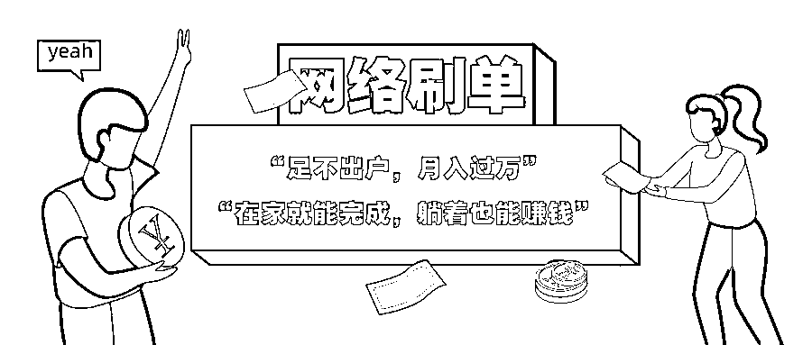

# 过年在家兼职刷单？骗人的！不要做！

> 原文：[`mp.weixin.qq.com/s?__biz=MzIyMDYwMTk0Mw==&mid=2247509519&idx=3&sn=aa4c5317df21edc2fcba236e0c83868d&chksm=97cb6d37a0bce421fb1679f5f66a3f959cf6089a63adf4b52ef483b5db2178643108063e9067&scene=27#wechat_redirect`](http://mp.weixin.qq.com/s?__biz=MzIyMDYwMTk0Mw==&mid=2247509519&idx=3&sn=aa4c5317df21edc2fcba236e0c83868d&chksm=97cb6d37a0bce421fb1679f5f66a3f959cf6089a63adf4b52ef483b5db2178643108063e9067&scene=27#wechat_redirect)

足不出户，月入过万
在家就能完成，躺着也能赚钱“零风险”“高回报”……看到这样的兼职内容你是不是也心动了但是钱真的那么好赚吗？

近年来随着“互联网+”产业的不断发展诈骗团伙花样层出不穷部分诈骗团伙利用**“刷单”**进行诈骗

疫情期间

居家人群更易成为诈骗的对象

...............................................

小胡最近想找个兼职

挣点零花钱

突然看到群里的一个**兼职**

“足不出户，省时省力”

利用闲暇时间就能赚零花钱

小胡赶紧联系了客服

客服声称只要小胡先**垫付资金**

购买其指定的商品

每一单刷完

便会如数返还货款并附上佣金

为了打消小胡的**疑虑**

还放上了公司的营业执照

小胡将信将疑地

跟着所谓的客服操作了起来

刚刷完 

客服便将货款及佣金转过来了

尝到甜头的小胡兴奋不已

赶紧开始了下一轮**刷单**

但是这次的佣金迟迟**没到账**

小胡询问客服 

客服却以**“任务单未完成”**为由

拒退本金

为了拿回成本

小胡硬着头皮刷完了五单

然而等来的并不是钱 

而且骗子无情的**嘲笑**

警方提示

网络上所谓的**“刷单”均为诈骗**，千万不要捡了芝麻丢了西瓜。在未核实对方身份前，**请勿**进行任何形式的**转账**。

来源：平安石家庄

← 向右滑动与灰产圈互动交流 →

