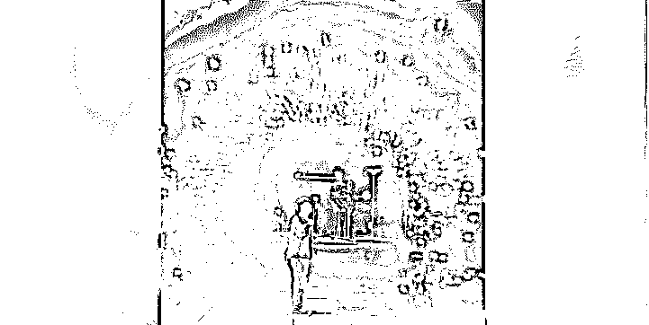
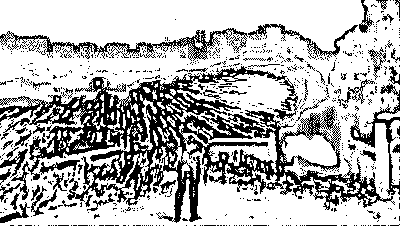
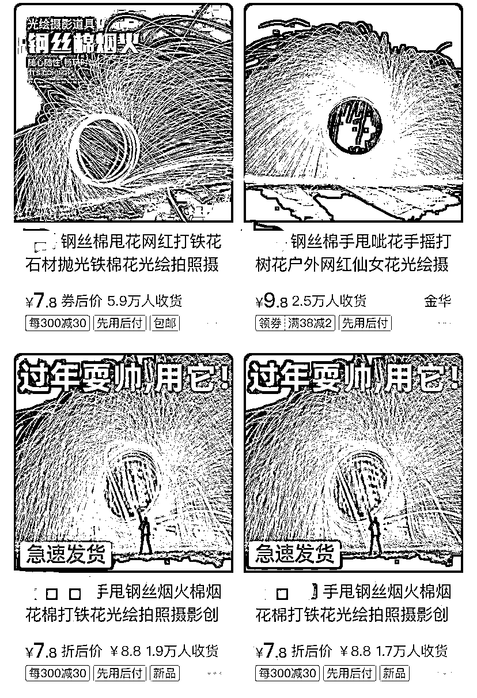
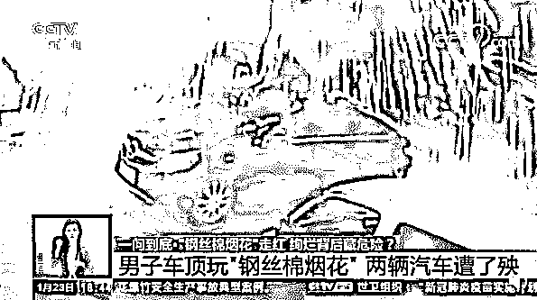
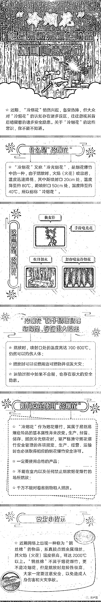

# 全部下架！

> 原文：[`mp.weixin.qq.com/s?__biz=MzIyMDYwMTk0Mw==&mid=2247509519&idx=4&sn=14ee44ea21c2691e95241a77aad22ed7&chksm=97cb6d37a0bce421be53a89b8e8c1c402ccd833d41cf6e84f44217e473e7692a916b5a377e88&scene=27#wechat_redirect`](http://mp.weixin.qq.com/s?__biz=MzIyMDYwMTk0Mw==&mid=2247509519&idx=4&sn=14ee44ea21c2691e95241a77aad22ed7&chksm=97cb6d37a0bce421be53a89b8e8c1c402ccd833d41cf6e84f44217e473e7692a916b5a377e88&scene=27#wechat_redirect)

近期，一些地方违法违规生产运输销售冷光烟花，网络平台大量销售“钢丝棉烟花”，安全风险问题突出。

冷光烟花俗称“冷烟花”，属烟花爆竹产品，其喷口温度高达 700 至 800℃；钢丝棉是易燃危险物品，燃烧时具有烟花效果，燃烧温度高达 2000℃以上，极易引发火灾或造成人身伤害。历史上曾因违规燃放冷光烟花引发多起重特大火灾事故。

## 

16 日，国务院安委会办公室组织召开专题会议，部署查处打击涉及冷光烟花和“钢丝棉烟花”生产运输销售等违法违规行为，并印发通知，提出要求。

通知强调，各地安委会要牵头协调，各有关部门密切配合，全面排查涉及冷光烟花和“钢丝棉烟花”的违法违规行为，摸清情况，建立台账。对排查发现的违法违规问题，要严格落实县级属地监管责任，确保查处打击到位。

对冷光烟花及装有冷光烟花的“电子鞭炮”等，要按照《烟花爆竹安全管理条例》等法律法规严格监管，严肃查处打击未经许可生产、运输、销售行为。对钢丝棉，要按易燃危险物品严格管理，依法严厉打击将钢丝棉当作烟花生产、销售、燃放等行为；目前在实体店面和网络平台销售的“钢丝棉烟花”，要全部下架并妥善处置；对用于工业生产和居民生活的钢丝棉，要保障正常生产供应，防止简单化、“一刀切”。

落实寄递物流企业安全主体责任，依法严厉查处打击邮寄冷光烟花和“钢丝棉烟花”行为。对各类违法违规行为，构成违反治安管理的，依法给予治安管理处罚；构成犯罪的，依法追究刑事责任。

通知要求，要健全完善查处打击常态化工作机制。建立地方冷光烟花生产企业公告制度，落实地方监管责任和企业主体责任；落实地方烟花爆竹“打非”网格化工作机制，对违法违规行为“露头就打”；充分发挥社会监督作用，建立健全举报受理、核查、奖励等工作机制，形成群防群治的工作格局。

据新华社报道，春节前夕，相关部门调查发现，部分电子鞭炮商家玩起了文字游戏，在某电商平台展示商品的视频或图片显示“室内燃放视频”“不伤人”“仿真烟花”等字样。而商品分类中，冷烟花则用“烟花填充物”代替，已经销售了上万支。

这种钢丝棉烟花

春节前也走红了各大短视频平台

在某电商平台搜索“钢丝棉烟花”“网红烟花”等关键词发现，单家店铺月销量高达数万件的不在少数，一些店家的宣传封面还打上了“过年耍帅，用它”的字样。

有商家在简介中称其为“烟火”，但详情页却表示这不是“烟花”，是一种“创意摄影辅助道具”。还宣称“类似洗碗的钢丝球，可过安检”。

其实，**这些冷烟花或打着擦边球的“钢丝棉烟花”都属于易燃易爆危险品，燃烧时温度可以达到 700 多度，容易引燃可燃物并引发火灾。**

央视新闻曾报道，今年 1 月初，上海市民徐先生因为拍视频，愣是用钢丝棉烟花，把自家车和邻居的车烧出了大大小小十几个洞。视频曝光后，不少网友直呼“危险”。

**什么是冷光烟花？到底多危险？** 

“冷烟花”又称冷光烟花、舞台效果剂，是采用燃点较低的金属粉末，经过一定比例加工而成的冷光无烟焰火。

冷烟花到底有多危险？来看这组实验。

[`mp.weixin.qq.com/mp/readtemplate?t=pages/video_player_tmpl&action=mpvideo&auto=0&vid=wxv_1615050017038221319`](https://mp.weixin.qq.com/mp/readtemplate?t=pages/video_player_tmpl&action=mpvideo&auto=0&vid=wxv_1615050017038221319)

来源：新闻晨报、央视新闻、应急管理部网站、新华社、中国消防

← 向右滑动与灰产圈互动交流 →

