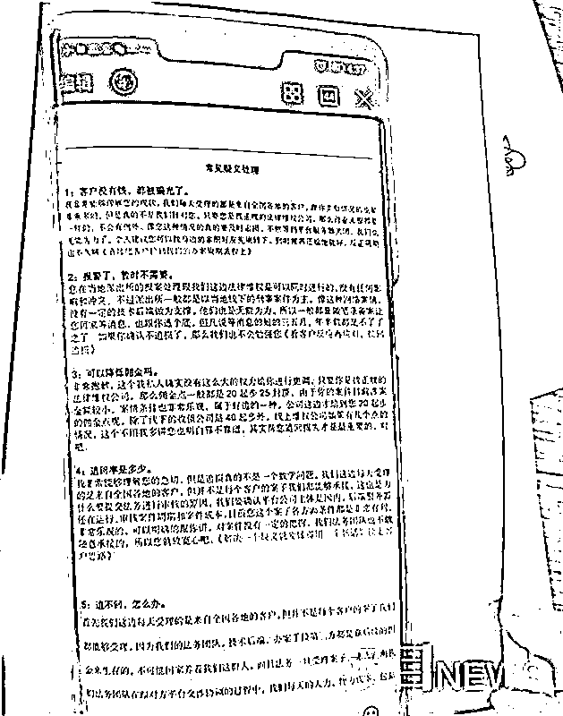
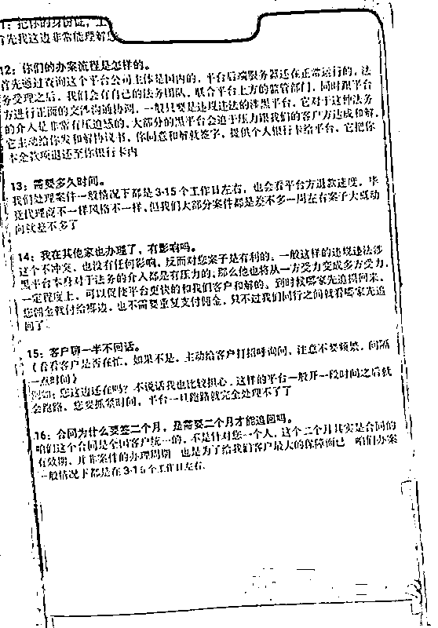
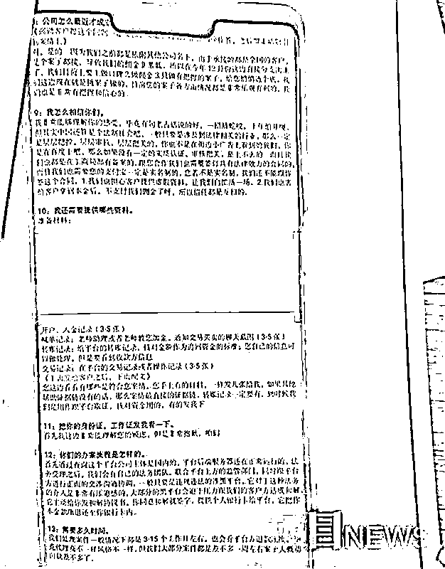
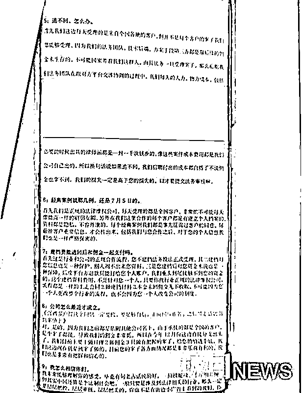

# 女子网恋遭“杀猪盘”求助律师，没想到“律师”也是骗子！

> 原文：[`mp.weixin.qq.com/s?__biz=MzIyMDYwMTk0Mw==&mid=2247509554&idx=1&sn=979e59b4afe1e67c21eec3ce1015d462&chksm=97cb6d0aa0bce41cbb7ba938d5cbbb3b7dc60e91095addc8bbc37a0927d49d5b711e0e960c32&scene=27#wechat_redirect`](http://mp.weixin.qq.com/s?__biz=MzIyMDYwMTk0Mw==&mid=2247509554&idx=1&sn=979e59b4afe1e67c21eec3ce1015d462&chksm=97cb6d0aa0bce41cbb7ba938d5cbbb3b7dc60e91095addc8bbc37a0927d49d5b711e0e960c32&scene=27#wechat_redirect)

> 一伙人对法律一窍不通，却冒充“律师”，打着“维权”的幌子，做起了行骗的勾当。

（本文

题图：资料图

近日，武汉洪山区公安分局珞南街派出所破获一宗诈骗案，该骗子团伙声称可以帮助客户追赃挽损，诱使此前被骗的受骗人交“咨询费”“建档费”，2 个月拉到业务 250 起。目前，武汉洪山警方已对涉案的 5 名嫌疑人采取刑事强制措施。 

**女子遭遇“杀猪盘”，求助律师却落入新骗局**

去年，来自福建的赖女士通过社交软件，结识了一名假冒军人的男子，两人聊得投机，确定了恋爱关系。对方以兼职、投资为由，骗走她 18 万元，之后就失联了。

“被骗了怎么办？”人财两空的赖女士意识到被骗，心有不甘，自行在网上搜索维权渠道。这时，一则“湖北某某法律咨询服务有限公司”的网页映入眼帘。她按照提示添加了工作人员的微信，联系上“专业律师”，向对方讲述了自己的遭遇。殊不知，接待赖女士的客服和后来的“法务”，其实是同一人。

“这明显就是‘杀猪盘’，我们有信心帮你把钱追回来。”对方有板有眼地为赖女士分析了这场骗局，还信誓旦旦地承诺为其追回损失，前提是赖女士得先交 1996 元的“咨询费”“建档费”。因急于挽损，赖女士并未多想，将钱如数转去。她满怀期待，对方却迟迟没有动静。

维权未果，去年 12 月 23 日，赖女士选择向当地警方报警求助。在对“杀猪盘”网恋骗局进行调查时，福建当地警方察觉到这家法律咨询服务公司也有行骗嫌疑。根据公司属地信息，1 月 20 日，福建当地警方将线索通报给了武汉警方。

**“专业律师”对法律一窍不通，公司法人初中没读完**

武汉洪山警方收到情况后，迅速开展侦查，锁定嫌疑人落脚点位于洪山区一栋写字楼。珞南街派出所循线追踪，1 月 20 日晚，民警将公司法人、嫌疑人熊某俊带回派出所接受调查。21 日，民警将其余 3 人抓捕归案。26 日，诈骗团伙最后一名嫌疑人周某落网。近日，极目新闻记者来到珞南街派出所，办案民警宋涛介绍了详细案情。

据调查，熊某俊今年 20 多岁，湖北汉川人，去年 12 月初，熊某与四名同乡好友搭伙，注册了这家法律咨询服务公司，打着“维权”的幌子，开始在网上接业务。另外一名嫌疑人熊某杰交代：“客户在网上找到我们公司，加我们公司的微信，我们在微信上答复客户的提问，把这笔业务接下来，跟客户在网上签订合同，收取客户的咨询费，接着我们在网上找‘维权之家’，以客户身份在‘维权之家’咨询答案，实际上怎么追回损失我们根本不知道。”

落网后，熊某俊交代，他对赖女士印象深刻，因为“名字比较有特点”。“赖女士跟我说她被骗了十几万，问我能不能帮她追回来，我说我有很大的信心和把握，她就相信了我 ，我收了她 1996 元，答应她 3 到 15 个工作给她结果。我除了刚开始搜索‘金融维权之家’以客户身份问了一下，后面就没有管了。”熊某俊交代，他没有学过法律知识，对法律知识一窍不通。

珞南街派出所办案民警向极目新闻记者介绍，团伙五人打着“法务”“专业律师”“法律维权顾问”等名号拉业务，实际上五人都没有学过法律知识，也没有取得相关资质，从来没有帮客户追回过一笔损失。团伙成员最高学历为大专，而为赖女士提供法律咨询服务的熊某俊，初三没有读完就辍学了。

**对着话术聊天拉客户，公司成立从未追回过损失**

在接受民警调查时，其中一名嫌疑人这样说道。

“一般是什么客户找你们？”“基本上都是受骗的人过来找我们，有的是贷款被骗，有的是投资平台被骗，有的是‘杀猪盘’被骗。”

“你们有办法帮客户追回资金损失吗？”“我们自己肯定没有这个能力。”

“你们公司自成立以来，有没有帮客户追回过损失？”“从来没有。”

珞南街派出所民警调查梳理公司的台账发现，公司成立 2 个月，该团伙拉成业务 250 起左右，很多人可能尚未察觉自己落入骗局。

为何会拉到这么多业务？武汉洪山警方介绍，团伙提前精心准备了话术，针对不同语境，比如“对方不回复”“质疑公司怎么才成立”“咨询追回率是多少”等情况，匹配对应的回复内容。嫌疑人熊某俊、熊某杰还表示，他们在某搜索引擎投放了费用，花的钱越多，搜索关键词之后，显示他们公司的网页就越靠前，这样客户在网上搜索就能快速找到“湖北某某法律咨询有限公司”。

（

目前，武汉洪山警方已对涉案的 5 名嫌疑人依法采取刑事强制措施。在此，警方与极目新闻提醒，如果需要法律咨询，尽量到实地探访或者通过官方网站等正规渠道，同时注意核实相关法律资质；网上涉及陌生人要求转载的，一定要高度警惕。

来源：新浪财经综合，利箭在出击

← 向右滑动与灰产圈互动交流 →

