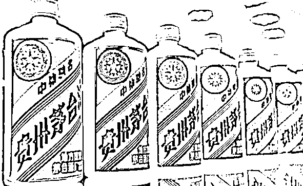
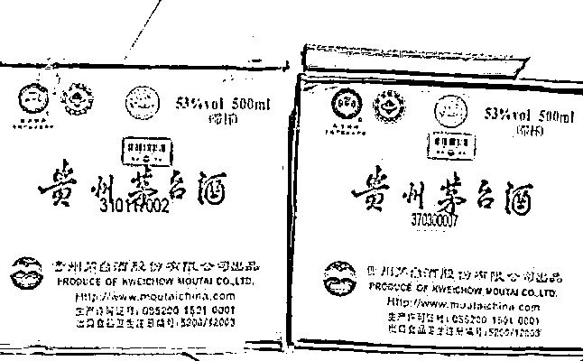

# 纸箱价格暴涨！茅台一个纸箱炒到 500 元！咋回事？

> 原文：[`mp.weixin.qq.com/s?__biz=MzIyMDYwMTk0Mw==&mid=2247509554&idx=2&sn=78d668c3aac24b5422e1bc48c7176293&chksm=97cb6d0aa0bce41cad3182609b15ec59cb2b1d5119dc23cbbc4127b24019c5cf7db67605365e&scene=27#wechat_redirect`](http://mp.weixin.qq.com/s?__biz=MzIyMDYwMTk0Mw==&mid=2247509554&idx=2&sn=78d668c3aac24b5422e1bc48c7176293&chksm=97cb6d0aa0bce41cad3182609b15ec59cb2b1d5119dc23cbbc4127b24019c5cf7db67605365e&scene=27#wechat_redirect)

2021 年春节前，贵州茅台酒销售有限公司（简称“茅台销售公司”）频频出台控价稳市举措：100%拆箱销售；取消线上“抢购”门槛；宣布将 2020 年可售茅台酒全部投放市场，实现库存清零。

记者春节期间走访发现，以 1499 元/瓶的价格购买 53 度 500 毫升飞天茅台仍是一件几乎不可能完成的事情，而且“新炒货”应运而生：一个茅台酒纸箱炒到 500 元。

消费者线上难“抢”

在北京家乐福超市四元桥店，记者发现锁着的酒柜里茅台酒价签标注为 1499 元/瓶，不少顾客驻足围观，但营业员一句“这里不卖，到网上抢”，瞬间浇灭了顾客“捡到便宜”的想法。

针对线上价格为 1499 元/瓶的飞天茅台，茅台销售公司要求电商不得在线上设置消费限制门槛。春节期间，在京东、苏宁 APP 抢购 1499 元/瓶飞天茅台页面，点击预约按钮，不再弹出需要会员身份的提示。小米有品 APP 凭身份证完成实名认证后即可预约。为防止“黄牛”刷单抢货，小米有品还设置人脸识别环节，且同一用户 30 日内最多购买 2 瓶，每次限购 1 瓶。

放低门槛后，在网上抢购茅台是否变容易了？其实，普通消费者更难抢过已经有一年经验并有软件加持的“黄牛”们。“我都没有机会进入二级页面。”一位参与过京东、苏宁两大平台抢购茅台酒的网友表示，“立即抢购”键一亮起就不停地点，但除了“很遗憾……”“抱歉……”等提示语，用“秒杀”形容这稍纵即逝的机会都显保守。

“1499 元一瓶的茅台酒？不可能有。现在店里的货 2700 元一瓶。”在北京西城区某特约经销商店内，记者看到地上摆着十余个茅台手提袋，每个袋内装有两瓶茅台酒，这些都是以 2750 元至 2800 元的单价卖出去的。

茅台浑身是“宝”

1 月，茅台销售公司规定专卖店每月将 80%的 53 度 500 毫升飞天茅台以 1499 元/瓶的价格拆箱售卖，随后又规定 100%拆箱以 1499 元/瓶的价格售卖，并将不定期检查拆箱售卖情况。如果发现箱子数量没达标，会对经销商作出相应处罚。**但春节期间，茅台酒市场越发疯狂，甚至出现销售茅台酒纸箱的渠道，一个 2020 年茅台酒纸箱售价炒到 500 元，同规格普通纸箱每个售价不过 3 元。**

业内人士透露，目前市场售价是茅台原箱酒（每箱 6 瓶）3300 元/瓶、散瓶酒 2700 元/瓶，500 元一个的纸箱起到重要作用。“买整箱茅台的人并不是自己饮用，不然不会在乎纸箱。就因为有纸箱，单瓶茅台身价才能再涨 600 元。”

白酒零售商林明（化名）表示，外行以为买箱子的人都是去装假酒的，其实不然。买箱子的基本是终端酒商。“拆箱令”下诞生很多“新名词”，比如原箱、涂码、扣码、剪角。林明解释称，原箱即完整的整件茅台酒，单价最高，3300 元/瓶；随后依次是涂码、扣码、剪角等，按照箱子完整度，酒价有一定区别。

将散瓶酒尽可能地变成原箱酒，拿到纸箱找酒和拿到酒找纸箱考验的是“黄牛”们的功力。茅台酒的纸箱和每瓶酒都有对应的批次和编号，彼此对应才算集齐原箱。用“黄牛”的话说“要实现‘三同’”，即生产日期、生产批次、物流码相同。

林明告诉记者，茅台全身是“宝”。**除了箱子外，飘带、酒杯、绷带、提袋、验酒器等都可以流通：飘带一根 2 元，原装酒杯一套 30 元，绷带一条 15 元，手提袋一个 100 元**。****

价差之下难解的结

在加大投放量的情况下，茅台销售公司将“拆箱令”视为控价的重要举措。这记重拳的确让众多经销商的高价茅台酒消失了，整箱的飞天茅台成为“稀缺品”，原箱飞天茅台市场单瓶价从 2900 多元一路升至逾 3300 元。

部分超市有其他容量规格的茅台酒出售，唯独没有“500ml、53 度”的规格，2L 装茅台，折合每 500ml 价格 3000 元左右。业内人士表示，春节因素支撑了对茅台酒的刚需，导致市场终端价格坚挺。

为提高开瓶率，实现“酒喝不炒”，部分茅台酒直营店出台“以瓶换购”活动，即出示一次购酒的出库单、空酒瓶、发票等，在直营店可以 1∶1 换购茅台酒。

天眼查显示，茅台销售公司只有两名股东：贵州茅台酒股份有限公司持股 95%，贵州茅台酒厂（集团）有限责任公司持股 5%。

杭州延瑞资产管理公司董事长李振表示，飞天茅台作为市场稀缺资源，价格上涨的主要原因是供求失衡，从 1499 元/瓶到 3300 元/瓶，其中的利润空间吸引着各路商人。由于官方定价与市场价存在巨大差额，茅台销售公司控价稳市措施面临挑战。

来源：中国证券报

← 向右滑动与灰产圈互动交流 →

