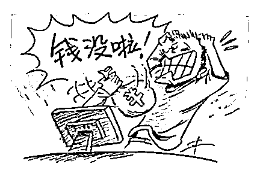

# 投资“中石油”，她 90 秒赚 14 万！谁跑赢了？

> 原文：[`mp.weixin.qq.com/s?__biz=MzIyMDYwMTk0Mw==&mid=2247509554&idx=3&sn=678639f6a9f796268c23e4793163713f&chksm=97cb6d0aa0bce41c28a58f73d9bb93900acaf34fd75c9f49bf05df74a6c5ecb6eea50cdf1089&scene=27#wechat_redirect`](http://mp.weixin.qq.com/s?__biz=MzIyMDYwMTk0Mw==&mid=2247509554&idx=3&sn=678639f6a9f796268c23e4793163713f&chksm=97cb6d0aa0bce41c28a58f73d9bb93900acaf34fd75c9f49bf05df74a6c5ecb6eea50cdf1089&scene=27#wechat_redirect)

俗话说 

高手过招

1 秒钟定输赢

那跟骗子过招呢?

昆明市官渡区的张某琼

跟骗子连过了三招

前两招都赢了

这关键性的第三招

……

2020 年 12 月中旬，昆明市官渡区的张某琼收到一个好友申请，对方微信名为赵山河。

张某琼同意添加后，对方便主动跟她聊了起来。

对方称自己在做一个**“中国石油旗下的短线控股”**，并推荐给她。“做这个 100%可以赚钱，而且赚钱很容易。”

张某琼表示自己不会，对方又说，**“看在我们那么有缘的份上，我可以免费教你如何做。”**

过了几天，赵山河就发来一个**二维码**，让她扫二维码进入了“中国石油”的网站页面。

在赵山河的指引下，张某琼填写了自己的姓名并进行了账户注册。

注册账户之后，赵山河就让她联系网站平台上的客服进行充值。

“充值之后，你就可以在这个网站平台上购买中国石油的股票赚钱了。”在赵山河的引诱下，张某琼照做了。

一开始赵山河让她先充 500 元至 1000 元。张某琼联系客服，客服给了她一个银行卡账户，让她把充值金额转进这个银行卡账户。

充值成功后，张某琼立即在网页上购买了 500 元的大庆石油股票。

赵山河说 90 秒后就可以查看股票的盈利和亏损。

“果然到时间，我一查看，盈利了 52 元。”张某琼欣喜万分，将本金和盈利共 552 元都提现了。

提现成功后，赵山河让她再充值 1 万元，并告诉她充得越多赚得越多。

张某琼还是有点儿不太放心，就告诉对方自己没钱，就只充值了 1000 元。

随后，她购买了大庆石油的股票，**90 秒后显示盈利了 558 元**。

张某琼又立马进行了提现，一共提现出了 1558 元。

紧接着，赵山河又让她值 3 万元，张某琼告诉对方自己没这么多钱，对方就让她充值 1 万元，并声称帮她垫付了 2 万元，已经充值到客服提供的银行卡账户内。

张某琼就在**“中国石油”网站平台上购买了 3 万元的股票**，90 秒后页面显示亏损了，平台的账户内还剩余 1.5 万元钱。

亏损后，赵山河称再**帮忙垫付 1.5 万元**，让她再买一次，等赚了提现之后在还他。

张某琼就利用账户内的 3 万元钱再次购买了上面的股票，**90 秒后平台显示盈利了 14.557 万元。**

她赶紧就进行提现，但这时客服却让她交纳 1.7 万元的税，她发现自己被骗了，赶紧报了案，共计损失 1 万元。

**诱导投资类诈骗特点**01**第一步极具煽动性，不正常的高收益**

现在的骗子越来越高明，对人性摸得非常清楚，贪婪是人类永远的软肋，于是就用高收益迷惑投资者的心智。广告宣传无一例外地宣传，具有超高的年收益率，有的动不动就 12%以上，有的甚至高达 30%，甚至更多。

02 **第二步公司背景模糊，承诺稳赚不赔** 

骗子仿佛都有一种特殊能力，像巫师一样，可以预知未来，甚至左右未来，他们的项目不管遇到什么状况，都能够盈利，你唯一需要做的就是买入。

03 **第三步先让受害人挣到点“甜头”** 

有些人开始不相信，但是后来看到钱不断地流进自己的账户，便开始相信，一发不可收拾。

**网上赌博类诈骗特点**

①不法分子专门从网上制作虚假平台伪装成虚假彩票网站用于诈骗，并且专门选择有赌博爱好的人下手。

②为了寻找目标，他们在网上伪装成“白富美”、“高富帅”以“时时彩”等为关键词在网上专门搜索一些赌博、投资群，然后网上加微信、QQ 好友聊天。

③聊天中，他们会从侧面打听受害人的经济状况和性格特点，比如：我们是同龄人，你开什么车等，把自己吹嘘得很高大上，还发布一些虚假炫富图片。

④等了解受害人的经济状况后，他们就会有针对性地诱骗事主登陆他们的彩票网站进行投注，进而对受害人实施诈骗。

**提醒：**

陌生好友别乱加

陌生链接别乱点

陌生网友别注册

身份信息不透露

**谨记防骗七字诀**

**不听不信不转账**

来源：昆明反电信网络诈骗中心

← 向右滑动与灰产圈互动交流 →

