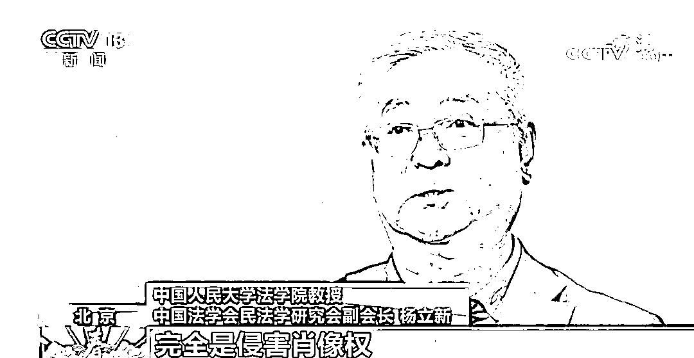
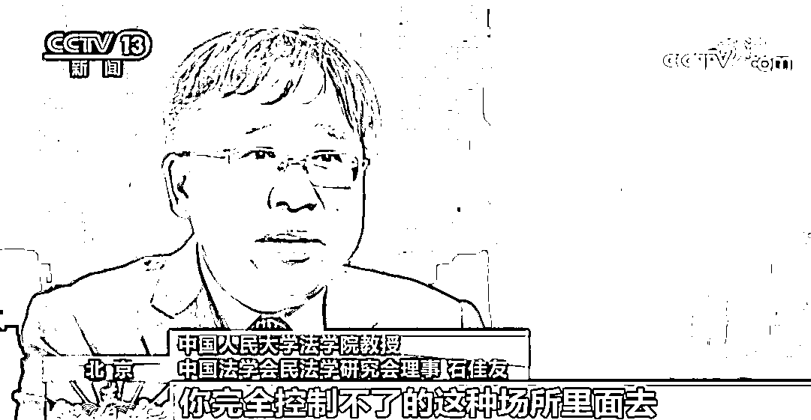
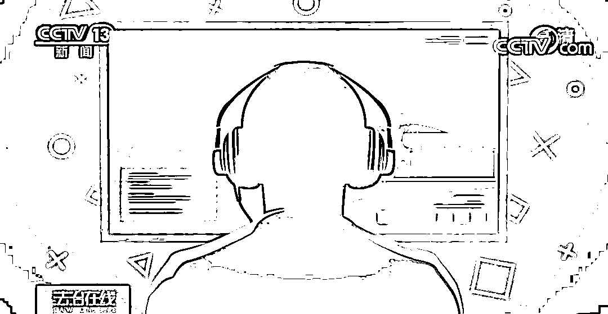
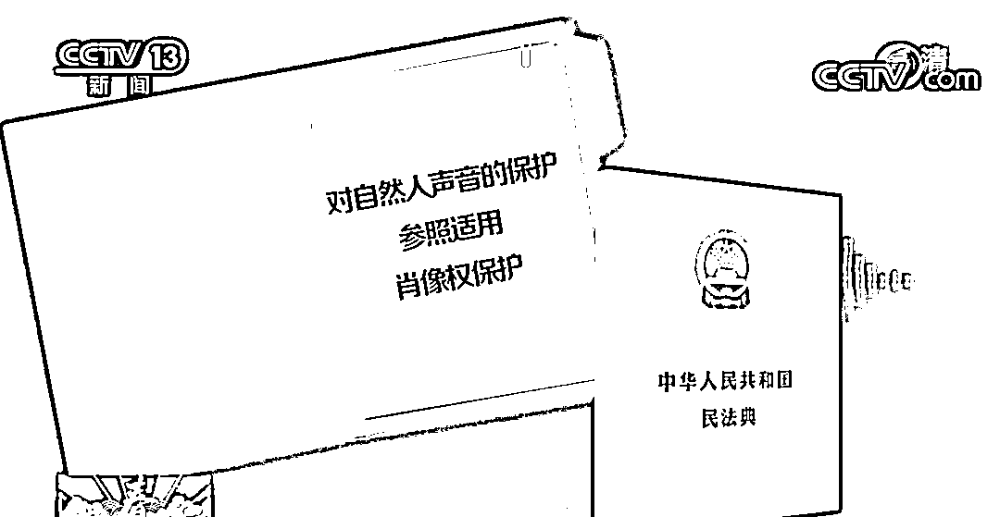

# 注意了！这样的“表情包”不能发

> 原文：[`mp.weixin.qq.com/s?__biz=MzIyMDYwMTk0Mw==&mid=2247509554&idx=4&sn=2a70e6a12ad953408ad30b9ad1352a36&chksm=97cb6d0aa0bce41c0bd5c7545259ea451e8bd64bf4f2c7ecb6b16121d253868010ced6226d40&scene=27#wechat_redirect`](http://mp.weixin.qq.com/s?__biz=MzIyMDYwMTk0Mw==&mid=2247509554&idx=4&sn=2a70e6a12ad953408ad30b9ad1352a36&chksm=97cb6d0aa0bce41c0bd5c7545259ea451e8bd64bf4f2c7ecb6b16121d253868010ced6226d40&scene=27#wechat_redirect)

你发一个葛优躺

我回一个苏大强

P 个图，换个脸

这些加工形成的表情包 

到底能不能使用？

聊天斗图需承担法律风险吗？ 

《民法典》明确

**表情包斗图也可能会侵权！**

[`mp.weixin.qq.com/mp/readtemplate?t=pages/video_player_tmpl&action=mpvideo&auto=0&vid=wxv_1745381803516837888`](https://mp.weixin.qq.com/mp/readtemplate?t=pages/video_player_tmpl&action=mpvideo&auto=0&vid=wxv_1745381803516837888)

用肖像制作表情包斗图

或需承担法律风险

电视剧《都挺好》播出后热议不断，有网友拿着倪大红的镜头来做表情包。

中国人民大学法学院教授、中国法学会民法学研究会副会长杨立新解释，**用明星肖像制作表情包，当然算作侵犯他人肖像权。**如果对方不追究，是没有问题的；但对方要是追究，则算侵犯肖像权。若是再利用这些表情包**出售盈利，更算是侵犯肖像权。**

> **杨立新：**比如我的学生给我做表情包，挺好玩的，我觉得可以，就不算侵权。如果我不同意，那就是构成侵权行为。尤其是你要再拿出去卖，更是侵权了。

AI“换脸”有风险

法律专家发出重要提示

随着视频剪辑技术发展，利用明星肖像制造“假明星”账号的不法行为时有发生，这样的虚假账号是否构成侵权呢？

去年，江西赣州黄女士在网上被假靳东欺骗感情的事件引发广泛关注。

《民法典》第一千零一十九条规定：**任何组织或者个人不得以丑化、污损，或者利用信息技术手段伪造等方式侵害他人的肖像权。**这条规定也对爆红一时的 AI“换脸”技术画了一条红线。

> **中国人民大学法学院教授、中国法学会民法学研究会理事石佳友：**你输入真实的人脸信息，平台保存后进行处理、合成。平台会把你的肖像移植到其他的、完全控制不了的场所里去，比如一些荒诞的剧里，甚至是移植到一些色情的视频里去，对于人格权是巨大的侵害。

模仿声音可以，但是……

此次《民法典》首次提出了对声音权的保护，**规定对自然人声音的保护，参照适用肖像权保护的有关规定。**

依据《民法典》的规定，声音权属于一种独立的新型人格权。那么，许多模仿声音的达人们还能继续愉快地模仿吗？

杨立新表示，就算两个人声音很像，在声纹鉴定面前都是不一样的。

①声音跟相貌一样，都是人格特征；

②声音有经济价值，个人特征运用到市场经济中，会产生经济利益。

通过模仿他人的声音，来进行表演、搞笑，这些是合法的。**但如果把模仿他人声音，应用在经营领域，这就属于严重侵权。**

> **杨立新：**经过他人同意后，模仿他人唱歌、搞笑都是可以的。但是，一旦把这种行为投入到经营领域，去卖票赚钱，这就是严重的侵权行为。

来源：央视新闻

← 向右滑动与灰产圈互动交流 →

