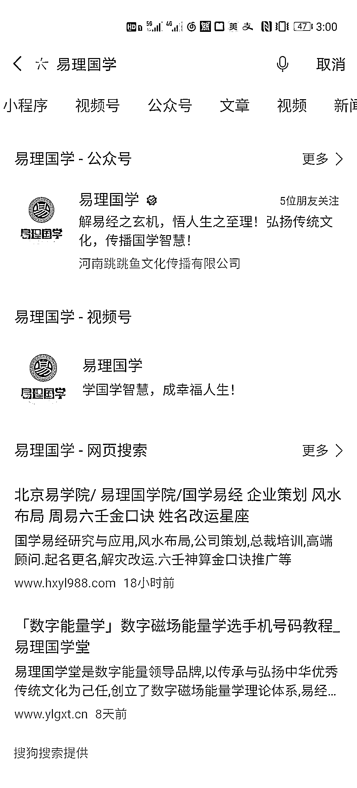
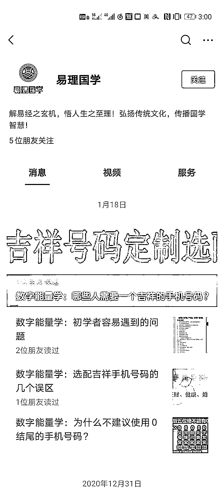
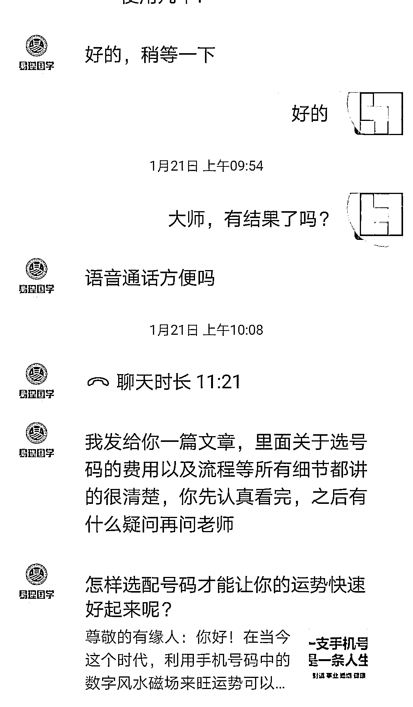
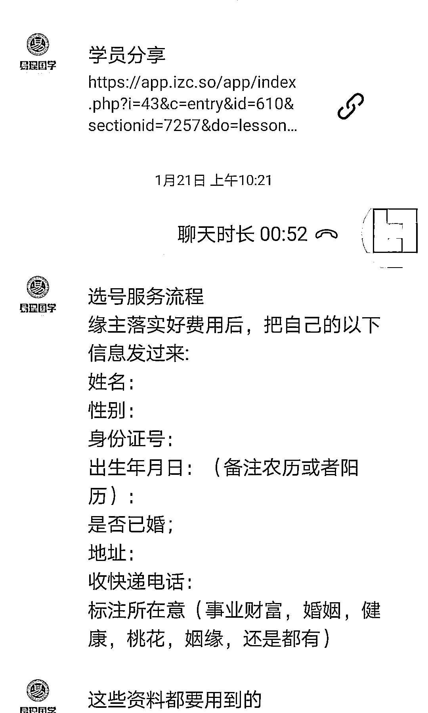
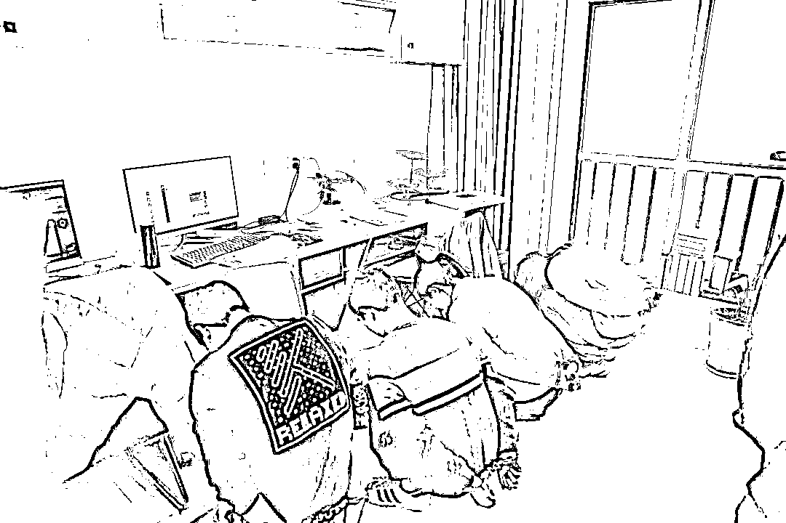
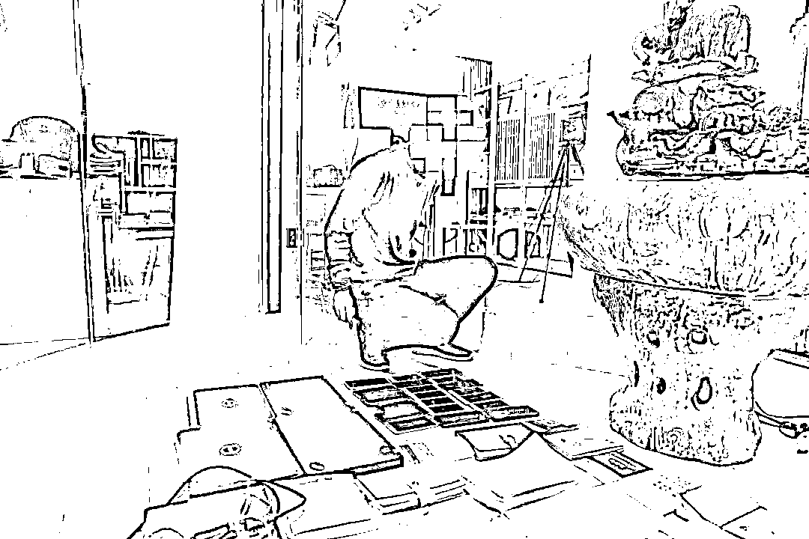
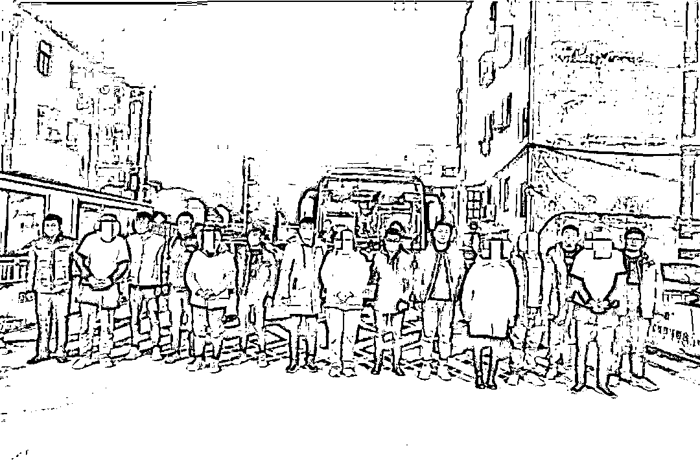
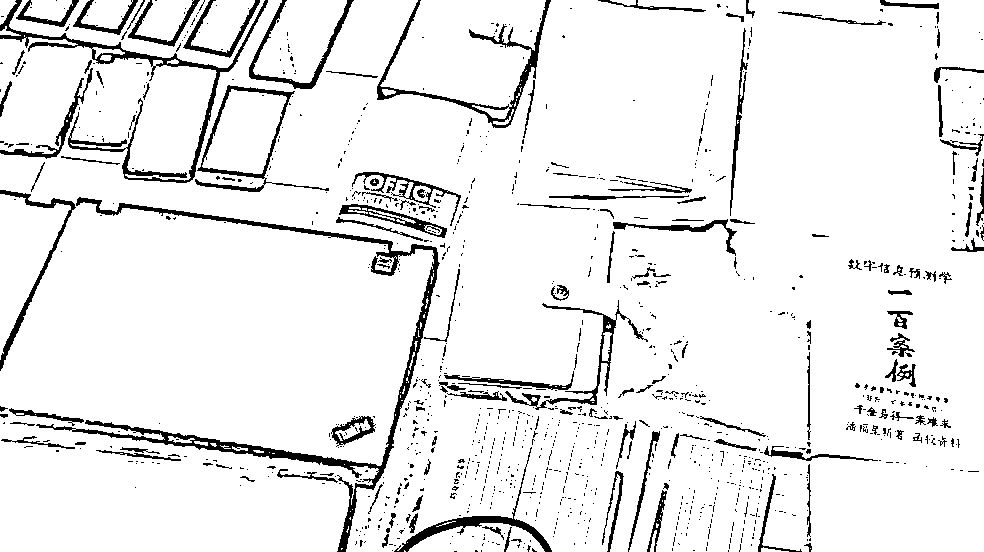
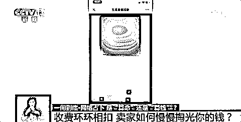

# 朋友圈里的“大师”被抓到了！

> 原文：[`mp.weixin.qq.com/s?__biz=MzIyMDYwMTk0Mw==&mid=2247509609&idx=1&sn=6defce27df36199932c9f5c8f5c3ea1e&chksm=97cb6d51a0bce447d174c9cf7601c72740d952062710bb2cbc16ad937b166d95eda312ebf405&scene=27#wechat_redirect`](http://mp.weixin.qq.com/s?__biz=MzIyMDYwMTk0Mw==&mid=2247509609&idx=1&sn=6defce27df36199932c9f5c8f5c3ea1e&chksm=97cb6d51a0bce447d174c9cf7601c72740d952062710bb2cbc16ad937b166d95eda312ebf405&scene=27#wechat_redirect)

新年新气象

很多小伙伴为了让自己的 2021 年红红火火

不惜采取一些**“非常手段”**

而就在此时

算命、看手相、星座占卜、手机改号

各路“神仙”齐上阵

美其名曰帮大家“转运”

受害者往往在不知不觉中受骗

近日 

江苏盐城警方成功捣毁一个

以“挑选驱灾辟邪电话卡”为名

实施网络诈骗的犯罪窝点

[`mp.weixin.qq.com/mp/readtemplate?t=pages/video_player_tmpl&action=mpvideo&auto=0&vid=wxv_1746918120331476996`](https://mp.weixin.qq.com/mp/readtemplate?t=pages/video_player_tmpl&action=mpvideo&auto=0&vid=wxv_1746918120331476996)

**案件回溯** 

2021 年 1 月，家住市区的张先生报警称

其在网上购买能够“转运”的电话号码时

被诈骗 4000 余元

原来，张先生平时做生意

在网上浏览信息时

发现一个名为“易理国学”的公众号

“里面讲的一些东西跟我的生活很贴近

最近也不太顺心

于是就添加了‘客服’的微信。”

张先生想请“客服”帮助“算算”

“客服”直接告诉张先生

“根据易经推理，

你手机号不吉利，必须换！”

张先生听到这里慌了

在“客服”的引导下

购买了 4900 元的“转运号码套餐”

后经身边人提醒

才发现自己被骗

接警后，江苏盐城警方立即开展案件侦查工作，于 1 月 29 日赴河南郑州实施抓捕，现场抓获犯罪嫌疑人 5 名。经审查，该团伙披着“国学公司”外衣，在互联网进行诈骗，涉案资金达 80 余万元。

该团伙在微信公众号

门户网站发布广告

宣称可以测试手机号码吉凶

吸引受害人添加其微信实施诈骗

目前，犯罪嫌疑人均已被警方刑事拘留

**套路揭秘** 

批量产生的“大师”

警方调查发现，那些所谓的有多年算命经验的“大师”、“道人”，实际上多是社会上的闲散人员。

而且，这样的“大师”可不止一个，而是由一些公司批量“生产”的，通过招募一批 90 后青年男女为业务员，经过统一培训话术等诈骗手法后，在微信朋友圈打广告，以“手机号码转运”为诱饵，实施诈骗。

一开始，“大师”声称可以通过免费测试手机号来判断吉凶，免费测试只是个引子，要收费的“大项目”还在后面。

“大师”接着会说一定要购买专门的手机号码，才能够知天命结因果，扭转关乎姻缘事业一生的运势，所以需要被害人支付费用，这笔费用就可多可少了，完全取决于对方想骗你多少。

随着被害人一步步上钩，骗钱的手段一步步升级。

收费环环相扣

除了测试手机号吉凶外，网络占卜的诈骗手段也如出一辙，那些声称能够预测未来情感走势、预测何时能升职加薪，以及预测来年运势如何等的网络占卜收费环环相扣。

测试者输入自己的信息后，想要获取测试报告，必须先付款，而这些报告中还包含很多单项报告，每项报告都有不同的收费标准，诱导测试者一步步付款，慢慢掏空人们的钱包。

为什么感觉算得很准

因为骗子们在利用心理学上的**“巴纳姆效应”**引诱你上套。

人们常常认为一种笼统的、一般性的人格描述十分准确地揭示了自己的特点，当人们用一些普通、含糊不清、广泛的形容词来描述一个人的时候，人们往往很容易就接受这些描述，却认为描述中所说的就是自己。

**友情提醒 **

老骗局也会有新皮肤

了解清楚这些“神仙”的套路与底细

才能将受骗的概率降到最低

**莫要被封建迷信迷惑了双眼**

**命运掌握在自己手中**

一旦发现上当受骗

请及时报警！

来源：盐城网警，安全圈

← 向右滑动与灰产圈互动交流 →

